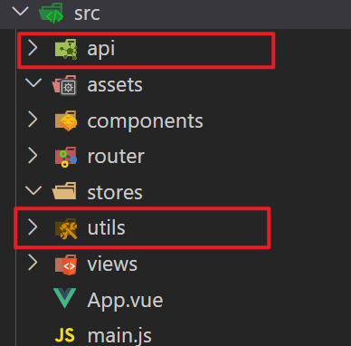
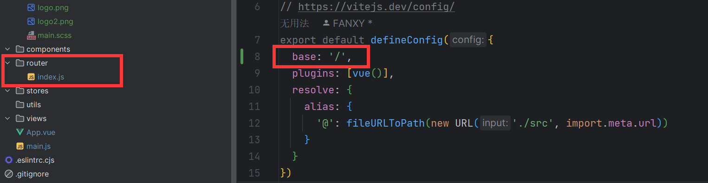
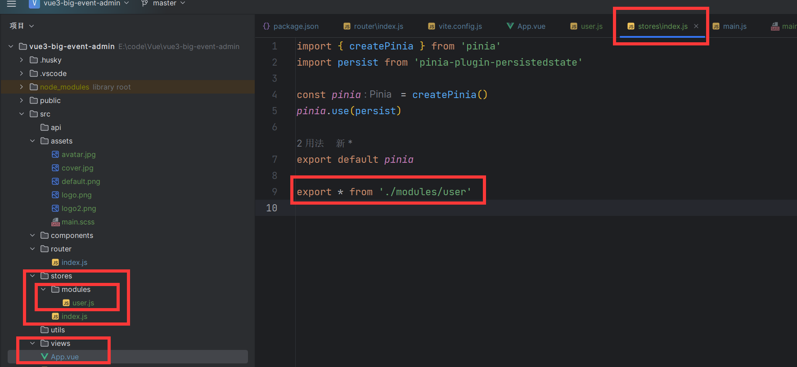
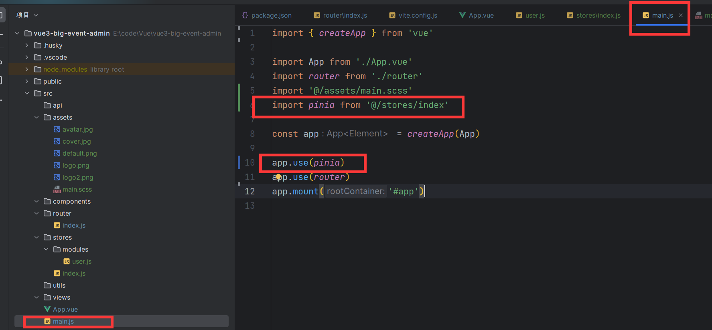
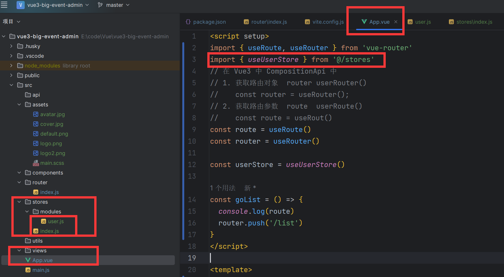
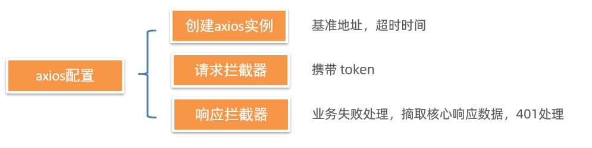

# 用户中心升级版

**前端** 基于 [ES6](http://es6.ruanyifeng.com/)、[vue3](https://cn.vuejs.org/index.html)、[pinia](https://pinia.web3doc.top/)、[vue-router](https://router.vuejs.org/) 、`vite` 、`axios` 和 `element-plus`

# 1. 项目工具介绍

## 1. 创建项目

创建 `vue` 

```sh
pnpm create vue

cd xy-admin-frontend
pnpm install
pnpm format
pnpm dev
```


## 2. `Eslint` 配置代码风格

`Eslint` 负责代码校验错误

配置文件 `.eslentrc.cjs`

1. `Prettier` 负责代码美化

2. `vue` 组件名称多单词组成【忽略 `index.vue` 报错，vue3 的问题】

3. `props` 解构【关闭】


**环境同步：**

1. **安装了插件 `ESlint`，开启保存自动修复**
2. **禁用了插件 `Prettier`，并关闭保存自动格式化**

```sh
// ESlint插件 + Vscode配置 实现自动格式化修复
"editor.codeActionsOnSave": {
    "source.fixAll": true
},
"editor.formatOnSave": false,
```


**配置文件 .eslintrc.cjs**

1. prettier 风格配置 [https://prettier.io](https://prettier.io/docs/en/options.html )

   1. 单引号

   2. 不使用分号

   3. 每行宽度至多80字符

   4. 不加对象|数组最后逗号

   5. 换行符号不限制（win mac 不一致）

2. `vue` 组件名称多单词组成（忽略`index.vue`）

3. props解构（关闭）

```js
  rules: {
    'prettier/prettier': [
      'warn',
      {
        singleQuote: true, // 单引号
        semi: false, // 无分号
        printWidth: 80, // 每行宽度至多80字符
        trailingComma: 'none', // 不加对象|数组最后逗号
        endOfLine: 'auto' // 换行符号不限制（win mac 不一致）
      }
    ],
    'vue/multi-word-component-names': [
      'warn',
      {
        ignores: ['index'] // vue组件名称多单词组成（忽略index.vue）
      }
    ],
    'vue/no-setup-props-destructure': ['off'], // 关闭 props 解构的校验
    // 💡 添加未定义变量错误提示，create-vue@3.6.3 关闭，这里加上是为了支持下一个章节演示。
    'no-undef': 'error'
  }
```


## 3. 基于 `husky` 的代码检查工作流

husky 是一个 git hooks 工具  ( git的钩子工具，可以在特定时机执行特定的命令 )

**husky 配置**

1. git初始化 `git init`

2. 初始化 husky 工具配置  https://typicode.github.io/husky/

```jsx
pnpm dlx husky-init 

pnpm install
```

3. 修改 .husky/pre-commit 文件

```diff
- npm test
+ pnpm lint
```

**问题：**默认进行的是全量检查，耗时问题，历史问题。


**lint-staged 配置**

1. 安装

```jsx
pnpm i lint-staged -D
```

2. 配置 `package.json`

```jsx
{
  // ... 省略 ...
  "lint-staged": {
    "*.{js,ts,vue}": [
      "eslint --fix"
    ]
  }
}

{
  "scripts": {
    // ... 省略 ...
    "lint-staged": "lint-staged"
  }
}
```

3. 修改 .husky/pre-commit 文件

```jsx
pnpm lint-staged
```


## 4. 调整项目目录

默认生成的目录结构不满足我们的开发需求，所以这里需要做一些自定义改动。主要是两个工作：

- 删除初始化的默认文件  `assert` `components` 下的文件都删了。 `store` 日后我们自己也能配自己的 `pinia` ，虽然可以按需最后打包，但是这里为了整洁还是删了, `view` 下的文件也都删了。
- 修改剩余代码内容
- 新增调整我们需要的目录结构
- 拷贝初始化资源文件，安装预处理器插件

1. 删除文件

2. 修改内容

`src/router/index.js` 删除默认配的路由

```jsx
import { createRouter, createWebHistory } from 'vue-router'

const router = createRouter({
  history: createWebHistory(import.meta.env.BASE_URL),
  routes: []
})

export default router
```

`src/App.vue`

```jsx
<script setup></script>

<template>
  <div>
    <router-view></router-view>
  </div>
</template>

<style scoped></style>
```

`src/main.js`

```jsx
import { createApp } from 'vue'
import { createPinia } from 'pinia'

import App from './App.vue'
import router from './router'

const app = createApp(App)

app.use(createPinia())
app.use(router)
app.mount('#app')
```

3. 新增需要目录 api  utils




4. 将项目需要的全局样式 和 图片文件，复制到 assets 文件夹中,  并将全局样式在main.js中引入

```css
body {
  margin: 0;
  background-color: #f5f5f5;
}

/* fade-slide */
.fade-slide-leave-active,
.fade-slide-enter-active {
  transition: all 0.3s;
}

.fade-slide-enter-from {
  transform: translateX(-30px);
  opacity: 0;
}

.fade-slide-leave-to {
  transform: translateX(30px);
  opacity: 0;
}

/*调整按钮focus效果*/
button.el-button:focus{
  color: var(--el-button-text-color);
  border-color: var(--el-button-border-color);
  background-color: var(--el-button-bg-color);
}
```

这个调整按钮聚焦效果，可以改善 `element-plus` 按钮在进入弹框还聚焦的问题。

```jsx
import '@/assets/main.scss'
```

- 安装 sass 依赖

```jsx
pnpm add sass -D
```


## 5. VueRouter4 路由代码解析

基础代码解析

```jsx
import { createRouter, createWebHistory } from 'vue-router'

// createRouter 创建路由实例，===> new VueRouter()
// 1. history模式: createWebHistory()   http://xxx/user
// 2. hash模式: createWebHashHistory()  http://xxx/#/user

// vite 的配置 import.meta.env.BASE_URL 是路由的基准地址，默认是 ’/‘
// https://vitejs.dev/guide/build.html#public-base-path

// 如果将来你部署的域名路径是：http://xxx/my-path/user
// vite.config.ts  添加配置  base: my-path，路由这就会加上 my-path 前缀了

const router = createRouter({
  history: createWebHistory(import.meta.env.BASE_URL),
  routes: []
})

export default router
```

import.meta.env.BASE_URL 是Vite 环境变量：[https://cn.vitejs.dev/guide/env-and-mode.html](https://cn.vitejs.dev/guide/env-and-mode.html)



**vue3 配置路由**

```js
<script setup>
import { useRoute, useRouter } from 'vue-router'

// 在 Vue3 中 CompositionApi 中
// 1. 获取路由对象  router userRouter()
//    const router = useRouter();
// 2. 获取路由参数  route  userRoute()
//    const route = useRout()

const route = useRoute()
const router = useRouter()

const goList = () => {
  router.push('/list')
}
</script>

<template>
  <div>
    我是APP
    <button @click="$router.push('/')">跳首页</button>
    <button @click="goList">跳列表页</button>
    <router-view></router-view>
  </div>
</template>

<style scoped></style>
```


## 6. 引入 `element-ui` 组件库

**官方文档：** https://element-plus.org/zh-CN/

- 安装

```jsx
pnpm add element-plus
```

- 安装 element-plus 图标库

```jsx
pnpm i @element-plus/icons-vue
```

**自动按需：**

1. 安装插件

```jsx
pnpm add -D unplugin-vue-components unplugin-auto-import
```

2. 然后把下列代码插入到你的 `Vite` 或 `Webpack` 的配置文件中

```jsx
...
import AutoImport from 'unplugin-auto-import/vite'
import Components from 'unplugin-vue-components/vite'
import { ElementPlusResolver } from 'unplugin-vue-components/resolvers'

// https://vitejs.dev/config/
export default defineConfig({
  plugins: [
    ...
    AutoImport({
      resolvers: [ElementPlusResolver()]
    }),
    Components({
      resolvers: [ElementPlusResolver()]
    })
  ]
})

```

3. 直接使用

```jsx
<template>
  <div>
    <el-button type="primary">Primary</el-button>
    <el-button type="success">Success</el-button>
    <el-button type="info">Info</el-button>
    <el-button type="warning">Warning</el-button>
    <el-button type="danger">Danger</el-button>
    ...
  </div>
</template>
```

**彩蛋：**默认 components 下的文件也会被自动注册~


## 7. `Pinia` - 构建用户仓库 和 持久化

官方文档：https://prazdevs.github.io/pinia-plugin-persistedstate/zh/

1. 安装插件 pinia-plugin-persistedstate

```jsx
pnpm add pinia-plugin-persistedstate -D
```

2. 使用 main.js

```jsx
import persist from 'pinia-plugin-persistedstate'
...
app.use(createPinia().use(persist))
```

3. 配置 stores/user.js

```jsx
import { defineStore } from 'pinia'
import { ref } from 'vue'

// 用户模块
export const useUserStore = defineStore(
  'big-user',
  () => {
    const token = ref('') // 定义 token
    const setToken = (t) => (token.value = t) // 设置 token

    return { token, setToken }
  },
  {
    persist: true // 持久化
  }
)

```


## 8. `Pinia` - 配置仓库统一管理

`pinia` 独立维护

\- 现在：初始化代码在 main.js 中，仓库代码在 stores 中，代码分散职能不单一

\- 优化：由 stores 统一维护，在 stores/index.js 中完成 `pinia` 初始化，交付 main.js 使用






仓库 统一导出

\- 现在：使用一个仓库 import { useUserStore } from `./stores/user.js` 不同仓库路径不一致

\- 优化：由 stores/index.js 统一导出，导入路径统一 `./stores`，而且仓库维护在 stores/modules 中



## 9. 数据交互 - 请求工具设计




### 1. 创建 `axios` 实例

们会使用 `axios` 来请求后端接口, 一般都会对 `axios` 进行一些配置 (比如: 配置基础地址等)

一般项目开发中, 都会对 `axios` 进行基本的二次封装, 单独封装到一个模块中, 便于使用

1. 安装 `axios`

```
pnpm add axios
```

2. 新建 `utils/request.js` 封装 axios 模块

   利用 axios.create 创建一个自定义的 axios 来使用

   http://www.axios-js.com/zh-cn/docs/#axios-create-config

```js
import axios from 'axios'
import { useUserStore } from '@/stores'

import router from '@/router'
const baseURL = 'http://localhost:8080/api'

const instance = axios.create({
  // TODO 1. 基础地址，超时时间
  baseURL,
  timeout: 10000
})

// 请求拦截器
instance.interceptors.request.use(
  (config) => {
    // TODO 2. 携带token
    const useStore = useUserStore()
    if (useStore.token) {
      config.headers.Authorization = useStore.token
    }
    return config
  },
  (err) => Promise.reject(err)
)

// 响应拦截器
instance.interceptors.response.use(
  (res) => {
    // TODO 4. 摘取核心响应数据
    if (res.data.code === 0) {
      return res
    }
    // TODO 3. 处理业务失败
    // 处理业务失败, 给错误提示，抛出错误
    ElMessage.error(res.data.message || '服务异常')
    return Promise.reject(res.data)
  },
  (err) => {
    // TODO 5. 处理401错误
    // 错误的特殊情况 => 401 权限不足 或 token 过期 => 拦截到登录
    if (err.response?.status === 401) {
      router.push('/login')
    }

    // 错误的默认情况 => 只要给提示
    ElMessage.error(err.response?.data?.message || '服务异常')
    return Promise.reject(err)
  }
)

export default instance
export { baseURL }
```


## 10. 首页整体路由设计

**实现目标:**

- 完成整体路由规划【搞清楚要做几个页面，它们分别在哪个路由下面，怎么跳转的.....】
- 通过观察,  点击左侧导航,  右侧区域在切换,  那右侧区域内容一直在变,  那这个地方就是一个路由的出口
- 我们需要搭建嵌套路由

目标：

- 把项目中所有用到的组件及路由表, 约定下来

**约定路由规则**

| path                | 文件                               | 功能      | 组件名            | 路由级别 |
| :------------------ | ---------------------------------- | --------- | ----------------- | -------- |
| /login              | `views/login/LoginPage.vue`        | 登录&注册 | `LoginPage`       | 一级路由 |
| /                   | `views/layout/LayoutContainer.vue` | 布局架子  | `LayoutContainer` | 一级路由 |
| ├─ /article/manage  | `views/article/ArticleManage.vue`  | 文章管理  | `ArticleManage`   | 二级路由 |
| ├─ /article/channel | `views/article/ArticleChannel.vue` | 频道管理  | `ArticleChannel`  | 二级路由 |
| ├─ /user/profile    | `views/user/UserProfile.vue`       | 个人详情  | `UserProfile`     | 二级路由 |
| ├─ /user/avatar     | `views/user/UserAvatar.vue`        | 更换头像  | `UserAvatar`      | 二级路由 |
| ├─ /user/password   | `views/user/UserPassword.vue`      | 重置密码  | `UserPassword`    | 二级路由 |

明确了路由规则，可以全部配完，也可以边写边配。


