# 用户中心项目

# 一. 项目前言

## 1. 企业做项目流程

需求分析 => 设计（概要设计、详细设计）=> 技术选型 => 

初始化 / 引入需要的技术 => 写 Demo => 写代码

（实现业务逻辑） => 测试（单元测试、系统测试）=> 代码提交 / 代码评审 => 部署 => 发布上线

1. 需求分析
2. 设计（概要设计、详细设计）
3. 技术选型
4. 初始化 / 引入需要的技术
5. 写 Demo
6. 写代码（实现业务逻辑）
7. 测试（单元测试、系统测试）
8. 代码提交 / 代码评审
9. 部署
10. 发布上线


## 2. 需求分析

1. **登录 / 注册**
2. **用户管理（仅管理员可见）对用户的查询或者修改**
3. 用户校验（ **仅星球用户** ）

这里权限管理就不管了，目前后台没有什么特别多的角色，还可以有比如封号黑名单等，待日后拓展。。。


## 3. 技术选型

**前端：**

- HTML+CSS+JavaScript 三件套

- React 开发框架

- 组件库 Ant Design

- `Umi` 开发框架

- `Umi Request` 开发框架 `Ant Design Pro`（现成的管理系统）

**后端：**

- java
- spring（依赖注入框架，帮助你管理 Java 对象，集成一些其他的内容）
- springmvc（web 框架，提供接口访问、restful接口等能力）
- mybatis（Java 操作数据库的框架，持久层框架，对 jdbc 的封装）
- mybatis-plus（对 mybatis 的增强，不用写 sql 也能实现增删改查）
- springboot（**快速启动** / 快速集成项目。不用自己管理 spring 配置，不用自己整合各种框架）
- junit 单元测试库
- mysql 数据库

部署：服务器 / 容器（平台）

**三种初始化 JAVA 项目的方式**

1. `github` 现成代码
2. `Springboot` 官方生成器
3. 直接在 IDEA 开发工具生成 【√】

- `lombok` 
- `dvtools`
- `mysql`
- `springweb`
- `mybatis`

自定义的日后加


## 4. 初始化项目

### 4.1. 前端初始化

1. Nodejs版本18 【当前的稳定版】

官方文档: https://pro.ant.design/

这个框架可能会更新，一定要跟着官方文档来: https://pro.ant.design/zh-CN/docs/getting-started/

首先下载 Node.js 18版本，可以去官网下载: https://nodejs.org/，记得选择稳定版本（不要选20)

>  nvm工具可以快捷切换node.js的版本

切换 `npm` 下包镜像源
在终端中运行下面这行命令

查看当前的下包镜像源

```sh
npm config get registry
```

将下包的镜像源切换为淘宝镜像源

```sh
npm config set registry=http://registry.npm.taobao.org/
```

检查镜像源是否下载成功

```sh
npm config get registry
```

为了更方便的切换下镜像源，我们可以安装 `nrm` 这个小工具，利用 `nrm` 提供的终端命令，可以快速查看和切换下包的镜像源

```sh
npm i nrm -g

nrm ls

nrm use taobao
```

```sh
# 使用 npm
npm i @ant-design/pro-cli -g
pro create xy-usercenter-frontend
```

> 如果没有下载 `yarn`【一个依赖管理工具】，可以执行下面的命令下载
>
> ```sh
> npm install --global yarn
> ```
>
> 然后通过`webstorm`进入`xy-usercenter-frontend`文件夹，打开terminal，自动安装相关依赖 安装依赖完成后，找到`package.json`。scripts下有很多脚本，找到start并运行。即可启动ant design pro

**这里我遇到了一个报错**

`'cross-env' is not recognized as an internal or external command, operable program or batch file.`

**发现这个问题的原因是由于windows电脑造成的，在windows电脑上默认是无法使用 `cross-env` ，需要手动安装，那行吧，安装一下**

然后又出现问题，其实这些问题，`webstorm` 都自动分析了，在右下角，让我们去安装依赖。

类似这种的无法识别参数，这些问题其实都是因为各种原因，比如网络啊什么的**安装不完全导致的**，我的建议是重新安装，甚至是 **换一种安装方式**；

```sh
cd 项目文件夹
 
npm install
```

**但是安装实在是太慢了，直接换`cnpm`，`CNPM` 是中国 `npm` 镜像的客户端。<font color='red'>换的前提是，你的版本能对应，如果太新，还是寄</font>**

```sh
npm install cnpm -g --registry=https://registry.npm.taobao.org
```

```sh
cd 项目文件夹
 
cnpm install
```

**这里如果node.js版本低于 16.14 也会报错，可以通过如下命令进行查看，如果不满足就去上面下载新版本**

```sh
node -v
```

**这里官方给我们提供了一键删除国际化的命令**

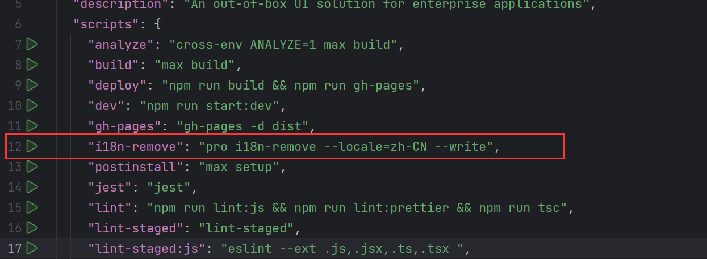

**但是报错了**

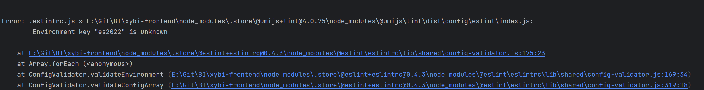

**问题解决**

**<font color='red'>任何开源项目的报错，都可以直接问作者（官方团队）或者搜 `github issues区`，直接这里复制报错部分的信息，在`github 的 issues区`，发现找到了官方给出的解决办法</font>**

步骤:

1．找到开源地址:               https://github.com/ant-design/ant-design-pro

2．搜索issues:                   https://github.com/ant-design/ant-design-pro/issues/10452

3．前端本地执行: 

````sh
yarn add eslint-config-prettier --dev yarn add eslint-plugin-unicorn --dev
````

**<font color='red'>修改`node_modules/@umijs/lint/dist/config/eslint/index.js`，注释掉 `es` 2022 true</font>**

**路由不显示名称**

给 `config/route.ts` 的路由加 `name`

这里类似 `springboot` 框架底层帮我们自动导入了很多依赖，需要根据readme文件，运行它写的 `npm install` 或者是 `yarn` 安装依赖


这里大致介绍了一下目录，其实 BI项目有笔记，这里迁移过来

##### 1. 前端目录


##### 2. 逐步更改代码模块

**因为 `start` 是以 `mock` 提供虚拟数据来启动，有了后端的情况下可以删除 `mock` 数据以 `dev` 方式启动**


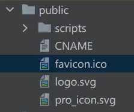

- **`icons` 文件夹直接删除，项目自带的图标**

- **`scripts` 文件夹 ：应该是 `umi4` 新版本的一些东西，不用管**

- **`public/CNAME` ：可以替换我们的域名**

- **这里的图标和logo可以替换成自己的，来搭建我们自己的项目，可以去下面的页面找替换的图**

  ```apl
  https://iconfont.cn
  ---------------------或者是字节跳动的-----------------------
  https://iconpark.oceanengine.com/official
  ```

  **项目里面是 `svg` 图标，所以就下 `svg` 的，全局搜索 `pro_icon.svg` 发现这个文件全局没用到，直接删**

  **而网站小图标 `favicon.ico` 可以直接下一个通过网上的工具转换成 `ico` 格式，或者直接改后缀，这里科普 4k 就有点大了， 小于 2k 比较好**

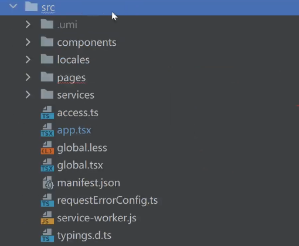

**`src`内文件夹类文件**

**组件是可以复用的，页面是唯一的**

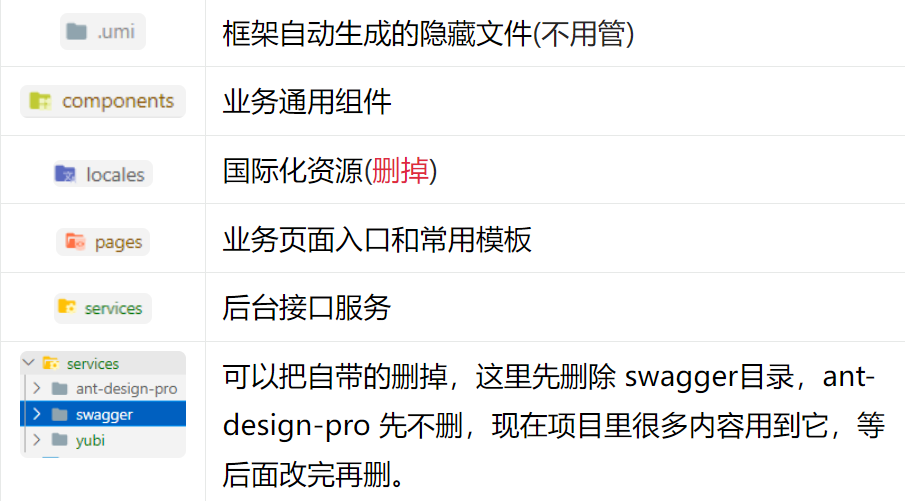

**`src`内非文件夹类文件**

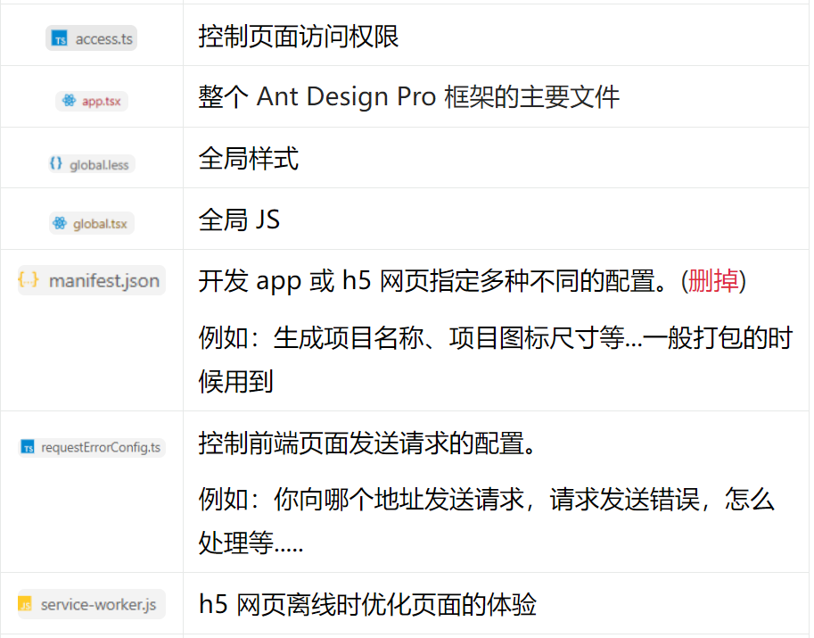

**最后外部的文件**

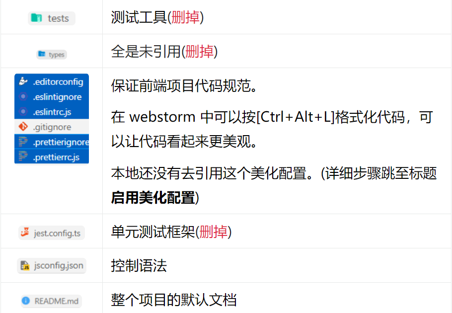

**这里默认没有开启美化，结合上面的外部文件，我们打开即可完成。**

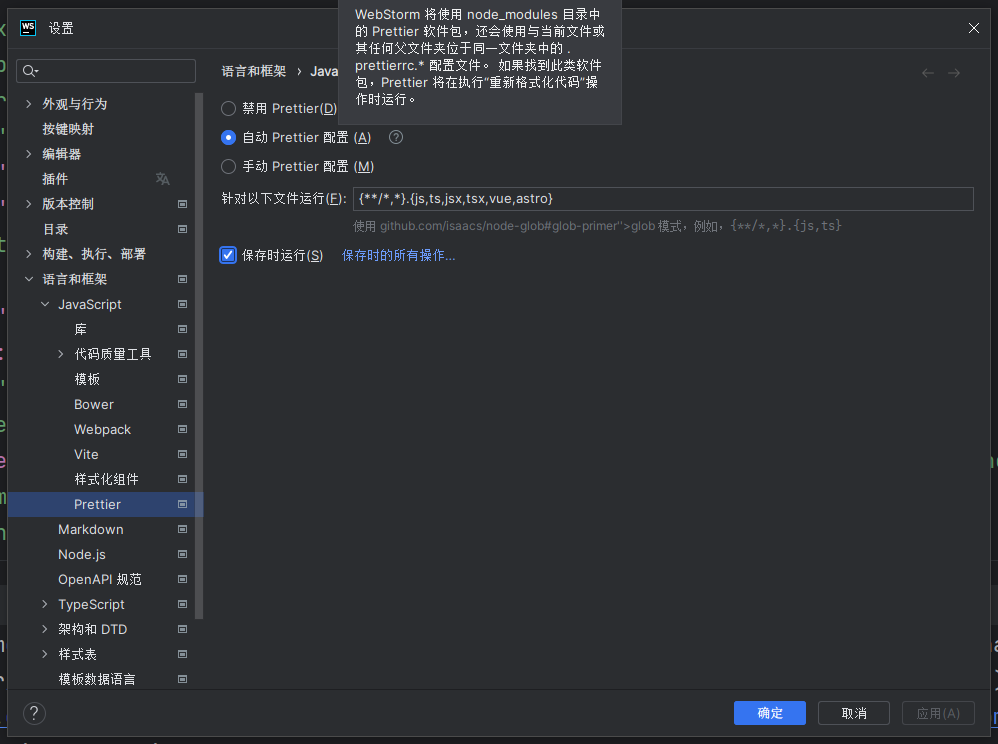

**然后进行项目名称全局替换，这里找到 `config/defaultSettings.ts`【只是为了懒得打字】，内部的 `Ant Design Pro` 和 `Ant Design`，全局替换成我们想要的名称，这里我选择 `XY の 后台管理系统` 。**

**当然发现网页下面的版权说明等，还是蚂蚁集团，这里也是全局搜索，替换自己的。以及网页未来能看到的可替换文本都是同样方式替换。**

**如果启动不了，删这个，因为前面删了 `openapi` 的 `json` 配置**

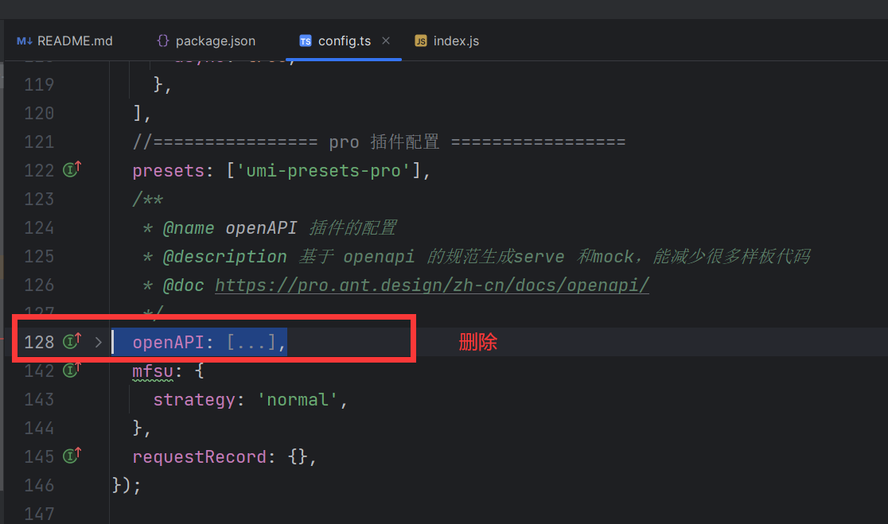


## 5. 数据库设计和简单测试

什么是数据库？存储数据

数据库里有什么？数据表（理解为 excel 表格）

java 操作数据库？程序代替人工


### 5.1 **什么是设计数据库表**？

有哪些表（模型）？

表中有哪些字段？

字段的类型？

数据库字段添加索引？

表与表之间的关联？

举例：性别是否需要加索引？

yarn add @umijs/preset-ui -D 


### 5.2 **用户表设计**

主要字段：

`id`（主键）`bigint`

`user_name` 昵称 `varchar`

`user_account` 登录账号 `varchar`

`avatar_url` 头像 `varchar`

`gender` 性别 `tinyint`

`user_password` 密码 `varchar`

`phone` 电话 `varchar`

`email` 邮箱 `varchar`

`user_status` 用户状态 `int` 0 - 正常

`create_time` 创建时间（数据插入时间）`datetime`

`update_time` 更新时间（数据更新时间）`datetime`

`deleted` 是否删除 0  1（逻辑删除）`tinyint`

`user_role` 用户角色 0 - 普通用户 1 - 管理员

`create_time` 创建时间 datetime

`update_time` 更新时间 datetime

**一般网上都推荐数据库字段不要设计的有 is 开头，可能序列化会出问题， 所以这里我就改掉了，同时数据库字段我也把驼峰改成了标准的下划线**

```sql
create database if not exists xycenter;
use xycenter;

drop table if exists user;

create table if not exists user
(
    id            bigint auto_increment comment 'id' primary key,
    user_name     varchar(256)                       null comment '用户昵称',
    user_account   varchar(256)                       null comment '账号',
    user_password varchar(512)                       not null comment '密码',
    avatar_url     varchar(1024)                      null comment '用户头像',
    gender        tinyint                            null comment '性别',
    phone         varchar(128)                       null comment '电话',
    email         varchar(512)                       null comment '邮箱',
    user_status   int      default 0                 not null comment '状态 0 - 正
常',
    create_time   datetime default CURRENT_TIMESTAMP null comment '创建时间',
    update_time   datetime default CURRENT_TIMESTAMP null on update
        CURRENT_TIMESTAMP comment '更新时间',
    deleted       tinyint  default 0                 not null comment '是否删除 0 - 否 1 - 是',
    user_role     int      default 0                 not null comment '用户角色 0
- 普通用户 1 - 管理员',
    user_code     varchar(512)                       null comment '用户编号'
) comment '用户表' collate = utf8mb4_unicode_ci;
```


### 5.3 自动生成器的使用

把项目结构先初步整理

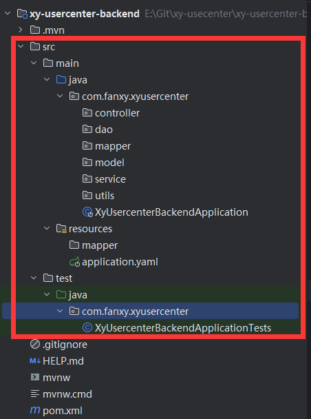

第一个路径填写项目的即可

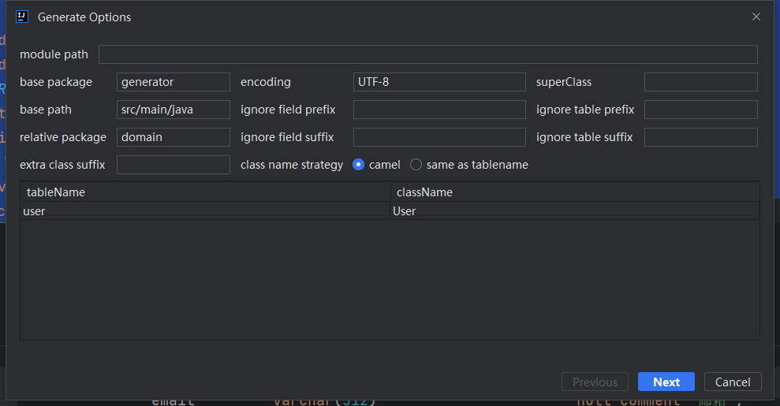

`MyBatisX` 插件，自动根据数据库生成：

`model`【domain：老版本】：实体对象

`mapper`：操作数据库的对象

`mapper.xml`：定义了 mapper 对象和数据库的关联，可以在里面自己写 SQL

`service`：包含常用的增删改查

`serviceImpl`：具体实现 service

从而提高开发效率！

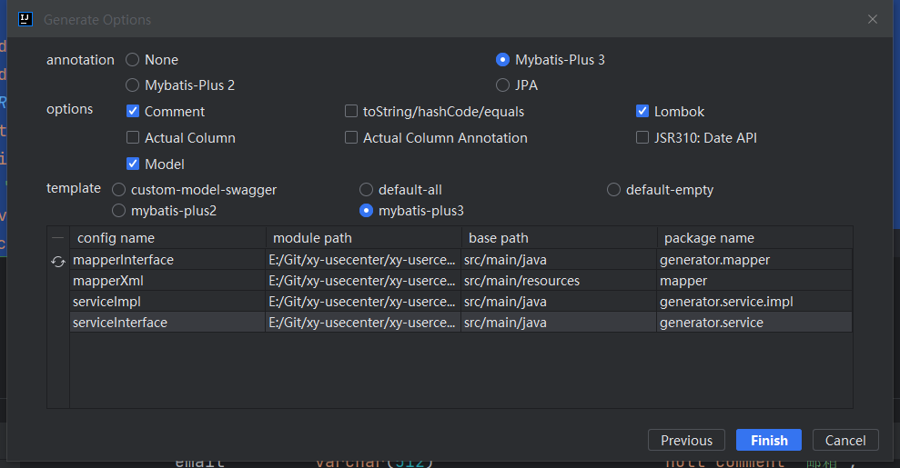

把对应的代码放到该放的包

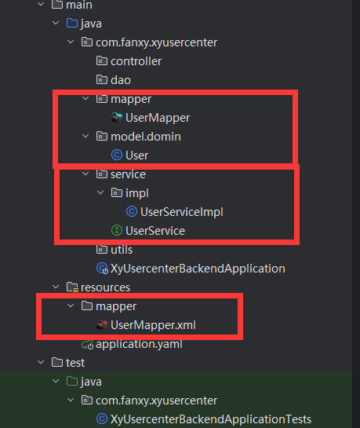

这里养成一个习惯，做好一个功能要先测试会不会有bug，使用 `alt + enter` 生成测试方法，默认的就行


这里科普了一个检查代码规范的小插件 `sonalint`

以及一个一键生成所有 get set 方法的插件 `GenerateAllSetter`

快捷键提醒 同时能统计有多少次没有使用快捷键 `Key Promoter X`

**这里我还把用户的主键改成了雪花ID，然后删除改成了逻辑删除，对应的测试代码，可以使用 `alt + enter` 快速生成【对应路径空方法，测试方法还得自己写】**

```java
@SpringBootTest
class UserServiceTest {

    @Resource
    private UserService userService;

    @Test
    void testAddUser() {
        User user = new User();
        user.setUserName("王大伟");
        user.setUserAccount("123456");
        user.setUserPassword("123");
        user.setAvatarUrl("");
        user.setGender(0);
        user.setPhone("123");
        user.setEmail("123@qq.com");
        user.setUserStatus(0);
        user.setCreateTime(new Date());
        user.setUpdateTime(new Date());
        user.setDeleted(0);
        user.setUserRole(0);
        user.setUserCode("233");

        boolean result = userService.save(user);
        Assertions.assertTrue(result);
    }
}
```


当然 `mybatis plus` 默认配置了驼峰转换，所以如果你不想转化可以改，具体看 `springboot` 第一节的部分


# 二. 登录注册初开发

1. 用户在前端输入账户和密码、以及校验码（todo）
2. 校验用户的账户、密码、校验密码，是否符合要求
   1. 非空
   2. 账户长度 **不小于** 4 位
   3. 密码就 **不小于** 8 位吧 【密码格式可以做正则】
   4. 账户不能重复
   5. 账户不包含特殊字符
   6. 密码和校验密码相同
3. 对密码进行加密（密码千万不要直接以明文存储到数据库中）
4. 向数据库插入用户数据


## 1. 注册业务代码编写

引入依赖

```xml
        <!-- https://mvnrepository.com/artifact/org.apache.commons/commons-lang3 -->
        <dependency>
            <groupId>org.apache.commons</groupId>
            <artifactId>commons-lang3</artifactId>
            <version>3.12.0</version>
        </dependency>
```

> Apache Commons Lang3 是 Apache 软件基金会开发的一组 Java 工具类库，提供各种常用字符串处理、数学运算、数据转换、校验等常用功能实现的工具类

Java 中的**盐值和密码混淆都是用来提高密码安全性的防护措施。**盐值是一种用于增加密码破解难度的技术，在存储用户密码时，会将用户密码和一个随机生成的字符串（称为盐）进行组合，然后再进行加密存储。每个用户的盐值都是随机生成的，**这样可以防止攻击者使用相同的方式对一组用户的密码执行攻击。**在验证用户登录时，系统会使用相同的盐和用户输入的密码进行组合，并与存储的加密密码进行比对，以验证密码是否正确。


先给接口写登录方法 返回生成用户的主键 id ，如果为 -1 说明注册失败，未来可以写异常，然后更为返回异常页面

```java
long userRegister(String userAccount, String userPassword, String checkPassword);
```

**然后实现方法这里利用了 `Springboot` 自带的判断非空的工具类 `StringUtils` 的 `isAnyBlank()` 方法，可以同时判断多个是否为空**


**同时这里有一个思想，校验是否有相同账户的操作，应该放在所有的校验之后，因为这个校验需要走数据库进行查询，是否有账户相同的数据，如果有的话，就登录失败。我们应该尽可能让查询数据库的操作放在所有不走数据库之后，减小数据库的压力。**


**这里加密使用了 Spring 自带的加密函数，我们手动加了盐，然后对它进行加密，返回的是一个十六进制的数。然后数据库操作其实用 service 功能更多，但是 这里为了直观演示，也使用了注入 `UserMapper` 的方式进行演示。**  


**第一版注册【此时只是返回 -1 未来应该对应做一个处理异常页面的类，然后返回异常】**

```java
@Service
public class UserServiceImpl extends ServiceImpl<UserMapper, User>
        implements UserService {

    @Override
    public long userRegister(String userAccount, String userPassword, String checkPassword) {
        // 1. 校验
        if (StringUtils.isAnyBlank(userAccount, userPassword, checkPassword)) {
            return -1;
        }
        if (userAccount.length() < 4) {
            return -1;
        }
        if (userPassword.length() < 8 || checkPassword.length() < 8) {
            return -1;
        }

        // 账户不能包含特殊字符 特殊字符使用正则表达式筛选
        String validPattern = "[`~!@#$%^&*()+=|{}':;',\\[\\].<>/?~！@#￥%……&*（）——+|{}【】‘；：”“’。 ，、？]";
        Matcher matcher = Pattern.compile(validPattern).matcher(userAccount);
        if (matcher.find()) {
            return -1;
        }

        // 账户不能重复
        QueryWrapper<User> queryWrapper = new QueryWrapper<>();
        queryWrapper.eq("user_account", userAccount);
        long count = this.count(queryWrapper);

        if (count > 0) {
            return -1;
        }

        // 校验密码和密码相同判断
        if (!userPassword.equals(checkPassword)) {
            return -1;
        }

        // 2. 加密
        final String SALT = "this is SALT";
        String encryptPassword = DigestUtils.md5DigestAsHex((SALT + userPassword).getBytes());

        // 3. 插入数据
        User user = new User();
        user.setUserAccount(userAccount);
        user.setUserPassword(userPassword);
        boolean saveResult = this.save(user);
        // 这里返回的是 long 类型 但是实际上我们实体类是 Long 类型 故加一重判断
        if (!saveResult) {
            return -1;
        }
        return 0;
    }
}
```


**对应的测试代码，可以使用 `alt + enter` 快速生成【对应路径空方法，测试方法还得自己写】**

```java
    @Test
    void testRegister() {

        // 1 非空检测
        Assertions.assertEquals(-1L, userService.userRegister("", "", ""));

        // 2 账号长度4位检测
        Assertions.assertEquals(-1L, userService.userRegister("123", "aaaaaaaa", "aaaaaaaa"));

        // 3 密码长度8位检测
        Assertions.assertEquals(-1L, userService.userRegister("fanxy", "a", "aaaaaaaa"));

        // 4 校验密码长度8位检测
        Assertions.assertEquals(-1L, userService.userRegister("fanxy2", "aaaaaaaa", "a"));

        // 5 账号特殊字符检测
        Assertions.assertEquals(-1L, userService.userRegister("fanxy3@", "aaaaaaaa", "aaaaaaaa"));

        // 6 账号重复检测
        Assertions.assertEquals(-1L, userService.userRegister("123456", "aaaaaaaa", "aaaaaaaa"));

        // 7 校验密码和密码相同检测
        Assertions.assertEquals(-1L, userService.userRegister("3152523562", "bbbbbbbb", "aaaaaaaa"));
    }
```


## 2. 登录业务代码编写


