# 智能BI项目笔记

## 1. 项目介绍

什么是BI?

即商业智能:数据可视化、报表可视化系统

主流B平台:帆软`BI`、小马`BI`、微软`Power Bl`

传统BI平台:	https://chartcube.alipay.com/1

1. 需要人工上传数据
2. 需要人工拖选分析要用到的数据行和列(数据分析师)
3. 需要人工选择图表类型（数据分析师)编程导航知识星球
4. 生成图表并保存配置

智能B平台:

项目介绍:
区别于传统的B，用户(数据分析者）只需要导入最最最原始的数据集，输入想要进行分析的目标（比如帮我分析一下网站的增长趋势），就能利用AI自动生成一个符合要求的图表以及结论。

优点:让不会数据分析的同学也能通过输入目标快速完成数据分析，大幅节约人力成本。会用到AI接口【项目会提供】


## 2. 需求分析

1．智能分析:用户输入目标和原始数据（图表类型)，可以自动生成图表和分析结论

2．图表管理

3．图表生成的异步化(消息队列)编程导航知识星球

4．对接AI能力


## 3. 架构图

**基础流程**

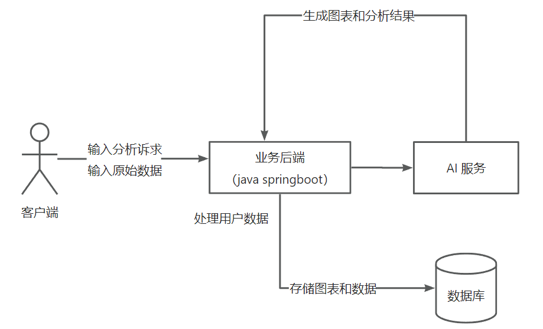

**优化过程【异步化】**

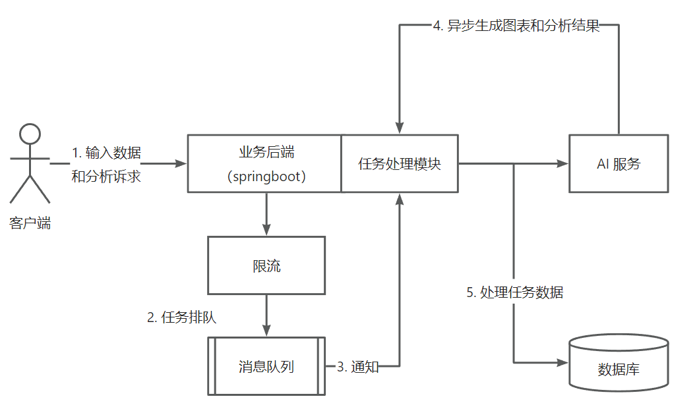


## 4. 技术栈

**前端**

1. `React`
2. `Umi` + `Ant Design Pro`
3. 可视化开发库(**`Echarts`** 【更新兼容旧版本】+ `HighCharts` + `AntV`)
4. `umi openapi`代码生成（自动生成后端调用代码)

**后端**

1. `Spring Boot`(万用Java后端项目模板，快速搭建基础框架，避免重复写代码)
2. `MySQL`数据库
3. `MyBatis Plus`数据访问框架
4. 消息队列(`RabbitMQ`)
5. Al能力(Open Al接口开发：星球提供现成的AI接口)
6. `Excel`的上传和数据的解析(`Easy Excel`)
7. `Swagger` + `Knife4j`项目接口文档
8. `Hutool`工具库


## 6. 第一部分

介绍项目背景、技术选型、架构图、业务流程

前端项目初始化

后端项目初始化

前端开发

- 快速开发登录功能
- 图表分析页面的开发
- 图表管理页面的开发

后端开发

- 库表设计
- 图表管理开发
- 文件上传接口
- 开发前后端业务
- 流程跑通


### 6.1. 前端项目初始化

官方文档: https://pro.ant.design/

这个框架可能会更新，一定要跟着官方文档来: https://pro.ant.design/zh-CN/docs/getting-started/

首先下载 Node.js 18版本，可以去官网下载: https://nodejs.org/，记得选择稳定版本（不要选20)

>  nvm工具可以快捷切换node.js的版本


#### 1．按照官方文档初始化

**在对应的目录进入终端**

```sh
# 使用 npm
npm i @ant-design/pro-cli -g
pro create xybi-frontend
```

这里选择了最新的 `umi 4`


#### 2．项目试运行(`npm run dev / start`)

然后打开项目，运行 `npm run strart:dev` ，先看看项目能否直接运行

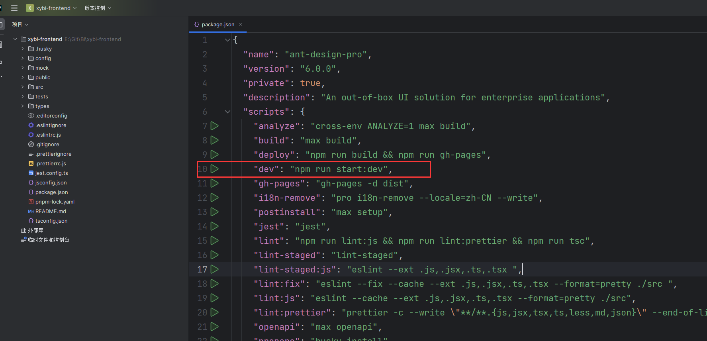

**这里我遇到了一个报错**

`'cross-env' is not recognized as an internal or external command, operable program or batch file.`

**发现这个问题的原因是由于windows电脑造成的，在windows电脑上默认是无法使用 `cross-env` ，需要手动安装，那行吧，安装一下**

然后又出现问题，其实这些问题，`webstorm` 都自动分析了，在右下角，让我们去安装依赖。

类似这种的无法识别参数，这些问题其实都是因为各种原因，比如网络啊什么的**安装不完全导致的**，我的建议是重新安装，甚至是 **换一种安装方式**；

```sh
cd 项目文件夹
 
npm install
```

**但是安装实在是太慢了，直接换`cnpm`，`CNPM` 是中国 `npm` 镜像的客户端。<font color='red'>换的前提是，你的版本能对应，如果太新，还是寄</font>**

```sh
npm install cnpm -g --registry=https://registry.npm.taobao.org
```

```sh
cd 项目文件夹
 
cnpm install
```

**这里如果node.js版本低于 16.14 也会报错，可以通过如下命令进行查看，如果不满足就去上面下载新版本**

```sh
node -v
```

**启动正常，这里没有后端输入账号密码也登录不了，直接我们选择换启动方式。**

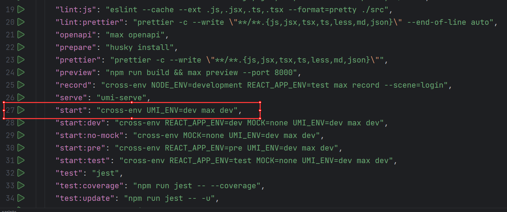

**这个启动方式会给我们模拟数据，这样就能启动了。**

**账号密码在输入框已经通过背景告诉我们了**

**而右侧的齿轮按钮可以调整页面样式，同时也可以导出来**

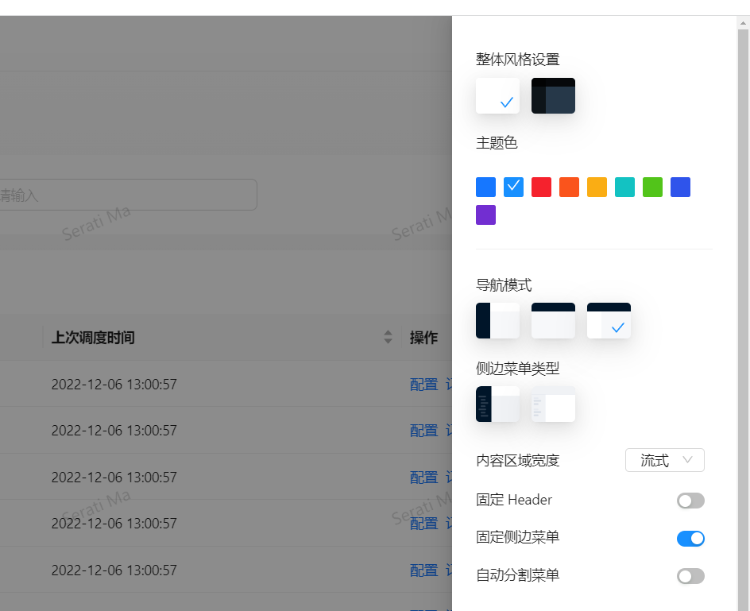


#### 3．代码托管

这里为了精简项目，需要删除项目不需要的东西，然而为了防止删错了，直接使用 git 命令先对代码进行代码托管。

```sh
git init
git add . # 把当前文件全部加入暂存区
git commit -m 'first init'
```


#### 4．移除不必要的能力(比如国际化)

**这里官方给我们提供了一键删除国际化的命令**

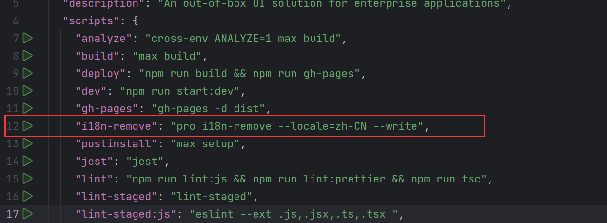

**但是报错了**

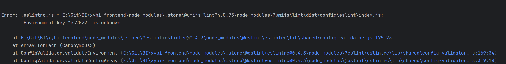

**问题解决**

**<font color='red'>任何开源项目的报错，都可以直接问作者（官方团队）或者搜 `github issues区`，直接这里复制报错部分的信息，在`github 的 issues区`，发现找到了官方给出的解决办法</font>**

步骤:

1．找到开源地址:               https://github.com/ant-design/ant-design-pro

2．搜索issues:                   https://github.com/ant-design/ant-design-pro/issues/10452

3．前端本地执行: 

````sh
yarn add eslint-config-prettier --dev yarn add eslint-plugin-unicorn --dev
````

如果没有下载 `yarn`【一个依赖管理工具】，可以执行下面的命令下载

```sh
cnpm install -g yarn
```

**<font color='red'>修改`node_modules/@umijs/lint/dist/config/eslint/index.js`，注释掉 `es` 2022 true</font>**

**路由不显示名称**

给 `config/route.ts` 的路由加 `name`


### 6.2. 后端项目初始化

这里使用了万能后端模板

用法参考项目中的 `README.md` 文件，默认情况下只要执行 `create_table.sql` 文件创建数据库表，然后修`application.yml` 中的数据库地址为你自己的数据库即可。

当然，使用前先启动一下，进入 `api` 接口网页，测试一下注册和登录功能是否正常

```sh
http://localhost:8080/api/doc.html
```


### 6.3. 库表设计

**用户表**

**这里用不到微信小程序等功能，就删除这部分，同时也不需要用户的简介信息，然后索引就改成以用户账号为索引。**

```sql
-- 用户表
create table if not exists user
(
    id           bigint auto_increment comment 'id' primary key,
    userAccount  varchar(256)                           not null comment '账号',
    userPassword varchar(512)                           not null comment '密码',
    userName     varchar(256)                           null comment '用户昵称',
    userAvatar   varchar(1024)                          null comment '用户头像',
    userRole     varchar(256) default 'user'            not null comment '用户角色：user/admin',
    createTime   datetime     default CURRENT_TIMESTAMP not null comment '创建时间',
    updateTime   datetime     default CURRENT_TIMESTAMP not null on update CURRENT_TIMESTAMP comment '更新时间',
    isDelete     tinyint      default 0                 not null comment '是否删除',
    index idx_userAccount (userAccount)
) comment '用户表' collate = utf8mb4_unicode_ci;
```

**图表数据表**

**首先图表用户会上来输入分析目标，所以我们就需要开一个 `text` 类型，来存放分析目标，但是用户可能自己都不清楚分析目标是什么，所以可以为空。**

**其次图表描述数据也是需要上传的，固也用 `text` 类型。**

**同时图表有各种各样的类型，如折线图，条形图，瀑布图等，我们这里就用 `VARCHAR(128)` 存储，同时也能非空，因为用户可能也不清楚使用什么类型。**

**然后就是根据 AI 生成的图表数据和分析结论，同样都用 `text `类型。**

**目前先写这些类型，如果后期感觉不够可以补充。**

**----------------补充--------------**

**在 6.4.6 部分 发现缺失一个数据 `userId`，这里下面补上了。**

```sql
-- 图表信息表
create table if not exists chart
(
    id           bigint auto_increment comment 'id' primary key,
    goal         text                                   null comment '分析目标',
    chartData    text                                   null comment '图表数据',
    chartType    varchar(128)                           null comment '图表类型',
    userId       bigint 								null comment '创建用户id',
    genChart     text                                   null comment 'AI生成的图表数据',
    genResult    text                                   null comment 'AI生成的评论数据',    
    createTime   datetime     default CURRENT_TIMESTAMP not null comment '创建时间',
    updateTime   datetime     default CURRENT_TIMESTAMP not null on update CURRENT_TIMESTAMP comment '更新时间',
    isDelete     tinyint      default 0                 not null comment '是否删除'
) comment '图表信息表' collate = utf8mb4_unicode_ci;
```

**这里就删除后端里面的其他表，然后使用这两个，进行数据库创建。别忘了写数据库生成和使用的信息**

```sql
CREATE DATABASE IF NOT EXISTS `xybi`;
USE `xybi`;
```

**<font color='bb000'>注意别忘了改配置文件对应的数据库</font>**


### 6.4. 后端基础开发

**自动生成后端增删改查代码:**

#### 1. 执行SQL语句来建表

**<font color='red'>同时把项目的名称重构成 `xybi-backend` 快捷键 `ctrl + shift + r` 快速查找替换，而如果想局部替换，就不需要按 `shift`</font>**

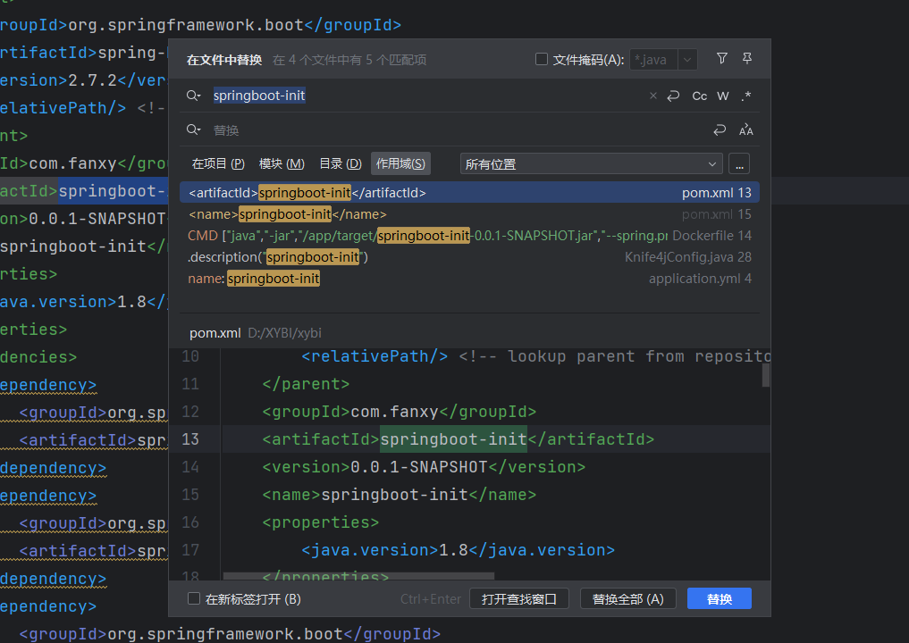


#### 2. `mybatisX`插件生成代码

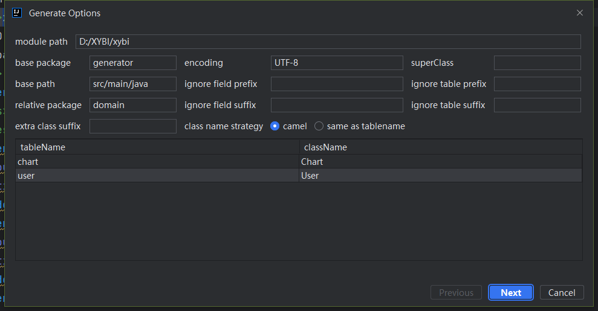

**这里记得要勾选Model，要不然还得自己写 `Java Bean`**

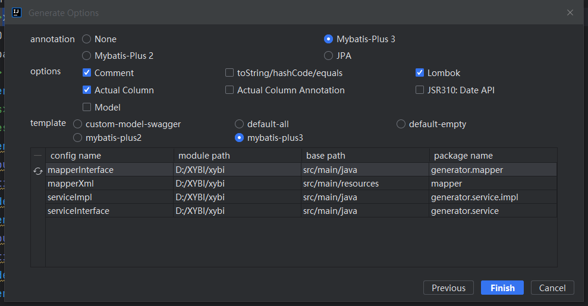


#### 3. 迁移生成的代码

**这里注意要把之前有的测试用的 `UserMapper` 删除，要不然冲突了，而 `UserService` 就用之前有的即可，<font color='bb000'>注意这里一定要拖过去，要不然项目没法帮你重构代码</font>，Model 的用户和图表 Bean 同理，记得删除之前的用户，因为我们删了不少属性，User 类应该少了很多属性。全部迁移完毕就可以删了生成的目录了。**

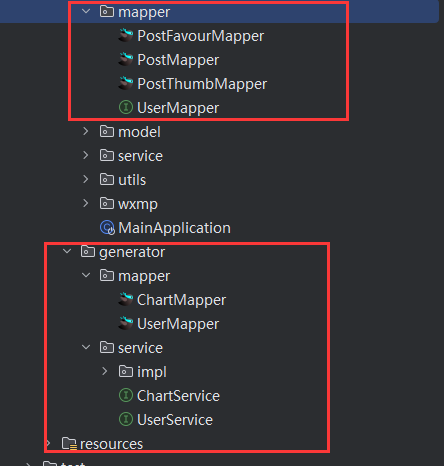


#### 4. 复制老的增删改查模板，根据的表重构

**首先这里把用户的 ID 这里改成 `ASSIGN_ID`<font color='bb000'>【同理 `Chart` 类也需要进行同样的更改】</font>**

**`IdType`是一个枚举类，定义了生成ID的类型【`mybatis plus` 的类】**

1. **`AUTO` 数据库ID 自增**
2. **`INPUT` 用户输入ID**
3. **`ASSIGN_ID` : 分配 ID(主键类型为 Number(Long 和 Integer)或 String)(since 3.3.0),使用接口`IdentifierGenerator`的方法`nextId`(默认实现类为`DefaultIdentifierGenerator`雪花算法)**
4. **`ASSIGN_UUID` 分配 UUID,主键类型为 String(since 3.3.0),使用接口`IdentifierGenerator`的方法`nextUUID`(默认 default 方法) **
5. **`NONE` 该类型为未设置主键类型**


**而逻辑删除字段，需要使用 `mybatis plus` 的注解 `@TableLogic` ，相当于让框架把它识别为逻辑删除字段**

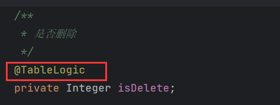


#### 5. 根据接口文档来测试

**试运行肯定跑不起来，因为我们删除了用户的一些字段，比如用来第三方登录的模块，我们把它们注释掉或删掉即可**

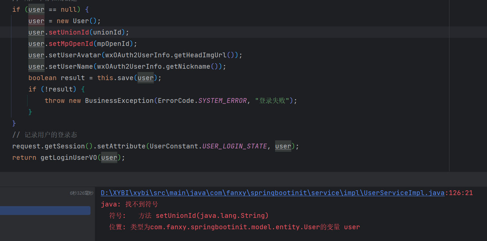

**这里删除 `UserServiceImpl` 和父接口对应的方法即可。然后逐个启动，把不需要的方法删除**

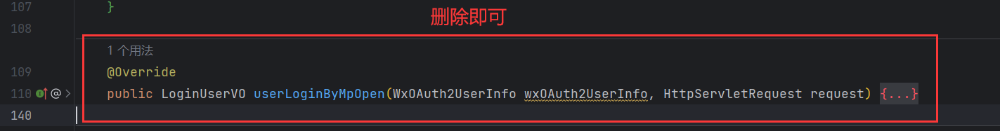

**关于微信公众号的包也删了即可。**

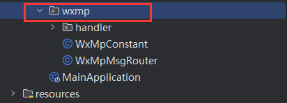

**再次启动报错，发现是因为还有 `wxmp` 的 Controller 存在，这里直接删除**

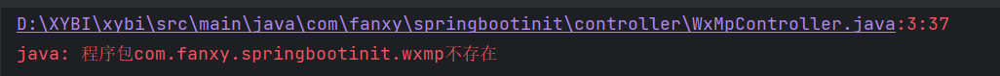

**再次启动，发现还是有一些和微信公众号相关的 `Service` 方法，接着删除**

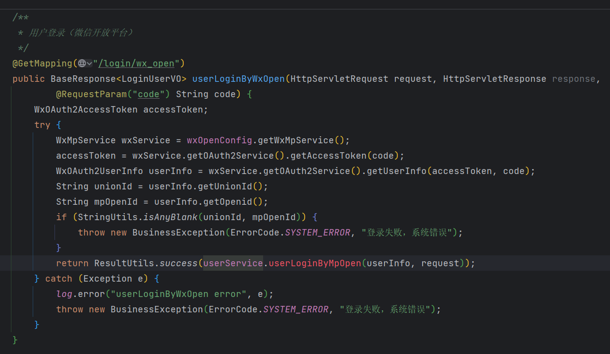

**此时启动，发现正常了，然后去 `api` 接口对应的网页，测试能否正常注册和登录。**

```sh
http://localhost:8101/api/doc.html
```

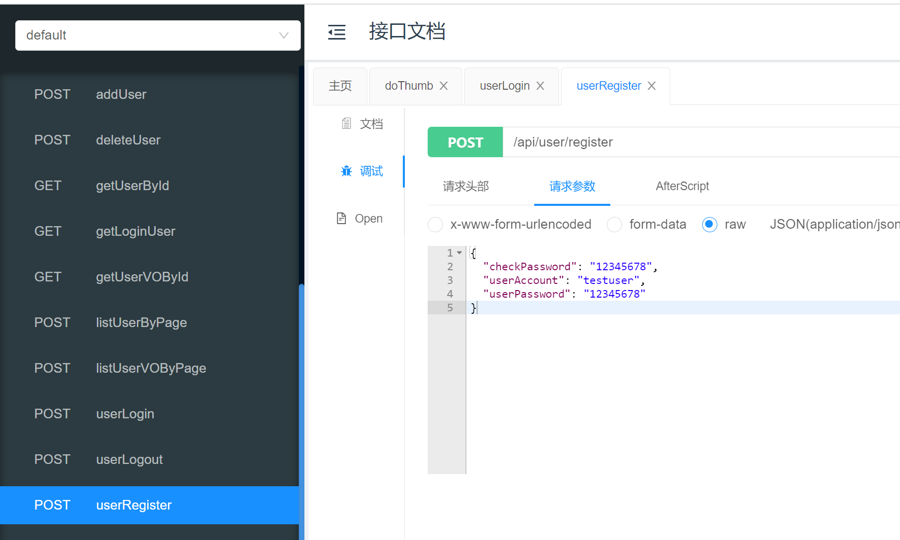

**测试登录注册都没问题。**


#### 6. 后端进一步改写

**然后我们的代码，其实之前是关于帖子的，而我们现在需要把这些改成图表的类型。**

**先复制一个** `PostController` 变成 `ChartController` 

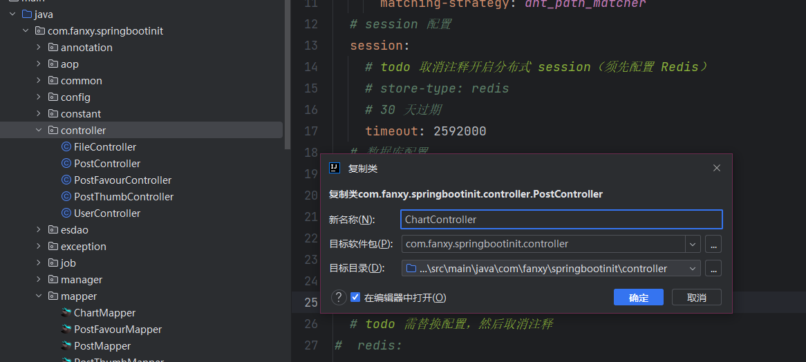

**里面的请求小写的 `post` 全改成 `chart`，而大写的关于 `Post` 部分【除了`PostMapping`】，也更改为 `Chart`，记得开启区分大小写**

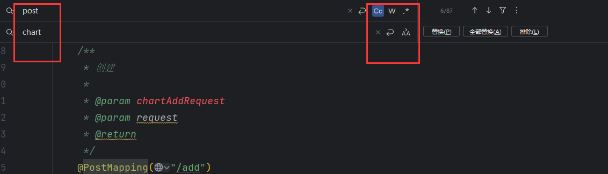

**替换回来 MVC 的注解**

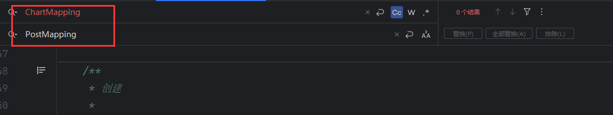

**现在代码会有很多报错，因为其实 DTO 类我们写了专门的对象来接受请求，之前写的是关于帖子的，所以就需要改写成 Chart 类型，ES的不用就不改了**

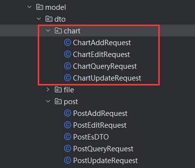

**<font color='bb000'>这了主要是关于图表的一些字段的封装，我们干脆直接把 Chart 类的数据复制过来，需要留下来的留下。这是一个快速开发修改的技巧</font>**

**首先要考虑前端部分，用户需要上传 分析目标， excel 数据，图表类型这三个属性，AI 根据这些信息生成图表描述和图表总结。**

**首先图表增加的请求，除了说的这三个属性，其他的都是由后端业务部分生成的，不需要留下**

**而编辑部分，仔细思考，我们除了上述三个，肯定还需要主键 id 才能去定位图表的数据库数据，然后才能修改，上述三个属性，其他属性都是后端生成，不需要考虑** 

**查询部分，用户可能根据 id 查询，分析目标查询，excel数据查询是不可能的，还可能根据类型查询，同时这里也意识到，其实应该每个图表该分配一个名称，后期再加。**


**然后回到 `ChartController` ，这里把不需要的 `VO` 封装类的部分删去，这里发现之前的图表的表少了一个字段，用户id，应该加上，改写 `sql`，然后我们删除对应的表，重新生成，这里手动给实体类对象增加这个字段，还有Mapper也补上**

**`ReView`，这个字段肯定不能让用户增加和编辑的请求传，要不然就可以修改发送别人的图表了，但是查询可以传，这样就能查指定用户的图表，固给上面的查询部分增加这个属性字段**

**然后接着去Controller把这些关于数据校验部分删了。**

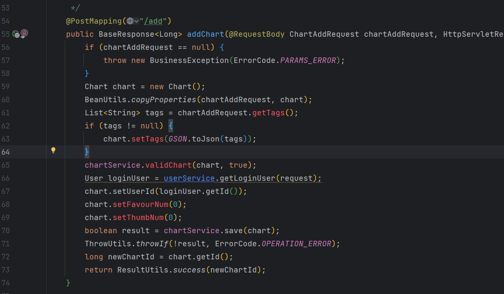

**把爆红部分都改一下， 返回的情况直接返回业务生成的即可，封装回复也一样，直接使用 Chart 类，不需要封装成VO类**

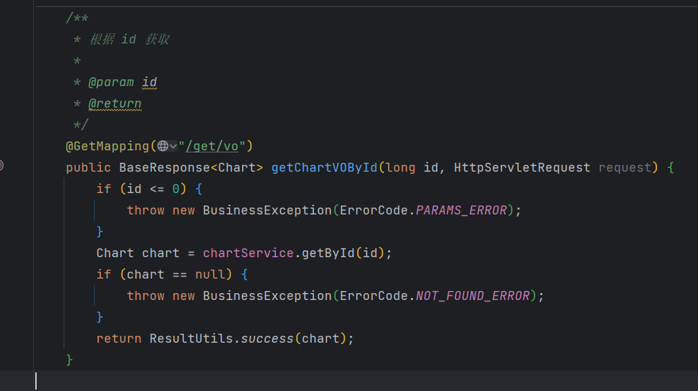

**获取请求这里需要一会重新编写，其他的就按上面的逻辑进行更改即可**

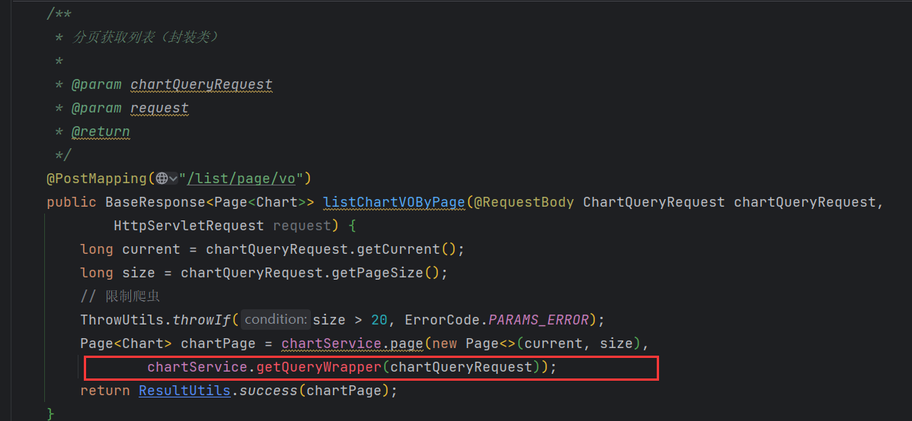

**然后就只差上面的获取查询条件的包装方法，这里直接去 `PostServiceImpl` 里面复制这个方法到我们的 `ChartController` 里面，然后把泛型改成 `Chart`**

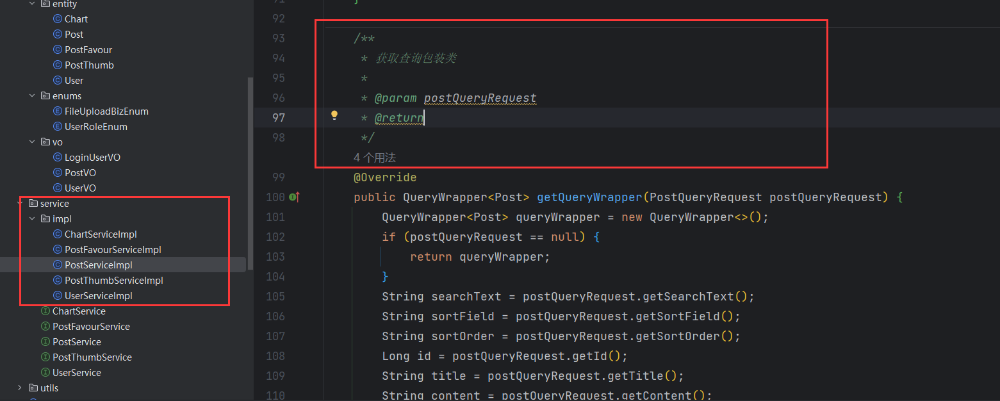

**复制之后需要改造一下，我们勾选全部，`ctrl + R`，然后把 大小写的 `Post` 改成 对应大小写的`Chart`**

**`GenerateAllSetter Postfix Completion` (自动生成Set/Get方法)**

**使用上面的插件，一键生成所有的get方法，然后删了爆红，按 `mybatis plus` 的方法，把查询条件拼接写好即可。**

```java
    /**
     * 获取查询包装类
     *
     * @param chartQueryRequest
     * @return
     */
    private QueryWrapper<Chart> getQueryWrapper(ChartQueryRequest chartQueryRequest) {


        QueryWrapper<Chart> queryWrapper = new QueryWrapper<>();
        if (chartQueryRequest == null) {
            return queryWrapper;
        }

        Long id = chartQueryRequest.getId();
        String goal = chartQueryRequest.getGoal();
        String chartType = chartQueryRequest.getChartType();
        Long userId = chartQueryRequest.getUserId();
        String sortField = chartQueryRequest.getSortField();
        String sortOrder = chartQueryRequest.getSortOrder();

        queryWrapper.eq(id != null && id > 0, "id", id);
        queryWrapper.eq(StringUtils.isNotBlank(goal), "goal", goal);
        queryWrapper.eq(ObjectUtils.isNotEmpty(userId), "userId", userId);
        queryWrapper.eq(ObjectUtils.isNotEmpty(chartType), "chartType", chartType);
        queryWrapper.eq("isDelete", false);

        queryWrapper.orderBy(SqlUtils.validSortField(sortField), 
                sortOrder.equals(CommonConstant.SORT_ORDER_ASC),
                sortField);
        return queryWrapper;
    }
```

**然后其他的 `ChartController` 方法都直接调用内部的这个方法即可。**

**然后我们直接以 Debug 模式打开，看看图表增删改查接口能否正常调用。记得先登录。**

```json
{
  "chartData": "[{\"月份\": 6}]",
  "chartType": "柱状图",
  "goal": "我想要分析网站近一年的用户增长趋势"
}
```

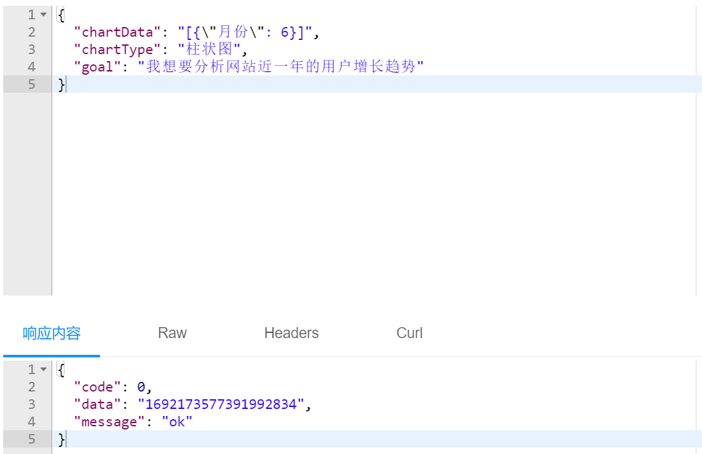

**<font color='red'>这里排序获取列表报错，发现是上面 `id` 应该先判断不为空，再判断大于 0，同时`Chart`的`Controller`带着VO名称，这里就把这些`Controller`的这两个字母去掉，同时把请求`Mapping` 字段里面的 `/vo` 都删除</font>**

```java
queryWrapper.eq(id != null && id > 0, "id", id);
```

**至此，后端部分的框架基本搭建完毕**


### 6.5. 前端调用后端

**后端有自己的 `api` 链接地址，前端可以根据它一键生成前端界面。**

**下面的是后端调试的 `swagger` 链接。**

```sh
http://localhost:8080/api/doc.html
```

**而我们传给前端框架的是 `ant design` 框架，根据后端代码提供的 `api` 接口，可以自动一键生成前端页面的配置**

```sh
http://localhost:8080/api/v2/api-docs
```


**然后根据 `openapi` 规则，生成前端 Service 代码**

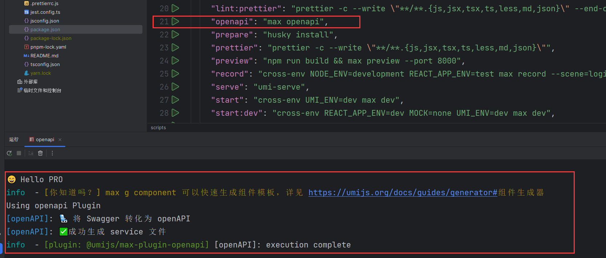

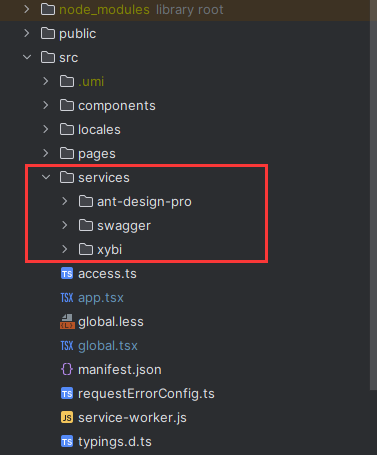

**<font color='red'>注意:前端须更改对应的请求地址为你的后端地址，方法:在`app.tsx`里修改`request.baseURL`，记得一定要大写，不大写无法跑通</font>**

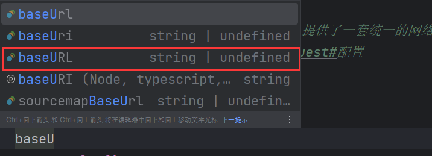

```sh
baseURL: "http://localhost:8080",
```

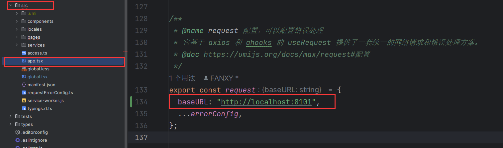


## 7. 第二部分

计划

1. 前置准备
2. 开发登录 注册页面
3. 学习使用 AI 生成 BI 图表的完整流程 【梳理功能点和工作】
4. 开发智能分析平台
   - 文件上传
   - Excel 处理
5. 图表管理功能


### 7.1. 初始化项目 - 开发前准备

#### 1. 后端启动项端口冲突问题

这里我之前启动 tomcat 的时候遇到过类似的问题，解决方法一样。

原因: Windows Hyper-V虚拟化平台占用了端口

先使用

```sh
netsh interface ipv4 show excludedportrange protocol=tcp
```

查看被占用的端口，然后选择一个没被占用的端口启动项目

禁用 `Hyper-V` 【不推荐】

#### 2. 前端模块优化和了解

##### 1. 前端目录

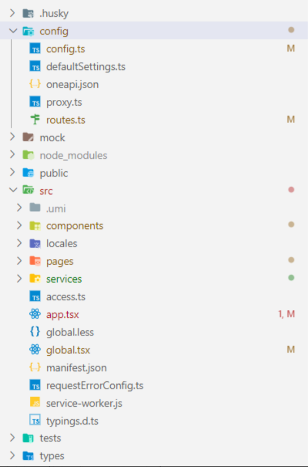

##### 2. 逐步更改代码模块

**这里就不用 `start` 启动了，因为 `start` 是以 `mock` 提供虚拟数据来启动，这里我们有了后端了，就直接以 `dev` 方式启动**

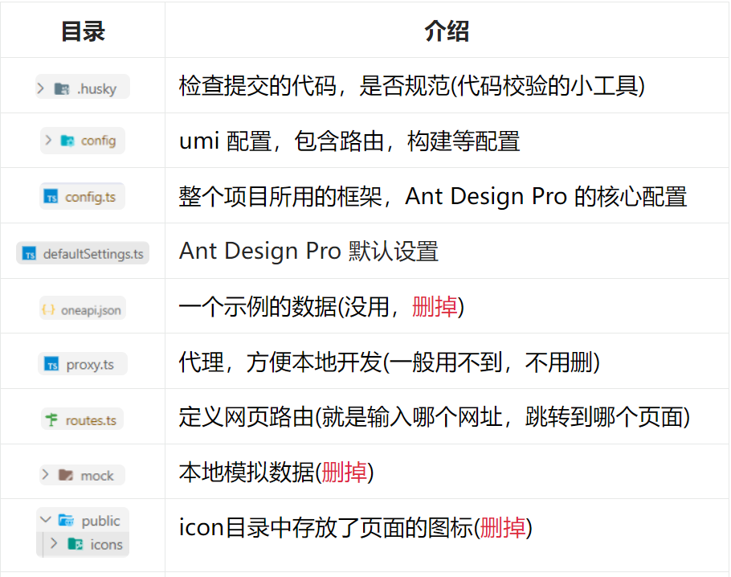


- **`icons` 文件夹直接删除，项目自带的图标**

- **`scripts` 文件夹 ：应该是 `umi4` 新版本的一些东西，不用管**

- **`public/CNAME` ：可以替换我们的域名**

- **这里的图标和logo可以替换成自己的，来搭建我们自己的项目，可以去下面的页面找替换的图**

  ```apl
  https://iconfont.cn
  ---------------------或者是字节跳动的-----------------------
  https://iconpark.oceanengine.com/official
  ```

  **项目里面是 `svg` 图标，所以就下 `svg` 的，全局搜索 `pro_icon.svg` 发现这个文件全局没用到，直接删**

  **而网站小图标 `favicon.ico` 可以直接下一个通过网上的工具转换成 `ico` 格式，或者直接改后缀，这里科普 4k 就有点大了， 小于 2k 比较好**

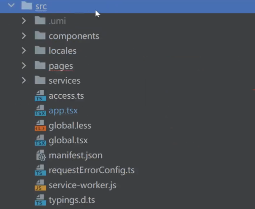

**`src`内文件夹类文件**

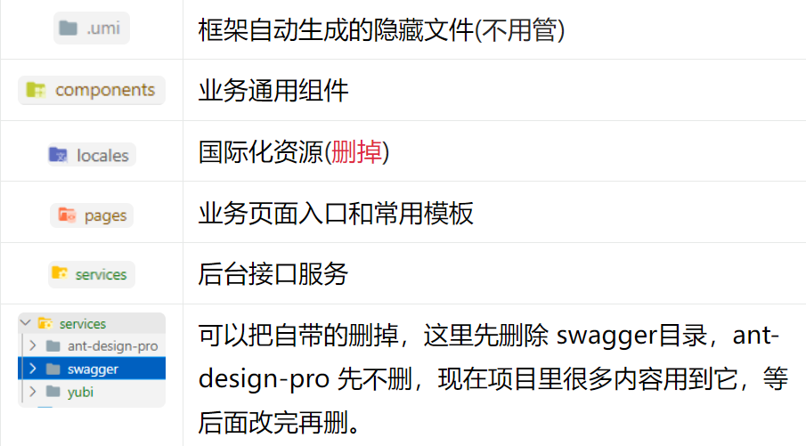

**`src`内非文件夹类文件**

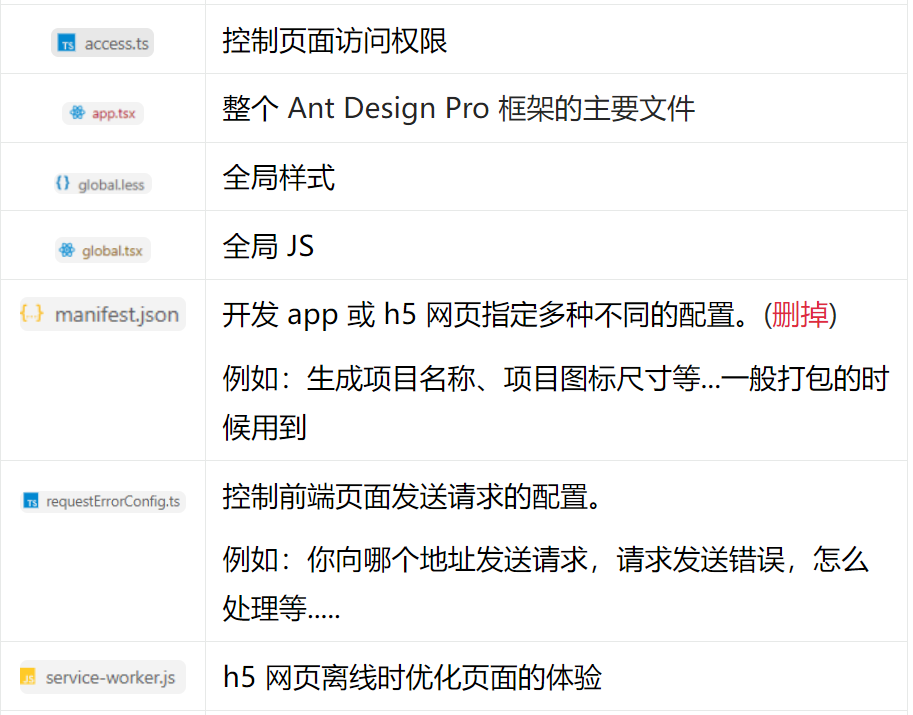

**最后外部的文件**

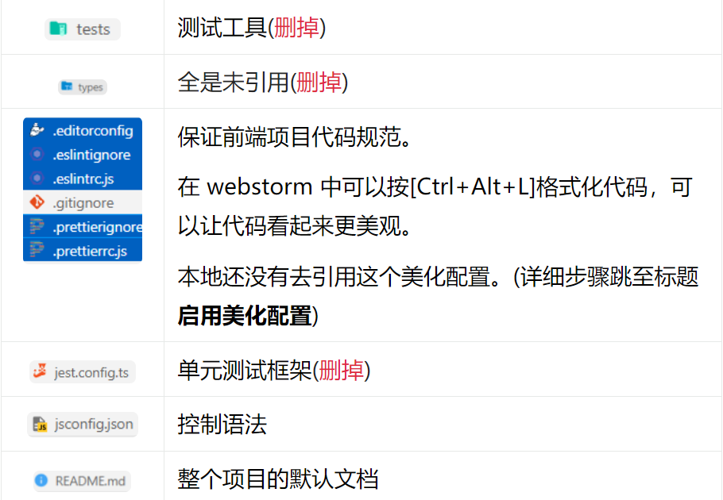

**这里默认没有开启美化，结合上面的外部文件，我们打开即可完成。**

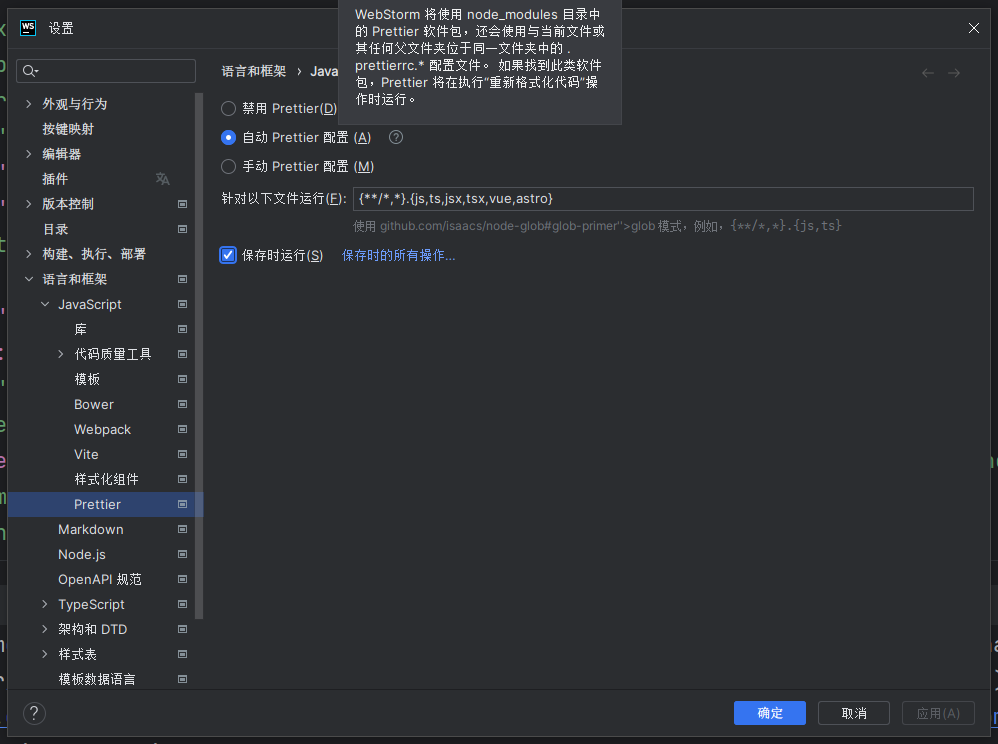

**然后进行项目名称全局替换，这里找到 `config/defaultSettings.ts`【只是为了懒得打字】，内部的 `Ant Design Pro` 和 `Ant Design`，全局替换成我们想要的名称，这里我选择 `XY の 智能 BI 平台` 。**

**当然发现网页下面的版权说明等，还是蚂蚁集团，这里也是全局搜索，替换自己的。以及网页未来能看到的可替换文本都是同样方式替换。**


#### 3. 开发登录注册页面

首先我们得找到开发登录页面在哪，先去 `config/routes.ts` 找路由

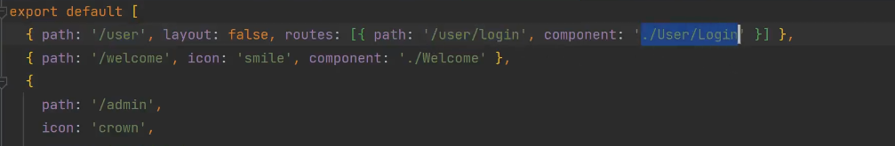

发现它的位置，然后去改动，下面两个是多余文件删除

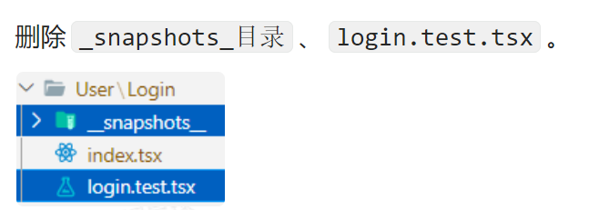

这里发现 `index.tsx` 的 `<Lang />` 爆红， `ctrl + 左键` 进来，这里都没用到，直接删除，然后把 `<Lang />` 也删除。

然后可以编辑 `subTitle` ，写一个自己的 `Title`。

也可以通过 react 语法 写一个超链接，链接到自己想要跳转的网页，如自己的博客。

```js
subTitle={
    <a href="xxxxx" target="_blank">
    	这是我的博客
    </a>
}
```

同时这里自动登录和其他方式登录我们不计划做，就删除

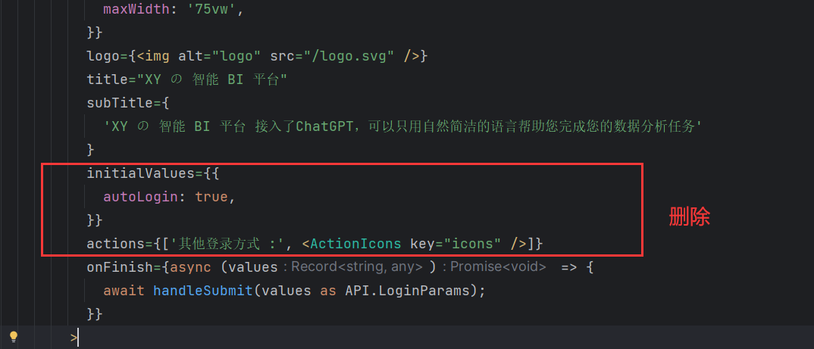

而上面的 `onFinish` 指的是用户点击会触发的事件，之后会改。

手机号登录也删了。

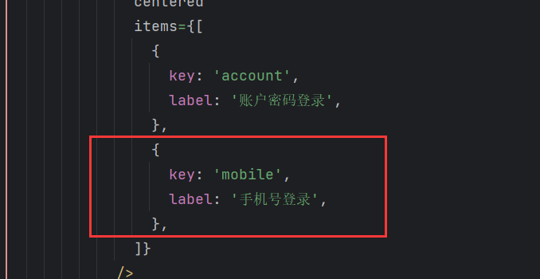

和手机号登录相关的都删了，这 186 行这个也删。

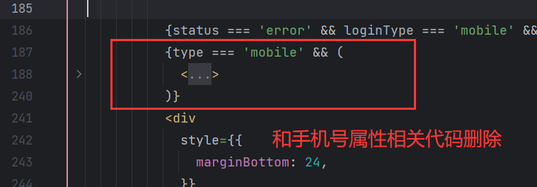

删除 float right 会脱离文档流，这里会导致和前面的不在同一行，所以删除

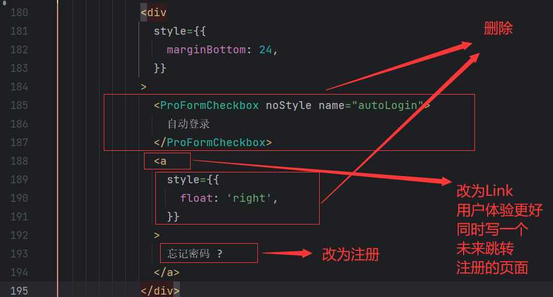

然后就是登录部分的账号密码部分，需要前后端的字段值是一致的。

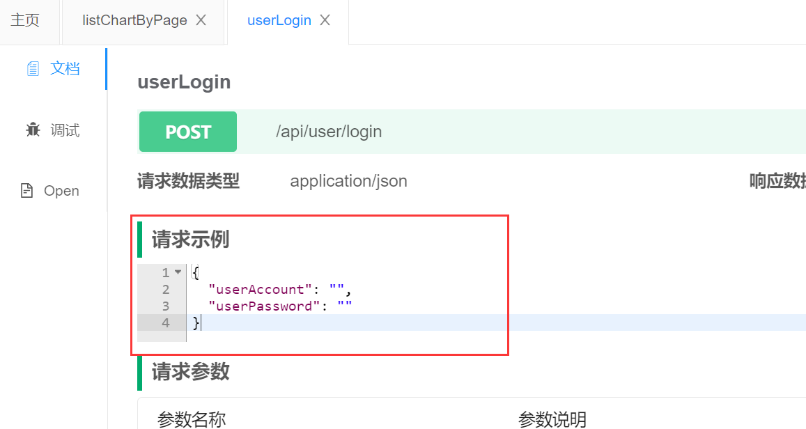

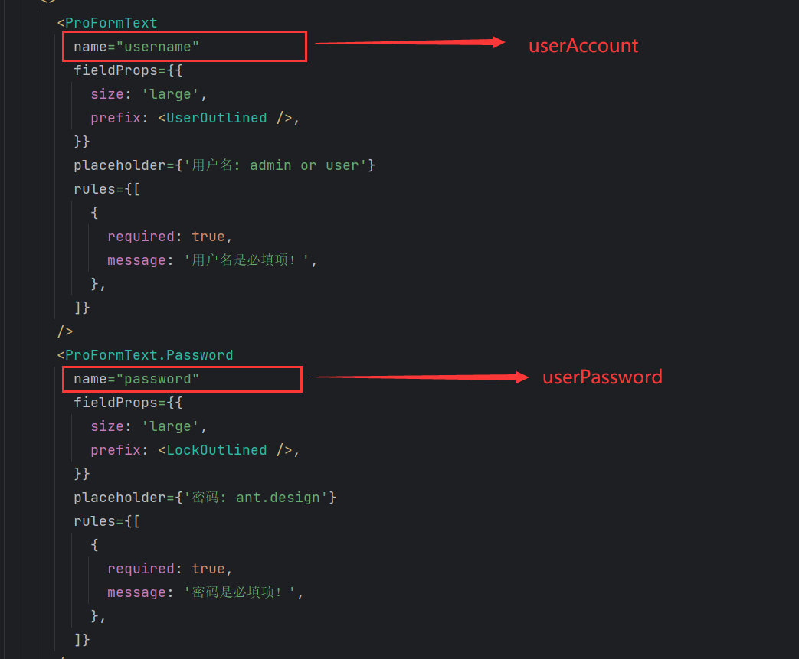

同时也改一下 `placeholder` ，提示用户输入账号密码，然后把这个它写好的错误页面配置删了

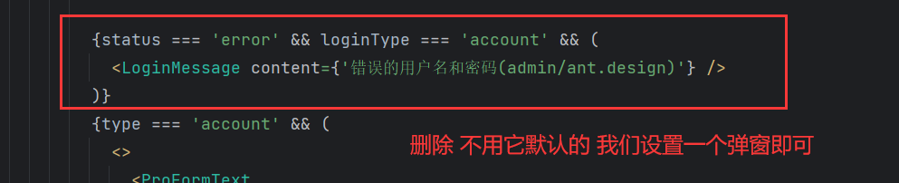

现在登录其实会返回 404，因为我们虽然生成了关于 **后端** 的接口，但是其实脚手架里面的很多代码还没改成对应接口的样子，比如这里的 404 肯定是因为登录的请求地址都不是我们的后端。

执行登录会执行下面的函数，我们可进去看看这个函数干了什么，**先把 API 改成我们自己的登录的 `API.UserLoginRequest`**

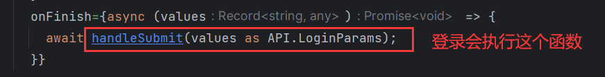

然后就是开始改写这个函数的登录逻辑了

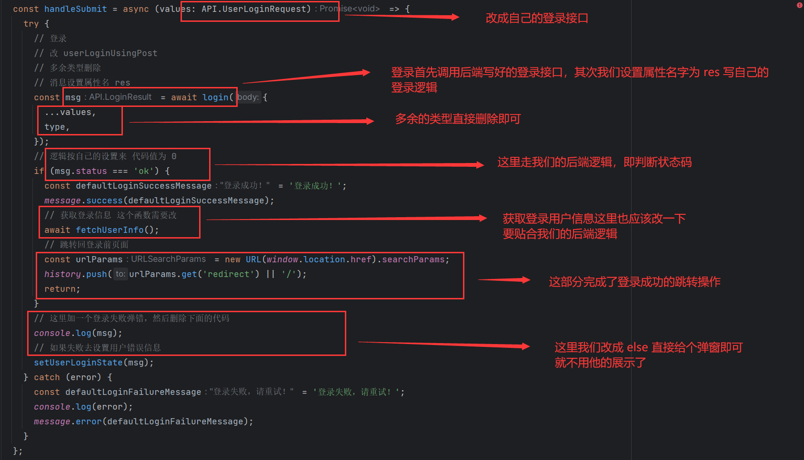

更改后如下

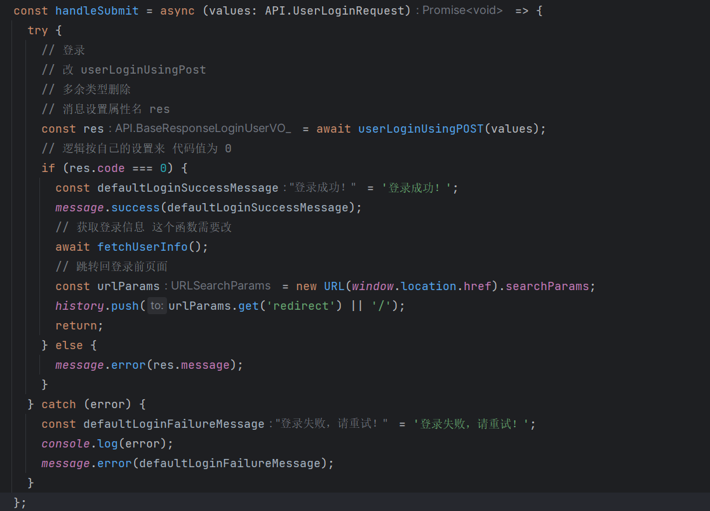

这里就先让它调用我们获取登录状态的后端接口，然后再去测试一下登录，这里数据库我们之前没有设置用户名，这里自己去数据库那里加了个名字


顺便把一些无用的代码删除，减少冗余


使用之前的测试用户，测试一下登录


**接着就可以改这里面调用了的 `fetchUserInfo` 获取用户登录信息的函数了。**


**这是改完之后的状态**


 

当前进度卡在 第二个视频的 49分钟， 先把用户中心项目学了，再来接着学这个。

给前后端补一下知识，目前前置知识不足。


