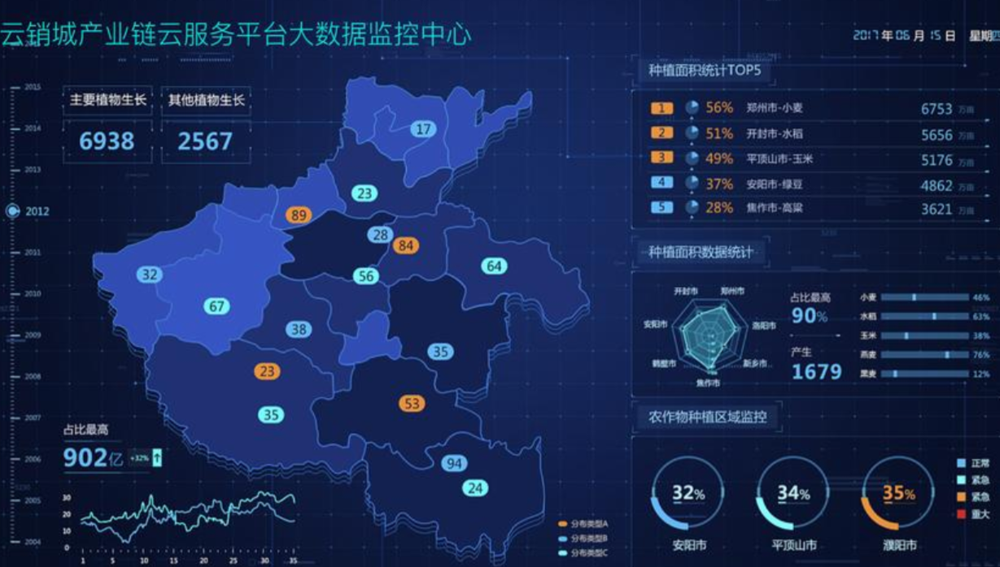

# 智能BI项目笔记

## 1. 项目介绍

什么是BI?

即商业智能:数据可视化、报表可视化系统

主流B平台:帆软`BI`、小马`BI`、微软`Power Bl`



传统BI平台:	https://chartcube.alipay.com/1

1. 需要人工上传数据
2. 需要人工拖选分析要用到的数据行和列(数据分析师)
3. 需要人工选择图表类型（数据分析师)编程导航知识星球
4. 生成图表并保存配置

智能B平台:

项目介绍:
区别于传统的B，用户(数据分析者）只需要导入最最最原始的数据集，输入想要进行分析的目标（比如帮我分析一下网站的增长趋势），就能利用AI自动生成一个符合要求的图表以及结论。

优点:让不会数据分析的同学也能通过输入目标快速完成数据分析，大幅节约人力成本。会用到AI接口【项目会提供】

## 2. 需求分析

1．智能分析:用户输入目标和原始数据（图表类型)，可以自动生成图表和分析结论

2．图表管理

3．图表生成的异步化(消息队列)编程导航知识星球

4．对接AI能力

## 3. 架构图

**基础流程**


**优化过程【异步化】**


## 4. 技术栈

**前端**

1. `React`
2. `Umi` + `Ant Design Pro`
3. 可视化开发库(**`Echarts`** 【更新兼容旧版本】+ `HighCharts` + `AntV`)
4. `umi openapi`代码生成（自动生成后端调用代码)

**后端**

1. `Spring Boot`(万用Java后端项目模板，快速搭建基础框架，避免重复写代码)
2. `MySQL`数据库
3. `MyBatis Plus`数据访问框架
4. 消息队列(`RabbitMQ`)
5. Al能力(Open Al接口开发：星球提供现成的AI接口)
6. `Excel`的上传和数据的解析(`Easy Excel`)
7. `Swagger` + `Knife4j`项目接口文档
8. `Hutool`工具库

## 6. 第一部分

介绍项目背景、技术选型、架构图、业务流程

前端项目初始化

后端项目初始化

前端开发

- 快速开发登录功能
- 图表分析页面的开发
- 图表管理页面的开发

后端开发

- 库表设计
- 图表管理开发
- 文件上传接口
- 开发前后端业务
- 流程跑通

### 6.1. 前端项目初始化

官方文档: https://pro.ant.design/

这个框架可能会更新，一定要跟着官方文档来: https://pro.ant.design/zh-CN/docs/getting-started/

首先下载 Node.js 18版本，可以去官网下载: https://nodejs.org/，记得选择稳定版本（不要选20)

>  nvm工具可以快捷切换node.js的版本

#### 1．按照官方文档初始化

**在对应的目录进入终端**

```sh
# 使用 npm
npm i @ant-design/pro-cli -g
pro create xybi-frontend
```

这里选择了最新的 `umi 4`

#### 2．项目试运行(`npm run dev / start`)

然后打开项目，运行 `npm run strart:dev` ，先看看项目能否直接运行


**这里我遇到了一个报错**

`'cross-env' is not recognized as an internal or external command, operable program or batch file.`

**发现这个问题的原因是由于windows电脑造成的，在windows电脑上默认是无法使用 `cross-env` ，需要手动安装，那行吧，安装一下**

然后又出现问题，其实这些问题，`webstorm` 都自动分析了，在右下角，让我们去安装依赖。

类似这种的无法识别参数，这些问题其实都是因为各种原因，比如网络啊什么的**安装不完全导致的**，我的建议是重新安装，甚至是 **换一种安装方式**；

```sh
cd 项目文件夹
 
npm install
```

**但是安装实在是太慢了，直接换`cnpm`，`CNPM` 是中国 `npm` 镜像的客户端。**

```sh
npm install cnpm -g --registry=https://registry.npm.taobao.org
```

```sh
cd 项目文件夹
 
cnpm install
```

**这里如果node.js版本低于 16.14 也会报错，可以通过如下命令进行查看，如果不满足就去上面下载新版本**

```sh
node -v
```

**启动正常，这里没有后端输入账号密码也登录不了，直接我们选择换启动方式。**


**这个启动方式会给我们模拟数据，这样就能启动了。**

**账号密码在输入框已经通过背景告诉我们了**

**而右侧的齿轮按钮可以调整页面样式，同时也可以导出来**


#### 3．代码托管

这里为了精简项目，需要删除项目不需要的东西，然而为了防止删错了，直接使用 git 命令先对代码进行代码托管。

```sh
git init
git add . # 把当前文件全部加入暂存区
git commit -m 'first init'
```

#### 4．移除不必要的能力(比如国际化)

**这里官方给我们提供了一键删除国际化的命令**


**但是报错了**


**问题解决**

**<font color='red'>任何开源项目的报错，都可以直接问作者（官方团队）或者搜 `github issues区`，直接这里复制报错部分的信息，在`github 的 issues区`，发现找到了官方给出的解决办法</font>**

步骤:

1．找到开源地址:               https://github.com/ant-design/ant-design-pro

2．搜索issues:                   https://github.com/ant-design/ant-design-pro/issues/10452

3．前端本地执行: 

````sh
yarn add eslint-config-prettier --dev yarn add eslint-plugin-unicorn --dev
````

如果没有下载 `yarn`【一个依赖管理工具】，可以执行下面的命令下载

```sh
cnpm install -g yarn
```

**修改`node_modules/@umijs/lint/dist/config/eslint/index.js`，注释掉 `es` 2022 true**

**路由不显示名称**

给 `config/route.ts` 的路由加 `name`

### 6.2. 后端项目初始化

这里使用了万能后端模板

用法参考项目中的 `README.md` 文件，默认情况下只要执行 `create_table.sql` 文件创建数据库表，然后修`application.yml` 中的数据库地址为你自己的数据库即可。


