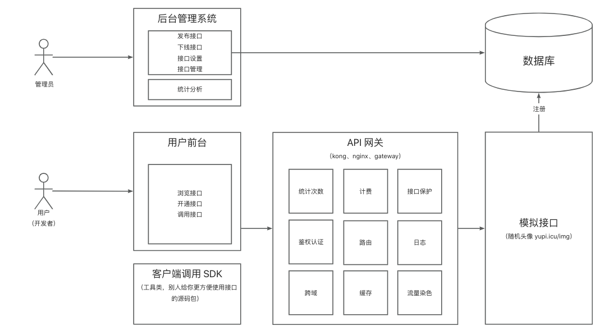

# XY-API调度站

**技术选型**

**前端：**

-   Ant Design Pro 

-   React
-   Ant Design Procomponents
-   Umi

-   Umi Request (Axios的封装)


**后端：**

-   Java Spring Boot
-   Spring Boot Starter (SDK开发)
-   Dubbo
-   Nacos
-   Spring Cloud Gateway (网关、限流、日志实现)



## 1. 项目初始化

```sh
# 使用 npm
npm i @ant-design/pro-cli -g
pro create xy-api-frontend
```


### 1. 前端项目瘦身

1. 初始化好前端项目后还需要`npm install` 和`yarn` 安装相关依赖

执行 `yarn add eslint-config-prettier --dev yarn add eslint-plugin-unicorn --dev` 

然后修改`node_modules/@umijs/lint/dist/config/eslint/index.js`文件注释`// es2022: true`

以后执行`i18n-remove`然后手动删掉locales目录即可移除多国语言模块


