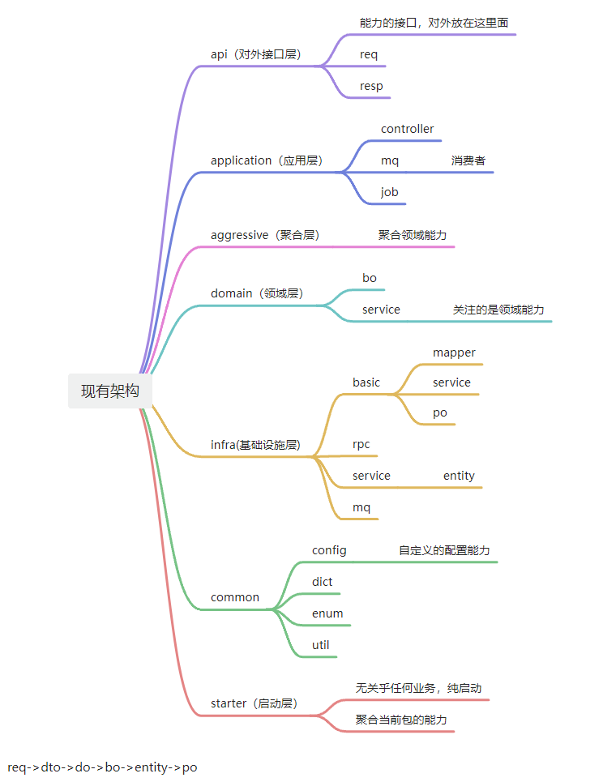
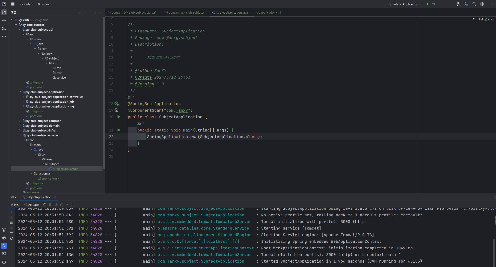
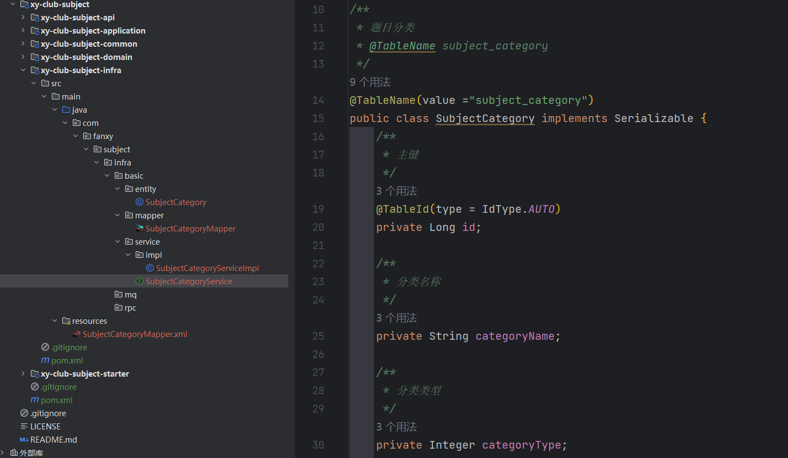
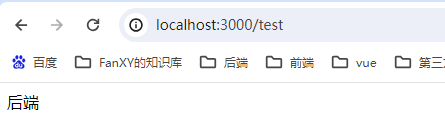
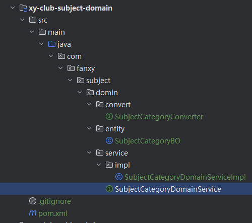
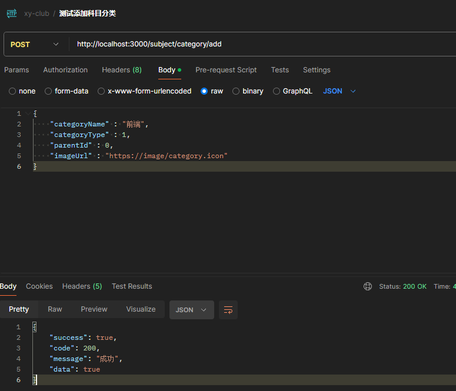
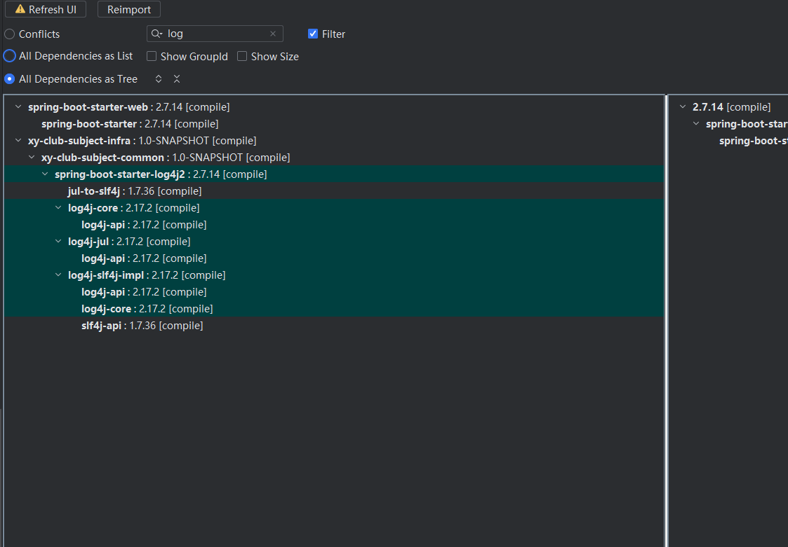
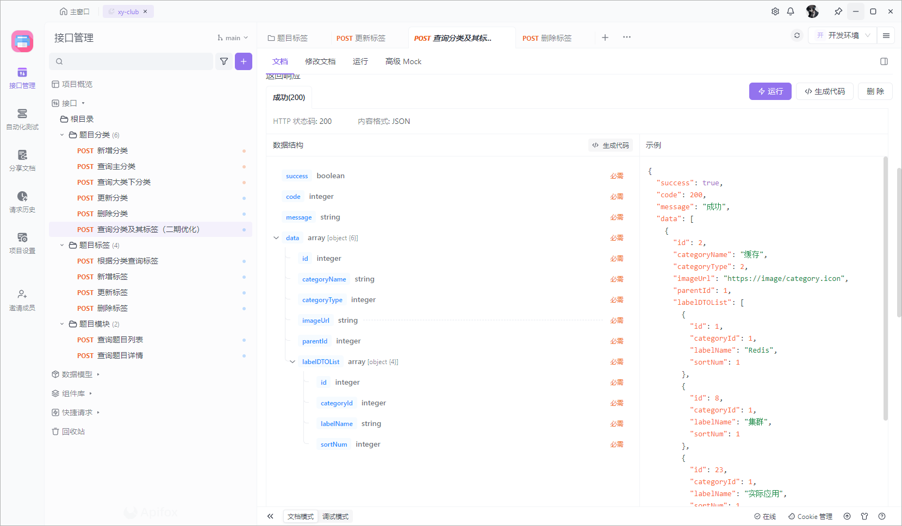

# 1. 一期项目

## 1.1. 项目一期刷题模块及框架建立

### 1.1.1. 架构图和启动类

**项目架构**



**包的划分基本如下，其中 `application` 模块，内嵌三个子模块，符合我们的项目架构。**

先建立启动类。



然后集成 `springmvc` ，按照架构肯定是需要集成到 `apllication` 模块内的 `controller` 子模块。引入 `maven` 依赖，即 `spring-boot-web-starter`，并建立第一个 `Controller`。

但这里因为是一个微服务架构，启动器模块和应用模块不是一个包下，所以这里采用 `maven` 导入的方式将 应用模块导入。

注意这里需要把具体的子模块写入，写外层的 `application` 访问还是 404。

```xml
        <dependency>
            <groupId>com.fanxy</groupId>
            <artifactId>xy-club-subject-application-controller</artifactId>
            <version>1.0-SNAPSHOT</version>
        </dependency>
```


### 1.1.2. 数据库和基础设施层相关

接着将基础设施层的代码进行添加，首当其冲的就是数据库相关的。

```xml
        <!-- jdbcStarter -->
        <dependency>
            <groupId>org.springframework.boot</groupId>
            <artifactId>spring-boot-starter-jdbc</artifactId>
        </dependency>
        <!-- druid连接池 -->
        <dependency>
            <groupId>com.alibaba</groupId>
            <artifactId>druid-spring-boot-starter</artifactId>
            <version>1.1.22</version>
        </dependency>
        <!-- mysql -->
        <dependency>
            <groupId>mysql</groupId>
            <artifactId>mysql-connector-java</artifactId>
            <version>8.0.22</version>
        </dependency>
        <!-- mybatis-plus -->
        <dependency>
            <groupId>com.baomidou</groupId>
            <artifactId>mybatis-plus-boot-starter</artifactId>
            <version>3.4.0</version>
        </dependency>
```


同时将数据库表建立，通过 `mybatis-X` 生成关于题目分类表的代码




然后在 `starter` 模块 中引入基础设施层模块，并在启动类上写入扫描 `mapper` 文件的注解，由此判断是否完成对模块的引入。

```xml
        <dependency>
            <groupId>com.fanxy</groupId>
            <artifactId>xy-club-subject-infra</artifactId>
            <version>1.0-SNAPSHOT</version>
        </dependency>
```

```java
@SpringBootApplication
@ComponentScan("com.fanxy")
@MapperScan("com.fanxy.**.mapper")
public class SubjectApplication {
    public static void main(String[] args) {
        SpringApplication.run(SubjectApplication.class);
    }
}
```


然后更新配置文件，关于数据库相关的内容。

```yaml
spring:
  # TODO: 数据库【MySQL】 配置
  datasource:
    driver-class-name: com.mysql.cj.jdbc.Driver
    username: root
    password: 123456
    url: jdbc:mysql://localhost:3306/xy-club?serverTimezone=Asia/Shanghai&useUnicode=true&characterEncoding=utf8&useSSL=false
    type: com.alibaba.druid.pool.DruidDataSource
    druid:
      initial-size: 20
      min-idle: 20
      max-active: 100
      max-wait: 60000
      stat-view-servlet:
        enabled: true
        url-pattern: /druid/*
        login-username: admin
        login-password: 123456
      filter:
        stat:
          enabled: true
          slow-sql-millis: 2000
          log-slow-sql: true
        wall:
          enabled: true
        config:
          enabled: true
```


为了验证是否完成对基础设施层的数据库部分完成依赖，我们直接在应用层的 `controller` 模块之前的测试代码中，首先在 `maven` 依赖基础设施层，然后在测试的 `controller` 随便进行一条数据的查询。

```java
@RestController
public class SubjectController {

    @Resource
    SubjectCategoryService subjectCategoryService;

    @GetMapping("/test")
    public String test() {
        SubjectCategory subjectCategory = subjectCategoryService.getById(1L);
        return subjectCategory.getCategoryName();
    }
}
```



测试虽然成功，但是此时配置文件的密码是通过明文配置的，我们肯定不希望密码明文写在配置文件，因为使用的 `druid连接池`，所以当然可以借助它的能力，我们在基础设施层建立 `utils` 包，并写入加密解密的方法，其实本质是 `Druid` 自带的包的能力，只是进行了封装，我们通过 `main` 方法，生成对应的公私钥，并把本身数据库密码根据公钥加密，得到的加密串这些复制，改写启动类的 `yaml` 配置文件，即可完成非明文记录数据库密码。

```java
public class DruidEncryptUtil {

    private static String privateKey;

    private static String publicKey;

    static {
        try {
            String [] keyPair = ConfigTools.genKeyPair(512);
            privateKey = keyPair[0];
            System.out.println("privateKey : " + privateKey);
            publicKey = keyPair[1];
            System.out.println("publicKey : " + publicKey);
        } catch (NoSuchAlgorithmException | NoSuchProviderException e) {
            throw new RuntimeException(e);
        }
    }

    public static String encrypt(String plainText) throws Exception {
        String encryptedText = ConfigTools.encrypt(privateKey, plainText);
        System.out.println("encryptedText : " + encryptedText);
        return encryptedText;
    }

    public static String decrypt(String encryptedText) throws Exception {
        String decryptedText = ConfigTools.decrypt(publicKey, encryptedText);
        System.out.println("decryptedText : " + decryptedText);
        return decryptedText;
    }
    public static void main(String[] args) throws Exception {
        String encrypt = encrypt("123456");
        String decrypt = ConfigTools.decrypt("MFwwDQYJKoZIhvcNAQEBBQADSwAwSAJBAINecJVPPQKc9BEm0YBsitT6aoB9OUQhzvtm6NFOEBvsoUHe4j2k2tdkXPUXmzhHQb0LSSUIUPj9J34p66gKGgMCAwEAAQ==",
                "MtLZQT5a7lM6YtWnBJ87FfYEg++WA9/NUAXR0/vCP1f/4UmJJsdsO4m+a2Qy41dszDeShdQcHARMdBxNiQ4cwA==");
        System.out.println(decrypt);
    }
}
```


### 1.1.3. Common层和Domain层基础建设

在 `common层` 引如 `lombok` 和 `mapstruct` ， 同时让 `infra层` 的 `maven` 引如 `common层` ，这时就可以在基础设施层的之前的通过 `mybatis-X` 生成的 **学科分类类** 写入 `@Data` 注解，把生成的 `get` `set` 方法删除，使得代码整洁。

接着我们可以写真正的领域相关的 `Service` 层了，我们在 `domain层` 建立 `SubjectCategoryDomainService` 接口，并建立实现类和所在包，同时这里我们操作的实体类对象，可以复制 `infra层` 的 `SubjectCategory类` ， 命名为  `SubjectCategoryBO` ，而再建立 `convert` 包，用引入的 `mastruct` 创建 `BO` 和 `Entity` 的转化器。



```java
// 注意这里的 Mapper 是 mapstruct 的
import org.mapstruct.Mapper;
import org.mapstruct.factory.Mappers;

@Mapper
public interface SubjectCategoryConverter {

    SubjectCategoryConverter INSTANCE = Mappers.getMapper(SubjectCategoryConverter.class);

    SubjectCategory convertBoToCategory(SubjectCategoryBO subjectCategoryBO);
}
```

```java
public class SubjectCategoryDomainServiceImpl implements SubjectCategoryDomainService {

    @Resource
    SubjectCategoryService subjectCategoryService;


    @Override
    public void add(SubjectCategoryBO subjectCategoryBO) {
        SubjectCategory subjectCategory = SubjectCategoryConverter.INSTANCE
                .convertBoToCategory(subjectCategoryBO);
        subjectCategoryService.save(subjectCategory);
    }
}
```


### 1.1.4. 应用层建立Controller

让 `Application-controller层` 导入 `Domain层` ，因为 `BO` 是业务层，也就是领域层交互的实体单位，而到了应用层，使用的实体单位是`DTO`， 所以需要如法炮制上面的机制，写 `SubjectCategoryDTOConverter` ，并开始写 `SubjectCategoryController` 。

这里 应用层显然需要依赖 `Domain层` ， 同时到了此步骤，需要给前端返回结果了，故我们肯定需要封装一个返回结果类，用于和前端进行数据交互，从而完成闭环，故需要写 `Result类`，同时为了方便也写了对应的枚举，当然肯定要写在公共的 `Common模块`。

 ```java
 @Getter
 public enum ResultCodeEnum {
     SUCCESS(200, "成功"),
     FAIL(500, "失败");
 
     // 状态码
     private final int code;
     //
     private final String desc;
 
     ResultCodeEnum(int code, String desc) {
         this.code = code;
         this.desc = desc;
     }
 
     public static ResultCodeEnum getByCode(int codeVal) {
         for (ResultCodeEnum resultCodeEnum : ResultCodeEnum.values()) {
             if (resultCodeEnum.code == codeVal) {
                 return resultCodeEnum;
             }
         }
         return null;
     }
 }
 ```

```java
@Data
public class Result<T> {

    private Boolean success;

    private Integer code;

    private String message;

    private T data;

    public static <T> Result ok() {
        Result<T> result = new Result<>();
        result.setSuccess(true);
        result.setCode(ResultCodeEnum.SUCCESS.getCode());
        result.setMessage(ResultCodeEnum.SUCCESS.getDesc());
        return result;
    }
    public static <T> Result ok(T data) {
        Result<T> result = new Result<>();
        result.setSuccess(true);
        result.setData(data);
        result.setCode(ResultCodeEnum.SUCCESS.getCode());
        result.setMessage(ResultCodeEnum.SUCCESS.getDesc());
        return result;
    }

    public static <T> Result fail() {
        Result<T> result = new Result<>();
        result.setSuccess(true);
        result.setCode(ResultCodeEnum.FAIL.getCode());
        result.setMessage(ResultCodeEnum.FAIL.getDesc());
        return result;
    }
    public static <T> Result fail(T data) {
        Result<T> result = new Result<>();
        result.setSuccess(true);
        result.setData(data);
        result.setCode(ResultCodeEnum.FAIL.getCode());
        result.setMessage(ResultCodeEnum.FAIL.getDesc());
        return result;
    }
}
```

```java
@RestController
@RequestMapping("/subject/category")
public class SubjectCategoryController {

    @Resource
    private SubjectCategoryDomainService subjectCategoryDomainService;

    @PostMapping("/add")
    public Result<Boolean> add(@RequestBody SubjectCategoryDTO subjectCategoryDTO) {
        try {
            SubjectCategoryBO subjectCategoryBO = SubjectCategoryDTOConverter.INSTANCE
                    .convertDtoToCategoryBO(subjectCategoryDTO);
            subjectCategoryDomainService.add(subjectCategoryBO);
            return  Result.ok(true);
        } catch (Exception e) {
            return Result.fail();
        }
    }
}
```

测试可以成功添加，查看数据库也增加了数据，后续还需要对 `Controller` 部分进行进一步优化。



### 1.1.5. 日志

首先需要在 `common层` 引如 `log4j2` 的 `maven`。

```xml
        <dependency>
            <groupId>org.springframework.boot</groupId>
            <artifactId>spring-boot-starter-log4j2</artifactId>
            <version>2.4.2</version>
        </dependency>
```

复制模板配置文件在启动层的 `resourse` 目录下。

在 `Controller` `DomainService` `infra层` 的 `Service` 都可以根据入参来进行如下的日志打印，当然参数和参数名称要对应。

进行一步判断的好处是，在并非是 `Info` 级别的日志打印情况下，其实还是会进行后面写的 `JSON序列化操作`，在高并发情况下是致命的，这个可以优化日志的**性能**。

```java
            if (log.isInfoEnabled()) {
                log.info("SubjectCategoryController.add.dto:{}", JSON.toJSONString(subjectCategoryDTO));
            }
```

这里会出现一个经典报错问题，就是自己导入的和 `spring-boot-starter` 导入的冲突，可以使用 `Dependency Analyzer` 进行排除。



同时优化一下，我们经常会出现当处理一个 `Controller` 的入参，需要进行很多参数的校验，这种情况下，写大量的 `if` 以及 `StringUtils.isNotBlank()` 是非常冗余的，可以引如 `guava` 使用 `Preconditions` 类内部的方法，用类似断言的机制来简洁的进行各种参数的校验。

```xml
        <dependency>
            <groupId>com.google.guava</groupId>
            <artifactId>guava</artifactId>
            <version>19.0</version>
        </dependency>
        <dependency>
            <groupId>org.apache.commons</groupId>
            <artifactId>commons-lang3</artifactId>
            <version>3.11</version>
        </dependency>
```

在 `Common层` 引如上面的包，第二个包主要是引如一些类似字符串工具等类。

就可以在 `Controller` 写入如下的代码。

```java
    Preconditions.checkNotNull(subjectCategoryDTO.getCategoryType(), "分类类型不能为空");
    Preconditions.checkArgument(!StringUtils.isBlank(subjectCategoryDTO.getCategoryName()), "分类名称不能为空");
    Preconditions.checkNotNull(subjectCategoryDTO.getParentId(), "分类父级id不能为空");
```

经过测试，可以完美执行我们需要的参数判断。


### 1.1.6. 刷题模块分类接口定义

根据原型设计，我们进入首页可以选择大分类-> 前端 后端 测试，然后根据对应的大类，会获取小分类，然后获取相关的标签，但是如果做成串行化，需要设置三个接口，和后端交互三次，这在效率上是不被允许的。

所以需要改进接口的设计，我们可以一个接口完成对三个数据的查询，一次查询获取一个大分类的数组，每个大分类除了 `category` 自身的属性，如 `id`，`categoryName` 等，还有一个 `categoryList` ，这个代表该大分类下的小分类数组集合，而每个小分类内部属性除了分类自身属性外，还附带一个 `LabelList` ，代表该小分类相关的所有标签集合。

数据结构其实哪怕是三次查询也应该是如此的，但是如何优化查询？

可以使用并行化的查询方式，将查询大分类，查询小分类，查询`label` 并行化查询，最后使用树状组件进行拼装，这么就只需要其中三次查询最慢的那次查询的时间，完成整体查询。



初步的增删改查代码，基本就是 `Controller层` 调用 `Domain层` 然后 `Domain层` 调用 `infra层` ，最终通过 `mybatis-plus`  完成查询。


### 1.1.7. 初步增删改查部分

增删改查部分雷同部分很多，可以直接看代码，这个章节主要把其中比较值得记录的部分做笔记。

其中分类和标签部分的代码，没有特别特殊的，比较特别的就是关于查询对应题目类型下的所有标签接口，需要联系到 `SubjectMapping` 表，同时需要进行一个去重的查询，可以使用 `mybatis-plus` 的 `queryWrapper.select("DISTINCT label_id");` 限定查询的条件和字段，以此完成一些不是特别复杂，但又不想单独写 `mapper` 的情况。如果是查到之后再通过 `stream流处理`，会占用大量的数据传送资源，和处理时间，不如在数据库层面去重。

```java
    /**
     * 查询分类下标签 SubjectLabelDomainServiceImpl
     * @param subjectLabelBO 标签BO
     * @return 指定分类的标签列表集合
     */
    @Override
    public List<SubjectLabelBO> queryLabelByCategoryId(SubjectLabelBO subjectLabelBO) {
        if (log.isInfoEnabled()) {
            log.info("SubjectLabelDomainServiceImpl.queryLabelByCategoryId.bo:{}",
                    JSON.toJSONString(subjectLabelBO));
        }
        Long categoryId = subjectLabelBO.getCategoryId();
        QueryWrapper<SubjectMapping> queryWrapper = new QueryWrapper<>();
        queryWrapper.eq("category_id", categoryId);
        queryWrapper.select("DISTINCT label_id");
        List<SubjectMapping> mappingList = subjectMappingService.list(queryWrapper);
        if (CollectionUtils.isEmpty(mappingList)) {
            return Collections.emptyList();
        }
        List<Long> labelIdList = mappingList.stream().
                map(SubjectMapping::getLabelId).
                collect(Collectors.toList());
        List<SubjectLabel> labelList = subjectLabelService.listByIds(labelIdList);
        return SubjectLabelConverter.INSTANCE.convertLabelListToBOList(labelList);
    }
```


然后来到 `SubjectInfo` 部分的增删改查，这里需要加入一个 `工厂 + 策略模式` 的代码。

首先思考遇到的问题，我们现在插入一个题目，`SubjectInfo` 本身是自带一个表，但是还需要根据题目本身的类型，插入对应类型的数据，这里分了四张表，对应单选，多选，判断，简答。

插入不同的数据到表中，其实是雷同的功能，只是根据不同的题目类型，有个别不一样的数据操作，但是如果常态写法，就需要使用很多的 `if判断`，然后根据类型进行不同的方法插入，但是这样就使代码变得冗余且不容易进行二次开发。

完全可以引入`工厂 + 策略 的模式` ，利用 `方法形参的多态` 根据不同的类型，工厂可以选择 `不同的接口实现类` 进行对应的增加操作，这样后续进行二次开发，只需要根据对应的接口实现类更改 `方法内` 的代码，不会影响别的类型，而 `增加新的类型`，只需要 `添加新的接口实现类` 即可。

 ```java
 // 题目类型工厂
 @Component
 public class SubjectTypeHandlerFactory implements InitializingBean {
 
     @Resource
     private List<SubjectTypeHandler> subjectTypeHandlerList;
 
     private Map<SubjectInfoTypeEnum, SubjectTypeHandler> handlerMap = new HashMap<>();
 
     public SubjectTypeHandler getHandler(int subjectType) {
         SubjectInfoTypeEnum subjectInfoTypeEnum = SubjectInfoTypeEnum.getByCode(subjectType);
         return handlerMap.get(subjectInfoTypeEnum);
     }
 
     @Override
     public void afterPropertiesSet() throws Exception {
         for(SubjectTypeHandler subjectTypeHandler : subjectTypeHandlerList) {
             handlerMap.put(subjectTypeHandler.getHandlerType(), subjectTypeHandler);
         }
     }
 }
 ```

以单选题 `SubjectRadio` 举例，同时这里的不同的 `Handler` 存在一个问题就是，我们不同的题目答案内容，需要转化成对应的题目实体，但是转化的过程中，其实这个答案列表是不带题目的 `id` 的，所以需要手动通过 `set注入` 的方式，把 `SubjectAnswerBO` 中 不具备的 `SubjectId` 注入到 `SubjectRadio 对象中` 。而对于多选也是一样的，唯一和单选不同就是 `isCorrect` 这个属性，但是这是公共属性，所以转换器会把值传过来不需要自己写特殊的代码处理。而判断题，答案列表中只会有一个 `SubjectAnswerBO` 对象，直接对列表中唯一的这个对象进行转化，`SubjectId` 赋值，然后插入即可。简答同理。

```java
@Component
public class RadioTypeHandler implements SubjectTypeHandler {

    @Resource
    SubjectRadioService subjectRadioService;
    
    @Override
    public SubjectInfoTypeEnum getHandlerType() {
        return SubjectInfoTypeEnum.RADIO;
    }

    @Override
    public void add(SubjectInfoBO subjectInfoBO) {
        // 单选题目的插入
        List<SubjectRadio> subjectRadioList = new LinkedList<>();
        subjectInfoBO.getOptionList().forEach(option -> {
            SubjectRadio subjectRadio = RadioSubjectConverter.INSTANCE.convertBoToEntity(option);
            subjectRadio.setSubjectId(subjectInfoBO.getId());
            subjectRadioList.add(subjectRadio);
        });
        subjectRadioService.saveBatch(subjectRadioList);
    }
}
```

这样领域层的 `Service` 即可优雅且方便拓展的利用工厂类和策略模式完成调用，同时这里设计 `SubjectMapping` 是绑定 `subject_id` `category_id` `label_id` 的，固是一个双层嵌套的关系，添加课程的同时，需要把关联表进行更新。

同时这里是关联表操作，需要设置事务，方便出现异常进行回滚 `@Transactional(rollbackFor = Exception.class)` 

同时 `不同的分类题型副表` 的更新需要获取刚插入的数据的主键，这里二次查询消耗性能，如果是自己写的 `Mapper`  可以通过如下方式使得插入的主键回显到本身对象的 `id` 属性上，而 `Mybatis-plus` 的自带 `Service 和 Mapper 方法` 已经默认具有这样的功能，所以需要把这个 `id` 传递给 `subjectInfoBO` 以使得策略模式的关联更新能通过课程的 `id` 上传数据。

```xml
<insert id="insert" useGeneratedKeys="true" keyProperty="id">      
    INSERT INTO your_table (column1, column2, ...)      
    VALUES (#{property1}, #{property2}, ...)   
</insert>
```

```java
    /**
     * 增加课程  SubjectInfoDomainServiceImpl
     */
    @Override
    @Transactional(rollbackFor = Exception.class)
    public void add(SubjectInfoBO subjectInfoBO) {
        if (log.isInfoEnabled()) {
            log.info("SubjectDomainServiceImpl.add.dto:{}", JSON.toJSONString(subjectInfoBO));
        }
        SubjectInfo subjectInfo = SubjectInfoConverter.INSTANCE.
                convertBoToInfo(subjectInfoBO);
        subjectInfoService.save(subjectInfo);
        // mybatis-plus 可以实现自动主键回显 因此传递给 subjectInfoBO 用于策略模式的副表更新
        subjectInfoBO.setId(subjectInfo.getId());
        // 工厂模型获取对应的 handler 并进行策略模式的处理
        SubjectTypeHandler handler = subjectTypeHandlerFactory.getHandler(subjectInfo.getSubjectType());
        handler.add(subjectInfoBO);
        // 关联表更新
        List<Integer> categoryIds = subjectInfoBO.getCategoryIds();
        List<Integer> labelIds = subjectInfoBO.getLabelIds();
        List<SubjectMapping> subjectMappingList = new LinkedList<>();
        labelIds.forEach(labelId -> {
            categoryIds.forEach(categoryId -> {
                SubjectMapping subjectMapping = new SubjectMapping();
                subjectMapping.setSubjectId(subjectInfo.getId());
                subjectMapping.setLabelId(Long.valueOf(labelId));
                subjectMapping.setCategoryId(Long.valueOf(categoryId));
                subjectMappingList.add(subjectMapping);
            });
        });
        subjectMappingService.saveBatch(subjectMappingList);
    }
```


### 1.1.8. 分页处理封装

首先需要封装一个分页信息类，包含基本的分页信息，这样分页展示的 `DTO类` 可以直接继承这个类，获取和分页相关的属性即页码和每页数量两个属性以及相对应的方法。

```java
@Data
public class PageInfo implements Serializable {

    /**
     * 默认页号 1
     */
    private static final Integer DEFAULT_PAGE_NO = 1;
    /**
     * 默认页面数 20
     */
    private static final Integer DEFAULT_PAGE_SIZE = 20;

    private static final Integer MIN_PAGE_SIZE = 1;

    private Integer pageNo = DEFAULT_PAGE_NO;

    private Integer pageSize = DEFAULT_PAGE_SIZE;

    public Integer getPageNo() {
        if (pageNo == null || pageNo < DEFAULT_PAGE_NO) {
            return DEFAULT_PAGE_NO;
        }
        return pageNo;
    }

    public Integer getPageSize() {
        if (this.pageSize == null || pageSize < MIN_PAGE_SIZE) {
            return DEFAULT_PAGE_SIZE;
        }
        return pageSize;
    }

    private static final long serialVersionUID = -123155235117879215L;
}
```

以及每页的返回实体类对象，可以封装和分页相关的信息，并且将 `set方法` 改造，同时把页面总数，当页实体起始和结束的下标获取。

```java
@Data
public class PageResult<T> implements Serializable {

    /**
     * 当前页码
     */
    private Integer pageNo = 1;

    /**
     * 每页额定数量
     */
    private Integer pageSize = 20;

    /**
     * 数据个数
     */
    private Integer total = 0;

    /**
     * 页面总数
     */
    private Integer totalPages = 0;

    private List<T> result = Collections.emptyList();

    private Integer start = 1;

    private Integer end = 0;

    public void setRecords(List<T> result) {
        this.result = result;
        if (result != null || result.size() > 0) {
            setTotal(result.size());
        }
    }

    public void setTotal(Integer total) {
        this.total = total;
        if (this.pageSize > 0) {
            this.totalPages = (total / this.pageSize) + (total % this.pageSize == 0 ? 0 : 1);
        } else {
            this.totalPages = 0;
        }
        this.start = (this.pageSize > 0 ? (this.pageNo - 1) * this.pageSize : 0) + 1;
        this.end = (this.start - 1 + this.pageSize * (this.pageNo > 0 ? 1 : 0));
    }

    public void setPageNo(Integer pageNo) {
        this.pageNo = pageNo;
    }

    public void setPageSize(Integer pageSize) {
        this.pageSize = pageSize;
    }
}
```

这里开始写 `SubjectController`  的查询页面详情的方法，入参还是定义为 `SubjectInfoDTO` ，返回分页包装下的 `SubjectInfoDTO` ，所以无论是`DTO类还是BO类` 肯定需要继承 `PageInfo类` ，同时入参还会带有 `categoryId` `labelId` ，即应该满足查询指定分类和标签的题目，这两个参数是 `SubjectInfo表` 没设置的字段，即业务字段，所以需要添加到 `SubjectInfoDTO类和BO类` 内部。

```java
    /**
     * 查询题目列表  SubjectController
     * @param subjectInfoDTO 题目分类DTO
     * @return 分页包装的SubjectInfoDTO
     */
    @PostMapping("/getSubjectPage")
    public Result<PageResult<SubjectInfoDTO>> getSubjectPage(@RequestBody SubjectInfoDTO subjectInfoDTO) {
        try {
            if (log.isInfoEnabled()) {
                log.info("SubjectController.add.dto:{}", JSON.toJSONString(subjectInfoDTO));
            }
            // 参数校验
            Preconditions.checkNotNull(subjectInfoDTO.getCategoryId(), "分类Id不能为空");
            Preconditions.checkNotNull(subjectInfoDTO.getLabelId(), "标签Id不能为空");
            // 这里不需要显式的把 PageSize和PageNo传递给Bo 因为两个人都继承 PageInfo 故转化器能把同名参数值传递
            SubjectInfoBO subjectInfoBO = SubjectInfoDTOConverter.INSTANCE.
                    convertDtoToInfoBO(subjectInfoDTO);
            PageResult<SubjectInfoBO> boPageResult = subjectInfoDomainService.getSubjectPage(subjectInfoBO);
            return  Result.ok(boPageResult);
        } catch (Exception e) {
            log.error("SubjectController.add.error:{}", e.getMessage(), e);
            return Result.fail("查询题目列表失败");
        }
    }
```

这是领域层的 `Service` ，这里涉及到要分页，即要先查询符合条件的数据数量，然后再根据查询的页码和页面额定个数确定分页的下表和数量，这两个查询属于业务查询，且涉及到多表联查，因此没有用 `Mybatis-plus` 自带的查询方法，独立写了 `Mapper`

```java
    @Override
    public PageResult<SubjectInfoBO> getSubjectPage(SubjectInfoBO subjectInfoBO) {
        PageResult<SubjectInfoBO> pageResult = new PageResult<>();
        pageResult.setPageNo(subjectInfoBO.getPageNo());
        pageResult.setPageSize(subjectInfoBO.getPageSize());
        // 这里的 start 不需要加1 因为数据库的分页是 0 开始
        int start = (subjectInfoBO.getPageNo() - 1) * subjectInfoBO.getPageSize();
        SubjectInfo subjectInfo = SubjectInfoConverter.INSTANCE.
                convertBoToInfo(subjectInfoBO);
        // 查询符合条件的课程数量
        int count = subjectInfoService.countByCondition(subjectInfo, subjectInfoBO.getCategoryId(),
                subjectInfoBO.getLabelId());
        if (count == 0) {
            return pageResult;
        }
        // 如果 start 已经大于总数 说明已经没有符合条件的数据 无需交互数据库 直接返回空实体即可
        if (start - 1 > count) {
            return pageResult;
        }
        // 根据数量 起始页码 以及类别和标签条件 查询分页需要查询的集合列表
        List<SubjectInfo> subjectInfoList = subjectInfoService.queryPage(subjectInfo, subjectInfoBO.getCategoryId(),
                subjectInfoBO.getLabelId(), start, subjectInfoBO.getPageSize());
        List<SubjectInfoBO> subjectInfoBOList = SubjectInfoConverter.INSTANCE.
                convertEntityListToBoList(subjectInfoList);
        pageResult.setRecords(subjectInfoBOList);
        return pageResult;
    }
```

单独写了根据条件查询的 `sql` 一个是根据给定的 `category_id` `label_id` 查询

```xml
    <select id="countByCondition" resultType="java.lang.Integer">
        SELECT count(1)
        FROM subject_info a JOIN
        subject_mapping b
        ON
        a.id = b.subject_id
        WHERE
        b.category_id = #{categoryId}
        AND b.label_id = #{labelId}
        AND a.is_deleted = 0
        AND b.is_deleted = 0
        <if test="subjectInfo.subjectDifficult != null">
            AND a.subject_difficult = #{subjectInfo.subjectDifficult}
        </if>
        <if test="subjectInfo.subjectType != null">
            AND a.subject_type = #{subjectInfo.subjectType}
        </if>
    </select>
```

一个是分页查询，通过 上面计算的 `start` 和查询得到的 `count` 进行分页查询

```xml
    <select id="queryPage" resultType="com.fanxy.subject.infra.basic.entity.SubjectInfo">
        select a.id,
        a.subject_name,
        a.subject_difficult,
        a.settle_name,
        a.subject_type,
        a.subject_score,
        a.subject_parse,
        a.created_by,
        a.created_time,
        a.update_by,
        a.update_time,
        a.is_deleted
        from subject_info a
        JOIN
        subject_mapping b
        ON
        a.id = b.subject_id
        where b.category_id = #{categoryId}
        and b.label_id = #{labelId}
        and a.is_deleted = 0
        and b.is_deleted = 0
        <if test="subjectInfo.subjectDifficult != null">
            and a.subject_difficult = #{subjectInfo.subjectDifficult}
        </if>
        <if test="subjectInfo.subjectType != null">
            and a.subject_type = #{subjectInfo.subjectType}
        </if>
        limit #{start},#{pageSize}
    </select>
```


### 1.1.9. 查询题目详情

这里想要查询题目详情，不可避免又要触及到不同的题目类型的题目信息是不同的，我们插入的时候，是根据  `工厂+策略模式` 把不同的题目类型的多余题目信息插入各自的表，那么查询的时候也可以设计相应的方法，进行查询对应题目类型的信息。

这里多设计了一个类用于对查询多余信息承载，其实也可以直接使用 `Info类`，但是多用一个类，更加清晰分明，而且不会把多余的字段涉及。

```java
@Data
public class SubjectOptionBO implements Serializable {
    
    /**
     * 题目答案
     */
    private String subjectAnswer;
    /**
     * 题目选项
     */
    private List<SubjectAnswerBO> optionList;
    
    private static final long serialVersionUID = 6779519098276153482L;
}
```

然后就可以给策略模式增加查询题目详情方法。

```java
public interface SubjectTypeHandler {
    /**
     * 枚举身份的识别
     */
    SubjectInfoTypeEnum getHandlerType();

    /**
     * 实际的题目的插入
     */
    void add(SubjectInfoBO subjectInfoBO);

    /**
     * 查询题目详情
     */
    SubjectOptionBO query(int subjectId);
}
```

这里以 `单选题` 为例子，是通过上面的额外定义的 `SubjectOptionBO` 类来承载副表多余的字段，这样后续可以将主表副表各自查询的实体类，拼装成最终的 `BO类` 作为结果返回。

```java
@Component
public class RadioTypeHandler implements SubjectTypeHandler{

    @Resource
    SubjectRadioService subjectRadioService;
    @Override
    public SubjectInfoTypeEnum getHandlerType() {
        return SubjectInfoTypeEnum.RADIO;
    }

    @Override
    public void add(SubjectInfoBO subjectInfoBO) {/*单选题目的插入*/}

    @Override
    public SubjectOptionBO query(int subjectId) {
        QueryWrapper<SubjectRadio> queryWrapper = new QueryWrapper<>();
        queryWrapper.eq("subject_id", subjectId);
        List<SubjectRadio> subjectRadioList = subjectRadioService.list(queryWrapper);
        List<SubjectAnswerBO> subjectAnswerBOList = RadioSubjectConverter.INSTANCE.
                convertEntityListToAnswerList(subjectRadioList);
        SubjectOptionBO subjectOptionBO = new SubjectOptionBO();
        subjectOptionBO.setOptionList(subjectAnswerBOList);
        return subjectOptionBO;
    }
}
```

`Controller方法` 如下，主要是借助领域层方法查询，不涉及业务代码，只涉及领域层方法调用和实体类类型转化和返回。

```java
    /**
     * 查询题目详情
     * @param subjectInfoDTO 题目分类DTO
     * @return SubjectInfoDTO
     */
    @PostMapping("/querySubjectInfo")
    public Result<PageResult<SubjectInfoDTO>> querySubjectInfo(@RequestBody SubjectInfoDTO subjectInfoDTO) {
        try {
            if (log.isInfoEnabled()) {
                log.info("SubjectController.querySubjectInfo.dto:{}", JSON.toJSONString(subjectInfoDTO));
            }
            // 参数校验
            Preconditions.checkNotNull(subjectInfoDTO.getId(), "题目Id不能为空");
            SubjectInfoBO subjectInfoBO = SubjectInfoDTOConverter.INSTANCE.
                    convertDtoToInfoBO(subjectInfoDTO);
            SubjectInfoBO boResult = subjectInfoDomainService.querySubjectInfo(subjectInfoBO);
            SubjectInfoDTO dtoResult = SubjectInfoDTOConverter.INSTANCE.convertBoToDto(boResult);
            return  Result.ok(dtoResult);
        } catch (Exception e) {
            log.error("SubjectController.querySubjectInfo.error:{}", e.getMessage(), e);
            return Result.fail("查询题目详情失败");
        }
    }
```

领域层方法，其中间涉及关联表的查询思想类似之前的根据 `category_id` 查询相关的所有 `标签label` ，只不过这里根据接口文档，需要的是 `labelName` 集合，所以还需要给 `BO 和 DTO` 添加一个业务字段 `labelNames`

```java
    @Override
    public SubjectInfoBO querySubjectInfo(SubjectInfoBO subjectInfoBO) {
        // 查询主表信息
        SubjectInfo subjectInfo = subjectInfoService.getById(subjectInfoBO.getId());
        // 策略模式查询该类副表
        SubjectTypeHandler handler = subjectTypeHandlerFactory.getHandler(subjectInfo.getSubjectType());
        SubjectOptionBO optionBO = handler.query(subjectInfo.getId().intValue());
        // 主表副表信息合并为 BO 实体
        SubjectInfoBO bo = SubjectInfoConverter.INSTANCE.convertOptionAndInfoToBo(optionBO, subjectInfo);
        // 查询当前题目的标签名称集合 需要使用到关联表 先通过关联表查询该题目对应的所有labelId
        Long subjectId = subjectInfo.getId();
        QueryWrapper<SubjectMapping> queryWrapper = new QueryWrapper<>();
        queryWrapper.eq("subject_id", subjectId);
        queryWrapper.select("DISTINCT label_id");
        List<SubjectMapping> subjectMappingList = subjectMappingService.list(queryWrapper);
        List<Long> labelIdList = subjectMappingList.stream().
                map(SubjectMapping::getLabelId)
                .collect(Collectors.toList());
        // 通过获取的该题目所有labelId 批量查询所有的SubjectLabel 并通过流转化为名称 存入上面组装的 bo 实体
        List<SubjectLabel> subjectLabels = subjectLabelService.listByIds(labelIdList);
        List<String> labelNameList = subjectLabels.stream().map(SubjectLabel::getLabelName).collect(Collectors.toList());
        bo.setLabelNames(labelNameList);
        return bo;
    }
```


### 1.1.10. jacksonConverter以及空值全局处理

当 `Json串` 出现空值的情况下，可能会报错  `SerializationFeature.FAIL_ON_EMPTY_BEANS` ，可以通过如下方式，继承 `WebMvcConfigurationSupport` 在消息转换器中添加 `自定义mappingJackson2HttpMessageConverter` 避免，同时这里也可以设置   `空值忽略`

```java
@Configuration
public class GlobalConfig extends WebMvcConfigurationSupport {

    @Override
    protected void configureMessageConverters(List<HttpMessageConverter<?>> converters) {
        super.configureMessageConverters(converters);
        converters.add(mappingJackson2HttpMessageConverter());
    }
    
    /**
     * 自定义mappingJackson2HttpMessageConverter
     * 目前实现：空值忽略，空字段可返回
     */
    private MappingJackson2HttpMessageConverter mappingJackson2HttpMessageConverter() {
        ObjectMapper objectMapper = new ObjectMapper();
        // 空字段可返回
        objectMapper.configure(SerializationFeature.FAIL_ON_EMPTY_BEANS, false);
        // 空值忽略
        objectMapper.setSerializationInclusion(JsonInclude.Include.NON_NULL);
        return new MappingJackson2HttpMessageConverter(objectMapper);
    }
}
```


### 1.1.11. SQL拦截器自动翻译

在 `infra层 创建 config包` 复制如下的几个拦截器，后者是实现了接口 `InnerInterceptor` ，是 `mybatis-plus` 提供的拦截器，主要是针对  `mybatis-plus` 自身的日志和 `sql操作等方法` ，需要手动注入容器。

第一个实现了对于更新和查询的 `sql`  进行日志记录的功能，同时还会对 `sql` 执行时间进行分等级记录。

```java
import org.apache.ibatis.cache.CacheKey;
import org.apache.ibatis.executor.Executor;
import org.apache.ibatis.mapping.BoundSql;
import org.apache.ibatis.mapping.MappedStatement;
import org.apache.ibatis.plugin.*;
import org.apache.ibatis.session.ResultHandler;
import org.apache.ibatis.session.RowBounds;
import org.slf4j.Logger;
import org.slf4j.LoggerFactory;

import java.util.Properties;


@Intercepts({
        @Signature(type = Executor.class, method = "update", args = {MappedStatement.class,
                Object.class}),
        @Signature(type = Executor.class, method = "query", args = {MappedStatement.class,
                Object.class, RowBounds.class, ResultHandler.class, CacheKey.class, BoundSql.class})})
public class SqlStatementInterceptor implements Interceptor {

    public static final Logger log = LoggerFactory.getLogger("sys-sql");

    @Override
    public Object intercept(Invocation invocation) throws Throwable {
        long startTime = System.currentTimeMillis();
        try {
            return invocation.proceed();
        } finally {
            long timeConsuming = System.currentTimeMillis() - startTime;
            log.info("执行SQL:{}ms", timeConsuming);
            if (timeConsuming > 999 && timeConsuming < 5000) {
                log.info("执行SQL大于1s:{}ms", timeConsuming);
            } else if (timeConsuming >= 5000 && timeConsuming < 10000) {
                log.info("执行SQL大于5s:{}ms", timeConsuming);
            } else if (timeConsuming >= 10000) {
                log.info("执行SQL大于10s:{}ms", timeConsuming);
            }
        }
    }

    @Override
    public Object plugin(Object target) {
        return Plugin.wrap(target, this);
    }

    @Override
    public void setProperties(Properties properties) {

    }
}
```

第二个实现了对日志的  `sql` 参数替换， `sql` 语句和异常的记录，以及日志中各种格式化功能以提供完整 `sql日志记录` 。 

```java
public class MybatisPlusAllSqlLog implements InnerInterceptor {
    public static final Logger log = LoggerFactory.getLogger("sys-sql");

    @Override
    public void beforeQuery(Executor executor, MappedStatement ms, Object parameter, RowBounds rowBounds, ResultHandler resultHandler, BoundSql boundSql) throws SQLException {
        logInfo(boundSql, ms, parameter);
    }

    @Override
    public void beforeUpdate(Executor executor, MappedStatement ms, Object parameter) throws SQLException {
        BoundSql boundSql = ms.getBoundSql(parameter);
        logInfo(boundSql, ms, parameter);
    }

    private static void logInfo(BoundSql boundSql, MappedStatement ms, Object parameter) {
        try {
            log.info("parameter = " + parameter);
            // 获取到节点的id,即sql语句的id
            String sqlId = ms.getId();
            log.info("sqlId = " + sqlId);
            // 获取节点的配置
            Configuration configuration = ms.getConfiguration();
            // 获取到最终的sql语句
            String sql = getSql(configuration, boundSql, sqlId);
            log.info("完整的sql:{}", sql);
        } catch (Exception e) {
            log.error("异常:{}", e.getLocalizedMessage(), e);
        }
    }

    // 封装了一下sql语句，使得结果返回完整xml路径下的sql语句节点id + sql语句
    public static String getSql(Configuration configuration, BoundSql boundSql, String sqlId) {
        return sqlId + ":" + showSql(configuration, boundSql);
    }

    // 进行？的替换
    public static String showSql(Configuration configuration, BoundSql boundSql) {
        // 获取参数
        Object parameterObject = boundSql.getParameterObject();
        List<ParameterMapping> parameterMappings = boundSql.getParameterMappings();
        // sql语句中多个空格都用一个空格代替
        String sql = boundSql.getSql().replaceAll("[\\s]+", " ");
        if (!CollectionUtils.isEmpty(parameterMappings) && parameterObject != null) {
            // 获取类型处理器注册器，类型处理器的功能是进行java类型和数据库类型的转换
            TypeHandlerRegistry typeHandlerRegistry = configuration.getTypeHandlerRegistry();
            // 如果根据parameterObject.getClass(）可以找到对应的类型，则替换
            if (typeHandlerRegistry.hasTypeHandler(parameterObject.getClass())) {
                sql = sql.replaceFirst("\\?",
                        Matcher.quoteReplacement(getParameterValue(parameterObject)));
            } else {
                // MetaObject主要是封装了originalObject对象，提供了get和set的方法用于获取和设置originalObject的属性值,主要支持对JavaBean、Collection、Map三种类型对象的操作
                MetaObject metaObject = configuration.newMetaObject(parameterObject);
                for (ParameterMapping parameterMapping : parameterMappings) {
                    String propertyName = parameterMapping.getProperty();
                    if (metaObject.hasGetter(propertyName)) {
                        Object obj = metaObject.getValue(propertyName);
                        sql = sql.replaceFirst("\\?",
                                Matcher.quoteReplacement(getParameterValue(obj)));
                    } else if (boundSql.hasAdditionalParameter(propertyName)) {
                        // 该分支是动态sql
                        Object obj = boundSql.getAdditionalParameter(propertyName);
                        sql = sql.replaceFirst("\\?",
                                Matcher.quoteReplacement(getParameterValue(obj)));
                    } else {
                        // 打印出缺失，提醒该参数缺失并防止错位
                        sql = sql.replaceFirst("\\?", "缺失");
                    }
                }
            }
        }
        return sql;
    }

    // 如果参数是String，则添加单引号， 如果是日期，则转换为时间格式器并加单引号； 对参数是null和不是null的情况作了处理
    private static String getParameterValue(Object obj) {
        String value;
        if (obj instanceof String) {
            value = "'" + obj.toString() + "'";
        } else if (obj instanceof Date) {
            DateFormat formatter = DateFormat.getDateTimeInstance(DateFormat.DEFAULT,
                    DateFormat.DEFAULT, Locale.CHINA);
            value = "'" + formatter.format(new Date()) + "'";
        } else {
            if (obj != null) {
                value = obj.toString();
            } else {
                value = "";
            }
        }
        return value;
    }

}
```

实现了 `InnerInterceptor` 但还需要注入 `ioc容器` ，所以需要写 `Mybatis-plus 的 Configuration类` 通过 `@Bean` 注入容器

```java
@Configuration
public class MybatisConfiguration {

    @Bean
    public MybatisPlusInterceptor mybatisPlusInterceptor(){
        MybatisPlusInterceptor mybatisPlusInterceptor = new MybatisPlusInterceptor();
        mybatisPlusInterceptor.addInnerInterceptor(new MybatisPlusAllSqlLog());
        return mybatisPlusInterceptor;
    }

}
```


### 1.1.12. Jenkins服务器部署

传统方式是可以在我们的 `starter层的pom文件的 dependencies 下面 加入打包的pom配置`。

```xml
    <build>
        <finalName>${project.artifactId}</finalName>
        <!--打包成jar包时的名字-->
        <plugins>
            <plugin>
                <groupId>org.springframework.boot</groupId>
                <artifactId>spring-boot-maven-plugin</artifactId>
                <version>2.3.0.RELEASE</version>
                <executions>
                    <execution>
                        <goals>
                            <goal>repackage</goal>
                        </goals>
                    </execution>
                </executions>
            </plugin>
        </plugins>
    </build>
```

但是这里讲了  `jenkins自动化部署`。可以使用 `docker`  下载。

这里我对外端口是 `8081` 。

```shell
docker search jenkins
docker pull jenkins/jenkins:2.414.2
docker run -d -u root -p 8081:8080 -p 50000:50000 -v /var/jenkins_home:/var/jenkins_home -v /etc/localtime:/etc/localtime --name jenkins jenkins/jenkins:2.414.2
docker start jenkins
```

完事之后，通过log来看一下密码

```sh
docker logs [容器名]
```


点击继续后，选择  `按照推荐安装插件`。然后继续等待安装，部分安装不了不影响后续使用。

创建用户之后，创建任务，上面输入任务名称，下面选择构建自由风格。


**选择源码管理** **这里需要选择 `main 分支`**


**配置maven**

`注意`：` maven` 一定要放到 `Jenkins` 的数据挂载目录内，这样容器才能读到。参考开发工具选型里面的 `maven` 包。

**`改一下镜像源。`**

```xml
<mirror>
    <id>aliyunmaven</id>
    <mirrorOf>*</mirrorOf>
    <name>阿里云公共仓库</name>
    <url>https://maven.aliyun.com/repository/public</url>
</mirror>
```


`Caused: java.io.IOException: Cannot run program "/var/jenkins_home/apache-maven-3.6.0/bin/mvn" (in directory "/var/jenkins_home/workspace/jc-club-subject"): error=13, Permission denied`

这个错误是由于 `Jenkins` 无法在指定的目录中执行 `Maven` 命令，导致权限被拒绝。解决这个问题的常见方法是确保 `Jenkins` 对该目录具有足够的权限。可以通过如下添加执行权限。

```sh
chmod +x /var/jenkins_home/apache-maven-3.9.6/bin/mvn
```

**配置SSH服务器**

Jenkins中的插件没有`publish over ssh`，无法进行配置的情况下，可以进行本地安装上传，下载后把解压的文件进行上传。

```sh
https://plugins.jenkins.io/publish-over-ssh/releases/
```


然后构建配置添加如下的配置。


```sh
cp /var/jenkins_home/workspace/xy-club-subject/xy-club-subject/xy-club-subject-starter/target/xy-club-subject-starter.jar /var/jenkins_home/jar/
#!/bin/bash
APP_NAME=xy-club-subject-starter.jar
LOG_NAME=xy-club-subject-starter.log

pid=`ps -ef | grep $APP_NAME | grep -v grep|awk '{print $2}'`

function is_exist(){
pid=`ps -ef | grep $APP_NAME | grep -v grep|awk '{print $2}'`
if [ -z ${pid} ]; then
String="notExist"
echo $String
else
String="exist"
echo $String
fi
}

str=$(is_exist)
if [ ${str} = "exist" ]; then
echo " 检测到已经启动的程序，pid 是 ${pid} "
kill -9 $pid
else
echo " 程序没有启动了 "
echo "${APP_NAME} is not running"
fi

str=$(is_exist)
if [ ${str} = "exist" ]; then
echo "${APP_NAME} 已经启动了. pid=${pid} ."
else
source /etc/profile
BUILD_ID=dontKillMe
nohup java -Xms300m -Xmx300m -jar /var/jenkins_home/jar/$APP_NAME   >$LOG_NAME 2>&1 &
echo "程序已重新启动..."
fi
```


### 1.1.13. 标签模块根据分类查标签改进

首先是需要给 `subject_label` 表添加 `category_id` 这一列，**`为什么？`**

因为原本的网站设计是，添加一个题目，需要从上到下选择，一级分类，二级分类，标签，然后再输入题目的信息，并不是像 `halo` 一样是区分开的两个独立的属性，所以`标签隶属于分类`。

而我们此前根据分类id查询对应标签的时候，存在一个问题，我们利用了 `subject_mapping` ，做了级联查询，先在这个标查询 `distinct label_id where category_id = xxx` ，然后再根据获得的 `List<String> labelList` 去查询所有的 `label` ，但是这种情况出现了一个问题，如果这个标签隶属于 `最大的分类即 category_id = 1` ，是没有题目对应的，故需要改进一下 `domain层 对应查询指定分类下标签的方法`。

```java
    @Override
    public List<SubjectLabelBO> queryLabelByCategoryId(SubjectLabelBO subjectLabelBO) {
        if (log.isInfoEnabled()) {
            log.info("SubjectLabelDomainServiceImpl.queryLabelByCategoryId.bo:{}",
                    JSON.toJSONString(subjectLabelBO));
        }
        // 如果当前分类是1级分类，则查询所有标签
        Long categoryId = subjectLabelBO.getCategoryId();
        SubjectCategory subjectCategory = subjectCategoryService.getById(categoryId);
        if (CategoryTypeEnum.PRIMARY.getCode() == subjectCategory.getCategoryType()) {
            QueryWrapper<SubjectLabel> queryWrapper = new QueryWrapper<>();
            queryWrapper.eq("category_id", categoryId);
            List<SubjectLabel> labelList = subjectLabelService.list(queryWrapper);
            return SubjectLabelConverter.INSTANCE.convertLabelListToBOList(labelList);
        }
        // 如果不是1级分类 则根据关联表查询符合条件标签
        QueryWrapper<SubjectMapping> queryWrapper = new QueryWrapper<>();
        queryWrapper.eq("category_id", categoryId);
        queryWrapper.select("DISTINCT label_id");
        List<SubjectMapping> mappingList = subjectMappingService.list(queryWrapper);
        if (CollectionUtils.isEmpty(mappingList)) {
            return Collections.emptyList();
        }
        List<Long> labelIdList = mappingList.stream().
                map(SubjectMapping::getLabelId).
                collect(Collectors.toList());
        List<SubjectLabel> labelList = subjectLabelService.listByIds(labelIdList);
        return SubjectLabelConverter.INSTANCE.convertLabelListToBOList(labelList);
    }
```


## 1.2. 项目一期OSS服务模块

### 1.2.1. docker安装minio

```sh
docker search minio
docker pull minio/minio
```

```sh
docker run -p 9000:9000 -p 9090:9090 \
 --name minio \
 -d --restart=always \
 -e "MINIO_ACCESS_KEY=minioadmin" \
 -e "MINIO_SECRET_KEY=3663573wxf" \
 -v /mydata/minio/data:/data \
 minio/minio server \
 /data --console-address ":9090" -address ":9000"
```

启动后，访问机器 `ip+9090`，进入 `minio` 的界面，输入用户名或密码后可以访问。


### 1.2.2. 基本框架和配置

建立新模块 `xy-club-oss` ，建立自己的 `oss` ，同时未来可无缝对接 腾讯 阿里等 `oss`。


现阶段只需要引入之前 `subject模块` 的 `web启动器` 和下面的 `minio` 。

```xml
    <dependency>
      <groupId>io.minio</groupId>
      <artifactId>minio</artifactId>
      <version>8.2.0</version>
    </dependency>
```

先写入基本的配置类，以及配置文件。

```java
@Configuration
public class MinioConfig {

    /**
     * minioUrl
     */
    @Value("${minio.url}")
    private String url;

    /**
     * minio账户
     */
    @Value("${minio.accessKey}")
    private String accessKey;

    /**
     * minio密码
     */
    @Value("${minio.secretKey}")
    private String secretKey;

    /**
     * 构造minioClient
     */
    @Bean
    public MinioClient getMinioClient(){
        return MinioClient.builder().
                endpoint(url).
                credentials(accessKey, secretKey).
                build();
    }
}
```

注意这里 `9090` 是后台界面的端口，而 `9000` 是 `对接api的端口` 。

```yaml
server:
  port: 4000
minio:
  url: http://101.42.252.133:9000
  accessKey: minioadmin
  secretKey: xxxxxxxxxx
```


### 1.2.3. 工具类初步封装

基本就是使用它自带的工厂流的函数进行级联创建。其中为了完成一个获取所有桶和文件的方法，封装了一个 `FileInfo` 类，这里代码见仓库。

这里未来是要拓展 `Service` 调用工具类，但是为了先验证能否使用，先注入 `Util` 测试能否完成交互，经过测试发现没问题。

```java
@RestController
public class FileController {

    @Resource
    MinioUtil minioUtil;

    @RequestMapping("/testGetAllBuckets")
    public String testGetAllBuckets() throws Exception {
        List<String> allBucket = minioUtil.getAllBucket();
        return allBucket.get(0);
    }
}
```


### 1.2.4. Service层封装

这里不能让具体业务和 `Controller层耦合` ，肯定是需要创建 `Sercice层 完成业务`，未来还会对接 `Nacos` 完成配置自动切换，以及针对 `适配器模式` 进行开发。

**为什么这里不是工厂 + 策略模式？之前的增加题目模块采用了这种模式，而现在选择适配器模式？**

- 适配器模式（Adapter Pattern）：

  - **定义**：将一个类的接口转换成客户希望的另外一个接口，使得原本由于接口不兼容而不能一起工作的那些类能一起工作。
  - **目的**：解决接口不兼容的问题，使得原本不能协同工作的类能够协同工作。
  - **分类**：分为类结构型模式和对象结构型模式两种，前者类之间的耦合度比后者高。
  - **优点**：客户端可以透明地调用目标接口，复用了现存的类，将目标类和适配者类解耦，解决了接口不一致的问题，符合开闭原则。
  - **缺点**：编写过程需要结合业务场景全面考虑，可能增加系统复杂性，降低代码可读性。

  工厂模式（Factory Pattern）：

  - **定义**：属于创建型模式的一种，它用于创建对象，但与直接在代码中使用new关键字创建对象不同，工厂模式通过一个共同的接口来创建对象，从而将对象的创建过程与具体的使用客户端代码分离开来。
  - **目的**：将对象的创建过程与使用过程分离，使得创建对象的过程更加灵活和可扩展。
  - **角色**：涉及抽象工厂、具体工厂、产品和具体产品等角色。
  - **优点**：降低了客户端与具体产品类之间的耦合，提高了系统的灵活性和可扩展性。

  策略模式（Strategy Pattern）：

  - **定义**：定义了算法族，分别封装起来，让它们之间可以互相替换，此模式让算法的变化独立于使用算法的用户。
  - **目的**：将算法的使用与算法的实现分离开来，使得算法可以独立于使用它的客户端变化。
  - **优点**：类的行为被封装进一组类中，可以被轻易地扩充与改变，提供相同行为的不同实现，扩展性好，方便增加新的行为实现。
  - **缺点**：策略类数量可能会很多，每个策略都是一个类，复用的可能性小，所有的策略类都要对外暴露。

工厂模式结合策略模式，可以方便的把同一个策略的不同实现类进行存储和根据情况方便的拿到相对应的实现类。

而策略模式主要是对同一个行为，但存在不同的实现细节的情况下的一种设计，如之前的题目新增和题目查询，不同类型的题目涉及到不同的副表信息查询和新增，而又有相同的部分，同时入参是相同的，这种时候适用于策略模式的应用，可以通过相同行为的不同实现，结合题目类型作为从工厂获取实现类的依据，完成这个操作。

而这里采用适配器模式，是因为虽然使用 `minio` 或者 `阿里oss等` 仍然要进行相同的操作，如上传文件，获取桶等，但是他们的内部实现细节以及入参出参都不太一样，不同的 `oss` 内部的细节不同，这种时候，就是满足适配器模式的应用条件：**将一个类的接口转换成客户希望的另外一个接口，使得原本由于接口不兼容而不能一起工作的那些类能一起工作。**


### 1.2.5. Docker安装Nacos以及动态配置

```sh
docker search nacos
docker pull nacos/nacos-server
# 镜像拉完之后，启动脚本
docker run -d \
  --name nacos \
  --privileged  \
  --cgroupns host \
  --env JVM_XMX=256m \
 --env MODE=standalone \
  --env JVM_XMS=256m \
  -p 8848:8848/tcp \
  -p 9848:9848/tcp \
  --restart=always \
  -w /home/nacos \
  nacos/nacos-server
```

访问 ` ip 地址+8848 /nacos ` 即可进入控制台

`nacos` 的文档：https://nacos.io/zh-cn/docs/what-is-nacos.html

`nacos` 的架构原理：https://developer.aliyun.com/ebook/36?spm=a2c6h.20345107.ebook-index.18.152c2984fsi5ST

未来我们希望能通过 `nacos` 动态切换配置，然后根据适配器模式能无感更新 `oss` 对接的平台，这里我们就新建一个配置，这个配置命名空间和组都选默认的，命名空间一般对应如开发环境，生产环境，而组涉及实际项目分工的组，这里就用默认，而 `Data ID` 一般是项目名称。


如果只是需要对配置的动态读取，只需要引入 `nacos配置` 的依赖，它依赖于 `log4j2` ，也需要引入这个。

```xml
    <dependency>
      <groupId>com.alibaba.boot</groupId>
      <artifactId>nacos-config-spring-boot-starter</artifactId>
      <version>0.2.11</version>
    </dependency>
	<dependency>
      <groupId>org.springframework.boot</groupId>
      <artifactId>spring-boot-starter-log4j2</artifactId>
    </dependency>
```

但是我们当前业务不仅需要进行 `配置的动态切换`，还需要进行 `Bean加载的动态切换`，那么就需要完全引入 `SpringCloud-Alibaba` 了。

这里多了 `服务发现` 的 `pom` ，未来的微服务交互依赖于这里。

```xml
        <dependency>
            <groupId>com.alibaba.cloud</groupId>
            <artifactId>spring-cloud-starter-alibaba-nacos-config</artifactId>
        </dependency>
        <dependency>
            <groupId>org.springframework.boot</groupId>
            <artifactId>spring-boot-starter-log4j2</artifactId>
        </dependency>
        <dependency>
            <groupId>org.springframework.cloud</groupId>
            <artifactId>spring-cloud-starter-bootstrap</artifactId>
        </dependency>
        <dependency>
            <groupId>com.alibaba.cloud</groupId>
            <artifactId>spring-cloud-starter-alibaba-nacos-discovery</artifactId>
        </dependency>

    <dependencyManagement>
        <dependencies>
            <dependency>
                <groupId>org.springframework.cloud</groupId>
                <artifactId>spring-cloud-dependencies</artifactId>
                <version>${spring-cloud.version}</version>
                <type>pom</type>
                <scope>import</scope>
            </dependency>
            <dependency>
                <groupId>com.alibaba.cloud</groupId>
                <artifactId>spring-cloud-alibaba-dependencies</artifactId>
                <version>${spring-cloud-alibaba.version}</version>
                <type>pom</type>
                <scope>import</scope>
            </dependency>
        </dependencies>
    </dependencyManagement>
```

同时这里需要写一个新的配置文件 `bootstrp.xml` 这个在学 `nacos` 的时候学过，会在 `springboot引导启动的时候就读取，即比 application.xml 更早读取`。

```yaml 
spring:
  application:
    name: xy-club-oss
  profiles:
    active: dev
  cloud:
    nacos:
      config:
        server-addr: 111.111.111.111:8848 # 这里没写我的真实的ip
        prefix: ${spring.application.name}
        group: DEFAULT_GROUP
        namespace:
        file-extension: yaml
      discovery:
        enabled: true
        server-addr: 111.111.111.111:8848
```

**在 `Nacos` 中添加配置信息【 `Nacos` 中的匹配规则】**

`Nacos` 中的 `dataid` 的组成格式及与 `SpringBoot` 配置文件中的匹配规则

官网 https://nacos.io/zh-cn/docs/quick-start-spring-cloud.html


**最后公式：**

```sh
${spring.application.name}-${spring.profiles.active}.${spring.cloud.nacos.config.file-extension}
```

**配置新增:**

```sh
xy-club-oss-dev.yaml
```

```yaml
storage:
  service:
    type: minio
```

测试配置动态更改，没有问题。

```java
@RestController
public class FileController {

    @Resource
    FileService fileService;

    @NacosValue(value = "storage.service.type", autoRefreshed = true)
    String storageServiceType;
    
    /**
     * 测试Nacos动态更新配置
     */
    @RequestMapping("/testNacos")
    public String testNacos() throws Exception {
        return storageServiceType;
    }
}
```


## 1.3. 项目一期登录鉴权模块

这里选择成型的模块 `SA-TOKEN`。

https://sa-token.cc/doc.html#/

**`RBAC-0` 模型**

用户和角色是一个多对多的关系，角色和权限也是一个多对多关系。

**`RBAC-1` 模型**

多了一个继承的概念。

比如一个业务部门，经理，主管，营业员。主管的权限肯定不能大于经理，营业员不能大于主管。

子角色的范围一定会小于父角色。

**`RBAC-2` 模型**

角色互斥，基数约束，先决条件等等。

角色互斥：同一个用户，不能被分配到复制的角色，比如说，你是一个采购，那你就不能分配销售。

基数约束：一个角色分配的用户数量是有限的。比如有一个公司的架构师，最多只能有三个。

先决条件：你想获得架构师的角色，那你必然得先是一个资深工程师的角色。

**权限**

他的含义其实是非常广泛的，可以是菜单，页面，字段，数据：菜单权限，页面权限，字段权限，数据权限，操作权限。

**用户组**

平台的用户基数非常大，角色也非常的多，如果说我给每个用户都操作一下角色，就非常的麻烦。我们其实抽象一层，组的概念，把同类的用户，放在一起，直接拥有相同的权限。

非常有益于减少工作量，一些管理方面也非常合适。用户组抽象到实际中，其实就是部门啊，科室。


### 1.3.1. 数据模型

这里数据的类型还没改，主要是体现 `RBAC` 的概念，具体字段类型见`sql`，同时创建时间，更新时间，创建人，逻辑删除这些为了简洁没有写入。


### 1.3.2. 数据架构

`jc-club-auth`：这个服务承载了我们所有的基础数据源。他不管鉴权，只管数据相关的持久化操作以及业务操作，提供出各种各样的权限相关的接口。

`nacos`：将 `auth` 服务以及 `subject` 服务都注册到上面。内部进行调用，不对外暴露。通过 `nacos` 实现我们的服务发现。

`gateway（网关）`：网关层会对外提供服务，内部实现路由，鉴权。整体我们采取 `token` 的方式来与前端进行交互。由网关来决定当前用户是否可以操作到后面的业务逻辑。


### 1.3.3. 微服务注册到**NACOS**

 根据阿里云脚手架可以找寻合适的 `spring-cloud` 版本，以及 `nacos maven`版本，同时引入 `bootstrap` 依赖，服务发现依赖，此时启动之前的 `oss服务`，就发现 `nacos` 成功注册上以 `spring.application.name` 配置名字的服务。


### 1.3.4. SpringCloudGateway搭建和路由配置

这里使用网关模块依赖的情况下，再引入 `spring-boot-web-starter` 会产生冲突，除非更改相关配置，这里这个模块是 `纯网关+鉴权` 的作用，所以可以直接把 `web` 依赖移除。

可以复制 `oss模块` 的 `maven` 依赖，同时加入 `spring-cloud-starter-gateway` 。

```xml
    <dependency>
      <groupId>org.springframework.cloud</groupId>
      <artifactId>spring-cloud-starter-gateway</artifactId>
    </dependency>
```

然后进行配置。

```yaml
server:
  port: 5000
spring:
  cloud:
    gateway:
      routes:
        - id : oss
          uri: lb://xy-club-oss
          predicates:
            - Path=/oss/**
          filters:
            - StripPrefix=1
```

`StripPrefix` 过滤器的值为`1`，意味着它会从请求的URL中删除第一个路径段。

例如，假设有一个请求到达Spring Cloud Gateway，其路径为`/oss/some/path`。当这个请求匹配到`oss`路由时，`StripPrefix=1`过滤器会将其路径修改为`/some/path`，然后再将其路由到`lb://xy-club-oss`。

这样做的一个常见原因是为了确保下游服务接收到的路径与Gateway中定义的路径不同。例如，下游服务可能期望请求的路径以`/some/path`开始，而不是`/oss/some/path`。

总之，`StripPrefix`过滤器允许您灵活地调整请求的路径，以便更好地适应您的路由和下游服务的需要。

使用 `lb://xxxxxxxxx` 即内置的 `服务负载均衡，需要引入 loadbalancer 的 maven 依赖`

```xml
        <dependency>
            <groupId>org.springframework.cloud</groupId>
            <artifactId>spring-cloud-loadbalancer</artifactId>
        </dependency>
```

 这里把 `auth模块` `subject模块` 也加入 `Nacos` 配置。


### 1.3.5. docker安装redis

`Sa-Token` 默认将数据保存在内存中，此模式读写速度最快，且避免了序列化与反序列化带来的性能消耗，但是此模式也有一些缺点，比如：

1. 重启后数据会丢失。
2. 无法在分布式环境中共享数据。

为此，`Sa-Token` 提供了扩展接口，你可以轻松将会话数据存储在一些专业的缓存中间件上（比如 `Redis`）， 做到重启数据不丢失，而且保证分布式环境下多节点的会话一致性。

```sh
docker search redis
docker pull redis
```

```sh
docker run -p 6388:6379 --name redis -v /data/redis/redis.conf:/etc/redis/redis.conf  -v /data/redis/data:/data -d redis redis-server /etc/redis/redis.conf --appendonly yes
```


### 1.3.6. gateway网关基于redis实现分布式会话

复制官网配置和依赖，给  `gateway模块` 引入，见文件。网关层需要使用Reactor响应式集成。

```xml
    <!-- Sa-Token 权限认证（Reactor响应式集成）, 在线文档：https://sa-token.cc -->
    <dependency>
      <groupId>cn.dev33</groupId>
      <artifactId>sa-token-reactor-spring-boot-starter</artifactId>
      <version>1.37.0</version>
    </dependency>
    <!-- Sa-Token 整合 Redis （使用 jackson 序列化方式） -->
    <dependency>
      <groupId>cn.dev33</groupId>
      <artifactId>sa-token-redis-jackson</artifactId>
      <version>1.37.0</version>
    </dependency>
    <!-- 无论使用哪种序列化方式，你都必须为项目提供一个 Redis 实例化方案 -> 提供Redis连接池 -->
    <dependency>
      <groupId>org.apache.commons</groupId>
      <artifactId>commons-pool2</artifactId>
    </dependency>
```

同时这里也需要给 `auth模块` 引入 `redis` ，之前的 `sa-tocken` 引入在 `application-controller` 层，因为要在这层交互和登录相关的类，而这个关于 `redis` 的配置可以在 `common层` 引入，当然这里不需要引入上面第一个权限认证的依赖。

根据微服务集成相关文档 -> **实现鉴权接口**

关于数据的获取，建议以下方案三选一：

1. 在网关处集成`ORM`框架，直接从数据库查询数据
2. 先从`Redis`中获取数据，获取不到时走`ORM`框架查询数据库
3. 先从`Redis`中获取缓存数据，获取不到时走`RPC`调用`子服务 (专门的权限数据提供服务) `获取。

**这里先模拟一下权限列表和角色列表。**

```java
@Component
public class StpInterfaceImpl implements StpInterface {

    @Override
    public List<String> getPermissionList(Object loginId, String loginType) {
        // 返回此 loginId 拥有的权限列表
        List<String> list = new LinkedList<>();
        list.add("user:add");
        return list;
    }

    @Override
    public List<String> getRoleList(Object loginId, String loginType) {
        // 返回此 loginId 拥有的角色列表
        List<String> list = new LinkedList<>();
        list.add("admin");
        return list;
    }
```

**然后在网关处注册全局过滤器进行鉴权操作** `详细操作参考`：[路由拦截鉴权](https://sa-token.cc/doc.html#/use/route-check)

```java
@Configuration
public class SaTokenConfigure {

    // 注册 Sa-Token全局过滤器
    @Bean
    public SaReactorFilter getSaReactorFilter() {
        return new SaReactorFilter()
                // 拦截地址
                .addInclude("/**")    /* 拦截全部path */
                // 鉴权方法：每次访问进入
                .setAuth(obj -> {
                    System.out.println("-------- 前端访问path：" + SaHolder.getRequest().getRequestPath());
                    // 登录校验 -- 拦截所有路由，并排除/user/doLogin 用于开放登录
                    SaRouter.match("/auth/**", "/auth/user/doLogin", r -> StpUtil.checkRole("admin"));
                    SaRouter.match("/oss/**", r -> StpUtil.checkLogin());
                    SaRouter.match("/subject/**", r -> StpUtil.checkLogin());
                    SaRouter.match("/subject/subject/add", r -> StpUtil.checkPermission("subject:add"));
                })
                // 异常处理方法：每次setAuth函数出现异常时进入
                .setError(e -> {
                    return SaResult.error(e.getMessage());
                });
    }
}
```

 这里发现一个坑，在网关层的请求地址，虽然我们通过 `spring-gateway` 设置 `StripPrefix` 过滤器的值为`1`，意味着它会从请求的URL中删除第一个路径段。

例如，假设有一个请求到达Spring Cloud Gateway，其路径为`/oss/some/path`。当这个请求匹配到`oss`路由时，`StripPrefix=1`过滤器会将其路径修改为`/some/path`，然后再将其路由到`lb://xy-club-oss`。

但是这是转发之后会去掉，在这层通过 `SaTocken` 提供的方法能输出当前请求地址:

```java
System.out.println("-------- 前端访问path：" + SaHolder.getRequest().getRequestPath());
```

发现其实是要带上这个被省略的前缀的，毕竟这里拦截器肯定是拦截发到网关的请求，转发的过程才去掉设置的`uri`。


### 1.3.7. gateway实现全局异常处理

如果是单体项目，肯定能想到使用如下的方式来处理全局的异常，但是现在是微服务项目，我们显然希望在网关层面鉴权出现异常，从网关层面能自定义返回定义好的状态码，前端就可以根据状态码返回对应页面，而如果是内部服务的异常，就由微服务自身返回自己的异常。

```java
@RestControllerAdvice
public class GlobalExceptionHandler {
    // 全局异常拦截 
    @ExceptionHandler
    public SaResult handlerException(Exception e) {
        e.printStackTrace(); 
        return SaResult.error(e.getMessage());
    }
}
```

这里把我们和前端约定的类型转化为 `json` 输出的代码可以学一下。

```java
@Component
public class GatewayExceptionHandler implements ErrorWebExceptionHandler {

    private ObjectMapper objectMapper = new ObjectMapper();

    @Override
    public Mono<Void> handle(ServerWebExchange serverWebExchange, Throwable throwable) {
        ServerHttpRequest request = serverWebExchange.getRequest();
        ServerHttpResponse response = serverWebExchange.getResponse();
        Integer code = 200;
        String message = "";
        if (throwable instanceof SaTokenException) {
            code = 401;
            message = "用户无权限";
            throwable.printStackTrace();
        } else {
            code = 500;
            message = "系统繁忙";
            throwable.printStackTrace();
        }
        Result result = Result.fail(code, message);
        response.getHeaders().setContentType(MediaType.APPLICATION_JSON);
        return response.writeWith(Mono.fromSupplier(() -> {
            DataBufferFactory dataBufferFactory = response.bufferFactory();
            byte[] bytes = null;
            try {
                bytes = objectMapper.writeValueAsBytes(result);
            } catch (JsonProcessingException e) {
                e.printStackTrace();
            }
            return dataBufferFactory.wrap(bytes);
        }));
    }
}
```

同时这里有一个问题 `上一章节注册的 Sa-Token全局过滤器` 模板内置了异常处理，这里需要把这段代码删掉，要不然异常就不会抛到 `GatewayExceptionHandler` 使用我们自己定义的方法返回。


### 1.3.8. Gateway实现redis拉取权限信息

 首先操作 `Redis`  肯定要先对 `redis` 进行封装，如序列化方式，要不然默认走 `jdk序列化` 可读性差。

```java
@Configuration
public class RedisConfig {

    @Bean
    public RedisTemplate<String, Object> redisTemplate(RedisConnectionFactory redisConnectionFactory) {
        RedisTemplate<String, Object> redisTemplate = new RedisTemplate<>();
        RedisSerializer<String> redisSerializer = new StringRedisSerializer();
        redisTemplate.setConnectionFactory(redisConnectionFactory);
        redisTemplate.setKeySerializer(redisSerializer);
        redisTemplate.setHashKeySerializer(redisSerializer);
        // 主要是如下关于 value 的序列化方式进行设置
        redisTemplate.setValueSerializer(jackson2JsonRedisSerializer());
        redisTemplate.setHashValueSerializer(jackson2JsonRedisSerializer());
        return redisTemplate;
    }

    private Jackson2JsonRedisSerializer<Object> jackson2JsonRedisSerializer() {
        // json序列化 设置类型为 Object 即任何普通类
        Jackson2JsonRedisSerializer<Object> jsonRedisSerializer = new Jackson2JsonRedisSerializer<>(Object.class);
        // ObjectMapper 可以设置序列化的属性以及规则
        ObjectMapper objectMapper = new ObjectMapper();
        // PropertyAccessor设置选择何种属性【get方法/构造方法...】 JsonAutoDetect.Visibility 可以设置权限【private/public】
        objectMapper.setVisibility(PropertyAccessor.ALL, JsonAutoDetect.Visibility.ANY);
        // 这里设置了配置 让找不到类的情况下 不要直接报错
        objectMapper.configure(DeserializationFeature.FAIL_ON_UNKNOWN_PROPERTIES, false);
        // 第一个枚举值意味着只有非 final 类型的类型信息会被包括在序列化后的 JSON
        // 第二个枚举值意味着类型信息将被包括为一个 JSON 属性 如内部有 Dog 类型 会出现 dog 为属性名
        objectMapper.enableDefaultTyping(ObjectMapper.DefaultTyping.NON_FINAL, JsonTypeInfo.As.PROPERTY);
        // 这里可以将配置完的 ObjectMapper 放入 Redis序列化对象中
        jsonRedisSerializer.setObjectMapper(objectMapper);
        return jsonRedisSerializer;
    }
}
```

而工具类封装就是把一些基本命令封装成方法。


### 1.3.9. 角色、鉴权等模块开发

这里用户模块 `auth_user` 和角色模块 `auth_role` 就是基本的增删改查，根据上面的流程一样，具体看代码。

还需要写用户角色关联模块  `auth_user_role`  的基本增删改查之后，我们需要改造一下之前的 `注册` 部分，【`这不是最终效果，如进行重复用户名验证等。`】

注册一个新用户，自动给他授予一个基本用户的角色，并插入角色权限关联表，很简单的逻辑，具体看代码。

然后开始做 `auth_permission` 权限模块增删改查。

这里设计表的时候，`type` 和 `show` 都是关键字，故更改名字为 `auth_type` `auth_show`，把实体类和 `Mapper` 以及 `sql` 表都改一下。

然后写 `auth_role_permission` 表相关的增删改查，即关联表关系，这里还是相同流程，但是因为增加关系的 `DTO` 根据业务肯定是一个角色对应一个 `权限列表` ，即这种情况下，需要给 `DTO`  `BO` 都添加属性，即 `List<String> permissionIds`。


### 1.3.10. 缓存数据一致性问题

这里就是 `redis高级篇` 学到的，项目里面是直接相信 `redis缓存` ，而实际需要使用延时双删，或者是 `mq` 或者 `canol` 这种形式。


### 1.3.11. 注册部分和权限校验部分更新

这里完善一下网关层的鉴权，以及注册部分的添加权限信息到缓存。

注册部分添加了对相同用户名用户注册的检测，以及后续的放入 `redis`  具体当前用户角色对应的所有权限列表。

```java
    @Override
    @SneakyThrows
    @Transactional(rollbackFor = Exception.class)
    public Boolean register(AuthUserBO authUserBO) {
		// 校验是否该用户名已被注册
        QueryWrapper<AuthUser> authUserQueryWrapper = new QueryWrapper<>();
        authUserQueryWrapper.eq("user_name", authUserBO.getUserName());
        List<AuthUser> existUser = authUserService.list(authUserQueryWrapper);
        if (existUser.size() > 0) {
            // 未来需要改为直接返回true 登录直接调用注册方法 没问题的情况下 直接通过satoken登录
            // return true;
            throw new RuntimeException("该用户名已经被注册");
        }
        AuthUser authUser = AuthUserBOConverter.INSTANCE.
                convertBoToEntity(authUserBO);
        authUser.setStatus(AuthUserStatusEnum.OPEN.getCode());
        // 密码盐值加密
        authUser.setPassword(SaSecureUtil.md5BySalt(authUser.getPassword(), AuthConstant.SALT));
        authUser.setIsDeleted(isDeletedFlagEnum.UN_DELETED.getCode());
        boolean flag = authUserService.save(authUser);
        // 建立初步的角色关联
        QueryWrapper<AuthRole> authRoleQueryWrapper = new QueryWrapper<>();
        authRoleQueryWrapper.eq("role_key", AuthConstant.NORMAL_USER);
        AuthRole authRole = authRoleService.getOne(authRoleQueryWrapper);
        Long roleId = authRole.getId();
        Long userId = authUser.getId();
        AuthUserRole authUserRole = new AuthUserRole();
        authUserRole.setUserId(userId);
        authUserRole.setRoleId(roleId);
        authUserRole.setIsDeleted(isDeletedFlagEnum.UN_DELETED.getCode());
        authUserRoleService.save(authUserRole);
        // 把当前用户的角色和权限放入 redis
        String roleKey = redisUtil.buildKey(AUTH_ROLE_PREFIX, authUser.getUserName());
        List<AuthRole> roleList = new LinkedList<>();
        roleList.add(authRole);
        redisUtil.set(roleKey, new Gson().toJson(roleList));
        // 根据角色id从关联表查询对应所有关联关系 并转化为权限id列表 查询所有权限
        QueryWrapper<AuthRolePermission> rolePermissionQueryWrapper = new QueryWrapper<>();
        rolePermissionQueryWrapper.eq("role_id", roleId);
        List<AuthRolePermission> rolePermissionList =
                authRolePermissionService.list(rolePermissionQueryWrapper);
        List<Long> permissionIdList = rolePermissionList.stream().
                map(AuthRolePermission::getPermissionId).collect(Collectors.toList());
        List<AuthPermission> authPermissions = authPermissionService.listByIds(permissionIdList);
        // 把当前用户的权限放入 redis
        String permissionKey = redisUtil.buildKey(AUTH_PERMISSION_PREFIX, authUser.getUserName());
        redisUtil.set(permissionKey, new Gson().toJson(authPermissions));
        return flag;
    }
```

而网关层鉴权部分，则需要把代码进行改变，因为是从 `redis` 获取，而验证的时候需要 `permissionKey` ，所以我们需要进行流式转换。

```java
@Component
public class StpInterfaceImpl implements StpInterface {

    @Resource
    private RedisUtil redisUtil;

    // 权限前缀
    private static final String AUTH_PERMISSION_PREFIX = "auth.permission";
    // 权限角色前缀
    private static final String AUTH_ROLE_PREFIX = "auth.role";

    @Override
    public List<String> getPermissionList(Object loginId, String loginType) {
        // 返回此 loginId 拥有的权限列表
        return getAuth(loginId.toString(), AUTH_PERMISSION_PREFIX);
    }

    @Override
    public List<String> getRoleList(Object loginId, String loginType) {
        // 返回此 loginId 拥有的角色列表
        return getAuth(loginId.toString(), AUTH_ROLE_PREFIX);
    }
    private List<String> getAuth(String loginId, String prefix) {
        String authKey = redisUtil.buildKey(prefix, loginId.toString());
        String authValue = redisUtil.get(authKey);
        if (StringUtils.isBlank(authValue)) {
            return Collections.emptyList();
        }
        List<String> authList = new LinkedList<>();
        if (AUTH_ROLE_PREFIX.equals(prefix)) {
            List<AuthRole> roleList =
                    new Gson().fromJson(authValue, new TypeToken<List<AuthRole>>(){}.getType());
            authList = roleList.stream().map(AuthRole::getRoleKey).collect(Collectors.toList());
        } else if (AUTH_PERMISSION_PREFIX.equals(prefix)) {
            List<AuthPermission> permissionList =
                    new Gson().fromJson(authValue, new TypeToken<List<AuthPermission>>(){}.getType());
            authList = permissionList.stream().map(AuthPermission::getPermissionKey).collect(Collectors.toList());
        }
        return authList;
    }
}
```


## 1.4. 项目一期微信对接登录模块

具体流程是需要用户关注公众号并向公众号发起登录请求，然后会发送给服务器对应微服务模块，然后模块进行校验然后回调给微信，验证码相同的情况下，会允许登录。

### 1.4.1.  测试号申请和内网穿透

测试号地址：https://mp.weixin.qq.com/debug/cgi-bin/sandboxinfo?action=showinfo&t=sandbox/index

公众号开发文档：https://developers.weixin.qq.com/doc/offiaccount/Getting_Started/Overview.html

回调消息接入指南：https://developers.weixin.qq.com/doc/offiaccount/Basic_Information/Access_Overview.html

接收公众号消息体文档：https://developers.weixin.qq.com/doc/offiaccount/Message_Management/Receiving_standard_messages.html

内网穿透使用指南：https://natapp.cn/article/natapp_newbie

下载完之后可以在 `cmd终端 使用如下命令启动`

```sh
start natapp -authtoken=xxxx
```

然后就能在测试号这里使用生成的域名和 `自定义的token【这个是微信加密使用的】` 提交接口配置，这里通过我们第一个方法的验证，验证成功就能通过配置。


### 1.4.2. 工厂+策略完成不同类型消息的回复

这里首先需要写两个方法，都是消息回调。微信服务器首先会给我们发送一个 `get请求 用于验证是否是与当前服务器交互的是微信服务器`，需要用到 `SHA1` 加密，这里可以在官网看到，这里就复制了一个鸡哥的加密工具。

然后微信会给我们发送一个 `Post 请求 比起之前的请求 多了一个请求体和一个msg_signature【如果选择加密才有这个参数】` ，同时这个请求体是 `xml` 格式的，所以需要 **设置** `@PostMapping(value = "callback", produces = "application/xml;charset=UTF-8")` 。下图是一个文字发送事件请求体格式的示例。

```xml
<xml>
  <ToUserName><![CDATA[toUser]]></ToUserName>
  <FromUserName><![CDATA[fromUser]]></FromUserName>
  <CreateTime>1348831860</CreateTime>
  <MsgType><![CDATA[text]]></MsgType>
  <Content><![CDATA[this is a test]]></Content>
  <MsgId>1234567890123456</MsgId>
  <MsgDataId>xxxx</MsgDataId>
  <Idx>xxxx</Idx>
</xml>
```

为了能够处理 `xml格式的文件`  需要引入相关文件，同时为了方便序列化，也需要引入 `gson` ，如下是引入的依赖，这里复制了一个鸡哥的 `message工具类`。

```xml
<dependency>
    <groupId>com.thoughtworks.xstream</groupId>
    <artifactId>xstream</artifactId>
    <version>1.4.18</version>
</dependency>
<dependency>
    <groupId>com.google.code.gson</groupId>
    <artifactId>gson</artifactId>
    <version>2.8.5</version>
</dependency>
<dependency>
    <groupId>org.dom4j</groupId>
    <artifactId>dom4j</artifactId>
    <version>2.1.1</version>
</dependency>
```

这里公众号肯定是希望用户发送 `验证码` 三个字之后，能`自动 被动回复 验证码给用户` 这里参考官网格式填写代码。


首先先给目前已经有的两种消息设计枚举，后续只需要添加新的即可。

```java
public enum WxChatMsgTypeEnum {

    SUBSCRIBE("event.subscribe", "用户关注事件"),
    TEXT_MSG("text", "接收用户文本消息");

    private String msgType;

    private String desc;

    WxChatMsgTypeEnum(String msgType, String desc) {
        this.msgType = msgType;
        this.desc = desc;
    }

    public static WxChatMsgTypeEnum getByMsgType(String msgType) {
        for (WxChatMsgTypeEnum wxChatMsgTypeEnum : WxChatMsgTypeEnum.values()) {
            if (wxChatMsgTypeEnum.msgType.equals(msgType)) {
                return wxChatMsgTypeEnum;
            }
        }
        return null;
    }
}
```

对于不同的行为，我们希望公众号有不同的反馈，这里采取一个`策略模式的设计模式`，使得不同的消息类型，能采用不同的策略进行回复用户。分别创建两个实现类用于针对 `用户关注事件` 和 `接收用户文本消息` 这两个事件。

```java
public interface WxChatMsgHandler {
	// 获取当前策略类型
    WxChatMsgTypeEnum getMsgType();
	// 处理消息
    String dealMsg(Map<String, String> messageMap);
}
```

并通过工厂统一管理所有的`策略实现类接口`。

```java
@Component
public class WxChatMsgFactory implements InitializingBean {

    @Resource
    private List<WxChatMsgHandler> wxChatMsgHandlerList;

    private Map<WxChatMsgTypeEnum, WxChatMsgHandler> handlerMap = new HashMap<>();

    public WxChatMsgHandler getHandlerByMsgType(String msgType) {
        WxChatMsgTypeEnum msgTypeEnum = WxChatMsgTypeEnum.getByMsgType(msgType);
        return handlerMap.get(msgTypeEnum);
    }

    @Override
    public void afterPropertiesSet() throws Exception {
        for (WxChatMsgHandler wxChatMsgHandler : wxChatMsgHandlerList) {
            handlerMap.put(wxChatMsgHandler.getMsgType(), wxChatMsgHandler);
        }
    }
}
```

下面是订阅事件发送过来的请求体格式。和文字不同的是，还存在一个`<Event>标签 内容是 subscribe(订阅) 或 unsubscribe(取消订阅)`，而文字消息是不带这个标签的，所以从这个角度获取请求类型的格式在 `Controller` 需要针对相应的情况进行处理。

```xml
<xml>
  <ToUserName><![CDATA[toUser]]></ToUserName>
  <FromUserName><![CDATA[FromUser]]></FromUserName>
  <CreateTime>123456789</CreateTime>
  <MsgType><![CDATA[event]]></MsgType>
  <Event><![CDATA[subscribe]]></Event>
</xml>
```

如下就是完整的 `CallBackController` 的代码设计。

```java
@RestController
@Slf4j
public class CallBackController {
    private static final String token = "wxtocken";

    @Resource
    private WxChatMsgFactory wxChatMsgFactory;

    @RequestMapping("/test")
    public String test() {
        return "hello world";
    }

    /**
     * 回调消息校验
     */
    @GetMapping("callback")
    public String callback(
            @RequestParam("signature") String signature,
            @RequestParam("timestamp") String timestamp,
            @RequestParam("nonce") String nonce,
            @RequestParam("echostr") String echostr) {
        log.info("get验签请求参数：signature:{}，timestamp:{}，nonce:{}，echostr:{}",
                signature, timestamp, nonce, echostr);
        String shaStr = SHA1.getSHA1(token, timestamp, nonce, "");
        if (signature.equals(shaStr)) {
            return echostr;
        }
        return "unknown";
    }

    @PostMapping(value = "callback", produces = "application/xml;charset=UTF-8")
    public String callback(
            @RequestBody String requestBody,
            @RequestParam("signature") String signature,
            @RequestParam("timestamp") String timestamp,
            @RequestParam("nonce") String nonce,
            @RequestParam(value = "msg_signature", required = false) String msgSignature) {
        log.info("接收到微信消息：requestBody：{}", requestBody);
        Map<String, String> messageMap = MessageUtil.parseXml(requestBody);
        String msgType = messageMap.get("MsgType");
        String event = messageMap.get("Event") == null ? "" : messageMap.get("Event");
        log.info("msgType:{},event:{}", msgType, event);

        StringBuilder sb = new StringBuilder();
        sb.append(msgType);
        if (!StringUtils.isEmpty(event)) {
            sb.append(".");
            sb.append(event);
        }
        String msgTypeKey = sb.toString();
        WxChatMsgHandler wxChatMsgHandler = wxChatMsgFactory.getHandlerByMsgType(msgTypeKey);
        if (Objects.isNull(wxChatMsgHandler)) {
            return "unknown";
        }
        String replyContent = wxChatMsgHandler.dealMsg(messageMap);
        log.info("replyContent:{}", replyContent);
        return replyContent;
    }
}
```


### 1.4.3. 具体不同策略回复处理设计

订阅的事件回复的消息很简单，只需要固定的对话回复即可。

```java
@Component
@Slf4j
public class SubscribeMsgHandler implements WxChatMsgHandler {

    @Override
    public WxChatMsgTypeEnum getMsgType() {
        return WxChatMsgTypeEnum.SUBSCRIBE;
    }

    @Override
    public String dealMsg(Map<String, String> messageMap) {
        log.info("触发用户关注事件！");
        String fromUserName = messageMap.get("FromUserName");
        String toUserName = messageMap.get("ToUserName");
        String subscribeContent = "感谢您的关注，我是FanXY，欢迎使用xy-club社区交流平台！";
        String content = "<xml>\n" +
                "  <ToUserName><![CDATA[" + fromUserName + "]]></ToUserName>\n" +
                "  <FromUserName><![CDATA[" + toUserName + "]]></FromUserName>\n" +
                "  <CreateTime>12345678</CreateTime>\n" +
                "  <MsgType><![CDATA[text]]></MsgType>\n" +
                "  <Content><![CDATA[" + subscribeContent + "]]></Content>\n" +
                "</xml>";
        return content;
    }
}
```

回复消息这里未来希望发送验证码，然后用户通过获得的验证码发给网站，就能登录了，这里就需要结合 `redis` 了，所以需要引入依赖，并且把之前的初始化 `redisTemplate` 序列化方式的代码和 `redis-util` 复制一下。

```xml
<dependency>
    <groupId>com.fasterxml.jackson.core</groupId>
    <artifactId>jackson-core</artifactId>
    <version>2.12.7</version>
</dependency>
<dependency>
    <groupId>com.fasterxml.jackson.core</groupId>
    <artifactId>jackson-databind</artifactId>
    <version>2.12.7</version>
</dependency>
<dependency>
    <groupId>org.springframework.boot</groupId>
    <artifactId>spring-boot-starter-data-redis</artifactId>
</dependency>
<dependency>
    <groupId>org.apache.commons</groupId>
    <artifactId>commons-pool2</artifactId>
    <version>2.9.0</version>
</dependency>
```

```java
@Component
@Slf4j
public class ReceiveTextMsgHandler implements WxChatMsgHandler {

    private static final String KEY_WORD = "验证码";

    private static final String LOGIN_PREFIX = "loginCode";

    @Resource
    private RedisUtil redisUtil;

    @Override
    public WxChatMsgTypeEnum getMsgType() {
        return WxChatMsgTypeEnum.TEXT_MSG;
    }

    @Override
    public String dealMsg(Map<String, String> messageMap) {
        log.info("接收到文本消息事件");
        String content = messageMap.get("Content");
        if (!KEY_WORD.equals(content)) {
            return "";
        }
        String fromUserName = messageMap.get("FromUserName");
        String toUserName = messageMap.get("ToUserName");

        Random random = new Random();
        int num = random.nextInt(1000);
        String numKey = redisUtil.buildKey(LOGIN_PREFIX, String.valueOf(num));
        redisUtil.setNx(numKey, fromUserName, 5L, TimeUnit.MINUTES);
        String numContent = "您当前的验证码是：" + num + "！ 5分钟内有效";
        String replyContent = "<xml>\n" +
                "  <ToUserName><![CDATA[" + fromUserName + "]]></ToUserName>\n" +
                "  <FromUserName><![CDATA[" + toUserName + "]]></FromUserName>\n" +
                "  <CreateTime>12345678</CreateTime>\n" +
                "  <MsgType><![CDATA[text]]></MsgType>\n" +
                "  <Content><![CDATA[" + numContent + "]]></Content>\n" +
                "</xml>";

        return replyContent;
    }
}
```


### 1.4.4. 打通登录接口

`auth模块的userController` 创建接口，需要传入验证码。

```java
    /**
     * 用户登录
     */
    @RequestMapping("doLogin")
    public Result<SaTokenInfo> doLogin(@RequestParam("validCode") String validCode) {
        try {
            Preconditions.checkArgument(!StringUtils.isBlank(validCode), "验证码不能为空!");
            return Result.ok(authUserDomainService.doLogin(validCode));
        } catch (Exception e) {
            log.error("UserController.doLogin.error:{}", e.getMessage(), e);
            return Result.fail("用户登录失败");
        }
    }
```

`authUserDomainService 具体实现方法` 

```java
    // 登录账号前缀
    private static final String LOGIN_PREFIX = "loginCode";

	@Override
    public SaTokenInfo doLogin(String validCode) {
        String loginKey = redisUtil.buildKey(LOGIN_PREFIX, validCode);
        String openId = redisUtil.get(loginKey);
        if (StringUtils.isBlank(openId)) {
            return null;
        }
        AuthUserBO authUserBO = new AuthUserBO();
        authUserBO.setUserName(openId);
        this.register(authUserBO);
        StpUtil.login(openId);
        SaTokenInfo tokenInfo = StpUtil.getTokenInfo();
        return tokenInfo;
    }
```


### 1.5. 项目bug和优化

### 1.5.1. 重复注册

这里登录会调用注册方法，如果存在直接返回 `true` 。

```java
    @Override
    @SneakyThrows
    @Transactional(rollbackFor = Exception.class)
    public Boolean register(AuthUserBO authUserBO) {
        //校验用户是否存在
        AuthUser existAuthUser = new AuthUser();
        existAuthUser.setUserName(authUserBO.getUserName());
        List<AuthUser> existUser = authUserService.queryByCondition(existAuthUser);
        if (existUser.size() > 0) {
            return true;
        }
```

### 1.5.2. 注销

这里 `Sa-token` 支持给定多设备注销，或者是根据 `token值` 注销等等，这里采用最简单，根据登录传入的账号注销。

```java
    /**
     * 用户退出
     */
    @RequestMapping("logOut")
    public Result logOut(@RequestParam String userName) {
        try {
            log.info("UserController.logOut.userName:{}", userName);
            Preconditions.checkArgument(!StringUtils.isBlank(userName), "用户名不能为空");
            StpUtil.logout(userName);
            return Result.ok();
        } catch (Exception e) {
            log.error("UserController.logOut.error:{}", e.getMessage(), e);
            return Result.fail("用户登出失败");
        }
    }
```


### 1.5.4. docker安装Minio mc客户端突破7天限制和简化url


# 2. 项目二期

## 2.1. 多线程优化查询分类及相关所有标签

此前查询多次交互数据库，但是只使用一个线程去完成这个操作，可以采用线程池 + FutureTask / CompleteStageFuture 优化。

首先建立一个自定义的线程池。

```java
@Configuration
public class ThreadPoolConfig {

    @Bean(name = "labelThreadPool")
    public ThreadPoolExecutor getLabelThreadPool() {
        return new ThreadPoolExecutor(20, 100, 5,
                TimeUnit.SECONDS, new LinkedBlockingDeque<>(40),
                new CustomNameThreadFactory("label"),
                new ThreadPoolExecutor.CallerRunsPolicy());
    }

}
```

这里没有用传统的默认线程工厂，而是自定义了工厂，这里单纯只是改写了名称，可以使用构造器传入名称定义线程池线程的名字，方便统计日志

可以参考 `Executors.defaultThreadFactory()` 的定义改写。

```java
public class CustomNameThreadFactory implements ThreadFactory {

    private static final AtomicInteger poolNumber = new AtomicInteger(1);
    private final ThreadGroup group;
    private final AtomicInteger threadNumber = new AtomicInteger(1);
    private final String namePrefix;

    CustomNameThreadFactory(String name) {
        SecurityManager s = System.getSecurityManager();
        group = (s != null) ? s.getThreadGroup() :
                Thread.currentThread().getThreadGroup();
        if (StringUtils.isBlank(name)) {
            name = "pool";
        }
        namePrefix = name + "-" +
                poolNumber.getAndIncrement() +
                "-thread-";
    }

    @Override
    public Thread newThread(Runnable r) {
        Thread t = new Thread(group, r,
                namePrefix + threadNumber.getAndIncrement(),
                0);
        if (t.isDaemon()){
            t.setDaemon(false);
        }
        if (t.getPriority() != Thread.NORM_PRIORITY){
            t.setPriority(Thread.NORM_PRIORITY);
        }
        return t;
    }
}
```

如下是经过优化的线程池查询方法，首先定义 `Map<Long, List<SubjectLabelBO>> getLabelBOList(SubjectCategoryBO category)` 把之前的查询标签列表封装为一个方法，并最终通过`categoryId`为 `key` 的方式，是因为之前是直接通过`categoryList.forEach()` 在内部遍历然后赋值，但是这是单线程的。而我们现在希望多线程的获取 `LabelList` ，也就是说我们用多个线程处理内部不同的 `category`，需要完成一个对应关系才能标识。

这里定义 `CompletableFuture` 一个列表集合，就是希望每个任务作为我们上面说的子任务。

```java
    private List<SubjectCategoryBO> getSubjectCategoryBOS(Long categoryId) {
        SubjectCategory subjectCategory = new SubjectCategory();
        subjectCategory.setParentId(categoryId);
        subjectCategory.setIsDeleted(IsDeletedFlagEnum.UN_DELETED.getCode());
        List<SubjectCategory> subjectCategoryList = subjectCategoryService.queryCategory(subjectCategory);
        if (log.isInfoEnabled()) {
            log.info("SubjectCategoryController.queryCategoryAndLabel.subjectCategoryList:{}",
                    JSON.toJSONString(subjectCategoryList));
        }
        List<SubjectCategoryBO> categoryBOList = SubjectCategoryConverter.INSTANCE.convertBoToCategory(subjectCategoryList);
        Map<Long, List<SubjectLabelBO>> map = new HashMap<>();
        List<CompletableFuture<Map<Long, List<SubjectLabelBO>>>> completableFutureList = categoryBOList.stream().map(category ->
                CompletableFuture.supplyAsync(() -> getLabelBOList(category), labelThreadPool)
        ).collect(Collectors.toList());
        completableFutureList.forEach(future -> {
            try {
                Map<Long, List<SubjectLabelBO>> resultMap = future.get();
                if (!MapUtils.isEmpty(resultMap)) {
                    map.putAll(resultMap);
                }
            } catch (Exception e) {
                e.printStackTrace();
            }
        });
        categoryBOList.forEach(categoryBO -> {
            if (!CollectionUtils.isEmpty(map.get(categoryBO.getId()))) {
                categoryBO.setLabelBOList(map.get(categoryBO.getId()));
            }
        });
        return categoryBOList;
    }

    private Map<Long, List<SubjectLabelBO>> getLabelBOList(SubjectCategoryBO category) {
        if (log.isInfoEnabled()) {
            log.info("getLabelBOList:{}", JSON.toJSONString(category));
        }
        Map<Long, List<SubjectLabelBO>> labelMap = new HashMap<>();
        SubjectMapping subjectMapping = new SubjectMapping();
        subjectMapping.setCategoryId(category.getId());
        List<SubjectMapping> mappingList = subjectMappingService.queryLabelId(subjectMapping);
        if (CollectionUtils.isEmpty(mappingList)) {
            return null;
        }
        List<Long> labelIdList = mappingList.stream().map(SubjectMapping::getLabelId).collect(Collectors.toList());
        List<SubjectLabel> labelList = subjectLabelService.batchQueryById(labelIdList);
        List<SubjectLabelBO> labelBOList = new LinkedList<>();
        labelList.forEach(label -> {
            SubjectLabelBO subjectLabelBO = new SubjectLabelBO();
            subjectLabelBO.setId(label.getId());
            subjectLabelBO.setLabelName(label.getLabelName());
            subjectLabelBO.setCategoryId(label.getCategoryId());
            subjectLabelBO.setSortNum(label.getSortNum());
            labelBOList.add(subjectLabelBO);
        });
        labelMap.put(category.getId(), labelBOList);
        return labelMap;
    }
```


## 2.2. 用户上下文打通

### 2.2.1. 链路路线


### 2.2.2. 实现流程图


### 2.2.3. 具体流程

首先在 `Gateway 模块的 application层` 建立如下 `filter` 首先如果直接登录就直接放行。而我们最终目的是让别的请求，我们都从请求头中的 `token` 获取用户的 `loginId` 然后保存到请求头，这样会传给后面的微服务。

```java
@Component
@Slf4j
public class LoginFilter implements GlobalFilter {

    @Override
    @SneakyThrows
    public Mono<Void> filter(ServerWebExchange exchange, GatewayFilterChain chain) {
        ServerHttpRequest request = exchange.getRequest();
        ServerHttpResponse response = exchange.getResponse();
        ServerHttpRequest.Builder mutate = request.mutate();
        String url = request.getURI().getPath();
        log.info("LoginFilter.filter.url:{}", url);
        if (url.equals("/user/doLogin")) {
            return chain.filter(exchange);
        }
        SaTokenInfo tokenInfo = StpUtil.getTokenInfo();
        log.info("LoginFilter.filter.url:{}", new Gson().toJson(tokenInfo));
        String loginId = (String) tokenInfo.getLoginId();
        mutate.header("loginId", loginId);
        return chain.filter(exchange.mutate().request(mutate.build()).build());
    }
}
```


而想要根据请求头做处理的模块，如 `Auth Subject` 需要用拦截器处理请求， 需要给这些模块定义如下 `interceptor`。

 ```java
 public class LoginInterceptor implements HandlerInterceptor {
 
     @Override
     public boolean preHandle(HttpServletRequest request,
                              HttpServletResponse response,
                              Object handler) throws Exception {
         String loginId = request.getHeader("loginId");
         if (StringUtils.isNotBlank(loginId)) {
             LoginContextHolder.set("loginId", loginId);
         }
         return true;
     }
 
     @Override
     public void afterCompletion(HttpServletRequest request,
                                 HttpServletResponse response,
                                 Object handler,
                                 @Nullable Exception ex) throws Exception {
         LoginContextHolder.remove();
     }
 
 }
 ```


此时我们希望把用户的 `loginId` 放入上下文对象中，所以我们需要定义上下文对象。

TransmittableThreadLocal 是阿里巴巴开发的一个用于解决线程池场景下 ThreadLocal 传递的问题的工具类。在传统的 ThreadLocal 中，当一个任务（例如，在一个线程池中）启动新的任务或者执行子任务时，ThreadLocal 的值不会自动传递给新的任务或子任务，这可能会导致意外的行为或错误。
TransmittableThreadLocal 正是为了解决这个问题而设计的，它可以确保 ThreadLocal 的值在线程池任务间正确传递。
以下是 TransmittableThreadLocal 的一些关键特性和用法：
1线程池透传：当使用 TransmittableThreadLocal 在线程池中执行任务时，它会自动将 ThreadLocal 的值透传给新的任务或子任务，确保上下文信息的正确传递。
2与 ThreadLocal 兼容：TransmittableThreadLocal 与标准的 ThreadLocal API 兼容，这意味着你可以像使用普通 ThreadLocal 那样使用它的 get()、set()、remove() 等方法。
3依赖性：TransmittableThreadLocal 通常作为阿里巴巴的 transmittable-thread-local 库的一部分提供，你需要在项目中添加相应的依赖来使用它。
4注意事项：尽管 TransmittableThreadLocal 可以解决线程池场景下的 ThreadLocal 传递问题，但仍然需要小心使用，以避免潜在的资源泄漏或错误的共享。
使用 TransmittableThreadLocal 可以帮助开发者在复杂的线程池环境中正确、高效地管理和传递线程局部变量，从而提高代码的健壮性和可维护性。如果你在使用线程池并遇到了 ThreadLocal 传递的问题，TransmittableThreadLocal 可能是一个值得考虑的解决方案。

这里 `ThreadLocalMap` 为了复用或者初始化，设计了方法 `getThreadLocalMap()` 

```java
public class LoginContextHolder {

    private static final InheritableThreadLocal<Map<String, Object>> THREAD_LOCAL
            = new InheritableThreadLocal<>();

    public static void set(String key, Object val) {
        Map<String, Object> map = getThreadLocalMap();
        map.put(key, val);
    }

    public static Object get(String key) {
        Map<String, Object> threadLocalMap = getThreadLocalMap();
        return threadLocalMap.get(key);
    }

    public static String getLoginId() {
        return (String) getThreadLocalMap().get("loginId");
    }

    public static void remove() {
        THREAD_LOCAL.remove();
    }

    public static Map<String, Object> getThreadLocalMap() {
        Map<String, Object> map = THREAD_LOCAL.get();
        if (Objects.isNull(map)) {
            map = new ConcurrentHashMap<>();
            THREAD_LOCAL.set(map);
        }
        return map;
    }
}
```


然后在 `mvc` 的全局配置类，添加这个拦截器到容器中，并排除登录的 `url`  。

```java
@Configuration
public class GlobalConfig extends WebMvcConfigurationSupport {

    @Override
    protected void configureMessageConverters(List<HttpMessageConverter<?>> converters) {...}

    @Override
    protected void addInterceptors(InterceptorRegistry registry) {
        registry.addInterceptor(new LoginInterceptor())
                .addPathPatterns("/**").excludePathPatterns("/user/doLogin");
    }

    private MappingJackson2HttpMessageConverter mappingJackson2HttpMessageConverter() {...}
}
```


### 2.2.4. OpenFeign打通微服务之间上下文

微服务之间的调用，我们选择在每个模块内部的 `api模块` ，所以我们在 `Auth-api模块` 建立如下结构，并引入相关 `maven`。


```xml
        <dependency>
            <groupId>org.springframework.cloud</groupId>
            <artifactId>spring-cloud-starter-openfeign</artifactId>
            <version>3.0.7</version>
        </dependency>
        <dependency>
            <groupId>org.springframework.cloud</groupId>
            <artifactId>spring-cloud-loadbalancer</artifactId>
            <version>3.0.6</version>
        </dependency>
        <dependency>
            <groupId>org.projectlombok</groupId>
            <artifactId>lombok</artifactId>
            <version>1.18.16</version>
        </dependency>
```


然后写相关提供给其他微服务的调用接口。

```java
@FeignClient("jc-club-auth-dev")
public interface UserFeignService {

    @RequestMapping("/user/getUserInfo")
    Result<AuthUserDTO> getUserInfo(@RequestBody AuthUserDTO authUserDTO);

    @RequestMapping("/user/listByIds")
    Result<List<AuthUserDTO>> listUserInfoByIds(@RequestBody List<String> userNameList);
}
```


此时我们想要在`题目微服务`访问 `Auth微服务` ，只需要在 `Subject 的 infra 模块 建立 rpc 类使用 Openfeign 调用` ，这里其实为了业务方便，一般会将我们用到的属性放入新封装的类中，这里上下文我们只想传递的是用户名称，用户的别名，头像。


```java
@Component
public class UserRpc {

    @Resource
    private UserFeignService userFeignService;

    public UserInfo getUserInfo(String userName) {
        AuthUserDTO authUserDTO = new AuthUserDTO();
        authUserDTO.setUserName(userName);
        Result<AuthUserDTO> result = userFeignService.getUserInfo(authUserDTO);
        UserInfo userInfo = new UserInfo();
        if (!result.getSuccess()) {
            return userInfo;
        }
        AuthUserDTO data = result.getData();
        userInfo.setUserName(data.getUserName());
        userInfo.setNickName(data.getNickName());
        userInfo.setAvatar(data.getAvatar());
        return userInfo;
    }
}
```


最后需要在启动类放入 `@EnableFeignClients(basePackages = "com.jingdianjichi")` 注解，这里需要放入包前缀要不然找不到接口。

```java
@SpringBootApplication
@ComponentScan("com.jingdianjichi")
@MapperScan("com.jingdianjichi.**.mapper")
@EnableFeignClients(basePackages = "com.jingdianjichi")
public class SubjectApplication {

    public static void main(String[] args) {
        SpringApplication.run(SubjectApplication.class);
    }
}
```


此时来到最终任务，打通微服务的rpc调用的上下文，因为微服务彼此调用之间，并不会把上一个微服务请求的 `header` 传给下一个微服务。所以我们只能借助拦截器将请求头传递给下一个微服务。需要实现 `OpenFeign 提供的 RequestInterceptor 接口`

```java
@Component
public class FeignRequestInterceptor implements RequestInterceptor {

    @Override
    public void apply(RequestTemplate requestTemplate) {
        ServletRequestAttributes requestAttributes = (ServletRequestAttributes) RequestContextHolder.getRequestAttributes();
        HttpServletRequest request = requestAttributes.getRequest();
        if (Objects.nonNull(request)) {
            String loginId = request.getHeader("loginId");
            if (StringUtils.isNotBlank(loginId)) {
                requestTemplate.header("loginId", loginId);
            }
        }
    }
}
```


然后通过配置类注入容器。

```java
@Configuration
public class FeignConfiguration {

    @Bean
    public RequestInterceptor requestInterceptor(){
        return new FeignRequestInterceptor();
    }
}
```


## 2.3. ES

### 2.3.1. 和mysql概念对比

| es              | mysql      |
| --------------- | ---------- |
| Index           | Database   |
| Type            | Table      |
| Document        | 行数据 row |
| field           | 列         |
| mapping         | schema     |
| dsl             | sql        |
| get 形式的 http | select     |


### 2.3.2. 传统方法实现ES

```xml
<dependency>
    <groupId>org.springframework.boot</groupId>
    <artifactId>spring-boot-starter-data-elasticsearch</artifactId>
    <version>2.7.6</version>
</dependency>
```

需要创建一个实体类 `SubjectInfoEs`，使用 `@Document(indexName = "subject_index",)` 标识索引名称。`@Field(type = FieldType.Long, analyzer = "ik_smart")` 类似注解标记属性字段，相当于标识 `mapping` 和分词器。

然后创建一个接口， `SubjectEsRepository extends ElasticsearchRespository <SubjectInfoEs, Long>` ，继承的为 `spring` 提供的类，而泛型一个代表存储数据的类，以及主键类型。

然后创建 `ElaticsearchRestTemplate elaticsearchRestTemplate` 通过 `@Resource` 注入到业务类  `SubjectEsServiceImpl` ，同时也注入 `SubjectEsRepository subjectEsRepository` 通过这两个对象的`api` 可以帮我们创建索引，加入数据等操作。


### 2.3.3. 自定义封装ES

我们希望的一个目的

1、有自己的封装好的工具

2、集群，索引等等都要兼容的配置的概念

3、不想用 data 的这种方式，不够扩展


配置类：读取配置文件自定义的属性，支持集群，节点等等一些信息

1. @Configuration + @ConfigurationProperties + @Data（必须提供set方法）
2. @Configuration +  @Value

集群类：集群的名称、集群的节点

索引类：集群名称、索引名称

封装的请求类：查询条件、查询字段、页数、条数、快照、快照缓存时间、排序字段、排序类型、高亮

封装的返回类：文档id（保证唯一）、所有跟restClient交互的封装成一个Map

自定义工具类：目的就是为了提供一个RestHighLevelClient，在原生client的基础上封装一些好用的api

```xml
<dependency>
    <groupId>org.elasticsearch</groupId>
    <artifactId>elasticsearch</artifactId>
    <version>7.17.12</version>
</dependency>
<dependency>
    <groupId>org.elasticsearch.client</groupId>
    <artifactId>elasticsearch-rest-client</artifactId>
    <version>7.17.12</version>
</dependency>
<dependency>
    <groupId>org.elasticsearch.client</groupId>
    <artifactId>elasticsearch-rest-high-level-client</artifactId>
    <version>7.17.12</version>
</dependency>
```


集群类

```java
@Data
public class EsClusterConfig implements Serializable {
    /**
     * 集群名称
     */
    private String name;

    /**
     * 集群节点
     */
    private String nodes;
}

```

配置类，这里结合 `@ConfigurationProperties(prefix = "es.cluster")` 将配置文件的配置注入容器，目前只有集群类的封装。

```java
@Component
@ConfigurationProperties(prefix = "es.cluster")
public class EsConfigProperties {

    private List<EsClusterConfig> esConfigs = new ArrayList<>();

    public List<EsClusterConfig> getEsConfigs() {
        return esConfigs;
    }

    public void setEsConfigs(List<EsClusterConfig> esConfigs) {
        this.esConfigs = esConfigs;
    }
}
```

索引类

```java
@Data
public class EsIndexInfo implements Serializable {
    /**
     * 集群名称
     */
    private String clusterName;
    /**
     * 索引名称
     */
    private String indexName;

}
```

查询类

```java
@Data
public class EsSearchRequest {
    /**
     * 查询条件
     */
    private BoolQueryBuilder bq;
    /**
     * 查询字段
     */
    private String[] fields;
    /**
     * 页数
     */
    private int from;
    /**
     * 条数
     */
    private int size;
    /**
     * 需要快照
     */
    private Boolean needScroll;
    /**
     * 快照缓存时间
     */
    private Long minutes;
    /**
     * 排序字段
     */
    private String sortName;
    /**
     * 排序类型
     */
    private SortOrder sortOrder;
    /**
     * 高亮builder
     */
    private HighlightBuilder highlightBuilder;

}
```

文档实体类 data属性为元数据 

```java
@Data
public class EsSourceData implements Serializable {

    private String docId;

    private Map<String, Object> data;
}
```

然后封装 `EsClient` 工具类，基本使用 `ElasticSearch 7` 的自带的方式，首先封装了

```java
@Component
@Slf4j
public class EsRestClient {

    public static Map<String, RestHighLevelClient> clientMap = new HashMap<>();

    @Resource
    private EsConfigProperties esConfigProperties;

    private static final RequestOptions COMMON_OPTIONS;

    static {
        RequestOptions.Builder builder = RequestOptions.DEFAULT.toBuilder();
        COMMON_OPTIONS = builder.build();
    }

    @PostConstruct
    public void initialize() {
        List<EsClusterConfig> esConfigs = esConfigProperties.getEsConfigs();
        for (EsClusterConfig esConfig : esConfigs) {
            log.info("initialize.config.name:{},node:{}", esConfig.getName(), esConfig.getNodes());
            RestHighLevelClient restHighLevelClient = initRestClient(esConfig);
            if (restHighLevelClient != null) {
                clientMap.put(esConfig.getName(), restHighLevelClient);
            } else {
                log.error("config.name:{},node:{}.initError", esConfig.getName(), esConfig.getNodes());
            }
        }
    }

    private RestHighLevelClient initRestClient(EsClusterConfig esClusterConfig) {
        String[] ipPortArr = esClusterConfig.getNodes().split(",");
        List<HttpHost> httpHostList = new ArrayList<>(ipPortArr.length);
        for (String ipPort : ipPortArr) {
            String[] ipPortInfo = ipPort.split(":");
            if (ipPortInfo.length == 2) {
                HttpHost httpHost = new HttpHost(ipPortInfo[0], NumberUtils.toInt(ipPortInfo[1]));
                httpHostList.add(httpHost);
            }
        }
        HttpHost[] httpHosts = new HttpHost[httpHostList.size()];
        httpHostList.toArray(httpHosts);

        RestClientBuilder builder = RestClient.builder(httpHosts);
        RestHighLevelClient restHighLevelClient = new RestHighLevelClient(builder);
        return restHighLevelClient;
    }

    private static RestHighLevelClient getClient(String clusterName) {
        return clientMap.get(clusterName);
    }

    public static boolean insertDoc(EsIndexInfo esIndexInfo, EsSourceData esSourceData) {
        try {
            IndexRequest indexRequest = new IndexRequest(esIndexInfo.getIndexName());
            indexRequest.source(esSourceData.getData());
            indexRequest.id(esSourceData.getDocId());
            getClient(esIndexInfo.getClusterName()).index(indexRequest, COMMON_OPTIONS);
            return true;
        } catch (Exception e) {
            log.error("insertDoc.exception:{}", e.getMessage(), e);
        }
        return false;
    }
----------------------------------非常多的方法 见代码 大体封装思路接近----------------------------------
}    
```


### 2.3.4. 新增题目同步ES

在 `Subject` 模块的 `infra` 模块 的 `entity` 建立题目信息es类，把本身题目信息类的属性移植，并添加一些 es 用到的属性。其中 `keyWord` 和 `score` 分别代表关键词和搜索匹配率。 

```java
@Data
public class SubjectInfoEs extends PageInfo implements Serializable {

    private Long subjectId;

    private Long docId;

    private String subjectName;

    private String subjectAnswer;

    private String createUser;

    private Long createTime;

    private Integer subjectType;

    private String keyWord;

    private BigDecimal score;

}
```

并建立 `EsSubjectFields`  管理会用到的查询字段。

```java
public class EsSubjectFields {

    public static final String DOC_ID = "doc_id";

    public static final String SUBJECT_ID = "subject_id";

    public static final String SUBJECT_NAME = "subject_name";

    public static final String SUBJECT_ANSWER = "subject_answer";

    public static final String SUBJECT_TYPE = "subject_type";

    public static final String CREATE_USER = "create_user";

    public static final String CREATE_TIME = "create_time";

    public static final String[] FIELD_QUERY = {
            SUBJECT_ID, SUBJECT_NAME, SUBJECT_ANSWER, SUBJECT_TYPE, DOC_ID, CREATE_USER, CREATE_TIME
    };

}
```

然后就接着在 `infra` 层 建立对课程操作的接口。

```java
public interface SubjectEsService {

    boolean insert(SubjectInfoEs subjectInfoEs);

    PageResult<SubjectInfoEs> querySubjectList(SubjectInfoEs subjectInfoEs);

}
```

并建立实现类，完成业务底层方法。这里对接之前封装的工具类，新写了把想插入的题目信息转化为 `SourceData` 的方法 `convert2EsSourceData`。本质就是使用刚刚建立的查询字段的值，也就是属性的名称作为 `key`，实际值作为 `value` 转为一个 `Map`

```java
@Service
@Slf4j
public class SubjectEsServiceImpl implements SubjectEsService {

    @Override
    public boolean insert(SubjectInfoEs subjectInfoEs) {
        EsSourceData esSourceData = new EsSourceData();
        Map<String, Object> data = convert2EsSourceData(subjectInfoEs);
        esSourceData.setDocId(subjectInfoEs.getDocId().toString());
        esSourceData.setData(data);
        return EsRestClient.insertDoc(getEsIndexInfo(), esSourceData);
    }

    private Map<String, Object> convert2EsSourceData(SubjectInfoEs subjectInfoEs) {
        Map<String, Object> data = new HashMap<>();
        data.put(EsSubjectFields.SUBJECT_ID, subjectInfoEs.getSubjectId());
        data.put(EsSubjectFields.DOC_ID, subjectInfoEs.getDocId());
        data.put(EsSubjectFields.SUBJECT_NAME, subjectInfoEs.getSubjectName());
        data.put(EsSubjectFields.SUBJECT_ANSWER, subjectInfoEs.getSubjectAnswer());
        data.put(EsSubjectFields.SUBJECT_TYPE, subjectInfoEs.getSubjectType());
        data.put(EsSubjectFields.CREATE_USER, subjectInfoEs.getCreateUser());
        data.put(EsSubjectFields.CREATE_TIME, subjectInfoEs.getCreateTime());
        return data;
    }

    private EsIndexInfo getEsIndexInfo() {
        EsIndexInfo esIndexInfo = new EsIndexInfo();
        esIndexInfo.setClusterName("73438a827b55");
        esIndexInfo.setIndexName("subject_index");
        return esIndexInfo;
    }
}
```

此时我们就可以完善之前的插入题目的 `dominServiceImpl` ，这里一般 `mysql` 同步 `es` 有三种方案。

1. 插入 `mysql` 后 ==再接着插入 es==
2. 插入 ==mysql== 后 ==通过mq将插入 es 的操作放入队列完成==
3. 使用 `cannol` 监听 `mysql` 同步插入 es

我们选择第一种简单，实际一般用第三种类。

```java
@Service
@Slf4j
public class SubjectInfoDomainServiceImpl implements SubjectInfoDomainService {

    @Resource
    private SubjectEsService subjectEsService;

    @Resource
    private RedisUtil redisUtil;

    private static final String RANK_KEY = "subject_rank";

    @Override
    @Transactional(rollbackFor = Exception.class)
    public void add(SubjectInfoBO subjectInfoBO) {
        if (log.isInfoEnabled()) {
            log.info("SubjectInfoDomainServiceImpl.add.bo:{}", JSON.toJSONString(subjectInfoBO));
        }
        ....................
        subjectMappingService.batchInsert(mappingList);
        //同步到es
        SubjectInfoEs subjectInfoEs = new SubjectInfoEs();
        subjectInfoEs.setDocId(new IdWorkerUtil(1, 1, 1).nextId());
        subjectInfoEs.setSubjectId(subjectInfo.getId());
        subjectInfoEs.setSubjectAnswer(subjectInfoBO.getSubjectAnswer());
        subjectInfoEs.setCreateTime(new Date().getTime());
        subjectInfoEs.setCreateUser("鸡翅");
        subjectInfoEs.setSubjectName(subjectInfo.getSubjectName());
        subjectInfoEs.setSubjectType(subjectInfo.getSubjectType());
        subjectEsService.insert(subjectInfoEs);
    }
```

全文检索。

```java
    /**
     * 全文检索
     */
    @PostMapping("/getSubjectPageBySearch")
    public Result<PageResult<SubjectInfoEs>> getSubjectPageBySearch(@RequestBody SubjectInfoDTO subjectInfoDTO) {
        try {
            if (log.isInfoEnabled()) {
                log.info("SubjectController.getSubjectPageBySearch.dto:{}", JSON.toJSONString(subjectInfoDTO));
            }
            Preconditions.checkArgument(StringUtils.isNotBlank(subjectInfoDTO.getKeyWord()), "关键词不能为空");
            SubjectInfoBO subjectInfoBO = SubjectInfoDTOConverter.INSTANCE.convertDTOToBO(subjectInfoDTO);
            subjectInfoBO.setPageNo(subjectInfoDTO.getPageNo());
            subjectInfoBO.setPageSize(subjectInfoDTO.getPageSize());
            PageResult<SubjectInfoEs> boPageResult = subjectInfoDomainService.getSubjectPageBySearch(subjectInfoBO);
            return Result.ok(boPageResult);
        } catch (Exception e) {
            log.error("SubjectCategoryController.getSubjectPageBySearch.error:{}", e.getMessage(), e);
            return Result.fail("全文检索失败");
        }
    }
```


### 2.3.5. 代码高亮

s给 `SubjectEsServiceImpl` 添加如下方法。

```java
    // ES全文检索 封装为分页查询对象
    @Override
    public PageResult<SubjectInfoEs> querySubjectList(SubjectInfoEs req) {
        PageResult<SubjectInfoEs> pageResult = new PageResult<>();
        EsSearchRequest esSearchRequest = createSearchListQuery(req);
        SearchResponse searchResponse = EsRestClient.searchWithTermQuery(getEsIndexInfo(), esSearchRequest);

        List<SubjectInfoEs> subjectInfoEsList = new LinkedList<>();
        SearchHits searchHits = searchResponse.getHits();
        // 如果命中0条 直接返回一个空的分页查询 初始化分页查询对象数据
        if (searchHits == null || searchHits.getHits() == null) {
            pageResult.setPageNo(req.getPageNo());
            pageResult.setPageSize(req.getPageSize());
            pageResult.setRecords(subjectInfoEsList);
            pageResult.setTotal(0);
            return pageResult;
        }
        // 遍历每个hit 每个hit经过 convertResult 方法 转换为 SubjectInfoEs 并放入List集合 最终存入分页的 records 属性
        SearchHit[] hits = searchHits.getHits();
        for (SearchHit hit : hits) {
            SubjectInfoEs subjectInfoEs = convertResult(hit);
            if (Objects.nonNull(subjectInfoEs)) {
                subjectInfoEsList.add(subjectInfoEs);
            }
        }
        pageResult.setPageNo(req.getPageNo());
        pageResult.setPageSize(req.getPageSize());
        pageResult.setRecords(subjectInfoEsList);
        pageResult.setTotal(Long.valueOf(searchHits.getTotalHits().value).intValue());
        return pageResult;
    }
	
	// 单个查询命中 hit 的转换 => SubjectInfoEs
    private SubjectInfoEs convertResult(SearchHit hit) {
        Map<String, Object> sourceAsMap = hit.getSourceAsMap();
        if (CollectionUtils.isEmpty(sourceAsMap)) {
            return null;
        }
        SubjectInfoEs result = new SubjectInfoEs();
        result.setSubjectId(MapUtils.getLong(sourceAsMap, EsSubjectFields.SUBJECT_ID));
        result.setSubjectName(MapUtils.getString(sourceAsMap, EsSubjectFields.SUBJECT_NAME));

        result.setSubjectAnswer(MapUtils.getString(sourceAsMap, EsSubjectFields.SUBJECT_ANSWER));

        result.setDocId(MapUtils.getLong(sourceAsMap, EsSubjectFields.DOC_ID));
        result.setSubjectType(MapUtils.getInteger(sourceAsMap, EsSubjectFields.SUBJECT_TYPE));
        result.setScore(new BigDecimal(String.valueOf(hit.getScore())).multiply(new BigDecimal("100.00")
                .setScale(2, RoundingMode.HALF_UP)));

        //处理name的高亮
        Map<String, HighlightField> highlightFields = hit.getHighlightFields();
        HighlightField subjectNameField = highlightFields.get(EsSubjectFields.SUBJECT_NAME);
        if(Objects.nonNull(subjectNameField)){
            Text[] fragments = subjectNameField.getFragments();
            StringBuilder subjectNameBuilder = new StringBuilder();
            for (Text fragment : fragments) {
                subjectNameBuilder.append(fragment);
            }
            result.setSubjectName(subjectNameBuilder.toString());
        }

        //处理答案高亮
        HighlightField subjectAnswerField = highlightFields.get(EsSubjectFields.SUBJECT_ANSWER);
        if(Objects.nonNull(subjectAnswerField)){
            Text[] fragments = subjectAnswerField.getFragments();
            StringBuilder subjectAnswerBuilder = new StringBuilder();
            for (Text fragment : fragments) {
                subjectAnswerBuilder.append(fragment);
            }
            result.setSubjectAnswer(subjectAnswerBuilder.toString());
        }

        return result;
    }
	
	// 创建查询条件请求
    private EsSearchRequest createSearchListQuery(SubjectInfoEs req) {
        EsSearchRequest esSearchRequest = new EsSearchRequest();
        BoolQueryBuilder bq = new BoolQueryBuilder();
        // 匹配题目名称 和 关键词
        MatchQueryBuilder subjectNameQueryBuilder =
                QueryBuilders.matchQuery(EsSubjectFields.SUBJECT_NAME, req.getKeyWord());
	    // 提高匹配题目名称的权重
        subjectNameQueryBuilder.boost(2);
        bq.should(subjectNameQueryBuilder);
        // 匹配答案 和 关键词
        MatchQueryBuilder subjectAnswerQueryBuilder =
                QueryBuilders.matchQuery(EsSubjectFields.SUBJECT_ANSWER, req.getKeyWord());
        bq.should(subjectAnswerQueryBuilder);
	    // 匹配是否为简答题
        MatchQueryBuilder subjectTypeQueryBuilder =
                QueryBuilders.matchQuery(EsSubjectFields.SUBJECT_TYPE, SubjectInfoTypeEnum.BRIEF.getCode());
        // 必须为简答题才完成匹配
        bq.must(subjectTypeQueryBuilder);
        // 至少命中一个
        bq.minimumShouldMatch(1);
	    // 添加高亮
        HighlightBuilder highlightBuilder = new HighlightBuilder().field("*").requireFieldMatch(false);
        highlightBuilder.preTags("<span style = \"color:red\">");
        highlightBuilder.postTags("</span>");

        esSearchRequest.setBq(bq);
        esSearchRequest.setHighlightBuilder(highlightBuilder);
        esSearchRequest.setFields(EsSubjectFields.FIELD_QUERY);
        esSearchRequest.setFrom((req.getPageNo() - 1) * req.getPageSize());
        esSearchRequest.setSize(req.getPageSize());
        esSearchRequest.setNeedScroll(false);
        return esSearchRequest;
    }
```


## 2.4. 元数据拦截器 

MyBatis的拦截器和Spring的拦截器在本质上存在几个关键的区别，这些区别主要体现在它们的作用层次、应用场景、以及实现方式上。

### 2.1.1. 作用层次

- **MyBatis拦截器**：MyBatis的拦截器主要用于在MyBatis的SQL执行过程中插入自定义的行为或逻辑。它们工作在Mapper层，即数据访问层，允许开发者在SQL语句执行、参数设置、结果集处理等关键环节插入自定义逻辑。MyBatis拦截器通过拦截MyBatis内部的关键接口（如Executor、StatementHandler、ParameterHandler、ResultHandler）来实现对SQL执行流程的定制。
- **Spring拦截器**：Spring的拦截器则更偏向于Web层或业务层，特别是在Spring MVC项目中。Spring拦截器通过实现HandlerInterceptor接口或MethodInterceptor接口，在请求进入Controller之前、Controller处理之后以及视图渲染之前等阶段进行拦截，以便在这些阶段添加自定义的处理逻辑。Spring拦截器主要用于实现诸如权限校验、日志记录、请求预处理等跨多个Controller或业务方法的通用功能。

### 2.1.2. 应用场景

- **MyBatis拦截器**：主要用于SQL层面的定制和优化，如动态修改SQL语句、参数处理、结果集处理、性能监控、异常处理等。它们直接作用于MyBatis的数据访问层，对于需要深入控制SQL执行流程的场景非常有用。
- **Spring拦截器**：更多地应用于Web请求的处理流程中，如登录认证、权限检查、请求日志记录等。Spring拦截器提供了一种灵活的方式，允许开发者在不修改具体业务逻辑代码的情况下，对整个请求处理流程进行定制和增强。

### 2.1.3. 实现方式

- **MyBatis拦截器**：通常通过实现MyBatis提供的Interceptor接口，并使用@Intercepts和@Signature注解来指定要拦截的接口、方法及其参数。在intercept方法中编写自定义逻辑，并通过调用invocation.proceed()来继续执行被拦截的方法。
- **Spring拦截器**：Spring MVC中的拦截器通常通过实现HandlerInterceptor接口（或其适配器HandlerInterceptorAdapter）来实现。需要在Spring的配置文件中（如applicationContext.xml或Java配置类）注册拦截器，并指定其拦截的路径和顺序。在HandlerInterceptor接口的方法（如preHandle、postHandle、afterCompletion）中编写自定义逻辑。对于AOP项目中的MethodInterceptor，则通过实现MethodInterceptor接口或使用AspectJ等AOP框架的注解和配置来实现方法拦截。

综上所述，MyBatis的拦截器和Spring的拦截器在作用层次、应用场景和实现方式上存在明显的区别。它们各自在数据访问层和Web/业务层发挥着不同的作用，为开发者提供了灵活强大的功能定制能力。

### 2.1.4. 实现拦截器 Interceptor 【mybatis包下的】

这里改之前先把上下文类 `LoginContextHolder` 放入 `common` 包，我们希望每个包即便是在 `Domin层` 也能调用，同时把 `LoginUtil` 也移入，同时我们上下文保存在 `ThreadLocal` 使用了 `ConcurrutHashMap` 是不能存放 `null` 值的，需要改写一下获取 `loginId` 的代码，如果为空，不要进行存放。

```java
public class LoginUtil {

    public static String getLoginId() {
        return LoginContextHolder.getLoginId();
    }
}
```

然后手写拦截器，具体是拦截更新的代码，即插入和更新，利用反射将更新时间，插入时间，用户 `id` 这三个属性进行赋值，为了防止代码冗余封装了不同的方法。

```java
@Component
@Slf4j
@Intercepts({@Signature(type = Executor.class, method = "update", args = {
        MappedStatement.class, Object.class
})})
public class MybatisInterceptor implements Interceptor {

    @Override
    public Object intercept(Invocation invocation) throws Throwable {
        MappedStatement mappedStatement = (MappedStatement) invocation.getArgs()[0];
        SqlCommandType sqlCommandType = mappedStatement.getSqlCommandType();
        // 第1个参数为当前sql执行时填充的对象，可以是一个实体类，也可以是一个map，需要分情况处理
        Object parameter = invocation.getArgs()[1];
        if (parameter == null) {
            return invocation.proceed();
        }
        // 获取当前登录用户的id
        String loginId = LoginUtil.getLoginId();
        if (StringUtils.isBlank(loginId)) {
            return invocation.proceed();
        }
        if (SqlCommandType.INSERT == sqlCommandType || SqlCommandType.UPDATE == sqlCommandType) {
            replaceEntityProperty(parameter, loginId, sqlCommandType);
        }
        return invocation.proceed();
    }

    private void replaceEntityProperty(Object parameter, String loginId, SqlCommandType sqlCommandType) {
        if (parameter instanceof Map) {
            replaceMap((Map) parameter, loginId, sqlCommandType);
        } else {
            replace(parameter, loginId, sqlCommandType);
        }
    }

    private void replaceMap(Map parameters, String loginId, SqlCommandType sqlCommandType) {
        for (Object value : parameters.values()) {
            // 判断是否是一个List类，如果是的话需要遍历再做分别替换
            if (value instanceof List) {
                replaceList((List<?>) value, loginId, sqlCommandType);
            }
            else {
                replace(value, loginId, sqlCommandType);
            }
        }
    }
    
    private void replaceList(List<?> parameters, String loginId, SqlCommandType sqlCommandType) {
        for (Object o : parameters) {
            replace(o, loginId, sqlCommandType);
        }
    }
    private void replace(Object parameter, String loginId, SqlCommandType sqlCommandType) {
        if (SqlCommandType.INSERT == sqlCommandType) {
            dealInsert(parameter, loginId);
        } else {
            dealUpdate(parameter, loginId);
        }
    }

    private void dealUpdate(Object parameter, String loginId) {
        Field[] fields = getAllFields(parameter);
        for (Field field : fields) {
            try {
                field.setAccessible(true);
                Object o = field.get(parameter);
                if (Objects.nonNull(o)) {
                    field.setAccessible(false);
                    continue;
                }
                if ("updateBy".equals(field.getName())) {
                    field.set(parameter, loginId);
                    field.setAccessible(false);
                } else if ("updateTime".equals(field.getName())) {
                    field.set(parameter, new Date());
                    field.setAccessible(false);
                } else {
                    field.setAccessible(false);
                }
            } catch (Exception e) {
                log.error("dealUpdate.error:{}", e.getMessage(), e);
            }
        }
    }

    private void dealInsert(Object parameter, String loginId) {
        Field[] fields = getAllFields(parameter);
        for (Field field : fields) {
            try {
                field.setAccessible(true);
                Object o = field.get(parameter);
                if (Objects.nonNull(o)) {
                    field.setAccessible(false);
                    continue;
                }
                if ("isDeleted".equals(field.getName())) {
                    field.set(parameter, 0);
                    field.setAccessible(false);
                } else if ("createdBy".equals(field.getName())) {
                    field.set(parameter, loginId);
                    field.setAccessible(false);
                } else if ("createdTime".equals(field.getName())) {
                    field.set(parameter, new Date());
                    field.setAccessible(false);
                } else {
                    field.setAccessible(false);
                }
            } catch (Exception e) {
                log.error("dealInsert.error:{}", e.getMessage(), e);
            }
        }
    }

    private Field[] getAllFields(Object object) {
        Class<?> clazz = object.getClass();
        List<Field> fieldList = new ArrayList<>();
        while (clazz != null) {
            fieldList.addAll(new ArrayList<>(Arrays.asList(clazz.getDeclaredFields())));
            clazz = clazz.getSuperclass();
        }
        Field[] fields = new Field[fieldList.size()];
        fieldList.toArray(fields);
        return fields;
    }

    @Override
    public Object plugin(Object target) {
        return Plugin.wrap(target, this);
    }

    @Override
    public void setProperties(Properties properties) {
    }
}
```


## 2.5. 排行榜设计

**数据库统计**

现在数据库里面的 createby 字段。用户的标识是唯一的，那我直接通过 group by 的形式统计 count。

select count(1),create_by from subject_info group by create_by limit 0,5;

数据量比较小，并发也比较小。这种方案是 ok 的。保证可以走到索引，返回速度快，不要产生慢 sql。

在数据库层面加一层缓存，接受一定的延时性。

**redis 的 sorted set**

有序集合，不允许重复的成员，然后每一个 key 都会包含一个 score 分数的概念。redis 根据分数可以帮助我们做从小到大，和从大到小的一个处理。

有序集合的 key 不可重复，score 重复。

它通过我们的一个哈希表来实现的，添加，删除，查找，复杂度 o(1) ，最大数量是 2 32 次方-1.

zadd	zrange	zincrby	zscore

这种的好处在于，完全不用和数据库做任何的交互，纯纯的通过缓存来做，速度非常快，要避免一些大 key 的问题。

**非实时**

定时任务 xxl-job

统计数据库的数据形式，帮助我们统计完成后，直接写入缓存。缓存的外部的交互展示。

首先在 `SubjectController` 添加查询排行榜的方法。

 ```java
     /**
      * 获取题目贡献榜
      */
     @PostMapping("/getContributeList")
     public Result<List<SubjectInfoDTO>> getContributeList() {
         try {
             List<SubjectInfoBO> boList = subjectInfoDomainService.getContributeList();
             List<SubjectInfoDTO> dtoList = SubjectInfoDTOConverter.INSTANCE.convertBOToDTOList(boList);
             return Result.ok(dtoList);
         } catch (Exception e) {
             log.error("SubjectCategoryController.getContributeList.error:{}", e.getMessage(), e);
             return Result.fail("获取贡献榜失败");
         }
     }
 ```

然后在 `subjectInfoDomainService` 创建业务方法。由于我们需要回显用户的用户别名和头像，这个数据并没有存放在上下文中，所以我们需要调用 `UserInfoRpc` 的方法，通过 `OpenFeign` 调用 `Auth微服务`。

给 `redisUtil` 新建方法，查询从大到小的数据。

**`ZINCRBY key increment member`**：为有序集 `key` 的成员 `member` 的 `score` 值加上增量 `increment` 

> 可以通过传递一个负数值  ，让 `score` 减去相应的值，比如 `ZINCRBY key -5 member` ，就是让 `member` 的 `score` 值减去 `5` 。
>
> **返回值**：返回`member` 成员的新 `score` 值，以字符串形式表示。
> 当 `key` 不是有序集类型时，返回一个错误。
> 当 `key` 不存在，或 `member` 不是 `key` 的成员时， `ZINCRBY key increment member` 等同于 `ZADD key increment member` 。
>
> `score` 值可以是整数值或双精度浮点数。

```java
    public Set<ZSetOperations.TypedTuple<String>> rankWithScore(String key, long start, long end) {
        Set<ZSetOperations.TypedTuple<String>> set = 
            redisTemplate.opsForZSet().reverseRangeWithScores(key, start, end);
        return set;
    }
    public Object addScore(String key, Object obj, double score) {
        return redisTemplate.opsForZSet().incrementScore(key, obj, score);
    }
```

```java
    @Override
    public List<SubjectInfoBO> getContributeList() {
        Set<ZSetOperations.TypedTuple<String>> typedTuples = redisUtil.rankWithScore(RANK_KEY, 0, 5);
        if (log.isInfoEnabled()) {
            log.info("getContributeList.typedTuples:{}", JSON.toJSONString(typedTuples));
        }
        if (CollectionUtils.isEmpty(typedTuples)) {
            return Collections.emptyList();
        }
        List<SubjectInfoBO> boList = new LinkedList<>();
        typedTuples.forEach((rank -> {
            SubjectInfoBO subjectInfoBO = new SubjectInfoBO();
            subjectInfoBO.setSubjectCount(rank.getScore().intValue());
            UserInfo userInfo = userRpc.getUserInfo(rank.getValue());
            subjectInfoBO.setCreateUser(userInfo.getNickName());
            subjectInfoBO.setCreateUserAvatar(userInfo.getAvatar());
            boList.add(subjectInfoBO);
        }));
        return boList;
    }
```

这里因为完全采用 `redis` 所以更新部分就放入之前的加入题目的领域层业务方法，即在 `mysql` 插入之后，`es`同步之后，`redis` 同步更新。

```java
    @Override
    @Transactional(rollbackFor = Exception.class)
    public void add(SubjectInfoBO subjectInfoBO) {
        if (log.isInfoEnabled()) {
            log.info("SubjectInfoDomainServiceImpl.add.bo:{}", JSON.toJSONString(subjectInfoBO));
        }
        //mysql插入具体业务实现 
        ...
        //同步到es
        ...
        //redis放入zadd计入排行榜
        redisUtil.addScore(RANK_KEY, LoginUtil.getLoginId(), 1);
    }
```

## 2.6. 点赞收藏设计

### 2.6.1. 基本设计


```sql
DROP TABLE IF EXISTS `subject_liked`;
CREATE TABLE `subject_liked`
(
  `id`             bigint(20) NOT NULL AUTO_INCREMENT COMMENT '主键',
  `subject_id`     bigint(20)   DEFAULT NULL COMMENT '题目id',
  `like_user_id`   bigint(20)   DEFAULT NULL COMMENT '题目点赞人id',
  `status`     int(11)   DEFAULT NULL COMMENT '点赞状态 1点赞 0未点赞',
  `created_by`     varchar(32)  DEFAULT NULL COMMENT '创建人',
  `created_time`   datetime     DEFAULT NULL COMMENT '创建时间',
  `update_by`      varchar(32)  DEFAULT NULL COMMENT '修改人',
  `update_time`    datetime     DEFAULT NULL COMMENT '修改时间',
  `is_deleted`     int(11)      DEFAULT '0',
  PRIMARY KEY (`id`)
) ENGINE = InnoDB
  AUTO_INCREMENT = 35
  DEFAULT CHARSET = utf8 COMMENT ='题目点赞表';
```

添加题目id和点赞人id的唯一索引，防止每次点赞都会添加一条记录，后面第三期会用到

```sql
ALTER TABLE subject_liked
ADD UNIQUE KEY unique_subject_like (subject_id, like_user_id);
```

### 2.6.2. 基本点赞

```java
@Data
public class SubjectLikedMessage implements Serializable {


    /**
     * 题目id
     */
    private Long subjectId;

    /**
     * 点赞人id
     */
    private String likeUserId;

    /**
     * 点赞状态 1点赞 0不点赞
     */
    private Integer status;

}
```


redisUtil 添加方法 

```java
    public Integer getInt(String key) {
        return (Integer) redisTemplate.opsForValue().get(key);
    }
```

```java
@RestController
@RequestMapping("/subjectLiked/")
@Slf4j
public class SubjectLikedController {

    @Resource
    private SubjectLikedDomainService subjectLikedDomainService;

    /**
     * 新增题目点赞表
     */
    @RequestMapping("add")
    public Result<Boolean> add(@RequestBody SubjectLikedDTO subjectLikedDTO) {

        try {
            if (log.isInfoEnabled()) {
                log.info("SubjectLikedController.add.dto:{}", JSON.toJSONString(subjectLikedDTO));
            }
            Preconditions.checkNotNull(subjectLikedDTO.getSubjectId(), "题目id不能为空");
            Preconditions.checkNotNull(subjectLikedDTO.getStatus(), "点赞状态不能为空");
            String loginId = LoginUtil.getLoginId();
            subjectLikedDTO.setLikeUserId(loginId);
            Preconditions.checkNotNull(subjectLikedDTO.getLikeUserId(), "点赞人不能为空");
            SubjectLikedBO SubjectLikedBO = SubjectLikedDTOConverter.INSTANCE.convertDTOToBO(subjectLikedDTO);
            subjectLikedDomainService.add(SubjectLikedBO);
            return Result.ok(true);
        } catch (Exception e) {
            log.error("SubjectLikedController.register.error:{}", e.getMessage(), e);
            return Result.fail("新增题目点赞表失败");
        }
    ----------------------    
    }
```

暂时业务方法定义。

```java
    private static final String SUBJECT_LIKED_KEY = "subject.liked";

    private static final String SUBJECT_LIKED_COUNT_KEY = "subject.liked.count";

    private static final String SUBJECT_LIKED_DETAIL_KEY = "subject.liked.detail";
```

其中 课程点赞总数为一个 `String` ，具体的 `key` 为 `subject.liked.count` + 具体课程的 `subject_id` ，值就是总点赞量。

而 涉及到每个课程具体被哪个用户点赞，使用了 `Hash` ，具体的 `key` 为 `subject.liked`，而 `field` 为 具体课程id 拼接 具体用户的id `subject:loginId` ，而 `value` 为 0/1 代表是否当前被点赞。

而是否用户对一个课程点赞了，也是用 `String`，具体的 `key` 为 `SUBJECT_LIKED_DETAIL_KEY` + 具体的 `subjectId` + 具体的 `likeUserId` ，而 `value` 为 0/1 代表是否当前被点赞。 

==这里我认为可以优化为判断上面的哈希结构 是否存在 value 为0 的field 甚至直接使用Set== 

但是后续有着 `hscan`  扫描 `Hash` 然后转化为`map` 再删除使用 `xxl-job` 定时任务存入 `mysql` ，所以还是按原来标准来 。


### 2.6.3. xxl-job完成定时任务刷新到mysql

下载源码包，把需要的配置，配置类，定时任务类复制到 `subject模块`。配置类就不放了，这个定时任务的类可以放在 `Subject模块的 Domain层 的 job包下 存放未来会定义的各种job`

```java
@Component
@Slf4j
public class SyncLikedJob {

    @Resource
    private SubjectLikedDomainService subjectLikedDomainService;

    /**
     * 同步点赞数据任务
     */
    @XxlJob("syncLikedJobHandler")
    public void syncLikedJobHandler() throws Exception {
        XxlJobHelper.log("syncLikedJobHandler.start");
        try {
            subjectLikedDomainService.syncLiked();
        } catch (Exception e) {
            XxlJobHelper.log("syncLikedJobHandler.error" + e.getMessage());
        }
    }

}
```

首先给 `redisUtil` 添加 `方法 getHashAndDelete` 

```java
    public Map<Object, Object> getHashAndDelete(String key) {
        Map<Object, Object> map = new HashMap<>();
        Cursor<Map.Entry<Object, Object>> cursor = redisTemplate.opsForHash().scan(key, ScanOptions.NONE);
        while (cursor.hasNext()) {
            Map.Entry<Object, Object> entry = cursor.next();
            Object hashKey = entry.getKey();
            Object value = entry.getValue();
            map.put(hashKey, value);
            redisTemplate.opsForHash().delete(key, hashKey);
        }
        return map;
    }
```

然后我们将方法放入 `Subject 领域层的 SubjectLikedDomainServiceImpl`

```java
@Service
@Slf4j
public class SubjectLikedDomainServiceImpl implements SubjectLikedDomainService {
	
    // 省略了别的方法和注入的Bean和常量
    @Override
    public void syncLiked() {
        Map<Object, Object> subjectLikedMap = redisUtil.getHashAndDelete(SUBJECT_LIKED_KEY);
        if (log.isInfoEnabled()) {
            log.info("syncLiked.subjectLikedMap:{}", JSON.toJSONString(subjectLikedMap));
        }
        if (MapUtils.isEmpty(subjectLikedMap)) {
            return;
        }
        //批量同步到数据库
        List<SubjectLiked> subjectLikedList = new LinkedList<>();
        subjectLikedMap.forEach((key, val) -> {
            SubjectLiked subjectLiked = new SubjectLiked();
            String[] keyArr = key.toString().split(":");
            String subjectId = keyArr[0];
            String likedUser = keyArr[1];
            subjectLiked.setSubjectId(Long.valueOf(subjectId));
            subjectLiked.setLikeUserId(likedUser);
            subjectLiked.setStatus(Integer.valueOf(val.toString()));
            subjectLiked.setIsDeleted(IsDeletedFlagEnum.UN_DELETED.getCode());
            subjectLikedList.add(subjectLiked);
        });
        subjectLikedService.batchInsertOrUpdate(subjectLikedList);
    }

```

这里批量插入可以是 `Mybatis-plus` 生成的方法，也可以写 `mapper`

### 2.6.4. RocketMq优化点赞收藏功能

[集成的依赖和代码](https://www.yuque.com/jingdianjichi/kwag7a/oo0g0o9dozhgf7q7)

在 `Subject 微服务的 应用层 mq 模块 定义如下的消费者 主题选择为 subject-liked 消费组也是类似名称`

```java
@Component
@RocketMQMessageListener(topic = "subject-liked", consumerGroup = "subject-liked-consumer")
@Slf4j
public class SubjectLikedConsumer implements RocketMQListener<String> {

    @Resource
    private SubjectLikedDomainService subjectLikedDomainService;

    @Override
    public void onMessage(String s) {
        System.out.println("接受点赞mq,消息为" + s);
        SubjectLikedBO subjectLikedBO = JSON.parseObject(s, SubjectLikedBO.class);
        subjectLikedDomainService.syncLikedByMsg(subjectLikedBO);
    }
}
```

而在 `SubjectLikedDomainServiceImpl` 我们就将之前先加入 `redis` 的哈希这部分去掉，并且可以不再使用 `xxl-job` 配合 `hscan` 刷入 `mysql`。而是直接通过 `rocketMQTemplate` 进行

```java
@Resource
private RocketMQTemplate rocketMQTemplate;

@Override
    public void add(SubjectLikedBO subjectLikedBO) {
        Long subjectId = subjectLikedBO.getSubjectId();
        String likeUserId = subjectLikedBO.getLikeUserId();
        Integer status = subjectLikedBO.getStatus();
//        String hashKey = buildSubjectLikedKey(subjectId.toString(), likeUserId);
//        redisUtil.putHash(SUBJECT_LIKED_KEY, hashKey, status);

        SubjectLikedMessage subjectLikedMessage = new SubjectLikedMessage();
        subjectLikedMessage.setSubjectId(subjectId);
        subjectLikedMessage.setLikeUserId(likeUserId);
        subjectLikedMessage.setStatus(status);
        // 通过 rocketMQ发送消息到 设置好的主题 
        rocketMQTemplate.convertAndSend("subject-liked", JSON.toJSONString(subjectLikedMessage));

        String detailKey = SUBJECT_LIKED_DETAIL_KEY + "." + subjectId + "." + likeUserId;
        String countKey = SUBJECT_LIKED_COUNT_KEY + "." + subjectId;
        if (SubjectLikedStatusEnum.LIKED.getCode() == status) {
            redisUtil.increment(countKey, 1);
            redisUtil.set(detailKey, "1");
        } else {
            Integer count = redisUtil.getInt(countKey);
            if (Objects.isNull(count) || count <= 0) {
                return;
            }
            redisUtil.increment(countKey, -1);
            redisUtil.del(detailKey);
        }
    }

 @Override
    public void syncLikedMsg(SubjectLikedBO subjectLikedBO) {
        //同步到数据库
        SubjectLiked subjectLiked = new SubjectLiked();
        subjectLiked.setSubjectId(subjectLikedBO.getSubjectId());
        subjectLiked.setLikeUserId(subjectLikedBO.getLikeUserId());
        subjectLiked.setStatus(subjectLikedBO.getStatus());
        subjectLiked.setIsDeleted(IsDeletedFlagEnum.UN_DELETED.getCode());
        List<SubjectLiked> subjectLikedList = new LinkedList<>();
        subjectLikedList.add(subjectLiked);
        subjectLikedService.batchInsertOrUpdate(subjectLikedList);
    }
```

### 2.6.5. `redis + lua` 脚本优化 `api` 限流

`Lua`脚本可能如下所示（这是一个简化的示例，你可能需要根据实际需要进行调整）：

```lua
-- Lua脚本，用于限流  
-- KEYS[1] 是Redis键  
-- ARGV[1] 是限制次数  
-- ARGV[2] 是时间间隔（秒）  
  
local key = KEYS[1]  
local limit = tonumber(ARGV[1])  
local interval = tonumber(ARGV[2])  
  
local current = redis.call('incr', key)  
if current == 1 then  
    -- 如果是第一次调用，则设置过期时间  
    redis.call('expire', key, interval)  
elseif current > limit then  
    -- 如果超出限制，则进行回滚（但在这个场景下，通常不需要回滚，因为incr已经是最终状态了）  
    -- 这里可以返回一个错误消息或执行其他操作  
    return 0 -- 表示超出限制  
end  
  
-- 返回当前计数（或其他你需要的值）  
return current
```

我们希望能够限制用户访问某个具体的`api`的流量，我们可以定义一个自定义接口 `@LimitApi` 其中有一个值就是对应的限制范围次数和时间窗口，必须填入。然后可以将他放入我们想要限流的 `Controller` 方法上，当然这里可以直接定义第三个值，即`uri` 如果没填就执行下面的命令获取。

==**固定窗口限流有一个明显的缺点，即在窗口边界处可能会出现突发流量。因为当窗口重置时，之前累积的请求计数会立即清零，这可能导致在窗口开始时的瞬间，允许大量的请求通过，即使这些请求的总数超过了限制。**==

然后结合 `aop` 在有这个注解的方法进行拦截，通过 `@Around` 自定义拦截，通过上面的 `lua` 脚本，结合 `redis` 进行窗口限流。从上下文工具获取用户 `id` ，用 `redis` 的 `String` 结构，`key` 为 `loginId:uri` , `value` 为整型，先进行 `HINCR` 然后判断是否等于1，如果等于1，设置 `TTL` 为窗口时间，如果目前值大于限制次数，则返回0，否则返回1，外部可以根据 `lua` 脚本的值，来进行判断是否超标，超标直接抛出业务异常。

```java
// 1. 获取RequestAttributes  
RequestAttributes requestAttributes = RequestContextHolder.getRequestAttributes();  
  
// 2. 转换为ServletRequestAttributes  
if (requestAttributes instanceof ServletRequestAttributes) {  
    ServletRequestAttributes servletRequestAttributes = (ServletRequestAttributes) requestAttributes;  
  
    // 3. 获取HttpServletRequest  
    HttpServletRequest request = servletRequestAttributes.getRequest();  
  
    // 4. 获取资源路径值（URI）  
    String uri = request.getRequestURI();  
```


### 2.6.6. `Redission`限流 

RRateLimiter 的底层原理主要基于 Redis 的原子操作和 Lua 脚本的执行来保证限流的准确性和高效性。以下是 RRateLimiter 底层原理的详细解释：

### 1. 初始化与配置

- 当通过 RedissonClient 调用 `getRateLimiter(String name)` 方法时，Redisson 会根据提供的名称 `name` 在 Redis 中查找或创建一个对应的限流器实例。
- 通过调用 `trySetRate(RateType mode, long rate, long rateInterval, RateIntervalUnit rateIntervalUnit)` 方法来设置限流参数。这里，`RateType` 决定了限流的作用范围（全局或单机），`rate` 表示在 `rateInterval` 时间窗口内允许的请求数，`rateIntervalUnit` 是时间窗口的单位。

### 2. 存储结构

- 在 Redis 中，RRateLimiter 会使用哈希表（Hashes）来存储限流器的配置信息（如令牌生成速率、时间间隔）和当前状态（如剩余令牌数）。
- 对于全局限流（`RateType.OVERALL`），所有实例共享相同的 Redis 键来存储这些信息。而对于单机限流（`RateType.PER_CLIENT`），则会在键名中附加客户端的唯一标识（如 UUID），以确保每个客户端的限流状态是独立的。

### 3. 令牌管理

- 令牌的管理主要通过 Lua 脚本在 Redis 服务器上执行，以保证操作的原子性。Lua 脚本会在 Redis 服务器上执行一系列命令，如获取当前令牌数、计算是否可以发放令牌、更新令牌数等。
- 令牌以固定速率生成，并存储在 Redis 的某个值中（如使用 `INCRBY` 命令增加令牌数，使用 `DECRBY` 命令减少令牌数）。
- 如果当前令牌数不足以满足请求，则根据限流策略（如直接拒绝或等待令牌生成）进行处理。

### 4. 请求处理

- 当客户端请求访问受限资源时，会调用 RRateLimiter 的 `tryAcquire()` 或 `acquire()` 方法来尝试获取令牌。
- `tryAcquire()` 方法会尝试非阻塞地获取令牌，如果成功则返回 `true`，否则返回 `false`。而 `acquire()` 方法则会阻塞等待直到获取到令牌或达到超时时间。
- 在请求处理过程中，RRateLimiter 会通过 Redis 的 Lua 脚本执行来确保令牌管理的准确性和高效性。

### 5. 异步支持

- Redisson 还提供了异步版本的 `acquireAsync()` 和 `tryAcquireAsync()` 方法，允许客户端以异步方式获取令牌。
- 这些异步方法会返回一个 `RFuture` 对象，客户端可以通过该对象来监听令牌获取的结果或进行其他异步操作。

综上所述，`RRateLimiter` 的底层原理主要依赖于 `Redis` 的原子操作和 `Lua` 脚本的执行来确保限流的准确性和高效性。通过合理的配置和使用方式，`RRateLimiter` 可以有效地控制资源的访问频率，防止系统因过载而崩溃。

### 6. 滑动窗口/固定窗口实现

这是固定窗口实现 可以通过取值 而不是 set String 的方式优化

```lua
-- 假设 KEYS[1] 是哈希表的键前缀  
-- ARGV[1] 是限制次数  
-- ARGV[2] 是窗口大小（秒）  
  
local prefix = KEYS[1]  
local limit = tonumber(ARGV[1])  
local windowSize = tonumber(ARGV[2])  
  
-- 获取当前时间戳（秒）  
local now = tonumber(redis.call('TIME')[1])  
  
-- 计算窗口的起始时间戳  
local windowStart = math.floor(now / windowSize) * windowSize  
  
-- 构造当前窗口的键  
local currentWindowKey = prefix .. ':' .. windowStart  
  
-- 尝试增加当前窗口的计数  
local currentCount = redis.call('hincrby', currentWindowKey, 'count', 1)  
  
-- 检查是否超出限制  
if currentCount > limit then  
    return 0 -- 超出限制  
end  
  
-- （可选）检查前一个窗口的计数（如果需要更精细的控制）  
-- 注意：这可能需要额外的逻辑来确保不会重复计数  
  
-- 返回当前计数或成功状态  
return currentCount  
  
-- 注意：这个脚本没有处理过期窗口的清理，这通常需要在应用层面或使用Redis的定时任务来完成。
```


### 7. 令牌桶实现


