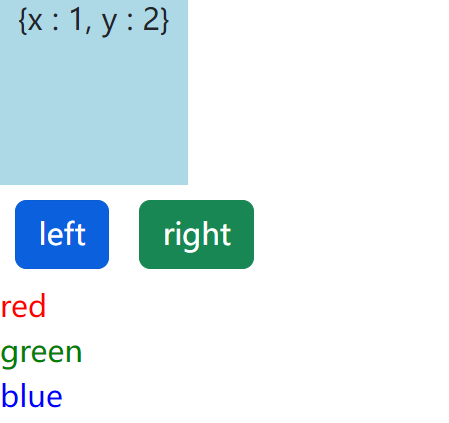

# React 基础学习

## 1. 配置环境

**如果没有终端 ： 安装Git Bash（仅限使用Windows，使用Mac和Linux的无需安装）**

https://gitforwindows.org/


**安装 Nodejs**

安装create-react-app

打开Git Bash，执行：

```sh
npm i -g create-react-app
```


**安装VSCode的插件**

- **Simple React Snippets**           ->         **webstorm   :          React Snippets**

- **Prettier - Code formatter**      


**创建React App**

在目标目录下打开Git Bash，在终端中执行：

```sh
create-react-app react-app  # 可以替换为其他app名称

cd react-app
npm start  # 启动应用
```


**JSX**

React中的一种语言，会被Babel编译成标准JavaScript。

https://babeljs.io/repl/


## 2. ES6语法补充

### 2.1. **使用 `bind()` 函数绑定 `this` 取值**

在JavaScript中，**函数里的this指向的是执行时的调用者，而非定义时所在的对象。**

例如：

```js
const person = {
  name: "yxc",
  talk: function() {
    console.log(this);
  }
}

person.talk();

const talk = person.talk;
talk();
```

运行结果：

```js
{name: 'yxc', talk: ƒ}
Window
```


bind()函数，可以绑定this的取值。例如：

```js
const talk = person.talk.bind(person);
```


### 2.2. 箭头函数的简写方式

```js
const f = (x) => {
  return x * x;
};
```

可以简写为：

```js
const f = x => x * x;
```


### 2.3. 箭头函数不重新绑定this的取值

例如：

```js
const person = {
  talk: function() {
    setTimeout(function() {
      console.log(this);
    }, 1000);
  }
};

person.talk();  // 输出Window
```

```js
const person = {
  talk: function() {
    setTimeout(() => {
      console.log(this);
    }, 1000);
  }
};

person.talk();  // 输出 {talk: f}
```


### 2.4. 对象的解构

例如：

```js
const person = {
  name: "yxc",
  age: 18,
  height: 180,
};

const {name : nm, age} = person;  // nm是name的别名
```


### 2.5. 数组和对象的展开

例如：

```js
let a = [1, 2, 3];
let b = [...a];  // b是a的复制 内存上不是用一个地址 一个改变不会改变另外一个的值
let c = [...a, 4, 5, 6];
```

```js
const a = {name: "yxc"};
const b = {age: 18};
const c = {...a, ...b, height: 180};
```


### 2.6. Named 与 Default exports

- **Named Export**：**每个文件可以export多个**，**import的时候需要加大括号，名称需要匹配**

- **Default Export**：**每个文件最多export一个**，**import的时候不需要加大括号，可以直接定义别名**

```js
export default class Person {
    constructor(){
        console.log("new Person....");
    }
}

let id = 10;
export {
	id
}
```

**两者可以同时存在，但普通的需要传一个数组**

```js
import Myperson, {id} from "/static/js/index1.js";
```


## 3. Components

### 3.1. 创建项目【引入bootstrap】

创建项目box-app：

```sh
create-react-app box-app
cd box-app
npm start
```

**安装bootstrap库：【是安装到当前项目里面了，所以每个项目都需要安装】**

```sh
npm i bootstrap
```

bootstrap的引入方式：

**在 index.js 上方写上**

```js
import 'bootstrap/dist/css/bootstrap.css';
```

 

### 3.2. 创建Component

**把除了 index 相关的代码和文件都删了** 


创建包 `/src/components` , 然后在里面创建 `box.jsx`，虽然 `react` 项目会把 `js` ，默认绑定为 `jsx` ，但是自己主动定义看上去更直观。

在 `box.jsx` 里先导入 `React` ，然后写好 `Box` 类，然后对外暴露，然后让 `index.js` 引入进来


```js
import React, {Component} from "react";


class Box extends Component {
    state = {};

    render() {
        return <h1> Hello World </h1>;
    }
}

export default Box;
```


**这里看上去，只用到了 Component 的 render 方法，让我们能在 js 里面， 通过这个函数的返回值，在 js 写 html**

**而 React 没用到，其实用到了，只不过是隐式用到的，jsx 编译成 js 是通过内部的方法做到的**


### 3.3. 创建按钮

**React 框架本质是通过递归的 dom 树生成，所以渲染页面的根节点只能是一个，当子节点数量大于1时，可以用`<div>`或`<React.Fragment>`将其括起来。同时最好用 括号把 html 内容包裹起来，这样可以防止编译器错误的解析内容。**

**<font color='red'>最好还是写 `<React.Fragment>` ，因为写 `<div>` 渲染页面还会多一个元素，而前者是虚拟的根节点。</font>**

```js
import React, {Component} from "react";


class Box extends Component {
    state = {};

    render() {
        return <React.Fragment>
            <h1> Hello World </h1>
            <button>left</button>
            <button>right</button>
        </React.Fragment>;
    }
}

export default Box;
```


### 3.4. 内嵌表达式

<font color='red'>**JSX中如果想在html中使用 js 使用{}嵌入表达式。这里 State 是当前类的局部变量【可以随意命名】，可以给我们其他的函数提供变量的引用 ，我们可以在 React 的 JSX 内部任何返回值返回标签，同时在想要调用 函数和变量的地方，通过大括号 + 引用的方式使用，下面的示例就用到了上面补充的对象的解构**</font>


```jsx
import React, {Component} from "react";


class Box extends Component {
    state = {
        x : 1,
        y : 2
    };

    render() {
        return (
            <React.Fragment>
                <div>{this.toString()}</div>
                <button>left</button>
                <button>right</button>
            </React.Fragment>
        );
    }

    toString() {
        const {x, y} = this.state;
        return `{x : ${x}, y : ${y}}`;
    }
}

export default Box;
```


### 3.5. 设置属性

- **class -> className**

- **CSS属性：background-color -> backgroundColor，其它属性类似，驼峰命名法**


**这里想用一个 css 格式修饰我们的按钮，我们不能像之前一样给标签加 `class` 属性，因为 React 专门给这个属性做了拓展，如果想要用这个属性，就换成 className 即可，下面是从 bootstrap 随便找的样式。m-2 是bootstrap 里面一个简单写间距 margin 的方式**


```JSX
import React, {Component} from "react";


class Box extends Component {
    state = {
        x : 1,
        y : 2
    };

    render() {
        return (
            <React.Fragment>
                <div>{this.toString()}</div>
                <button className="btn btn-primary m-2">left</button>
                <button className="btn btn-success m-2">right</button>
            </React.Fragment>
        );
    }

    toString() {
        const {x, y} = this.state;
        return `{x : ${x}, y : ${y}}`;
    }
}

export default Box;
```


### 3.6. 数据驱动改变Style

可以通过写一个变量，然后复制给标签的 style 属性，当然，要遵循 react 的内嵌表达式的写法。

```jsx
    styles = {
        width : "50px",
        height : "50px",
        backgroundColor : "lightblue"
    }

    render() {
        return (
            <React.Fragment>
                <div style={this.styles}>{this.toString()}</div>
                <button className="btn btn-primary m-2">left</button>
                <button className="btn btn-success m-2">right</button>
            </React.Fragment>
        );
    }
```

当然也可以通过内嵌表达式这么写，多写一个括号来代表一个对象。

```jsx
    render() {
        return (
            <React.Fragment>
                <div style={{
                    width: "50px",
                    height: "50px",
                    backgroundColor: "lightblue"
                }}>{this.toString()}</div>
                <button className="btn btn-primary m-2">left</button>
                <button className="btn btn-success m-2">right</button>
            </React.Fragment>
        );
    }
```

**如何通过数据驱动 Style ？【数据驱动是 React 的核心思想】**

**即写一个函数，通过数值的改动让 style 发生变化，此时从 IDE 改其实相当于刷新页面，未来会学习通过数值的改动不刷新页面让 style 发生变化。【类似输入值，或者是鼠标悬浮事件】**

```jsx
    state = {
        x: 1,
        y: 2
    };

    render() {
        return (
            <React.Fragment>
                <div style={this.getStyle()}>{this.toString()}</div>
                <button className="btn btn-primary m-2">left</button>
                <button className="btn btn-success m-2">right</button>
            </React.Fragment>
        );
    }

    getStyle() {
        let style = {
            width: "100px",
            height: "100px",
            backgroundColor: "lightblue",
            textAlign: "center",
            margin : "4 4 4 4",
        }

        if (this.state.x === 2) {
            style.backgroundColor = "red";
        }

        return style;
    }
```


### 3.7. 渲染列表

使用map函数

```
关键词：map
```

项目中我们常常会遇到要对后端返回的数据进行修改，从而达到符合我们的需要，其中map是常用到的对数组元素进行修改的重要函数。

**map()** 方法定义在JavaScript的Array中，它返回一个新的数组，数组中的元素为原始数组调用函数处理后的值。值得注意的是：**1、map()函数不会对空数组进行检测；2、map()函数不会改变原始数组，它形成的是 一个新的数组**

```js
array.map(function(currentValue, index, arr), thisIndex)
```

参数说明：

- function(currentValue, index, arr)：必须。为一个函数，数组中的每个元素都会执行这个函数。其中函数参数：
- currentValue：必须。表述当前元素的的值(item)
- index：可选。当前元素的索引也就是第几个数组元素。
- arr：可选。当前元素属于的数组对象
- thisValue：可选。对象作为该执行回调时使用，传递给函数，用作"this"的值

```js
let array = [1, 2, 3, 4, 5];

let newArray = array.map((item) => {
    return item * item;
})

console.log(newArray)  // [1, 4, 9, 16, 25]

```

```js
this.tableData = list.map(function (item) {
                if (item.leaseStatus === 0) {
                  item.leaseStatus = '已租';
                } else if (item.leaseStatus === 1) {
                  item.leaseStatus = '未租';
                } else if (item.leaseStatus === 2) {
                  item.leaseStatus = '已租';
                }
                if (res.data.data === null) {
                  item = '暂无记录';
                }
                return item;
              });

```

每个元素需要具有唯一的key属性，用来帮助React快速找到被修改的DOM元素。



```jsx
    state = {
        x: 1,
        y: 2,
        color: ["red", "green", "blue"]
    };

    render() {
        return (
            <React.Fragment>
                <div style={this.getStyle()}>{this.toString()}</div>
                <button className="btn btn-primary m-2">left</button>
                <button className="btn btn-success m-2">right</button>
                {
                    this.state.color.map(color => {
                        return <div key={color} style={{color}}>{color}</div>
                    })
                }
            </React.Fragment>
        );
    }

```


### 3.8. Conditional Rendering

利用逻辑表达式的短路原则。

与表达式中 expr1 && expr2，当expr1为假时返回expr1的值，否则返回expr2的值

或表达式中 expr1 || expr2，当expr1为真时返回expr1的值，否则返回expr2的值

当然三目运算符号更清晰         expr1 ?   expr2  : expr3;       当第一个表达式为 true 返回第一个，为 false 返回第二个

**推荐写个函数再调用，看着清晰**


### 3.9. 绑定事件

<font color='red'>**注意妥善处理好绑定事件函数的this**</font>

<font color='red'>**要么用前面说的  箭头表达式【更推荐使用箭头函数】，要么使用 bind 函数，这里我们是想绑定一个函数，而不是调用一个函数。**</font>

**<font color='red'>绑定函数所以我们不需要写括号，如果写了括号，相当于绑定了函数的返回值。相当于渲染的时候会触发这个函数</font>**

```jsx
    handleClickLeft= () => {
        console.log("clickLeft....", this);
    }

    handleClickRight() {
        console.log("clickRight...", this);
    }

    render() {
        return (
            <React.Fragment>
                <div style={this.getStyle()}>{this.toString()}</div>
                <button onClick={this.handleClickLeft} className="btn btn-primary m-2">left</button>
                <button onClick={this.handleClickRight.bind(this)} className="btn btn-success m-2">right</button>
            </React.Fragment>
        );
    }
```


### 3.10. 修改state

**需要使用this.setState()函数**

**<font color='red'>每次调用this.setState()函数后，会重新调用this.render()函数，用来修改虚拟DOM树。React只会修改不同步的实际DOM树节点。</font>**

**下面实现了点击切换 x 的值，然后实时改变 box 的颜色，同时渲染新值到页面**

```jsx
class Box extends Component {
    state = {
        x: 1
    };


    handleClickLeft= () => {
        this.setState({
            x : this.state.x - 1
        })
    }

    handleClickRight() {
        this.setState({
            x : this.state.x + 1
        })
    }

    render() {
        return (
            <React.Fragment>
                <div style={this.getStyle()}>{this.toString()}</div>
                <button onClick={this.handleClickLeft} className="btn btn-primary m-2">left</button>
                <button onClick={this.handleClickRight.bind(this)} className="btn btn-success m-2">right</button>
            </React.Fragment>
        );
    }

    getStyle() {
        let style = {
            width: "100px",
            height: "100px",
            backgroundColor: "lightblue",
            textAlign: "center",
            margin: "4 4 4 4",
        }

        if (this.state.x % 2 === 0) {
            style.backgroundColor = "red";
        }

        return style;
    }

    toString(){
        return `x : ${this.state.x}`;
    }
}
```


**想要改变位置可以通过 修改 CSS 的 `marginLeft` 的值，赋值为 `this.state.x`**


### 3.11. 给事件函数添加参数

**通过设置一个别的函数，能给传参数的函数添加参数。**

```jsx
    state = {
        x: 1
    };

    handleClickLeft = (temp) => {
        this.setState({
            x: this.state.x - temp
        })
    }

    handleClickLeftTemp = () => {
        return this.handleClickLeft(10);
    }

    handleClickRight() {
        this.setState({
            x: this.state.x + 1
        })
    }

    render() {
        return (
            <React.Fragment>
                <div style={this.getStyle()}>{this.toString()}</div>
                <button onClick={this.handleClickLeftTemp} className="btn btn-primary m-2">left</button>
                <button onClick={this.handleClickRight.bind(this)} className="btn btn-success m-2">right</button>
            </React.Fragment>
        );
    }
```

**当然也可以直接在事件里面写 箭头函数**

```jsx
    render() {
        return (
            <React.Fragment>
                <div style={this.getStyle()}>{this.toString()}</div>
                <button onClick={() => {return this.handleClickLeft(10)}}>left</button>
                <button onClick={this.handleClickRight.bind(this)}>right</button>
            </React.Fragment>
        );
    }
```


## 4. 组合Components

### 4.1. 创建Boxes组件

**Boxes** 组件中包含一系列 **Box** 组件。

**`index.js`**

```jsx
import React from 'react';
import ReactDOM from 'react-dom/client';
import './index.css';
import 'bootstrap/dist/css/bootstrap.css';
import Box from "./components/box";
import Boxes from "./components/boxes";

const root = ReactDOM.createRoot(document.getElementById('root'));
root.render(
    <React.StrictMode>
        <Boxes />
    </React.StrictMode>
);
```

`boxes.jsx`

```jsx
import React, {Component} from "react";
import Box from "./box";

class Boxes extends Component {

    render() {
        return (
            <React.Fragment>
                <Box/>
                <Box/>
                <Box/>
                <Box/>
            </React.Fragment>
        );
    }
}

export default Boxes;
```


**<font color='red'>当然这么写其实如果项目复杂了，代码就会很冗余，可以利用之前学过的数组遍历的思想，然后写个数组进行遍历</font>**

```jsx
class Boxes extends Component {

    state = {
        boxes: [
            {id: 1, x: 0},
            {id: 2, x: 0},
            {id: 3, x: 0},
            {id: 4, x: 0},
        ]
    }

    render() {
        return (
            <React.Fragment>
                {
                    this.state.boxes.map(box => <Box key={box.id}/>)
                }
            </React.Fragment>
        );
    }
}
```


### 4.2. 从上往下传递数据

<font color='red'>**注意：每个组件的this.state只能在组件内部修改，不能在其他组件内修改。**</font>

通过  **this.props** 属性可以从上到下传递数据。

父节点直接传值，可以是对象，数组，或者是普通的值，函数

```jsx
    state = {
        boxes: [
            {id: 1, x: 2},
            {id: 2, x: 4},
            {id: 3, x: 6},
            {id: 4, x: 8},
        ]
    }

	render() {
        return (
            <React.Fragment>
                {
                    this.state.boxes.map(box => (<Box
                        key={box.id}
                        x={box.x}
                        name= "box"
                    />))
                }
            </React.Fragment>
        );
    }
```


子节点可以通过在渲染前输出 **this.props** 可以看到确实被传入了参数

```jsx
    render() {
        console.log(this.props)
        return (
            <React.Fragment>
                <div style={this.getStyle()}>{this.toString()}</div>
                <button onClick={() => {return this.handleClickLeft(10)}} className="btn btn-primary m-2">left</button>
                <button onClick={this.handleClickRight.bind(this)} className="btn btn-success m-2">right</button>
            </React.Fragment>
        );
    }
```

但是位置没变，说明只给了参数，没给赋值到子节点的 `state`

想要传递过来很简单，直接赋值的时候就接受这个值

```jsx
class Box extends Component {
    state = {
        x: this.props.x
    };
-------------------------------下面略-------------------------------
```


### 4.3. 传递子节点

<font color='red'>**注意：每个组件的this.state只能在组件内部修改，不能在其他组件内修改。**</font>

**通过this.props.children属性传递子节点**

我们的组件也可以写成分体标签，然后给里面嵌套写标签，但是写了之后渲染画面会发现，其实变成了内部的属性【props.children】

想要渲染很简单，直接在子节点的渲染函数，根据数组方式选择渲染。

**父节点传入标签。**

```jsx
    render() {
        return (
            <React.Fragment>
                {
                    this.state.boxes.map(box => (
                        <Box
                            key={box.id}
                            x={box.x}
                        >
                            <h3>Box:</h3>
                            <p>#{box.id}</p>
                        </Box>))
                }
            </React.Fragment>
        );
    }
```


**子节点渲染标签。**

```jsx
    render() {
        console.log(this.props)
        return (
            <React.Fragment>
                {this.props.children[0]}
                <div style={this.getStyle()}>{this.toString()}</div>
                {this.props.children[1]}
                <button onClick={() => {return this.handleClickLeft(10)}} className="btn btn-primary m-2">left</button>
                <button onClick={this.handleClickRight.bind(this)} className="btn btn-success m-2">right</button>
            </React.Fragment>
        );
    }
```


### 4.4. 从下往上调用函数

<font color='red'>**注意：每个组件的this.state只能在组件内部修改，不能在其他组件内修改。**</font>

**这里演示，从父组件定义一个删除方法，能够在子元素调用这个方法，并实现子元素的删除。**


**父组件**

在父组件把删除方法写好，然后通过上面学的从上往下传递方法，然后子组件给按钮增加事件，当点击的时候，调用传下来的方法即可完成子组件的删除。

```jsx
    state = {
        boxes: [
            {id: 1, x: 1},
            {id: 2, x: 3},
            {id: 3, x: 5},
            {id: 4, x: 8},
        ]
    }

    handleDelete = (id) => {
        const boxes = this.state.boxes.filter(
            box => box.id !== id
        );
        this.setState({boxes: boxes});
    }

    render() {
        return (
            <React.Fragment>
                {
                    this.state.boxes.map(box => (
                        <Box
                            key={box.id}
                            x={box.x}
                            id={box.id}
                            onDelete={this.handleDelete}
                        >
                        </Box>))
                }
            </React.Fragment>
        );
    }
}
```

这里有一个语法糖，如果给 state 元素赋值，前后元素名字相同，可以不用重复书写，只需要写一次

```jsx
this.setState({boxes: boxes});
相当于
this.setState({boxes});
```


**子组件**

子组件调用父组件传递下来的方法

```jsx
    render() {
        console.log(this.props)
        return (
            <React.Fragment>
                <div style={this.getStyle()}>{this.toString()}</div>
                <button onClick={this.handleClickLeft}>left</button>
                <button onClick={this.handleClickRight.bind(this)}>right</button>
                <button
                    onClick={() => this.props.onDelete(this.props.id)}>delete
                </button>
            </React.Fragment>
        );
    }
```


### 4.5. 每个维护的数据仅能保存在一个this.state中

<font color='red'>**不要直接修改this.state的值，因为setState函数可能会将修改覆盖掉。**</font>

**像我们之前的传递 `x` 的方式，我们通过给子组件传了属性 `x` ，然后在子组件的 `state` 里，进行赋值 `x : this.props.x` 但是这种方式只在子组件被创建的时候能够赋值，渲染完毕之后，再修改 父组件传递的属性 `x` , 就会出现虽然传递过去的属性值变了，但是不会再二次赋值了。**

所以我们直接干脆一点，就不给子组件任何 state 属性，所有的属性都来自于父组件给它的 props

父节点

```jsx
class Boxes extends Component {

    state = {
        boxes: [
            {id: 1, x: 1},
            {id: 2, x: 3},
            {id: 3, x: 5},
            {id: 4, x: 8},
        ]
    }

    handleClickLeft = (box) => {
        const boxes = [...this.state.boxes];
        const k = boxes.indexOf(box);
        boxes[k] = {...boxes[k]};
        boxes[k].x --;
        this.setState({boxes});
    }
    handleClickRight = (box) => {
        const boxes = [...this.state.boxes];
        const k = boxes.indexOf(box);
        boxes[k] = {...boxes[k]};
        boxes[k].x ++;
        this.setState({boxes});
    }

    handleDelete = (box) => {
        const boxes = this.state.boxes.filter(
            b => box !== b
        );
        this.setState({boxes});
    }

    render() {
        return (
            <React.Fragment>
                {
                    this.state.boxes.map(box => (
                        <Box
                            key={box.id}
                            onDelete={this.handleDelete}
                            onClickLeft={() => this.handleClickLeft(box)}
                            onClickRight={this.handleClickRight}
                            box={box}
                        >
                        </Box>))
                }
            </React.Fragment>
        );
    }
}

export default Boxes;
```

子节点

```jsx
class Box extends Component {

    render() {
        return (
            <React.Fragment>
                <div style={this.getStyle()}>{this.toString()}</div>
                <button onClick={this.props.onClickLeft} className="btn btn-primary m-2">left</button>
                <button onClick={() => this.props.onClickRight(this.props.box)} className="btn btn-success m-2">right</button>
                <button
                    onClick={() => this.props.onDelete(this.props.box)}
                    className="btn btn-danger m-2">delete</button>
            </React.Fragment>
        );
    }

    getStyle() {
        let style = {
            width: "100px",
            height: "100px",
            backgroundColor: "lightblue",
            textAlign: "center",
            margin: "4 4 4 4",
            borderRadius: 10,
            marginLeft: this.props.box.x * 10
        }

        if (this.props.box.x % 2 === 0) {
            style.backgroundColor = "red";
        }

        return style;
    }

    toString() {
        return `x : ${this.props.box.x}`;
    }
}
```


### 4.6. 创建App组件

**包含：**

- **导航栏组件**
- **Boxes组件**

**注意：**

**要将多个组件共用的数据存放到最近公共祖先的this.state中。**


## 4.7. 无状态函数组件

当组件中没有用到this.state时，可以简写为无状态的函数组件。

函数的传入参数为props对象


## 4.8. 组件的生命周期

- Mount周期，执行顺序：constructor() -> render() -> componentDidMount()
- Update周期，执行顺序：render() -> componentDidUpdate()
- Unmount周期，执行顺序：componentWillUnmount()


## 5. 路由

### 5.1. Web分类

- 静态页面：页面里的数据是写死的

- 动态页面：页面里的数据是动态填充的

- 后端渲染：数据在后端填充

- 前端渲染：数据在前端填充


### 5.2. 安装环境

VSCODE安装插件：`Auto Import - ES6, TS, JSX, TSX`

安装Route组件：

```sh
npm i react-router-dom
```


### 5.3. Route组件介绍

- BrowserRouter：所有需要路由的组件，都要包裹在BrowserRouter组件内

- Link：跳转到某个链接，to属性表示跳转到的链接

- Routes：类似于C++中的switch，匹配第一个路径

- Route：路由，path属性表示路径，element属性表示路由到的内容


### 5.4. URL中传递参数

解析URL：

```js
<Route path="/linux/:chapter_id/:section_id/" element={<Linux />} />
```

获取参数，类组件写法：

```js
import React, { Component } from 'react';
import { useParams } from 'react-router-dom';

class Linux extends Component {
    state = {  } 
    render() {
        console.log(this.props.params);
        return <h1>Linux</h1>;
    }
}

export default (props) => (
    <Linux
        {...props}
        params={useParams()}
    />
)
```

函数组件写法：

```js
import React, { Component } from 'react';
import { useParams } from 'react-router-dom';

const Linux = () => {
    console.log(useParams());
    return (<h1>Linux</h1>);
}

export default Linux;
```


### 5.5. Search Params传递参数

类组件写法：

```js
import React, { Component } from 'react';
import { useSearchParams } from 'react-router-dom';

class Django extends Component {
    state = {
        searchParams: this.props.params[0],  // 获取某个参数
        setSearchParams: this.props.params[1],  // 设置链接中的参数，然后重新渲染当前页面
    }

    handleClick = () => {
        this.state.setSearchParams({
            name: "abc",
            age: 20,
        })
    }

    render() {
        console.log(this.state.searchParams.get('age'));
        return <h1 onClick={this.handleClick}>Django</h1>;
    }
}

export default (props) => (
    <Django
        {...props}
        params={useSearchParams()}
    />
);
```

函数组件写法：

```js
import React, { Component } from 'react';
import { useSearchParams } from 'react-router-dom';

const Django = () => {
    let [searchParams, setSearchParams] = useSearchParams();
    console.log(searchParams.get('age'));
    return (<h1>Django</h1>);
}

export default Django;
```


### 5.6. 重定向

使用Navigate组件可以重定向。

```js
<Route path="*" element={ <Navigate replace to="/404" /> } />
```


### 5.7. 嵌套路由

```js
<Route path="/web" element={<Web />}>
    <Route index path="a" element={<h1>a</h1>} />
    <Route index path="b" element={<h1>b</h1>} />
    <Route index path="c" element={<h1>c</h1>} />
</Route>
```

注意：需要在父组件中添加`<Outlet />`组件，用来填充子组件的内容。


## 6. Redux

redux将所有数据存储到树中，且树是唯一的。

### 6.1. Redux基本概念

- store：存储树结构。
- state：维护的数据，一般维护成树的结构。
- reducer：对state进行更新的函数，每个state绑定一个reducer。传入两个参数：当前state和action，返回新state。
- action：一个普通对象，存储reducer的传入参数，一般描述对state的更新类型。
- dispatch：传入一个参数action，对整棵state树操作一遍。


### 6.2. React-Redux基本概念

- Provider组件：用来包裹整个项目，其store属性用来存储redux的store对象。
- connect(mapStateToProps, mapDispatchToProps)函数：用来将store与组件关联起来。
- mapStateToProps：每次store中的状态更新后调用一次，用来更新组件中的值。
- mapDispatchToProps：组件创建时调用一次，用来将store的dispatch函数传入组件。


### 6.3. 安装

```sh
npm i redux react-redux @reduxjs/toolkit
```


