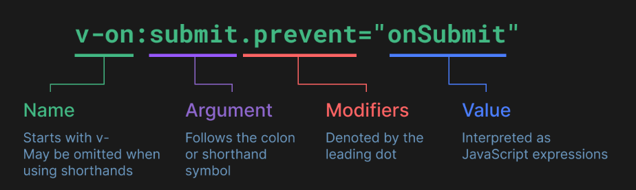

# 1. VITE 构建

## 1. 项目构建

用脚手架初始化项目

- `Vue CLI` https://cli.vuejs.org/zh/
- **`Vite` 脚手架** ：https://vitejs.cn/guide/#scaffolding-your-first-vite-project

```sh
npm create vite@latest
```

下载依赖

```
npm install
```

这一指令将会安装并执行 `create-vue`，它是 `Vue` 官方的项目脚手架工具。你将会看到一些诸如 `TypeScript` 和测试支持之类的可选功能提示：

如果不确定是否要开启某个功能，你可以直接按下回车键选择 `No`。在项目被创建后，通过以下步骤安装依赖并启动开发服务器

生成的项目中的示例组件使用的是 `组合式 API` 和 `<script setup>`，而非 `选项式 API`。下面是一些补充提示：


### 1. 浏览器开发者插件

`Vue` 的浏览器开发者插件使我们可以浏览一个 `Vue` 应用的组件树，查看各个组件的状态，追踪状态管理的事件，还可以进行组件性能分析。


## 2. 整合组件库

### 1. `Vant`

整合组件库 `Vant`：

- 安装 `Vant`
- 按需引入 `npm i vite-plugin-style-import@1.4.1 -D`

```sh
npm i vite-plugin-style-import@1.4.1 -D
```


### 2. `element-ui`


## 3. 初识 setup

1. 理解：Vue3.0中一个新的配置项，值为一个函数。
2. setup是所有<strong style="color:#DD5145">Composition API（组合API）</strong><i style="color:gray;font-weight:bold">“ 表演的舞台 ”</i>。
3. 组件中所用到的：数据、方法等等，均要配置在setup中。
4. setup函数的两种返回值：
   1. 若返回一个对象，则对象中的属性、方法, 在模板中均可以直接使用。（重点关注！）
   2. <span style="color:#aad">若返回一个渲染函数：则可以自定义渲染内容。（了解）</span>
5. 注意点：
   1. 尽量不要与Vue2.x配置混用
      - Vue2.x配置（data、methos、computed...）中<strong style="color:#DD5145">可以访问到</strong>setup中的属性、方法。
      - 但在setup中<strong style="color:#DD5145">不能访问到</strong>Vue2.x配置（data、methos、computed...）。
      - 如果有重名, setup优先。
   2. setup不能是一个async函数，因为返回值不再是return的对象, 而是promise, 模板看不到return对象中的属性。（后期也可以返回一个Promise实例，但需要Suspense和异步组件的配合）


# 2. 基础使用

## 2.1. 创建应用

每个 `Vue` 应用都是通过 `createApp` 函数创建一个新的 **应用实例**：


```js
import { createApp } from 'vue'

const app = createApp({
  /* 根组件选项 */
})
```

应用实例必须在调用了 `.mount()` 方法后才会渲染出来。该方法接收一个“容器”参数，可以是一个实际的 DOM 元素或是一个 CSS 选择器字符串：

```vue
<div id="app"></div>
```

```js
app.mount('#app')
```


`多个应用实例`

应用实例并不只限于一个。`createApp` API 允许你在同一个页面中创建多个共存的 Vue 应用，而且每个应用都拥有自己的用于配置和全局资源的作用域。

```js
const app1 = createApp({
  /* ... */
})
app1.mount('#container-1')

const app2 = createApp({
  /* ... */
})
app2.mount('#container-2')
```

如果你正在使用 `Vue` 来增强服务端渲染 `HTML`，并且只想要 `Vue` 去控制一个大型页面中特殊的一小部分，应避免将一个单独的 `Vue` 应用实例挂载到整个页面上，而是应该创建多个小的应用实例，将它们分别挂载到所需的元素上去。


应用实例还提供了一些方法来注册应用范围内可用的资源，例如注册一个组件：

```js
app.component('TodoDeleteButton', TodoDeleteButton)
```

这使得 `TodoDeleteButton` 在应用的任何地方都是可用的。我们会在指南的后续章节中讨论关于组件和其他资源的注册。你也可以在 [API 参考](https://cn.vuejs.org/api/application.html) 中浏览应用实例 API 的完整列表。

确保在挂载应用实例之前完成所有应用配置！


## 2.2. API风格

`Vue` 的组件可以按两种不同的风格书写：**选项式 API** 和**组合式 API**。

`选项式 API (Options API)`

使用选项式 `API`，我们可以用包含多个选项的对象来描述组件的逻辑，例如 `data`、`methods` 和 `mounted`。选项所定义的属性都会暴露在函数内部的 `this` 上，它会指向当前的组件实例。

```js
<script>
export default {
  // data() 返回的属性将会成为响应式的状态
  // 并且暴露在 `this` 上
  data() {
    return {
      count: 0
    }
  },

  // methods 是一些用来更改状态与触发更新的函数
  // 它们可以在模板中作为事件处理器绑定
  methods: {
    increment() {
      this.count++
    }
  },

  // 生命周期钩子会在组件生命周期的各个不同阶段被调用
  // 例如这个函数就会在组件挂载完成后被调用
  mounted() {
    console.log(`The initial count is ${this.count}.`)
  }
}
</script>

<template>
  <button @click="increment">Count is: {{ count }}</button>
</template>
```


`组合式 API` 

通过组合式 API，我们可以使用导入的 API 函数来描述组件逻辑。在单文件组件中，组合式 API 通常会与 `<script setup>` 搭配使用。这个 `setup` `attribute` 是一个标识，告诉 `Vue` 需要在编译时进行一些处理，让我们可以更简洁地使用组合式 `API`。比如，`<script setup>` 中的导入和顶层变量/函数都能够在模板中直接使用。

下面是使用了组合式 API 与 `<script setup>` 改造后和上面的模板完全一样的组件：

```js
<script setup>
import { ref, onMounted } from 'vue'

// 响应式状态
const count = ref(0)

// 用来修改状态、触发更新的函数
function increment() {
  count.value++
}

// 生命周期钩子
onMounted(() => {
  console.log(`The initial count is ${count.value}.`)
})
</script>

<template>
  <button @click="increment">Count is: {{ count }}</button>
</template>
```

两种 API 风格都能够覆盖大部分的应用场景。它们只是同一个底层系统所提供的两套不同的接口。实际上，选项式 API 是在组合式 API 的基础上实现的！关于 Vue 的基础概念和知识在它们之间都是通用的。

选项式 API 以“组件实例”的概念为中心 (即上述例子中的 `this`)，对于有面向对象语言背景的用户来说，这通常与基于类的心智模型更为一致。同时，它将响应性相关的细节抽象出来，并强制按照选项来组织代码，从而对初学者而言更为友好。

组合式 API 的核心思想是直接在函数作用域内定义响应式状态变量，并将从多个函数中得到的状态组合起来处理复杂问题。这种形式更加自由，也需要你对 Vue 的响应式系统有更深的理解才能高效使用。相应的，它的灵活性也使得组织和重用逻辑的模式变得更加强大。

在 [组合式 API FAQ](https://cn.vuejs.org/guide/extras/composition-api-faq.html) 章节中，你可以了解更多关于这两种 API 风格的对比以及组合式 API 所带来的潜在收益。

如果你是使用 `Vue` 的新手，这里是我们的大致建议：

- 在学习的过程中，推荐采用更易于自己理解的风格。再强调一下，大部分的核心概念在这两种风格之间都是通用的。熟悉了一种风格以后，你也能够很快地理解另一种风格。
- 在生产项目中：
  - 当你不需要使用构建工具，或者打算主要在低复杂度的场景中使用 `Vue`，例如渐进增强的应用场景，推荐采用选项式 API。
  - 当你打算用 Vue 构建完整的单页应用，推荐采用组合式 API + 单文件组件。


## 2.3. 模板语法

`Vue` 使用一种基于 `HTML` 的模板语法，使我们能够声明式地将其组件实例的数据绑定到呈现的 `DOM` 上。所有的 `Vue` 模板都是语法层面合法的 HTML，可以被符合规范的浏览器和 `HTML` 解析器解析。

在底层机制中，`Vue` 会将模板编译成高度优化的 `JavaScript` 代码。结合响应式系统，当应用状态变更时，`Vue` 能够智能地推导出需要重新渲染的组件的最少数量，并应用最少的 `DOM` 操作。


### 1. 文本插值

最基本的数据绑定形式是文本插值，它使用的是“`Mustache`”语法 (即双大括号)：

`template`

```vue
<span>Message: {{ msg }}</span>
```

双大括号标签会被替换为 相应组件实例中 `msg` 属性的值。同时每次 `msg` 属性更改时它也会同步更新。


### 2. 原始 HTML

双大括号会将数据解释为纯文本，而不是 HTML。若想插入 HTML，你需要使用 `v-html` 指令：

```js
<script setup>
    const rawHtml = "<span style="color: red">This should be red.</span>";
</script>
```


```vue
<p>Using text interpolation: {{ rawHtml }}</p>
<p>Using v-html directive: <span v-html="rawHtml"></span></p>
```


> Using text interpolation: <span style="color: red">This should be red.</span>
>
> Using v-html directive: This should be red.


这里我们遇到了一个新的概念。这里看到的 `v-html` `attribute` 被称为一个**指令**。指令由 `v-` 作为前缀，表明它们是一些由 Vue 提供的特殊 `attribute`，你可能已经猜到了，它们将为渲染的 `DOM` 应用特殊的响应式行为。这里我们做的事情简单来说就是：在当前组件实例上，将此元素的 `innerHTML` 与 `rawHtml` 属性保持同步。

`span` 的内容将会被替换为 `rawHtml` 属性的值，插值为纯 HTML——数据绑定将会被忽略。注意，你不能使用 `v-html` 来拼接组合模板，因为 Vue 不是一个基于字符串的模板引擎。在使用 `Vue` 时，应当使用组件作为 UI 重用和组合的基本单元。


### 3.Attribute 绑定

双大括号不能在 HTML attributes 中使用。想要响应式地绑定一个 attribute，应该使用 `v-bind` 指令：


```vue
<div v-bind:id="dynamicId"></div>
```


`v-bind` 指令指示 `Vue` 将元素的 `id` attribute 与组件的 `dynamicId` 属性保持一致。如果绑定的值是 `null` 或者 `undefined`，那么该 attribute 将会从渲染的元素上移除。

**简写**

因为 `v-bind` 非常常用，我们提供了特定的简写语法：


```vue
<div :id="dynamicId"></div>
```


开头为 `:` 的 attribute 可能和一般的 HTML attribute 看起来不太一样，但它的确是合法的 attribute 名称字符，并且所有支持 `Vue` 的浏览器都能正确解析它。此外，他们不会出现在最终渲染的 DOM 中。简写语法是可选的，但相信在你了解了它更多的用处后，你应该会更喜欢它。

> 接下来的指引中，我们都将在示例中使用简写语法，因为这是在实际开发中更常见的用法。


### 4.布尔型 Attribute

**布尔型 attribute** 依据 true / false 值来决定 attribute 是否应该存在于该元素上。`disabled` 就是最常见的例子之一。

`v-bind` 在这种场景下的行为略有不同：


```vue
<button :disabled="flag">Button</button>
```

当 `flag` 为 **真值 **或一个空字符串 (即 `<button disabled="">`) 时，元素会包含这个 `disabled` attribute。而当其为其他 **假值** 时 attribute 将被忽略。

```js
const flag = true;
```

为 `true` 则失效，为 `false` 就可以正常使用按钮。


### 5.动态绑定多个值

如果你有像这样的一个包含多个 attribute 的 JavaScript 对象：


```js
const objectOfAttrs = {
  id: 'container',
  class: 'wrapper'
}
```

通过不带参数的 `v-bind`，你可以将它们绑定到单个元素上：


```vue
<div v-bind="objectOfAttrs"></div>
```


### 6. 使用 JavaScript 表达式

至此，我们仅在模板中绑定了一些简单的属性名。但是 Vue 实际上在所有的数据绑定中都支持完整的 JavaScript 表达式：


```js
{{ number + 1 }}

{{ ok ? 'YES' : 'NO' }}

{{ message.split('').reverse().join('') }}

<div :id="`list-${id}`"></div>
```


这些表达式都会被作为 JavaScript ，以当前组件实例为作用域解析执行。

在 Vue 模板内，JavaScript 表达式可以被使用在如下场景上：

- 在文本插值中 (双大括号)
- 在任何 Vue 指令 (以 `v-` 开头的特殊 `attribute`) attribute 的值中


### 7. 仅支持表达式

每个绑定仅支持**单一表达式**，也就是一段能够被求值的 JavaScript 代码。一个简单的判断方法是是否可以合法地写在 `return` 后面。

因此，下面的例子都是**无效**的：


```js
<!-- 这是一个语句，而非表达式 -->
{{ var a = 1 }}

<!-- 条件控制也不支持，请使用三元表达式 -->
{{ if (ok) { return message } }}
```


### 8. 调用函数

可以在绑定的表达式中使用一个组件暴露的方法：


```js
<time :title="toTitleDate(date)" :datetime="date">
  {{ formatDate(date) }}
</time>
```

TIP

绑定在表达式中的方法在组件每次更新时都会被重新调用，因此 **不** 应该产生任何副作用，比如改变数据或触发异步操作。


### 9. 受限的全局访问

模板中的表达式将被沙盒化，仅能够访问到**有限的全局对象列表**。该列表中会暴露常用的内置全局对象，比如 `Math` 和 `Date`。

没有显式包含在列表中的全局对象将不能在模板内表达式中访问，例如用户附加在 `window` 上的属性。然而，你也可以自行在 `app.config.globalProperties` 上显式地添加它们，供所有的 `Vue` 表达式使用。


## 2.4. 指令 Directives

### 1. 参数 Arguments

某些指令会需要一个“参数”，在指令名后通过一个冒号隔开做标识。例如用 `v-bind` 指令来响应式地更新一个 HTML attribute：

```vue
<a v-bind:href="url"> ... </a>

<!-- 简写 -->
<a :href="url"> ... </a>
```


这里 `href` 就是一个参数，它告诉 `v-bind` 指令将表达式 `url` 的值绑定到元素的 `href` attribute 上。在简写中，参数前的一切 (例如 `v-bind:`) 都会被缩略为一个 `:` 字符。

另一个例子是 `v-on` 指令，它将监听 DOM 事件：

```vue
<a v-on:click="doSomething"> ... </a>

<!-- 简写 -->
<a @click="doSomething"> ... </a>
```

这里的参数是要监听的事件名称：`click`。`v-on` 有一个相应的缩写，即 `@` 字符。我们之后也会讨论关于事件处理的更多细节。


### 2. 动态参数

同样在指令参数上也可以使用一个 JavaScript 表达式，需要包含在一对方括号内：

```vue
<!--
注意，参数表达式有一些约束，
参见下面“动态参数值的限制”与“动态参数语法的限制”章节的解释
-->
<a v-bind:[attributeName]="url"> ... </a>

<!-- 简写 -->
<a :[attributeName]="url"> ... </a>
```

这里的 `attributeName` 会作为一个 JavaScript 表达式被动态执行，计算得到的值会被用作最终的参数。举例来说，如果你的组件实例有一个数据属性 `attributeName`，其值为 `"href"`，那么这个绑定就等价于 `v-bind:href`。


相似地，你还可以将一个函数绑定到动态的事件名称上：

```vue
<a v-on:[eventName]="doSomething"> ... </a>

<!-- 简写 -->
<a @[eventName]="doSomething">
```

在此示例中，当 `eventName` 的值是 `"focus"` 时，`v-on:[eventName]` 就等价于 `v-on:focus`。


### 3. 动态参数值的限制

动态参数中表达式的值应当是一个字符串，或者是 `null`。特殊值 `null` 意为显式移除该绑定。其他非字符串的值会触发警告。


### 4. 动态参数语法的限制

动态参数表达式因为某些字符的缘故有一些语法限制，比如空格和引号，在 `HTML` `attribute` 名称中都是不合法的。例如下面的示例：


```vue
<!-- 这会触发一个编译器警告 -->
<a :['foo' + bar]="value"> ... </a>
```

如果你需要传入一个复杂的动态参数，我们推荐使用 **计算属性 **替换复杂的表达式，也是 `Vue` 最基础的概念之一，我们很快就会讲到。

当使用 DOM 内嵌模板 (直接写在 HTML 文件里的模板) 时，我们需要避免在名称中使用大写字母，因为浏览器会强制将其转换为小写：


```vue
<a :[someAttr]="value"> ... </a>
```

上面的例子将会在 DOM 内嵌模板中被转换为 `:[someattr]`。如果你的组件拥有 “`someAttr`” 属性而非 “`someattr`”，这段代码将不会工作。单文件组件内的模板 **不** 受此限制。


### 5. 修饰符 Modifiers

修饰符是以点开头的特殊后缀，表明指令需要以一些特殊的方式被绑定。例如 `.prevent` 修饰符会告知 `v-on` 指令对触发的事件调用 `event.preventDefault()`：


```vue
<form @submit.prevent="onSubmit">...</form>
```

之后在讲到 `v-on` 和 `v-model` 的功能时，你将会看到其他修饰符的例子。

最后，在这里你可以直观地看到完整的指令语法：




## 2.5. 响应式基础

**vue2.x的响应式**

- 实现原理：

  - 对象类型：通过```Object.defineProperty()```对属性的读取、修改进行拦截（数据劫持）。

  - 数组类型：通过重写更新数组的一系列方法来实现拦截。（对数组的变更方法进行了包裹）。

    ```js
    Object.defineProperty(data, 'count', {
        get () {}, 
        set () {}
    })
    ```

- 存在问题：

  - 新增属性、删除属性, 界面不会更新。
  - 直接通过下标修改数组, 界面不会自动更新。

**Vue3.0的响应式**

- 实现原理: 

  - 通过Proxy（代理）:  拦截对象中任意属性的变化, 包括：属性值的读写、属性的添加、属性的删除等。

  - 通过Reflect（反射）:  对源对象的属性进行操作。

  - MDN文档中描述的Proxy与Reflect：

    - Proxy：https://developer.mozilla.org/zh-CN/docs/Web/JavaScript/Reference/Global_Objects/Proxy

    - Reflect：https://developer.mozilla.org/zh-CN/docs/Web/JavaScript/Reference/Global_Objects/Reflect

      ```js
      new Proxy(data, {
      	// 拦截读取属性值
          get (target, prop) {
          	return Reflect.get(target, prop)
          },
          // 拦截设置属性值或添加新属性
          set (target, prop, value) {
          	return Reflect.set(target, prop, value)
          },
          // 拦截删除属性
          deleteProperty (target, prop) {
          	return Reflect.deleteProperty(target, prop)
          }
      })
      
      proxy.name = 'tom'   
      ```


### 1.声明响应式状态

选用选项式 API 时，会用 `data` 选项来声明组件的响应式状态。此选项的值应为返回一个对象的函数。Vue 将在创建新组件实例的时候调用此函数，并将函数返回的对象用响应式系统进行包装。此对象的所有顶层属性都会被代理到组件实例 (即方法和生命周期钩子中的 `this`) 上。

```js
export default {
  data() {
    return {
      count: 1
    }
  },

  // `mounted` 是生命周期钩子，之后我们会讲到
  mounted() {
    // `this` 指向当前组件实例
    console.log(this.count) // => 1

    // 数据属性也可以被更改
    this.count = 2
  }
}
```


#### 1. `ref()`

在组合式 API 中，推荐使用 `ref()` 函数来声明响应式状态：

```js
import { ref } from 'vue'

const count = ref(0)
```

`ref()` 接收参数，并将其包裹在一个带有 `.value` 属性的 ref 对象中返回：

```js
const count = ref(0)

console.log(count) // { value: 0 }
console.log(count.value) // 0

count.value++
console.log(count.value) // 1
```


为 `ref()` 标注类型

ref 会根据初始化时的值推导其类型：

```js
import { ref } from 'vue'

// 推导出的类型：Ref<number>
const year = ref(2020)

// => TS Error: Type 'string' is not assignable to type 'number'.
year.value = '2020'
```


**typescript** 有时我们可能想为 ref 内的值指定一个更复杂的类型，可以通过使用 `Ref` 这个类型：

```js
import { ref } from 'vue'
import type { Ref } from 'vue'

const year: Ref<string | number> = ref('2020')

year.value = 2020 // 成功！
```

或者，在调用 `ref()` 时传入一个泛型参数，来覆盖默认的推导行为：

```js
// 得到的类型：Ref<string | number>
const year = ref<string | number>('2020')

year.value = 2020 // 成功！
```

如果你指定了一个泛型参数但没有给出初始值，那么最后得到的就将是一个包含 `undefined` 的联合类型：

```js
// 推导得到的类型：Ref<number | undefined>
const n = ref<number>()
```


#### 2. `<script setup>`

要在组件模板中访问 ref，请从组件的 `setup()` 函数中声明并返回它们：

```js
import { ref } from 'vue'

export default {
  // `setup` 是一个特殊的钩子，专门用于组合式 API。
  setup() {
    const count = ref(0)

    // 将 ref 暴露给模板
    return {
      count
    }
  }
}
```


在 `setup()` 函数中手动暴露大量的状态和方法非常繁琐。幸运的是，我们可以通过使用 **单文件组件 (SFC)** 来避免这种情况。我们可以使用 `<script setup>` 来大幅度地简化代码：【第一行的 `<script setup>`】

```js
<script setup>
import { ref } from 'vue'

const count = ref(0)

function increment() {
  count.value++
}
</script>

<template>
  <button @click="increment">
    {{ count }}
  </button>
</template>
```

`<script setup>` 中的顶层的导入、声明的变量和函数可在同一组件的模板中直接使用。你可以理解为模板是在同一作用域内声明的一个 JavaScript 函数——它自然可以访问与它一起声明的所有内容。


#### 3. 为什么要使用 `ref`

你可能会好奇：为什么我们需要使用带有 `.value` 的 `ref`，而不是普通的变量？为了解释这一点，我们需要简单地讨论一下 `Vue` 的响应式系统是如何工作的。

当你在模板中使用了一个 `ref`，然后改变了这个 `ref` 的值时，`Vue` 会自动检测到这个变化，并且相应地更新 `DOM`。这是通过一个基于依赖追踪的响应式系统实现的。当一个组件首次渲染时，`Vue` 会 **追踪** 在渲染过程中使用的每一个 `ref`。然后，当一个 `ref` 被修改时，它会 **触发** 追踪它的组件的一次重新渲染。

在标准的 `JavaScript` 中，检测普通变量的访问或修改是行不通的。然而，我们可以通过 `getter` 和 `setter` 方法来拦截对象属性的 `get` 和 `set` 操作。

该 `.value` 属性给予了 `Vue` 一个机会来检测 `ref` 何时被访问或修改。在其内部，`Vue` 在它的 `getter` 中执行追踪，在它的 `setter` 中执行触发。从概念上讲，你可以将 `ref` 看作是一个像这样的对象：

```js
// 伪代码，不是真正的实现
const myRef = {
  _value: 0,
  get value() {
    track()
    return this._value
  },
  set value(newValue) {
    this._value = newValue
    trigger()
  }
}
```

另一个 ref 的好处是，与普通变量不同，你可以将 ref 传递给函数，同时保留对最新值和响应式连接的访问。当将复杂的逻辑重构为可重用的代码时，这将非常有用。

该响应性系统在[深入响应式原理](https://cn.vuejs.org/guide/extras/reactivity-in-depth.html)章节中有更详细的讨论。


#### 4. 深层响应性

Ref 可以持有任何类型的值，包括深层嵌套的对象、数组或者 JavaScript 内置的数据结构，比如 `Map`。

Ref 会使它的值具有深层响应性。这意味着即使改变嵌套对象或数组时，变化也会被检测到：

```js
import { ref } from 'vue'

const obj = ref({
  nested: { count: 0 },
  arr: ['foo', 'bar']
})

function mutateDeeply() {
  // 以下都会按照期望工作
  obj.value.nested.count++
  obj.value.arr.push('baz')
}
```

非原始值将通过 `reactive()` 转换为响应式代理，该函数将在后面讨论。

也可以通过 `shallow ref` 来放弃深层响应性。对于浅层 ref，只有 `.value` 的访问会被追踪。浅层 ref 可以用于避免对大型数据的响应性开销来优化性能、或者有外部库管理其内部状态的情况。

阅读更多：

- [减少大型不可变数据的响应性开销](https://cn.vuejs.org/guide/best-practices/performance.html#reduce-reactivity-overhead-for-large-immutable-structures)
- [与外部状态系统集成](https://cn.vuejs.org/guide/extras/reactivity-in-depth.html#integration-with-external-state-systems)


#### 5. DOM 更新时机

当你修改了响应式状态时，DOM 会被自动更新。但是需要注意的是，DOM 更新不是同步的。`Vue` 会在“next tick”更新周期中缓冲所有状态的修改，以确保不管你进行了多少次状态修改，每个组件都只会被更新一次。

要等待 DOM 更新完成后再执行额外的代码，可以使用 [`nextTick()`](https://cn.vuejs.org/api/general.html#nexttick) 全局 API：

```js
import { nextTick } from 'vue'

async function increment() {
  count.value++
  await nextTick()
  // 现在 DOM 已经更新了
}
```


### 2. reactive()

还有另一种声明响应式状态的方式，即使用 `reactive()` API。与将内部值包装在特殊对象中的 ref 不同，`reactive()` 将使对象本身具有响应性：

```js
import { reactive } from 'vue'

const state = reactive({ count: 0 })
```


为 `reactive()` 标注类型

`reactive()` 也会隐式地从它的参数中推导类型：

```js
import { reactive } from 'vue'

// 推导得到的类型：{ title: string }
const book = reactive({ title: 'Vue 3 指引' })
```

要显式地标注一个 `reactive` 变量的类型，我们可以使用接口：

```js
import { reactive } from 'vue'

interface Book {
  title: string
  year?: number
}

const book: Book = reactive({ title: 'Vue 3 指引' })
```


在模板中使用：

```js
<button @click="state.count++">
  {{ state.count }}
</button>
```

响应式对象是 **JavaScript** 代理，其行为就和普通对象一样。不同的是，Vue 能够拦截对响应式对象所有属性的访问和修改，以便进行依赖追踪和触发更新。

`reactive()` 将深层地转换对象：当访问嵌套对象时，它们也会被 `reactive()` 包装。当 ref 的值是一个对象时，`ref()` 也会在内部调用它。与浅层 ref 类似，这里也有一个 `shallowReactive()` API 可以选择退出深层响应性。


#### 1. Reactive Proxy vs. Original

值得注意的是，`reactive()` 返回的是一个原始对象的 **Proxy**，它和原始对象是不相等的：

```js
const raw = {}
const proxy = reactive(raw)

// 代理对象和原始对象不是全等的
console.log(proxy === raw) // false
```

只有代理对象是响应式的，更改原始对象不会触发更新。因此，使用 `Vue` 的响应式系统的最佳实践是 **仅使用你声明对象的代理版本**。

为保证访问代理的一致性，对同一个原始对象调用 `reactive()` 会总是返回同样的代理对象，而对一个已存在的代理对象调用 `reactive()` 会返回其本身：

```js
// 在同一个对象上调用 reactive() 会返回相同的代理
console.log(reactive(raw) === proxy) // true

// 在一个代理上调用 reactive() 会返回它自己
console.log(reactive(proxy) === proxy) // true
```

这个规则对嵌套对象也适用。依靠深层响应性，响应式对象内的嵌套对象依然是代理：

```js
const proxy = reactive({})

const raw = {}
proxy.nested = raw

console.log(proxy.nested === raw) // false
```


#### 2. `reactive()` 的局限性

`reactive()` API 有一些局限性：

1. **有限的值类型**：它只能用于对象类型 (对象、数组和如 `Map`、`Set` 这样的**集合类型**)。它不能持有如 `string`、`number` 或 `boolean` 这样的**原始类型**。
2. **不能替换整个对象**：由于 `Vue` 的响应式跟踪是通过属性访问实现的，因此我们必须始终保持对响应式对象的相同引用。这意味着我们不能轻易地“替换”响应式对象，因为这样的话与第一个引用的响应性连接将丢失：

```js
let state = reactive({ count: 0 })

// 上面的 ({ count: 0 }) 引用将不再被追踪
// (响应性连接已丢失！)
state = reactive({ count: 1 })
```

3. **对解构操作不友好**：当我们将响应式对象的原始类型属性解构为本地变量时，或者将该属性传递给函数时，我们将丢失响应性连接：

```js
const state = reactive({ count: 0 })

// 当解构时，count 已经与 state.count 断开连接
let { count } = state
// 不会影响原始的 state
count++

// 该函数接收到的是一个普通的数字
// 并且无法追踪 state.count 的变化
// 我们必须传入整个对象以保持响应性
callSomeFunction(state.count)
```

由于这些限制，我们建议使用 `ref()` 作为声明响应式状态的主要 API。


### 3. 额外的 **ref** 解包细节

#### 1. 作为 reactive 对象的属性

一个 ref 会在作为响应式对象的属性被访问或修改时自动解包。换句话说，它的行为就像一个普通的属性：

```js
const count = ref(0)
const state = reactive({
  count
})

console.log(state.count) // 0

state.count = 1
console.log(count.value) // 1
```

如果将一个新的 ref 赋值给一个关联了已有 ref 的属性，那么它会替换掉旧的 ref：

```js
const otherCount = ref(2)

state.count = otherCount
console.log(state.count) // 2
// 原始 ref 现在已经和 state.count 失去联系
console.log(count.value) // 1
```

只有当嵌套在一个深层响应式对象内时，才会发生 ref 解包。当其作为 **浅层响应式对象** 的属性被访问时不会解包。


#### 2. 数组和集合的注意事项

与 reactive 对象不同的是，当 ref 作为响应式数组或原生集合类型(如 `Map`) 中的元素被访问时，它**不会**被解包：


```js
const books = reactive([ref('Vue 3 Guide')])
// 这里需要 .value
console.log(books[0].value)

const map = reactive(new Map([['count', ref(0)]]))
// 这里需要 .value
console.log(map.get('count').value)
```


#### 3. 在模板中解包的注意事项

在模板渲染上下文中，只有顶级的 ref 属性才会被解包。

在下面的例子中，`count` 和 `object` 是顶级属性，但 `object.id` 不是：

```js
const count = ref(0)
const object = { id: ref(0) }
```

因此，这个表达式按预期工作：

```js
{{ count + 1 }}
```

...但这个**不会**：

```js
{{ object.id + 1 }}
```

渲染的结果将是 `[object Object]1`，因为在计算表达式时 `object.id` 没有被解包，仍然是一个 ref 对象。为了解决这个问题，我们可以将 `id` 解构为一个顶级属性：

```js
const { id } = object
```

```js
{{ id + 1 }}
```

现在渲染的结果将是 `2`。

另一个需要注意的点是，如果 ref 是文本插值的最终计算值 (即 `{{ }}` 标签)，那么它将被解包，因此以下内容将渲染为 `1`：

```js
{{ object.id }}
```

该特性仅仅是文本插值的一个便利特性，等价于 `{{ object.id.value }}`。


## 2.6. 计算属性


## 2.7. 类与样式绑定


## 2.8. 条件渲染

指令是带有 `v-` 前缀的特殊 attribute。`Vue` 提供了许多**内置指令**，包括上面我们所介绍的 `v-bind` 和 `v-html`。

指令 attribute 的期望值为一个 JavaScript 表达式 (除了少数几个例外，即之后要讨论到的 `v-for`、`v-on` 和 `v-slot`)。一个指令的任务是在其表达式的值变化时响应式地更新 DOM。以 `v-if` 为例：


```vue
<p v-if="seen">Now you see me</p>
```

这里，`v-if` 指令会基于表达式 `seen` 的值的真假来移除/插入该 `<p>` 元素。

`v-else-if` `v-else`

```vue
<p v-if="type === 'A'">A</p>
<p v-else-if="type === 'B'">B</p>
<p v-else-if="type === 'C">C</p>
<p v-else>NOT A/B/C</p>

<script setup>
let type = 'A';
</script>
```


`v-show`

```vue
<p v-show="flag">SHOW</p>

<script setup>
let type = flag;
</script>
```

基于表达式值的真假性，来改变元素的可见性。

- **期望的绑定值类型：**`any`

- **详细信息**

  `v-show` 通过设置内联样式的 `display` CSS 属性来工作，当元素可见时将使用初始 `display` 值。当条件改变时，也会触发过渡效果。

**<font color='red'>注意，这里的 v-show 是改 css，本质还是渲染了，但是 v-if 是相当于直接不渲染</font>**

**<font color='blue'>所以 v-show 有更高的初始渲染开销，而 v-if 有更高的切换开销。频繁切换用 v-show，很少改变用 v-if</font>**


## 2.9. 列表渲染

### 1. `v-for`

我们可以使用 `v-for` 指令基于一个数组来渲染一个列表。`v-for` 指令的值需要使用 `item in items` 形式的特殊语法，其中 `items` 是源数据的数组，而 `item` 是迭代项的**别名**：


```js
const items = ref([{ message: 'Foo' }, { message: 'Bar' }])
```


```js
<li v-for="item in items">
  {{ item.message }}
</li>
```

在 `v-for` 块中可以完整地访问父作用域内的属性和变量。`v-for` 也支持使用可选的第二个参数表示当前项的位置索引。


```js
const parentMessage = ref('Parent')
const items = ref([{ message: 'Foo' }, { message: 'Bar' }])
```


```js
<li v-for="(item, index) in items">
  {{ parentMessage }} - {{ index }} - {{ item.message }}
</li>
```

> Parent - 0 - Foo
>
> Parent - 1 - Bar


`v-for` 变量的作用域和下面的 JavaScript 代码很类似：

```js
const parentMessage = 'Parent'
const items = [
  /* ... */
]

items.forEach((item, index) => {
  // 可以访问外层的 `parentMessage`
  // 而 `item` 和 `index` 只在这个作用域可用
  console.log(parentMessage, item.message, index)
})
```


注意 `v-for` 是如何对应 `forEach` 回调的函数签名的。实际上，你也可以在定义 `v-for` 的变量别名时使用解构，和解构函数参数类似：

```js
<li v-for="{ message } in items">
  {{ message }}
</li>

<!-- 有 index 索引时 -->
<li v-for="({ message }, index) in items">
  {{ message }} {{ index }}
</li>
```


对于多层嵌套的 `v-for`，作用域的工作方式和函数的作用域很类似。每个 `v-for` 作用域都可以访问到父级作用域：

```js
<li v-for="item in items">
  <span v-for="childItem in item.children">
    {{ item.message }} {{ childItem }}
  </span>
</li>
```


你也可以使用 `of` 作为分隔符来替代 `in`，这更接近 JavaScript 的迭代器语法：

```js
<div v-for="item of items"></div>
```


### 2. `v-for` 与对象

你也可以使用 `v-for` 来遍历一个对象的所有属性。遍历的顺序会基于对该对象调用 `Object.keys()` 的返回值来决定。


```js
const myObject = reactive({
  title: 'How to do lists in Vue',
  author: 'Jane Doe',
  publishedAt: '2016-04-10'
})
```

```js
<ul>
  <li v-for="value in myObject">
    {{ value }}
  </li>
</ul>
```


可以通过提供第二个参数表示属性名 (例如 key)：

```js
<li v-for="(value, key) in myObject">
  {{ key }}: {{ value }}
</li>
```

第三个参数表示位置索引：

```js
<li v-for="(value, key, index) in myObject">
  {{ index }}. {{ key }}: {{ value }}
</li>
```


### 3. 在 `v-for` 里使用范围值

`v-for` 可以直接接受一个整数值。在这种用例中，会将该模板基于 `1...n` 的取值范围重复多次。

```js
<span v-for="n in 10">{{ n }}</span>
```

注意此处 `n` 的初值是从 `1` 开始而非 `0`。


### 4. `<template>` 上的 `v-for`

与模板上的 `v-if` 类似，你也可以在 `<template>` 标签上使用 `v-for` 来渲染一个包含多个元素的块。例如：

```js
<ul>
  <template v-for="item in items">
    <li>{{ item.msg }}</li>
    <li class="divider" role="presentation"></li>
  </template>
</ul>
```


### 5. `v-for` 与 `v-if`

**注意**

同时使用 `v-if` 和 `v-for` 是**不推荐的**，因为这样二者的优先级不明显。请转阅[风格指南](https://cn.vuejs.org/style-guide/rules-essential.html#avoid-v-if-with-v-for)查看更多细节。

当它们同时存在于一个节点上时，`v-if` 比 `v-for` 的优先级更高。这意味着 `v-if` 的条件将无法访问到 `v-for` 作用域内定义的变量别名：


```js
<!--
 这会抛出一个错误，因为属性 todo 此时
 没有在该实例上定义
-->
<li v-for="todo in todos" v-if="!todo.isComplete">
  {{ todo.name }}
</li>
```

在外新包装一层 `<template>` 再在其上使用 `v-for` 可以解决这个问题 (这也更加明显易读)：


```js
<template v-for="todo in todos">
  <li v-if="!todo.isComplete">
    {{ todo.name }}
  </li>
</template>
```


### 6. 通过 key 管理状态

Vue 默认按照“就地更新”的策略来更新通过 `v-for` 渲染的元素列表。当数据项的顺序改变时，Vue 不会随之移动 DOM 元素的顺序，而是就地更新每个元素，确保它们在原本指定的索引位置上渲染。

默认模式是高效的，但**只适用于列表渲染输出的结果不依赖子组件状态或者临时 DOM 状态 (例如表单输入值) 的情况**。

为了给 Vue 一个提示，以便它可以跟踪每个节点的标识，从而重用和重新排序现有的元素，你需要为每个元素对应的块提供一个唯一的 `key` attribute：


```js
<div v-for="item in items" :key="item.id">
  <!-- 内容 -->
</div>
```

当你使用 `<template v-for>` 时，`key` 应该被放置在这个 `<template>` 容器上：


```js
<template v-for="todo in todos" :key="todo.name">
  <li>{{ todo.name }}</li>
</template>
```

注意

`key` 在这里是一个通过 `v-bind` 绑定的特殊 attribute。请不要和[在 `v-for` 中使用对象](https://cn.vuejs.org/guide/essentials/list.html#v-for-with-an-object)里所提到的对象属性名相混淆。

[推荐](https://cn.vuejs.org/style-guide/rules-essential.html#use-keyed-v-for)在任何可行的时候为 `v-for` 提供一个 `key` attribute，除非所迭代的 DOM 内容非常简单 (例如：不包含组件或有状态的 DOM 元素)，或者你想有意采用默认行为来提高性能。

`key` 绑定的值期望是一个基础类型的值，例如字符串或 number 类型。不要用对象作为 `v-for` 的 key。关于 `key` attribute 的更多用途细节，请参阅 [`key` API 文档](https://cn.vuejs.org/api/built-in-special-attributes.html#key)。


### 7. 组件上使用 `v-for`

> 这一小节假设你已了解[组件](https://cn.vuejs.org/guide/essentials/component-basics.html)的相关知识，或者你也可以先跳过这里，之后再回来看。

我们可以直接在组件上使用 `v-for`，和在一般的元素上使用没有区别 (别忘记提供一个 `key`)：


```js
<MyComponent v-for="item in items" :key="item.id" />
```

但是，这不会自动将任何数据传递给组件，因为组件有自己独立的作用域。为了将迭代后的数据传递到组件中，我们还需要传递 props：


```js
<MyComponent
  v-for="(item, index) in items"
  :item="item"
  :index="index"
  :key="item.id"
/>
```

不自动将 `item` 注入组件的原因是，这会使组件与 `v-for` 的工作方式紧密耦合。明确其数据的来源可以使组件在其他情况下重用。

这里是一个简单的 [Todo List 的例子](https://play.vuejs.org/#eNp1U8Fu2zAM/RXCGGAHTWx02ylwgxZYB+ywYRhyq3dwLGYRYkuCJTsZjPz7KMmK3ay9JBQfH/meKA/Rk1Jp32G0jnJdtVwZ0Gg6tSkEb5RsDQzQ4h4usG9lAzGVxldoK5n8ZrAZsTQLCduRygAKUUmhDQg8WWyLZwMPtmESx4sAGkL0mH6xrMH+AHC2hvuljw03Na4h/iLBHBAY1wfUbsTFVcwoH28o2/KIIDuaQ0TTlvrwNu/TDe+7PDlKXZ6EZxTiN4kuRI3W0dk4u4yUf7bZfScqw6WAkrEf3m+y8AOcw7Qv6w5T1elDMhs7Nbq7e61gdmme60SQAvgfIhExiSSJeeb3SBukAy1D1aVBezL5XrYN9Csp1rrbNdykqsUehXkookl0EVGxlZHX5Q5rIBLhNHFlbRD6xBiUzlOeuZJQz4XqjI+BxjSSYe2pQWwRBZizV01DmsRWeJA1Qzv0Of2TwldE5hZRlVd+FkbuOmOksJLybIwtkmfWqg+7qz47asXpSiaN3lxikSVwwfC8oD+/sEnV+oh/qcxmU85mebepgLjDBD622Mg+oDrVquYVJm7IEu4XoXKTZ1dho3gnmdJhedEymn9ab3ysDPdc4M9WKp28xE5JbB+rzz/Trm3eK3LAu8/E7p2PNzYM/i3ChR7W7L7hsSIvR7L2Aal1EhqTp80vF95sw3WcG7r8A0XaeME=)，展示了如何通过 `v-for` 来渲染一个组件列表，并向每个实例中传入不同的数据。

## 数组变化侦测

### 变更方法

Vue 能够侦听响应式数组的变更方法，并在它们被调用时触发相关的更新。这些变更方法包括：

- `push()`
- `pop()`
- `shift()`
- `unshift()`
- `splice()`
- `sort()`
- `reverse()`

### 替换一个数组

变更方法，顾名思义，就是会对调用它们的原数组进行变更。相对地，也有一些不可变 (immutable) 方法，例如 `filter()`，`concat()` 和 `slice()`，这些都不会更改原数组，而总是**返回一个新数组**。当遇到的是非变更方法时，我们需要将旧的数组替换为新的：

js

```js
// `items` 是一个数组的 ref
items.value = items.value.filter((item) => item.message.match(/Foo/))
```

你可能认为这将导致 Vue 丢弃现有的 DOM 并重新渲染整个列表——幸运的是，情况并非如此。Vue 实现了一些巧妙的方法来最大化对 DOM 元素的重用，因此用另一个包含部分重叠对象的数组来做替换，仍会是一种非常高效的操作。

## 展示过滤或排序后的结果

有时，我们希望显示数组经过过滤或排序后的内容，而不实际变更或重置原始数据。在这种情况下，你可以创建返回已过滤或已排序数组的计算属性。

举例来说：


```js
const numbers = ref([1, 2, 3, 4, 5])

const evenNumbers = computed(() => {
  return numbers.value.filter((n) => n % 2 === 0)
})
```


```
<li v-for="n in evenNumbers">{{ n }}</li>
```

在计算属性不可行的情况下 (例如在多层嵌套的 `v-for` 循环中)，你可以使用以下方法：


```js
const sets = ref([
  [1, 2, 3, 4, 5],
  [6, 7, 8, 9, 10]
])

function even(numbers) {
  return numbers.filter((number) => number % 2 === 0)
}
```


```js
<ul v-for="numbers in sets">
  <li v-for="n in even(numbers)">{{ n }}</li>
</ul>
```

在计算属性中使用 `reverse()` 和 `sort()` 的时候务必小心！这两个方法将变更原始数组，计算函数中不应该这么做。请在调用这些方法之前创建一个原数组的副本：


```diff
- return numbers.reverse()
+ return [...numbers].reverse()
```


