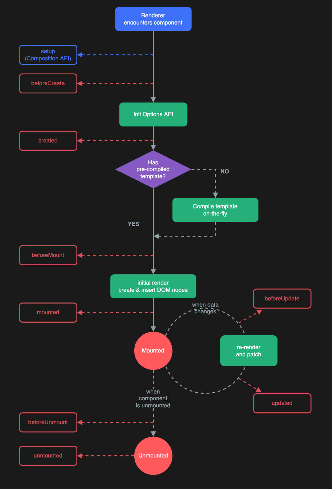
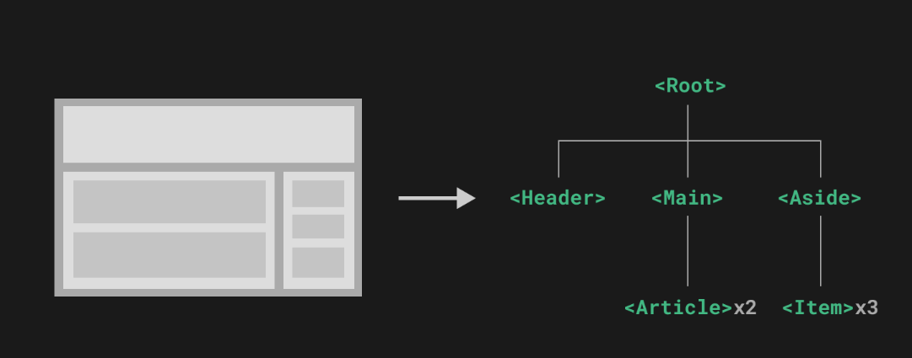
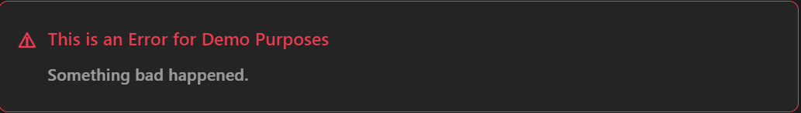

# 1. VITE 构建

## 1. 项目构建

用脚手架初始化项目

- `Vue CLI` https://cli.vuejs.org/zh/
- **`Vite` 脚手架** ：https://vitejs.cn/guide/#scaffolding-your-first-vite-project

```sh
npm create vite@latest
```

下载依赖

```
npm install
```

这一指令将会安装并执行 `create-vue`，它是 `Vue` 官方的项目脚手架工具。你将会看到一些诸如 `TypeScript` 和测试支持之类的可选功能提示：

如果不确定是否要开启某个功能，你可以直接按下回车键选择 `No`。在项目被创建后，通过以下步骤安装依赖并启动开发服务器

生成的项目中的示例组件使用的是 `组合式 API` 和 `<script setup>`，而非 `选项式 API`。下面是一些补充提示：


### 1. 浏览器开发者插件

`Vue` 的浏览器开发者插件使我们可以浏览一个 `Vue` 应用的组件树，查看各个组件的状态，追踪状态管理的事件，还可以进行组件性能分析。


## 2. 整合组件库和插件

### 1. `Vant`

整合组件库 `Vant`：

- 安装 `Vant`
- 按需引入 `npm i vite-plugin-style-import@1.4.1 -D`

```sh
npm i vite-plugin-style-import@1.4.1 -D
```


### 2. `element-ui`

1. 在您的 `Vue` 项目中安装Semantic UI。您可以使用 `npm` 或 `yarn` 进行安装，具体取决于您的项目配置。

```sh
npm install semantic-ui
```

2. 在 `Vue` 项目的根目录下创建一个名为 `semantic.js` 的文件，并将以下代码复制到该文件中：

```js
import 'semantic-ui-css/semantic.min.css';
import 'semantic-ui-css/components/button.min.css';
import 'semantic-ui-css/components/checkbox.min.css';
import 'semantic-ui-css/components/dimmer.min.css';
import 'semantic-ui-css/components/dropdown.min.css';
import 'semantic-ui-css/components/modal.min.css';
import 'semantic-ui-css/components/nagivation.min.css';
import 'semantic-ui-css/components/popup.min.css';
import 'semantic-ui-css/components/rating.min.css';
import 'semantic-ui-css/components/search.min.css';
import 'semantic-ui-css/components/shape.min.css';
import 'semantic-ui-css/components/sidebar.min.css';
import 'semantic-ui-css/components/sticky.min.css';
import 'semantic-ui-css/components/tab.min.css';
import 'semantic-ui-css/components/transition.min.css';
```

3. 在 `Vue` 项目的入口文件（通常是main.js）中引入semantic.js文件：

```js
import './semantic.js';
```

4. 在Vue组件中，您可以使用`<template>`标签引入Semantic UI的组件，例如：

```js
<template>
  <div>
    <button class="ui button">Click me</button>
  </div>
</template>
```

5. 在Vue组件的`<script>`标签中，您可以使用`import`语句引入Semantic UI的JavaScript模块，例如：

```js
<script>
  import { Button } from 'semantic-ui-vue';
  import 'semantic-ui-vue/dist/theme';
  import 'semantic-ui-vue/dist/components/button';
  import 'semantic-ui-vue/dist/components/checkbox';
  // 引入其他组件...
  
  export default {
    components: {
      'button': Button, // 注册组件名称为Button
      // 注册其他组件...
    },
    // 其他Vue组件配置...
  };
</script>
```

6. 更细节的配置参考官方文档


### 3. `axios`

```sh
yarn install axios
```


### 4. `json-server`

```sh
npm install -g json-server
```

Create a `db.json` file with some data

```json
{
  "posts": [
    { "id": 1, "title": "fanxy-title", "author": "fanxy" },
    { "id": 2, "title": "题目2", "author": "wzw" },
    { "id": 3, "title": "题目3", "author": "djn" },
    { "id": 4, "title": "题目4", "author": "wxf" }
  ],
  "comments": [
    { "id": 1, "body": "some comment 1", "postId": 1 },
    { "id": 2, "body": "some comment 2", "postId": 2 },
    { "id": 3, "body": "some comment 3", "postId": 3 },
    { "id": 4, "body": "some comment 4", "postId": 4 }
  ],
  "profile": { "name": "fanxy" }
}
```

Start JSON Server

```sh
json-server --watch db.json
```

Now if you go to http://localhost:3000/posts/1, you'll **get**

```sh
{ "id": 1, "title": "json-server", "author": "typicode" }
```

默认支持 **`RestFul`** 风格的请求和响应


### 5. `pinia`

```sh
yarn add pinia
# 或者使用 npm
npm install pinia
```

```js
import { createApp } from 'vue'
import { createPinia } from 'pinia'
import App from './App.vue'

const pinia = createPinia()
const app = createApp(App)

app.use(pinia)
app.mount('#app')
```


**一个基础的例子**

创建 `stores` 文件夹，然后创建 `counterStore` 

```js
export const useCounterStore
    = defineStore("counter", () => {

        // 声明数据
        const count = ref(0);
        const postList = ref([]);


        // 声明操作数据的方法
        const getList = async () => {
            const {data} =
                await axios.get('http://localhost:3000/posts');
            postList.value = data
        }

        const addCount = () => count.value++;
        const subCount = () => count.value--;


        // 声明基于数据的计算属性 getter


        return {
            count,
            addCount,
            subCount,
            postList,
            getList,
        }
    },
 )
```


请注意，`store` 是一个用 `reactive` 包装的对象，这意味着不需要在 getters 后面写 `.value`，就像 `setup` 中的 `props` 一样，**如果你写了，我们也不能解构它**：

```js
<script setup>
const store = useCounterStore()
// ❌ 这将不起作用，因为它破坏了响应性
// 这就和直接解构 `props` 一样
const { name, doubleCount } = store 
name // 将始终是 "Eduardo" 
doubleCount // 将始终是 0 
setTimeout(() => {
  store.increment()
}, 1000)
// ✅ 这样写是响应式的
// 💡 当然你也可以直接使用 `store.doubleCount`
const doubleValue = computed(() => store.doubleCount)
</script>
```

为了从 store 中提取属性时保持其响应性，你需要使用 `storeToRefs()`。它将为每一个响应式属性创建引用。当你只使用 store 的状态而不调用任何 action 时，它会非常有用。请注意，你可以直接从 store 中解构 action，因为它们也被绑定到 store 上：

```js
<script setup>
import { storeToRefs } from 'pinia'
const store = useCounterStore()
// `name` 和 `doubleCount` 是响应式的 ref
// 同时通过插件添加的属性也会被提取为 ref
// 并且会跳过所有的 action 或非响应式 (不是 ref 或 reactive) 的属性
const { name, doubleCount } = storeToRefs(store)
// 作为 action 的 increment 可以直接解构
const { increment } = store
</script>
```


**持久化插件** 

官方文档   https://prazdevs.github.io/pinia-plugin-persistedstate/zh/

```sh
npm i pinia-plugin-persistedstate

或

yarn add pinia-plugin-persistedstate
```

1. 将插件添加到 `pinia` 实例上

```js
import { createPinia } from 'pinia'
import piniaPluginPersistedstate from 'pinia-plugin-persistedstate'

const pinia = createPinia()
pinia.use(piniaPluginPersistedstate)
```


创建 Store 时，将 `persist` 选项设置为 `true`。

```js
import { defineStore } from 'pinia'

export const useStore = defineStore(
  'main',
  () => {
    const someState = ref('你好 pinia')
    return { someState }
  },
  {
    persist: true,
  }
)
```


## 3. 初识 setup

1. 理解：Vue3.0中一个新的配置项，值为一个函数。
2. setup是所有<strong style="color:#DD5145">Composition API（组合API）</strong><i style="color:gray;font-weight:bold">“ 表演的舞台 ”</i>。
3. 组件中所用到的：数据、方法等等，均要配置在setup中。
4. setup函数的两种返回值：
   1. 若返回一个对象，则对象中的属性、方法, 在模板中均可以直接使用。（重点关注！）
   2. <span style="color:#aad">若返回一个渲染函数：则可以自定义渲染内容。（了解）</span>
5. 注意点：
   1. 尽量不要与Vue2.x配置混用
      - Vue2.x配置（data、methos、computed...）中<strong style="color:#DD5145">可以访问到</strong>setup中的属性、方法。
      - 但在setup中<strong style="color:#DD5145">不能访问到</strong>Vue2.x配置（data、methos、computed...）。
      - 如果有重名, setup优先。
   2. setup不能是一个 `async` 函数，因为返回值不再是return的对象, 而是promise, 模板看不到return对象中的属性。（后期也可以返回一个Promise实例，但需要Suspense和异步组件的配合）


# 2. 基础使用

## 2.1. 创建应用

每个 `Vue` 应用都是通过 `createApp` 函数创建一个新的 **应用实例**：


```js
import { createApp } from 'vue'

const app = createApp({
  /* 根组件选项 */
})
```

应用实例必须在调用了 `.mount()` 方法后才会渲染出来。该方法接收一个“容器”参数，可以是一个实际的 DOM 元素或是一个 CSS 选择器字符串：

```vue
<div id="app"></div>
```

```js
app.mount('#app')
```


`多个应用实例`

应用实例并不只限于一个。`createApp` API 允许你在同一个页面中创建多个共存的 Vue 应用，而且每个应用都拥有自己的用于配置和全局资源的作用域。

```js
const app1 = createApp({
  /* ... */
})
app1.mount('#container-1')

const app2 = createApp({
  /* ... */
})
app2.mount('#container-2')
```

如果你正在使用 `Vue` 来增强服务端渲染 `HTML`，并且只想要 `Vue` 去控制一个大型页面中特殊的一小部分，应避免将一个单独的 `Vue` 应用实例挂载到整个页面上，而是应该创建多个小的应用实例，将它们分别挂载到所需的元素上去。


应用实例还提供了一些方法来注册应用范围内可用的资源，例如注册一个组件：

```js
app.component('TodoDeleteButton', TodoDeleteButton)
```

这使得 `TodoDeleteButton` 在应用的任何地方都是可用的。我们会在指南的后续章节中讨论关于组件和其他资源的注册。你也可以在 [API 参考](https://cn.vuejs.org/api/application.html) 中浏览应用实例 API 的完整列表。

确保在挂载应用实例之前完成所有应用配置！


## 2.2. API风格

`Vue` 的组件可以按两种不同的风格书写：**选项式 API** 和**组合式 API**。

`选项式 API (Options API)`

使用选项式 `API`，我们可以用包含多个选项的对象来描述组件的逻辑，例如 `data`、`methods` 和 `mounted`。选项所定义的属性都会暴露在函数内部的 `this` 上，它会指向当前的组件实例。

```js
<script>
export default {
  // data() 返回的属性将会成为响应式的状态
  // 并且暴露在 `this` 上
  data() {
    return {
      count: 0
    }
  },

  // methods 是一些用来更改状态与触发更新的函数
  // 它们可以在模板中作为事件处理器绑定
  methods: {
    increment() {
      this.count++
    }
  },

  // 生命周期钩子会在组件生命周期的各个不同阶段被调用
  // 例如这个函数就会在组件挂载完成后被调用
  mounted() {
    console.log(`The initial count is ${this.count}.`)
  }
}
</script>

<template>
  <button @click="increment">Count is: {{ count }}</button>
</template>
```


`组合式 API` 

通过组合式 API，我们可以使用导入的 API 函数来描述组件逻辑。在单文件组件中，组合式 API 通常会与 `<script setup>` 搭配使用。这个 `setup` `attribute` 是一个标识，告诉 `Vue` 需要在编译时进行一些处理，让我们可以更简洁地使用组合式 `API`。比如，`<script setup>` 中的导入和顶层变量/函数都能够在模板中直接使用。

下面是使用了组合式 API 与 `<script setup>` 改造后和上面的模板完全一样的组件：

```js
<script setup>
import { ref, onMounted } from 'vue'

// 响应式状态
const count = ref(0)

// 用来修改状态、触发更新的函数
function increment() {
  count.value++
}

// 生命周期钩子
onMounted(() => {
  console.log(`The initial count is ${count.value}.`)
})
</script>

<template>
  <button @click="increment">Count is: {{ count }}</button>
</template>
```

两种 API 风格都能够覆盖大部分的应用场景。它们只是同一个底层系统所提供的两套不同的接口。实际上，选项式 API 是在组合式 API 的基础上实现的！关于 Vue 的基础概念和知识在它们之间都是通用的。

选项式 API 以“组件实例”的概念为中心 (即上述例子中的 `this`)，对于有面向对象语言背景的用户来说，这通常与基于类的心智模型更为一致。同时，它将响应性相关的细节抽象出来，并强制按照选项来组织代码，从而对初学者而言更为友好。

组合式 API 的核心思想是直接在函数作用域内定义响应式状态变量，并将从多个函数中得到的状态组合起来处理复杂问题。这种形式更加自由，也需要你对 Vue 的响应式系统有更深的理解才能高效使用。相应的，它的灵活性也使得组织和重用逻辑的模式变得更加强大。

在 [组合式 API FAQ](https://cn.vuejs.org/guide/extras/composition-api-faq.html) 章节中，你可以了解更多关于这两种 API 风格的对比以及组合式 API 所带来的潜在收益。

如果你是使用 `Vue` 的新手，这里是我们的大致建议：

- 在学习的过程中，推荐采用更易于自己理解的风格。再强调一下，大部分的核心概念在这两种风格之间都是通用的。熟悉了一种风格以后，你也能够很快地理解另一种风格。
- 在生产项目中：
  - 当你不需要使用构建工具，或者打算主要在低复杂度的场景中使用 `Vue`，例如渐进增强的应用场景，推荐采用选项式 API。
  - 当你打算用 Vue 构建完整的单页应用，推荐采用组合式 API + 单文件组件。


## 2.3. 模板语法

`Vue` 使用一种基于 `HTML` 的模板语法，使我们能够声明式地将其组件实例的数据绑定到呈现的 `DOM` 上。所有的 `Vue` 模板都是语法层面合法的 HTML，可以被符合规范的浏览器和 `HTML` 解析器解析。

在底层机制中，`Vue` 会将模板编译成高度优化的 `JavaScript` 代码。结合响应式系统，当应用状态变更时，`Vue` 能够智能地推导出需要重新渲染的组件的最少数量，并应用最少的 `DOM` 操作。


### 1. 文本插值

最基本的数据绑定形式是文本插值，它使用的是“`Mustache`”语法 (即双大括号)：

`template`

```vue
<span>Message: {{ msg }}</span>
```

双大括号标签会被替换为 相应组件实例中 `msg` 属性的值。同时每次 `msg` 属性更改时它也会同步更新。


### 2. 原始 HTML

双大括号会将数据解释为纯文本，而不是 HTML。若想插入 HTML，你需要使用 `v-html` 指令：

```js
<script setup>
    const rawHtml = "<span style="color: red">This should be red.</span>";
</script>
```


```vue
<p>Using text interpolation: {{ rawHtml }}</p>
<p>Using v-html directive: <span v-html="rawHtml"></span></p>
```


> Using text interpolation: <span style="color: red">This should be red.</span>
>
> Using v-html directive: This should be red.


这里我们遇到了一个新的概念。这里看到的 `v-html` `attribute` 被称为一个**指令**。指令由 `v-` 作为前缀，表明它们是一些由 Vue 提供的特殊 `attribute`，你可能已经猜到了，它们将为渲染的 `DOM` 应用特殊的响应式行为。这里我们做的事情简单来说就是：在当前组件实例上，将此元素的 `innerHTML` 与 `rawHtml` 属性保持同步。

`span` 的内容将会被替换为 `rawHtml` 属性的值，插值为纯 HTML——数据绑定将会被忽略。注意，你不能使用 `v-html` 来拼接组合模板，因为 Vue 不是一个基于字符串的模板引擎。在使用 `Vue` 时，应当使用组件作为 UI 重用和组合的基本单元。


### 3.Attribute 绑定

双大括号不能在 HTML attributes 中使用。想要响应式地绑定一个 attribute，应该使用 `v-bind` 指令：


```vue
<div v-bind:id="dynamicId"></div>
```


`v-bind` 指令指示 `Vue` 将元素的 `id` attribute 与组件的 `dynamicId` 属性保持一致。如果绑定的值是 `null` 或者 `undefined`，那么该 attribute 将会从渲染的元素上移除。

**简写**

因为 `v-bind` 非常常用，我们提供了特定的简写语法：


```vue
<div :id="dynamicId"></div>
```


开头为 `:` 的 attribute 可能和一般的 HTML attribute 看起来不太一样，但它的确是合法的 attribute 名称字符，并且所有支持 `Vue` 的浏览器都能正确解析它。此外，他们不会出现在最终渲染的 DOM 中。简写语法是可选的，但相信在你了解了它更多的用处后，你应该会更喜欢它。

> 接下来的指引中，我们都将在示例中使用简写语法，因为这是在实际开发中更常见的用法。


### 4.布尔型 Attribute

**布尔型 attribute** 依据 true / false 值来决定 attribute 是否应该存在于该元素上。`disabled` 就是最常见的例子之一。

`v-bind` 在这种场景下的行为略有不同：


```vue
<button :disabled="flag">Button</button>
```

当 `flag` 为 **真值 **或一个空字符串 (即 `<button disabled="">`) 时，元素会包含这个 `disabled` attribute。而当其为其他 **假值** 时 attribute 将被忽略。

```js
const flag = true;
```

为 `true` 则失效，为 `false` 就可以正常使用按钮。


### 5.动态绑定多个值

如果你有像这样的一个包含多个 attribute 的 JavaScript 对象：


```js
const objectOfAttrs = {
  id: 'container',
  class: 'wrapper'
}
```

通过不带参数的 `v-bind`，你可以将它们绑定到单个元素上：


```vue
<div v-bind="objectOfAttrs"></div>
```


### 6. 使用 JavaScript 表达式

至此，我们仅在模板中绑定了一些简单的属性名。但是 Vue 实际上在所有的数据绑定中都支持完整的 JavaScript 表达式：


```js
{{ number + 1 }}

{{ ok ? 'YES' : 'NO' }}

{{ message.split('').reverse().join('') }}

<div :id="`list-${id}`"></div>
```


这些表达式都会被作为 JavaScript ，以当前组件实例为作用域解析执行。

在 Vue 模板内，JavaScript 表达式可以被使用在如下场景上：

- 在文本插值中 (双大括号)
- 在任何 Vue 指令 (以 `v-` 开头的特殊 `attribute`) attribute 的值中


### 7. 仅支持表达式

每个绑定仅支持**单一表达式**，也就是一段能够被求值的 JavaScript 代码。一个简单的判断方法是是否可以合法地写在 `return` 后面。

因此，下面的例子都是**无效**的：


```js
<!-- 这是一个语句，而非表达式 -->
{{ var a = 1 }}

<!-- 条件控制也不支持，请使用三元表达式 -->
{{ if (ok) { return message } }}
```


### 8. 调用函数

可以在绑定的表达式中使用一个组件暴露的方法：


```js
<time :title="toTitleDate(date)" :datetime="date">
  {{ formatDate(date) }}
</time>
```

TIP

绑定在表达式中的方法在组件每次更新时都会被重新调用，因此 **不** 应该产生任何副作用，比如改变数据或触发异步操作。


### 9. 受限的全局访问

模板中的表达式将被沙盒化，仅能够访问到**有限的全局对象列表**。该列表中会暴露常用的内置全局对象，比如 `Math` 和 `Date`。

没有显式包含在列表中的全局对象将不能在模板内表达式中访问，例如用户附加在 `window` 上的属性。然而，你也可以自行在 `app.config.globalProperties` 上显式地添加它们，供所有的 `Vue` 表达式使用。


## 2.4. 指令 Directives

### 1. 参数 Arguments

某些指令会需要一个“参数”，在指令名后通过一个冒号隔开做标识。例如用 `v-bind` 指令来响应式地更新一个 HTML attribute：

```vue
<a v-bind:href="url"> ... </a>

<!-- 简写 -->
<a :href="url"> ... </a>
```


这里 `href` 就是一个参数，它告诉 `v-bind` 指令将表达式 `url` 的值绑定到元素的 `href` attribute 上。在简写中，参数前的一切 (例如 `v-bind:`) 都会被缩略为一个 `:` 字符。

另一个例子是 `v-on` 指令，它将监听 DOM 事件：

```vue
<a v-on:click="doSomething"> ... </a>

<!-- 简写 -->
<a @click="doSomething"> ... </a>
```

这里的参数是要监听的事件名称：`click`。`v-on` 有一个相应的缩写，即 `@` 字符。我们之后也会讨论关于事件处理的更多细节。


### 2. 动态参数

同样在指令参数上也可以使用一个 JavaScript 表达式，需要包含在一对方括号内：

```vue
<!--
注意，参数表达式有一些约束，
参见下面“动态参数值的限制”与“动态参数语法的限制”章节的解释
-->
<a v-bind:[attributeName]="url"> ... </a>

<!-- 简写 -->
<a :[attributeName]="url"> ... </a>
```

这里的 `attributeName` 会作为一个 JavaScript 表达式被动态执行，计算得到的值会被用作最终的参数。举例来说，如果你的组件实例有一个数据属性 `attributeName`，其值为 `"href"`，那么这个绑定就等价于 `v-bind:href`。


相似地，你还可以将一个函数绑定到动态的事件名称上：

```vue
<a v-on:[eventName]="doSomething"> ... </a>

<!-- 简写 -->
<a @[eventName]="doSomething">
```

在此示例中，当 `eventName` 的值是 `"focus"` 时，`v-on:[eventName]` 就等价于 `v-on:focus`。


### 3. 动态参数值的限制

动态参数中表达式的值应当是一个字符串，或者是 `null`。特殊值 `null` 意为显式移除该绑定。其他非字符串的值会触发警告。


### 4. 动态参数语法的限制

动态参数表达式因为某些字符的缘故有一些语法限制，比如空格和引号，在 `HTML` `attribute` 名称中都是不合法的。例如下面的示例：


```vue
<!-- 这会触发一个编译器警告 -->
<a :['foo' + bar]="value"> ... </a>
```

如果你需要传入一个复杂的动态参数，我们推荐使用 **计算属性 **替换复杂的表达式，也是 `Vue` 最基础的概念之一，我们很快就会讲到。

当使用 DOM 内嵌模板 (直接写在 HTML 文件里的模板) 时，我们需要避免在名称中使用大写字母，因为浏览器会强制将其转换为小写：


```vue
<a :[someAttr]="value"> ... </a>
```

上面的例子将会在 DOM 内嵌模板中被转换为 `:[someattr]`。如果你的组件拥有 “`someAttr`” 属性而非 “`someattr`”，这段代码将不会工作。单文件组件内的模板 **不** 受此限制。


### 5. 修饰符 Modifiers

修饰符是以点开头的特殊后缀，表明指令需要以一些特殊的方式被绑定。例如 `.prevent` 修饰符会告知 `v-on` 指令对触发的事件调用 `event.preventDefault()`：


```vue
<form @submit.prevent="onSubmit">...</form>
```

之后在讲到 `v-on` 和 `v-model` 的功能时，你将会看到其他修饰符的例子。

最后，在这里你可以直观地看到完整的指令语法：


## 2.5. 响应式基础

**vue2.x的响应式**

- 实现原理：

  - 对象类型：通过```Object.defineProperty()```对属性的读取、修改进行拦截（数据劫持）。

  - 数组类型：通过重写更新数组的一系列方法来实现拦截。（对数组的变更方法进行了包裹）。

    ```js
    Object.defineProperty(data, 'count', {
        get () {}, 
        set () {}
    })
    ```

- 存在问题：

  - 新增属性、删除属性, 界面不会更新。
  - 直接通过下标修改数组, 界面不会自动更新。

**Vue3.0的响应式**

- 实现原理: 

  - 通过Proxy（代理）:  拦截对象中任意属性的变化, 包括：属性值的读写、属性的添加、属性的删除等。

  - 通过Reflect（反射）:  对源对象的属性进行操作。

  - MDN文档中描述的Proxy与Reflect：

    - Proxy：https://developer.mozilla.org/zh-CN/docs/Web/JavaScript/Reference/Global_Objects/Proxy

    - Reflect：https://developer.mozilla.org/zh-CN/docs/Web/JavaScript/Reference/Global_Objects/Reflect

      ```js
      new Proxy(data, {
      	// 拦截读取属性值
          get (target, prop) {
          	return Reflect.get(target, prop)
          },
          // 拦截设置属性值或添加新属性
          set (target, prop, value) {
          	return Reflect.set(target, prop, value)
          },
          // 拦截删除属性
          deleteProperty (target, prop) {
          	return Reflect.deleteProperty(target, prop)
          }
      })
      
      proxy.name = 'tom'   
      ```


### 1.声明响应式状态

选用选项式 API 时，会用 `data` 选项来声明组件的响应式状态。此选项的值应为返回一个对象的函数。Vue 将在创建新组件实例的时候调用此函数，并将函数返回的对象用响应式系统进行包装。此对象的所有顶层属性都会被代理到组件实例 (即方法和生命周期钩子中的 `this`) 上。

```js
export default {
  data() {
    return {
      count: 1
    }
  },

  // `mounted` 是生命周期钩子，之后我们会讲到
  mounted() {
    // `this` 指向当前组件实例
    console.log(this.count) // => 1

    // 数据属性也可以被更改
    this.count = 2
  }
}
```


#### 1. `ref()`

在组合式 API 中，推荐使用 `ref()` 函数来声明响应式状态：

```js
import { ref } from 'vue'

const count = ref(0)
```

`ref()` 接收参数，并将其包裹在一个带有 `.value` 属性的 ref 对象中返回：

```js
const count = ref(0)

console.log(count) // { value: 0 }
console.log(count.value) // 0

count.value++
console.log(count.value) // 1
```


为 `ref()` 标注类型

ref 会根据初始化时的值推导其类型：

```js
import { ref } from 'vue'

// 推导出的类型：Ref<number>
const year = ref(2020)

// => TS Error: Type 'string' is not assignable to type 'number'.
year.value = '2020'
```


**typescript** 有时我们可能想为 ref 内的值指定一个更复杂的类型，可以通过使用 `Ref` 这个类型：

```js
import { ref } from 'vue'
import type { Ref } from 'vue'

const year: Ref<string | number> = ref('2020')

year.value = 2020 // 成功！
```

或者，在调用 `ref()` 时传入一个泛型参数，来覆盖默认的推导行为：

```js
// 得到的类型：Ref<string | number>
const year = ref<string | number>('2020')

year.value = 2020 // 成功！
```

如果你指定了一个泛型参数但没有给出初始值，那么最后得到的就将是一个包含 `undefined` 的联合类型：

```js
// 推导得到的类型：Ref<number | undefined>
const n = ref<number>()
```


#### 2. `<script setup>`

要在组件模板中访问 ref，请从组件的 `setup()` 函数中声明并返回它们：

```js
import { ref } from 'vue'

export default {
  // `setup` 是一个特殊的钩子，专门用于组合式 API。
  setup() {
    const count = ref(0)

    // 将 ref 暴露给模板
    return {
      count
    }
  }
}
```


在 `setup()` 函数中手动暴露大量的状态和方法非常繁琐。幸运的是，我们可以通过使用 **单文件组件 (SFC)** 来避免这种情况。我们可以使用 `<script setup>` 来大幅度地简化代码：【第一行的 `<script setup>`】

```js
<script setup>
import { ref } from 'vue'

const count = ref(0)

function increment() {
  count.value++
}
</script>

<template>
  <button @click="increment">
    {{ count }}
  </button>
</template>
```

`<script setup>` 中的顶层的导入、声明的变量和函数可在同一组件的模板中直接使用。你可以理解为模板是在同一作用域内声明的一个 JavaScript 函数——它自然可以访问与它一起声明的所有内容。


#### 3. 为什么要使用 `ref`

你可能会好奇：为什么我们需要使用带有 `.value` 的 `ref`，而不是普通的变量？为了解释这一点，我们需要简单地讨论一下 `Vue` 的响应式系统是如何工作的。

当你在模板中使用了一个 `ref`，然后改变了这个 `ref` 的值时，`Vue` 会自动检测到这个变化，并且相应地更新 `DOM`。这是通过一个基于依赖追踪的响应式系统实现的。当一个组件首次渲染时，`Vue` 会 **追踪** 在渲染过程中使用的每一个 `ref`。然后，当一个 `ref` 被修改时，它会 **触发** 追踪它的组件的一次重新渲染。

在标准的 `JavaScript` 中，检测普通变量的访问或修改是行不通的。然而，我们可以通过 `getter` 和 `setter` 方法来拦截对象属性的 `get` 和 `set` 操作。

该 `.value` 属性给予了 `Vue` 一个机会来检测 `ref` 何时被访问或修改。在其内部，`Vue` 在它的 `getter` 中执行追踪，在它的 `setter` 中执行触发。从概念上讲，你可以将 `ref` 看作是一个像这样的对象：

```js
// 伪代码，不是真正的实现
const myRef = {
  _value: 0,
  get value() {
    track()
    return this._value
  },
  set value(newValue) {
    this._value = newValue
    trigger()
  }
}
```

另一个 ref 的好处是，与普通变量不同，你可以将 ref 传递给函数，同时保留对最新值和响应式连接的访问。当将复杂的逻辑重构为可重用的代码时，这将非常有用。

该响应性系统在[深入响应式原理](https://cn.vuejs.org/guide/extras/reactivity-in-depth.html)章节中有更详细的讨论。


#### 4. 深层响应性

Ref 可以持有任何类型的值，包括深层嵌套的对象、数组或者 JavaScript 内置的数据结构，比如 `Map`。

Ref 会使它的值具有深层响应性。这意味着即使改变嵌套对象或数组时，变化也会被检测到：

```js
import { ref } from 'vue'

const obj = ref({
  nested: { count: 0 },
  arr: ['foo', 'bar']
})

function mutateDeeply() {
  // 以下都会按照期望工作
  obj.value.nested.count++
  obj.value.arr.push('baz')
}
```

非原始值将通过 `reactive()` 转换为响应式代理，该函数将在后面讨论。

也可以通过 `shallow ref` 来放弃深层响应性。对于浅层 ref，只有 `.value` 的访问会被追踪。浅层 ref 可以用于避免对大型数据的响应性开销来优化性能、或者有外部库管理其内部状态的情况。

阅读更多：

- [减少大型不可变数据的响应性开销](https://cn.vuejs.org/guide/best-practices/performance.html#reduce-reactivity-overhead-for-large-immutable-structures)
- [与外部状态系统集成](https://cn.vuejs.org/guide/extras/reactivity-in-depth.html#integration-with-external-state-systems)


#### 5. DOM 更新时机

当你修改了响应式状态时，DOM 会被自动更新。但是需要注意的是，DOM 更新不是同步的。`Vue` 会在“next tick”更新周期中缓冲所有状态的修改，以确保不管你进行了多少次状态修改，每个组件都只会被更新一次。

要等待 DOM 更新完成后再执行额外的代码，可以使用 [`nextTick()`](https://cn.vuejs.org/api/general.html#nexttick) 全局 API：

```js
import { nextTick } from 'vue'

async function increment() {
  count.value++
  await nextTick()
  // 现在 DOM 已经更新了
}
```


### 2. reactive()

还有另一种声明响应式状态的方式，即使用 `reactive()` API。与将内部值包装在特殊对象中的 ref 不同，`reactive()` 将使对象本身具有响应性：

```js
import { reactive } from 'vue'

const state = reactive({ count: 0 })
```


为 `reactive()` 标注类型

`reactive()` 也会隐式地从它的参数中推导类型：

```js
import { reactive } from 'vue'

// 推导得到的类型：{ title: string }
const book = reactive({ title: 'Vue 3 指引' })
```

要显式地标注一个 `reactive` 变量的类型，我们可以使用接口：

```js
import { reactive } from 'vue'

interface Book {
  title: string
  year?: number
}

const book: Book = reactive({ title: 'Vue 3 指引' })
```


在模板中使用：

```js
<button @click="state.count++">
  {{ state.count }}
</button>
```

响应式对象是 **JavaScript** 代理，其行为就和普通对象一样。不同的是，`Vue` 能够拦截对响应式对象所有属性的访问和修改，以便进行依赖追踪和触发更新。

`reactive()` 将深层地转换对象：当访问嵌套对象时，它们也会被 `reactive()` 包装。当 ref 的值是一个对象时，`ref()` 也会在内部调用它。与浅层 ref 类似，这里也有一个 `shallowReactive()` API 可以选择退出深层响应性。


#### 1. Reactive Proxy vs. Original

值得注意的是，`reactive()` 返回的是一个原始对象的 **Proxy**，它和原始对象是不相等的：

```js
const raw = {}
const proxy = reactive(raw)

// 代理对象和原始对象不是全等的
console.log(proxy === raw) // false
```

只有代理对象是响应式的，更改原始对象不会触发更新。因此，使用 `Vue` 的响应式系统的最佳实践是 **仅使用你声明对象的代理版本**。

为保证访问代理的一致性，对同一个原始对象调用 `reactive()` 会总是返回同样的代理对象，而对一个已存在的代理对象调用 `reactive()` 会返回其本身：

```js
// 在同一个对象上调用 reactive() 会返回相同的代理
console.log(reactive(raw) === proxy) // true

// 在一个代理上调用 reactive() 会返回它自己
console.log(reactive(proxy) === proxy) // true
```

这个规则对嵌套对象也适用。依靠深层响应性，响应式对象内的嵌套对象依然是代理：

```js
const proxy = reactive({})

const raw = {}
proxy.nested = raw

console.log(proxy.nested === raw) // false
```


#### 2. `reactive()` 的局限性

`reactive()` API 有一些局限性：

1. **有限的值类型**：它只能用于对象类型 (对象、数组和如 `Map`、`Set` 这样的**集合类型**)。它不能持有如 `string`、`number` 或 `boolean` 这样的**原始类型**。
2. **不能替换整个对象**：由于 `Vue` 的响应式跟踪是通过属性访问实现的，因此我们必须始终保持对响应式对象的相同引用。这意味着我们不能轻易地“替换”响应式对象，因为这样的话与第一个引用的响应性连接将丢失：

```js
let state = reactive({ count: 0 })

// 上面的 ({ count: 0 }) 引用将不再被追踪
// (响应性连接已丢失！)
state = reactive({ count: 1 })
```

3. **对解构操作不友好**：当我们将响应式对象的原始类型属性解构为本地变量时，或者将该属性传递给函数时，我们将丢失响应性连接：

```js
const state = reactive({ count: 0 })

// 当解构时，count 已经与 state.count 断开连接
let { count } = state
// 不会影响原始的 state
count++

// 该函数接收到的是一个普通的数字
// 并且无法追踪 state.count 的变化
// 我们必须传入整个对象以保持响应性
callSomeFunction(state.count)
```

由于这些限制，我们建议使用 `ref()` 作为声明响应式状态的主要 API。


### 3. 额外的 **ref** 解包细节

#### 1. 作为 reactive 对象的属性

一个 ref 会在作为响应式对象的属性被访问或修改时自动解包。换句话说，它的行为就像一个普通的属性：

```js
const count = ref(0)
const state = reactive({
  count
})

console.log(state.count) // 0

state.count = 1
console.log(count.value) // 1
```

如果将一个新的 ref 赋值给一个关联了已有 ref 的属性，那么它会替换掉旧的 ref：

```js
const otherCount = ref(2)

state.count = otherCount
console.log(state.count) // 2
// 原始 ref 现在已经和 state.count 失去联系
console.log(count.value) // 1
```

只有当嵌套在一个深层响应式对象内时，才会发生 ref 解包。当其作为 **浅层响应式对象** 的属性被访问时不会解包。


#### 2. 数组和集合的注意事项

与 reactive 对象不同的是，当 ref 作为响应式数组或原生集合类型(如 `Map`) 中的元素被访问时，它**不会**被解包：


```js
const books = reactive([ref('Vue 3 Guide')])
// 这里需要 .value
console.log(books[0].value)

const map = reactive(new Map([['count', ref(0)]]))
// 这里需要 .value
console.log(map.get('count').value)
```


#### 3. 在模板中解包的注意事项

在模板渲染上下文中，只有顶级的 ref 属性才会被解包。

在下面的例子中，`count` 和 `object` 是顶级属性，但 `object.id` 不是：

```js
const count = ref(0)
const object = { id: ref(0) }
```

因此，这个表达式按预期工作：

```js
{{ count + 1 }}
```

...但这个**不会**：

```js
{{ object.id + 1 }}
```

渲染的结果将是 `[object Object]1`，因为在计算表达式时 `object.id` 没有被解包，仍然是一个 ref 对象。为了解决这个问题，我们可以将 `id` 解构为一个顶级属性：

```js
const { id } = object
```

```js
{{ id + 1 }}
```

现在渲染的结果将是 `2`。

另一个需要注意的点是，如果 ref 是文本插值的最终计算值 (即 `{{ }}` 标签)，那么它将被解包，因此以下内容将渲染为 `1`：

```js
{{ object.id }}
```

该特性仅仅是文本插值的一个便利特性，等价于 `{{ object.id.value }}`。


## 2.6. 计算属性

### 1. 基础示例

模板中的表达式虽然方便，但也只能用来做简单的操作。如果在模板中写太多逻辑，会让模板变得臃肿，难以维护。比如说，我们有这样一个包含嵌套数组的对象：

```js
const author = reactive({
  name: 'John Doe',
  books: [
    'Vue 2 - Advanced Guide',
    'Vue 3 - Basic Guide',
    'Vue 4 - The Mystery'
  ]
})
```

我们想根据 `author` 是否已有一些书籍来展示不同的信息：

```js
<p>Has published books:</p>
<span>{{ author.books.length > 0 ? 'Yes' : 'No' }}</span>
```

这里的模板看起来有些复杂。我们必须认真看好一会儿才能明白它的计算依赖于 `author.books`。更重要的是，如果在模板中需要不止一次这样的计算，我们可不想将这样的代码在模板里重复好多遍。

因此我们推荐使用**计算属性**来描述依赖响应式状态的复杂逻辑。这是重构后的示例：

```js
<script setup>
import { reactive, computed } from 'vue'

const author = reactive({
  name: 'John Doe',
  books: [
    'Vue 2 - Advanced Guide',
    'Vue 3 - Basic Guide',
    'Vue 4 - The Mystery'
  ]
})

// 一个计算属性 ref
const publishedBooksMessage = computed(() => {
  return author.books.length > 0 ? 'Yes' : 'No'
})
</script>

<template>
  <p>Has published books:</p>
  <span>{{ publishedBooksMessage }}</span>
</template>
```

我们在这里定义了一个计算属性 `publishedBooksMessage`。`computed()` 方法期望接收一个 getter 函数，返回值为一个**计算属性 ref**。和其他一般的 ref 类似，你可以通过 `publishedBooksMessage.value` 访问计算结果。计算属性 ref 也会在模板中自动解包，因此在模板表达式中引用时无需添加 `.value`。

`Vue` 的计算属性会自动追踪响应式依赖。它会检测到 `publishedBooksMessage` 依赖于 `author.books`，所以当 `author.books` 改变时，任何依赖于 `publishedBooksMessage` 的绑定都会同时更新。


### 2. 计算属性缓存 vs 方法

你可能注意到我们在表达式中像这样调用一个函数也会获得和计算属性相同的结果：

```js
<p>{{ calculateBooksMessage() }}</p>
```

```js
// 组件中
function calculateBooksMessage() {
  return author.books.length > 0 ? 'Yes' : 'No'
}
```

若我们将同样的函数定义为一个方法而不是计算属性，两种方式在结果上确实是完全相同的，然而，不同之处在于**计算属性值会基于其响应式依赖被缓存**。一个计算属性仅会在其响应式依赖更新时才重新计算。这意味着只要 `author.books` 不改变，无论多少次访问 `publishedBooksMessage` 都会立即返回先前的计算结果，而不用重复执行 getter 函数。

这也解释了为什么下面的计算属性永远不会更新，因为 `Date.now()` 并不是一个响应式依赖：

```js
const now = computed(() => Date.now())
```

相比之下，方法调用**总是**会在重渲染发生时再次执行函数。

为什么需要缓存呢？想象一下我们有一个非常耗性能的计算属性 `list`，需要循环一个巨大的数组并做许多计算逻辑，并且可能也有其他计算属性依赖于 `list`。没有缓存的话，我们会重复执行非常多次 `list` 的 getter，然而这实际上没有必要！如果你确定不需要缓存，那么也可以使用方法调用。


### 3. 可写计算属性

计算属性默认是只读的。当你尝试修改一个计算属性时，你会收到一个运行时警告。只在某些特殊场景中你可能才需要用到“可写”的属性，你可以通过同时提供 getter 和 setter 来创建：

```js
<script setup>
import { ref, computed } from 'vue'

const firstName = ref('John')
const lastName = ref('Doe')

const fullName = computed({
  // getter
  get() {
    return firstName.value + ' ' + lastName.value
  },
  // setter
  set(newValue) {
    // 注意：我们这里使用的是解构赋值语法
    [firstName.value, lastName.value] = newValue.split(' ')
  }
})
</script>
```

现在当你再运行 `fullName.value = 'John Doe'` 时，setter 会被调用而 `firstName` 和 `lastName` 会随之更新。


### 4. 最佳实践

**Getter 不应有副作用**

计算属性的 `getter` 应只做计算而没有任何其他的副作用，这一点非常重要，请务必牢记。举例来说，**不要在 getter 中做异步请求或者更改 DOM**！一个计算属性的声明中描述的是如何根据其他值派生一个值。因此 `getter` 的职责应该仅为计算和返回该值。在之后的指引中我们会讨论如何使用[侦听器](https://cn.vuejs.org/guide/essentials/watchers.html)根据其他响应式状态的变更来创建副作用。


**避免直接修改计算属性值**

从计算属性返回的值是派生状态。可以把它看作是一个“临时快照”，每当源状态发生变化时，就会创建一个新的快照。更改快照是没有意义的，因此计算属性的返回值应该被视为只读的，并且永远不应该被更改——应该更新它所依赖的源状态以触发新的计算。


## 2.7. 类与样式绑定

数据绑定的一个常见需求场景是操纵元素的 CSS class 列表和内联样式。因为 `class` 和 `style` 都是 attribute，我们可以和其他 attribute 一样使用 `v-bind` 将它们和动态的字符串绑定。但是，在处理比较复杂的绑定时，通过拼接生成字符串是麻烦且易出错的。因此，Vue 专门为 `class` 和 `style` 的 `v-bind` 用法提供了特殊的功能增强。除了字符串外，表达式的值也可以是对象或数组。


### 1. 绑定 HTML class

**绑定对象**

我们可以给 `:class` (`v-bind:class` 的缩写) 传递一个对象来动态切换 class：

```js
<div :class="{ active: isActive }"></div>
```

上面的语法表示 `active` 是否存在取决于数据属性 `isActive` 的 **真假值**。

你可以在对象中写多个字段来操作多个 class。此外，`:class` 指令也可以和一般的 `class` attribute 共存。举例来说，下面这样的状态：

```js
const isActive = ref(true)
const hasError = ref(false)
```


配合以下模板：

```js
<div
  class="static"
  :class="{ active: isActive, 'text-danger': hasError }"
></div>
```

渲染的结果会是：

```js
<div class="static active"></div>
```

当 `isActive` 或者 `hasError` 改变时，class 列表会随之更新。举例来说，如果 `hasError` 变为 `true`，class 列表也会变成 `"static active text-danger"`。

绑定的对象并不一定需要写成内联字面量的形式，也可以直接绑定一个对象：

```js
const classObject = reactive({
  active: true,
  'text-danger': false
})
```

```js
<div :class="classObject"></div>
```

这也会渲染出相同的结果。我们也可以绑定一个返回对象的 **计算属性** 。这是一个常见且很有用的技巧：

```js
const isActive = ref(true)
const error = ref(null)

const classObject = computed(() => ({
  active: isActive.value && !error.value,
  'text-danger': error.value && error.value.type === 'fatal'
}))
```

```js
<div :class="classObject"></div>
```


**绑定数组**

我们可以给 `:class` 绑定一个数组来渲染多个 CSS class：

```js
const activeClass = ref('active')
const errorClass = ref('text-danger')
```

```js
<div :class="[activeClass, errorClass]"></div>
```

渲染的结果是：

```js
<div class="active text-danger"></div>
```


如果你也想在数组中有条件地渲染某个 class，你可以使用三元表达式：

```js
<div :class="[isActive ? activeClass : '', errorClass]"></div>
```


`errorClass` 会一直存在，但 `activeClass` 只会在 `isActive` 为真时才存在。

然而，这可能在有多个依赖条件的 class 时会有些冗长。因此也可以在数组中嵌套对象：

```js
<div :class="[{ active: isActive }, errorClass]"></div>
```


### 2. 在组件上使用

> 本节假设你已经有 [Vue 组件](https://cn.vuejs.org/guide/essentials/component-basics.html)
>
> 的知识基础。如果没有，你也可以暂时跳过，以后再阅读。

对于只有一个根元素的组件，当你使用了 `class` attribute 时，这些 class 会被添加到根元素上并与该元素上已有的 class 合并。

举例来说，如果你声明了一个组件名叫 `MyComponent`，模板如下：

```js
<!-- 子组件模板 -->
<p class="foo bar">Hi!</p>
```

在使用时添加一些 class：

```js
<!-- 在使用组件时 -->
<MyComponent class="baz boo" />
```

渲染出的 HTML 为：

```js
<p class="foo bar baz boo">Hi!</p>
```


Class 的绑定也是同样的：

```js
<MyComponent :class="{ active: isActive }" />
```

当 `isActive` 为真时，被渲染的 HTML 会是：

```js
<p class="foo bar active">Hi!</p>
```


如果你的组件有多个根元素，你将需要指定哪个根元素来接收这个 class。你可以通过组件的 `$attrs` 属性来实现指定

```js
<!-- MyComponent 模板使用 $attrs 时 -->
<p :class="$attrs.class">Hi!</p>
<span>This is a child component</span>
```

```js
<MyComponent class="baz" />
```

这将被渲染为：

```js
<p class="baz">Hi!</p>
<span>This is a child component</span>
```

你可以在[透传 Attribute](https://cn.vuejs.org/guide/components/attrs.html) 一章中了解更多组件的 attribute 继承的细节。


### 3. 绑定内联样式

**绑定对象**

`:style` 支持绑定 JavaScript 对象值，对应的是 HTML 元素的 `style` 属性：

```js
const activeColor = ref('red')
const fontSize = ref(30)
```

```js
<div :style="{ color: activeColor, fontSize: fontSize + 'px' }"></div>
```

尽管推荐使用 camelCase，但 `:style` 也支持 **kebab-cased** 形式的 CSS 属性 key (对应其 CSS 中的实际名称)，例如：

```js
<div :style="{ 'font-size': fontSize + 'px' }"></div>
```


**直接绑定一个样式对象通常是一个好主意，这样可以使模板更加简洁：**

```js
const styleObject = reactive({
  color: 'red',
  fontSize: '13px'
})
```

```js
<div :style="styleObject"></div>
```

同样的，如果样式对象需要更复杂的逻辑，也可以使用返回样式对象的计算属性。


**绑定数组**

我们还可以给 `:style` 绑定一个包含多个样式对象的数组。这些对象会被合并后渲染到同一元素上：

```js
<div :style="[baseStyles, overridingStyles]"></div>
```


**自动前缀**

当你在 `:style` 中使用了需要[浏览器特殊前缀](https://developer.mozilla.org/en-US/docs/Glossary/Vendor_Prefix)的 CSS 属性时，`Vue` 会自动为他们加上相应的前缀。`Vue` 是在运行时检查该属性是否支持在当前浏览器中使用。如果浏览器不支持某个属性，那么将尝试加上各个浏览器特殊前缀，以找到哪一个是被支持的。


**样式多值**

你可以对一个样式属性提供多个 (不同前缀的) 值，举例来说：

```js
<div :style="{ display: ['-webkit-box', '-ms-flexbox', 'flex'] }"></div>
```

数组仅会渲染浏览器支持的最后一个值。在这个示例中，在支持不需要特别前缀的浏览器中都会渲染为 `display: flex`。


## 2.8. 条件渲染

指令是带有 `v-` 前缀的特殊 attribute。`Vue` 提供了许多**内置指令**，包括上面我们所介绍的 `v-bind` 和 `v-html`。

指令 attribute 的期望值为一个 JavaScript 表达式 (除了少数几个例外，即之后要讨论到的 `v-for`、`v-on` 和 `v-slot`)。一个指令的任务是在其表达式的值变化时响应式地更新 DOM。以 `v-if` 为例：


```vue
<p v-if="seen">Now you see me</p>
```

这里，`v-if` 指令会基于表达式 `seen` 的值的真假来移除/插入该 `<p>` 元素。

`v-else-if` `v-else`

```vue
<p v-if="type === 'A'">A</p>
<p v-else-if="type === 'B'">B</p>
<p v-else-if="type === 'C">C</p>
<p v-else>NOT A/B/C</p>

<script setup>
let type = 'A';
</script>
```


`v-show`

```vue
<p v-show="flag">SHOW</p>

<script setup>
let type = flag;
</script>
```

基于表达式值的真假性，来改变元素的可见性。

- **期望的绑定值类型：**`any`

- **详细信息**

  `v-show` 通过设置内联样式的 `display` CSS 属性来工作，当元素可见时将使用初始 `display` 值。当条件改变时，也会触发过渡效果。

**<font color='red'>注意，这里的 v-show 是改 css，本质还是渲染了，但是 v-if 是相当于直接不渲染</font>**

**<font color='blue'>所以 v-show 有更高的初始渲染开销，而 v-if 有更高的切换开销。频繁切换用 v-show，很少改变用 v-if</font>**


## 2.9. 列表渲染

### 1. `v-for`

我们可以使用 `v-for` 指令基于一个数组来渲染一个列表。`v-for` 指令的值需要使用 `item in items` 形式的特殊语法，其中 `items` 是源数据的数组，而 `item` 是迭代项的**别名**：


```js
const items = ref([{ message: 'Foo' }, { message: 'Bar' }])
```


```js
<li v-for="item in items">
  {{ item.message }}
</li>
```

在 `v-for` 块中可以完整地访问父作用域内的属性和变量。`v-for` 也支持使用可选的第二个参数表示当前项的位置索引。


```js
const parentMessage = ref('Parent')
const items = ref([{ message: 'Foo' }, { message: 'Bar' }])
```


```js
<li v-for="(item, index) in items">
  {{ parentMessage }} - {{ index }} - {{ item.message }}
</li>
```

> Parent - 0 - Foo
>
> Parent - 1 - Bar


`v-for` 变量的作用域和下面的 JavaScript 代码很类似：

```js
const parentMessage = 'Parent'
const items = [
  /* ... */
]

items.forEach((item, index) => {
  // 可以访问外层的 `parentMessage`
  // 而 `item` 和 `index` 只在这个作用域可用
  console.log(parentMessage, item.message, index)
})
```


注意 `v-for` 是如何对应 `forEach` 回调的函数签名的。实际上，你也可以在定义 `v-for` 的变量别名时使用解构，和解构函数参数类似：

```js
<li v-for="{ message } in items">
  {{ message }}
</li>

<!-- 有 index 索引时 -->
<li v-for="({ message }, index) in items">
  {{ message }} {{ index }}
</li>
```


对于多层嵌套的 `v-for`，作用域的工作方式和函数的作用域很类似。每个 `v-for` 作用域都可以访问到父级作用域：

```js
<li v-for="item in items">
  <span v-for="childItem in item.children">
    {{ item.message }} {{ childItem }}
  </span>
</li>
```


你也可以使用 `of` 作为分隔符来替代 `in`，这更接近 JavaScript 的迭代器语法：

```js
<div v-for="item of items"></div>
```


### 2. `v-for` 与对象

你也可以使用 `v-for` 来遍历一个对象的所有属性。遍历的顺序会基于对该对象调用 `Object.keys()` 的返回值来决定。


```js
const myObject = reactive({
  title: 'How to do lists in Vue',
  author: 'Jane Doe',
  publishedAt: '2016-04-10'
})
```

```js
<ul>
  <li v-for="value in myObject">
    {{ value }}
  </li>
</ul>
```


可以通过提供第二个参数表示属性名 (例如 key)：

```js
<li v-for="(value, key) in myObject">
  {{ key }}: {{ value }}
</li>
```

第三个参数表示位置索引：

```js
<li v-for="(value, key, index) in myObject">
  {{ index }}. {{ key }}: {{ value }}
</li>
```


### 3. 在 `v-for` 里使用范围值

`v-for` 可以直接接受一个整数值。在这种用例中，会将该模板基于 `1...n` 的取值范围重复多次。

```js
<span v-for="n in 10">{{ n }}</span>
```

**<font color='red'>注意此处 `n` 的初值是从 `1` 开始而非 `0`。</font>**


### 4. `<template>` 上的 `v-for`

与模板上的 `v-if` 类似，你也可以在 `<template>` 标签上使用 `v-for` 来渲染一个包含多个元素的块。例如：

```js
<ul>
  <template v-for="item in items">
    <li>{{ item.msg }}</li>
    <li class="divider" role="presentation"></li>
  </template>
</ul>
```


### 5. `v-for` 与 `v-if`

**注意**

同时使用 `v-if` 和 `v-for` 是**不推荐的**，因为这样二者的优先级不明显。请转阅[风格指南](https://cn.vuejs.org/style-guide/rules-essential.html#avoid-v-if-with-v-for)查看更多细节。

当它们同时存在于一个节点上时，`v-if` 比 `v-for` 的优先级更高。这意味着 `v-if` 的条件将无法访问到 `v-for` 作用域内定义的变量别名：


```js
<!--
 这会抛出一个错误，因为属性 todo 此时
 没有在该实例上定义
-->
<li v-for="todo in todos" v-if="!todo.isComplete">
  {{ todo.name }}
</li>
```

在外新包装一层 `<template>` 再在其上使用 `v-for` 可以解决这个问题 (这也更加明显易读)：


```js
<template v-for="todo in todos">
  <li v-if="!todo.isComplete">
    {{ todo.name }}
  </li>
</template>
```


### 6. 通过 key 管理状态

`Vue` 默认按照“就地更新”的策略来更新通过 `v-for` 渲染的元素列表。当数据项的顺序改变时，Vue 不会随之移动 DOM 元素的顺序，而是就地更新每个元素，确保它们在原本指定的索引位置上渲染。

默认模式是高效的，但 **只适用于列表渲染输出的结果不依赖子组件状态或者临时 DOM 状态 (例如表单输入值) 的情况**。

为了给 `Vue` 一个提示，以便它可以跟踪每个节点的标识，从而重用和重新排序现有的元素，你需要为每个元素对应的块提供一个唯一的 `key` attribute：


```js
<div v-for="item in items" :key="item.id">
  <!-- 内容 -->
</div>
```

当你使用 `<template v-for>` 时，`key` 应该被放置在这个 `<template>` 容器上：


```js
<template v-for="todo in todos" :key="todo.name">
  <li>{{ todo.name }}</li>
</template>
```

注意

`key` 在这里是一个通过 `v-bind` 绑定的特殊 attribute。请不要和[在 `v-for` 中使用对象](https://cn.vuejs.org/guide/essentials/list.html#v-for-with-an-object) 里所提到的对象属性名相混淆。

**推荐**在任何可行的时候为 `v-for` 提供一个 `key` attribute，除非所迭代的 DOM 内容非常简单 (例如：不包含组件或有状态的 DOM 元素)，或者你想有意采用默认行为来提高性能。

`key` 绑定的值期望是一个基础类型的值，例如字符串或 number 类型。不要用对象作为 `v-for` 的 key。关于 `key` attribute 的更多用途细节，请参阅 [`key` API 文档](https://cn.vuejs.org/api/built-in-special-attributes.html#key)。


### 7. 组件上使用 `v-for`

> 这一小节假设你已了解[组件](https://cn.vuejs.org/guide/essentials/component-basics.html)的相关知识，或者你也可以先跳过这里，之后再回来看。

我们可以直接在组件上使用 `v-for`，和在一般的元素上使用没有区别 (别忘记提供一个 `key`)：


```js
<MyComponent v-for="item in items" :key="item.id" />
```

但是，这不会自动将任何数据传递给组件，因为组件有自己独立的作用域。为了将迭代后的数据传递到组件中，我们还需要传递 props：


```js
<MyComponent
  v-for="(item, index) in items"
  :item="item"
  :index="index"
  :key="item.id"
/>
```

不自动将 `item` 注入组件的原因是，这会使组件与 `v-for` 的工作方式紧密耦合。明确其数据的来源可以使组件在其他情况下重用。

这里是一个简单的 [Todo List 的例子](https://play.vuejs.org/#eNp1U8Fu2zAM/RXCGGAHTWx02ylwgxZYB+ywYRhyq3dwLGYRYkuCJTsZjPz7KMmK3ay9JBQfH/meKA/Rk1Jp32G0jnJdtVwZ0Gg6tSkEb5RsDQzQ4h4usG9lAzGVxldoK5n8ZrAZsTQLCduRygAKUUmhDQg8WWyLZwMPtmESx4sAGkL0mH6xrMH+AHC2hvuljw03Na4h/iLBHBAY1wfUbsTFVcwoH28o2/KIIDuaQ0TTlvrwNu/TDe+7PDlKXZ6EZxTiN4kuRI3W0dk4u4yUf7bZfScqw6WAkrEf3m+y8AOcw7Qv6w5T1elDMhs7Nbq7e61gdmme60SQAvgfIhExiSSJeeb3SBukAy1D1aVBezL5XrYN9Csp1rrbNdykqsUehXkookl0EVGxlZHX5Q5rIBLhNHFlbRD6xBiUzlOeuZJQz4XqjI+BxjSSYe2pQWwRBZizV01DmsRWeJA1Qzv0Of2TwldE5hZRlVd+FkbuOmOksJLybIwtkmfWqg+7qz47asXpSiaN3lxikSVwwfC8oD+/sEnV+oh/qcxmU85mebepgLjDBD622Mg+oDrVquYVJm7IEu4XoXKTZ1dho3gnmdJhedEymn9ab3ysDPdc4M9WKp28xE5JbB+rzz/Trm3eK3LAu8/E7p2PNzYM/i3ChR7W7L7hsSIvR7L2Aal1EhqTp80vF95sw3WcG7r8A0XaeME=)，展示了如何通过 `v-for` 来渲染一个组件列表，并向每个实例中传入不同的数据。


### 8. 数组变化侦测

**变更方法**

`Vue` 能够侦听响应式数组的变更方法，并在它们被调用时触发相关的更新。这些变更方法包括：

- `push()`
- `pop()`
- `shift()`
- `unshift()`
- `splice()`
- `sort()`
- `reverse()`


**替换一个数组**

变更方法，顾名思义，就是会对调用它们的原数组进行变更。相对地，也有一些不可变 (immutable) 方法，例如 `filter()`，`concat()` 和 `slice()`，这些都不会更改原数组，而总是**返回一个新数组**。当遇到的是非变更方法时，我们需要将旧的数组替换为新的：


```js
// `items` 是一个数组的 ref
items.value = items.value.filter((item) => item.message.match(/Foo/))
```

你可能认为这将导致 `Vue` 丢弃现有的 DOM 并重新渲染整个列表——幸运的是，情况并非如此。Vue 实现了一些巧妙的方法来最大化对 DOM 元素的重用，因此用另一个包含部分重叠对象的数组来做替换，仍会是一种非常高效的操作。


### 9. 展示过滤或排序后的结果

有时，我们希望显示数组经过过滤或排序后的内容，而不实际变更或重置原始数据。在这种情况下，你可以创建返回已过滤或已排序数组的计算属性。

举例来说：


```js
const numbers = ref([1, 2, 3, 4, 5])

const evenNumbers = computed(() => {
  return numbers.value.filter((n) => n % 2 === 0)
})
```


```js
<li v-for="n in evenNumbers">{{ n }}</li>
```


在计算属性不可行的情况下 (例如在多层嵌套的 `v-for` 循环中)，你可以使用以下方法：

```js
const sets = ref([
  [1, 2, 3, 4, 5],
  [6, 7, 8, 9, 10]
])

function even(numbers) {
  return numbers.filter((number) => number % 2 === 0)
}
```

```js
<ul v-for="numbers in sets">
  <li v-for="n in even(numbers)">{{ n }}</li>
</ul>
```


在计算属性中使用 `reverse()` 和 `sort()` 的时候务必小心！这两个方法将变更原始数组，计算函数中不应该这么做。请在调用这些方法之前创建一个原数组的副本：

```diff
- return numbers.reverse()
+ return [...numbers].reverse()
```


## 2.10. 事件处理

### 1. 监听事件

我们可以使用 `v-on` 指令 (简写为 `@`) 来监听 DOM 事件，并在事件触发时执行对应的 JavaScript。用法：`v-on:click="handler"` 或 `@click="handler"`。

事件处理器 (handler) 的值可以是：

1. **内联事件处理器**：事件被触发时执行的内联 JavaScript 语句 (与 `onclick` 类似)。
2. **方法事件处理器**：一个指向组件上定义的方法的属性名或是路径。


### 2. 内联事件处理器

内联事件处理器通常用于简单场景，例如：


```js
const count = ref(0)
```

```js
<button @click="count++">Add 1</button>
<p>Count is: {{ count }}</p>
```


### 3. 方法事件处理器

随着事件处理器的逻辑变得愈发复杂，内联代码方式变得不够灵活。因此 `v-on` 也可以接受一个方法名或对某个方法的调用。

举例来说：

```js
const name = ref('Vue.js')

function greet(event) {
  alert(`Hello ${name.value}!`)
  // `event` 是 DOM 原生事件
  if (event) {
    alert(event.target.tagName)
  }
}
```

```js
<!-- `greet` 是上面定义过的方法名 -->
<button @click="greet">Greet</button>
```

方法事件处理器会自动接收原生 DOM 事件并触发执行。在上面的例子中，我们能够通过被触发事件的 `event.target.tagName` 访问到该 DOM 元素。

**为事件处理函数标注类型【基于 TS】**

在处理原生 DOM 事件时，应该为我们传递给事件处理函数的参数正确地标注类型。让我们看一下这个例子：

```js
<script setup lang="ts">
function handleChange(event) {
  // `event` 隐式地标注为 `any` 类型
  console.log(event.target.value)
}
</script>

<template>
  <input type="text" @change="handleChange" />
</template>
```

没有类型标注时，这个 `event` 参数会隐式地标注为 `any` 类型。这也会在 `tsconfig.json` 中配置了 `"strict": true` 或 `"noImplicitAny": true` 时报出一个 TS 错误。因此，建议显式地为事件处理函数的参数标注类型。此外，你在访问 `event` 上的属性时可能需要使用类型断言：

```js
function handleChange(event: Event) {
  console.log((event.target as HTMLInputElement).value)
}
```


### 4. 在内联处理器中调用方法

除了直接绑定方法名，你还可以在内联事件处理器中调用方法。这允许我们向方法传入自定义参数以代替原生事件：

```js
function say(message) {
  alert(message)
}
```

```js
<button @click="say('hello')">Say hello</button>
<button @click="say('bye')">Say bye</button>
```


### 5. 在内联事件处理器中访问事件参数

有时我们需要在内联事件处理器中访问原生 DOM 事件。你可以向该处理器方法传入一个特殊的 `$event` 变量，或者使用内联箭头函数：

```js
<!-- 使用特殊的 $event 变量 -->
<button @click="warn('Form cannot be submitted yet.', $event)">
  Submit
</button>

<!-- 使用内联箭头函数 -->
<button @click="(event) => warn('Form cannot be submitted yet.', event)">
  Submit
</button>
```

```js
function warn(message, event) {
  // 这里可以访问原生事件
  if (event) {
    event.preventDefault()
  }
  alert(message)
}
```


### 6. 事件修饰符【重要】

在处理事件时调用 `event.preventDefault()` 或 `event.stopPropagation()` 是很常见的。尽管我们可以直接在方法内调用，但如果方法能更专注于数据逻辑而不用去处理 DOM 事件的细节会更好。

为解决这一问题，Vue 为 `v-on` 提供了**事件修饰符**。修饰符是用 `.` 表示的指令后缀，包含以下这些：

- `.stop`
- `.prevent`
- `.self`
- `.capture`
- `.once`
- `.passive`

```js
<!-- 单击事件将停止传递 -->
<a @click.stop="doThis"></a>

<!-- 提交事件将不再重新加载页面 -->
<form @submit.prevent="onSubmit"></form>

<!-- 修饰语可以使用链式书写 -->
<a @click.stop.prevent="doThat"></a>

<!-- 也可以只有修饰符 -->
<form @submit.prevent></form>

<!-- 仅当 event.target 是元素本身时才会触发事件处理器 -->
<!-- 例如：事件处理器不来自子元素 -->
<div @click.self="doThat">...</div>
```


> 使用修饰符时需要注意调用顺序，因为相关代码是以相同的顺序生成的。因此使用 `@click.prevent.self` 会阻止**元素及其子元素的所有点击事件的默认行为**，而 `@click.self.prevent` 则只会阻止对元素本身的点击事件的默认行为。


`.capture`、`.once` 和 `.passive` 修饰符与[原生 `addEventListener` 事件](https://developer.mozilla.org/zh-CN/docs/Web/API/EventTarget/addEventListener#options)相对应：

```js
<!-- 添加事件监听器时，使用 `capture` 捕获模式 -->
<!-- 例如：指向内部元素的事件，在被内部元素处理前，先被外部处理 -->
<div @click.capture="doThis">...</div>

<!-- 点击事件最多被触发一次 -->
<a @click.once="doThis"></a>

<!-- 滚动事件的默认行为 (scrolling) 将立即发生而非等待 `onScroll` 完成 -->
<!-- 以防其中包含 `event.preventDefault()` -->
<div @scroll.passive="onScroll">...</div>
```

`.passive` 修饰符一般用于触摸事件的监听器，可以用来[改善移动端设备的滚屏性能](https://developer.mozilla.org/zh-CN/docs/Web/API/EventTarget/addEventListener#使用_passive_改善滚屏性能)。

> 请勿同时使用 `.passive` 和 `.prevent`，因为 `.passive` 已经向浏览器表明了你*不想*阻止事件的默认行为。如果你这么做了，则 `.prevent` 会被忽略，并且浏览器会抛出警告。


### 7. 按键修饰符

在监听键盘事件时，我们经常需要检查特定的按键。`Vue` 允许在 `v-on` 或 `@` 监听按键事件时添加按键修饰符。

```js
<!-- 仅在 `key` 为 `Enter` 时调用 `submit` -->
<input @keyup.enter="submit" />
```

你可以直接使用 [`KeyboardEvent.key`](https://developer.mozilla.org/zh-CN/docs/Web/API/KeyboardEvent/key/Key_Values) 暴露的按键名称作为修饰符，但需要转为 kebab-case 形式。

```js
<input @keyup.page-down="onPageDown" />
```

在上面的例子中，仅会在 `$event.key` 为 `'PageDown'` 时调用事件处理。


**按键别名**

Vue 为一些常用的按键提供了别名：

- `.enter`
- `.tab`
- `.delete` (捕获“Delete”和“Backspace”两个按键)
- `.esc`
- `.space`
- `.up`
- `.down`
- `.left`
- `.right`


**系统按键修饰符**

你可以使用以下系统按键修饰符来触发鼠标或键盘事件监听器，只有当按键被按下时才会触发。

- `.ctrl`
- `.alt`
- `.shift`
- `.meta`

> 在 Mac 键盘上，meta 是 Command 键 (⌘)。在 Windows 键盘上，meta 键是 Windows 键 (⊞)。在 Sun 微机系统键盘上，meta 是钻石键 (◆)。在某些键盘上，特别是 MIT 和 Lisp 机器的键盘及其后代版本的键盘，如 Knight 键盘，space-cadet 键盘，meta 都被标记为“META”。在 `Symbolics` 键盘上，meta 也被标识为“META”或“Meta”。

举例来说：

```js
<!-- Alt + Enter -->
<input @keyup.alt.enter="clear" />

<!-- Ctrl + 点击 -->
<div @click.ctrl="doSomething">Do something</div>
```

> **请注意，系统按键修饰符和常规按键不同。与 `keyup` 事件一起使用时，该按键必须在事件发出时处于按下状态。**换句话说，`keyup.ctrl` 只会在你仍然按住 `ctrl` 但松开了另一个键时被触发。若你单独松开 `ctrl` 键将不会触发。


**`.exact` 修饰符**

`.exact` 修饰符允许控制触发一个事件所需的确定组合的系统按键修饰符。

```js
<!-- 当按下 Ctrl 时，即使同时按下 Alt 或 Shift 也会触发 -->
<button @click.ctrl="onClick">A</button>

<!-- 仅当按下 Ctrl 且未按任何其他键时才会触发 -->
<button @click.ctrl.exact="onCtrlClick">A</button>

<!-- 仅当没有按下任何系统按键时触发 -->
<button @click.exact="onClick">A</button>
```


### 8. 鼠标按键修饰符

- `.left`
- `.right`
- `.middle`

这些修饰符将处理程序限定为由特定鼠标按键触发的事件。


## 2.11. 表单输入绑定

在前端处理表单时，我们常常需要将表单输入框的内容同步给 JavaScript 中相应的变量。手动连接值绑定和更改事件监听器可能会很麻烦：

```js
<input
  :value="text"
  @input="event => text = event.target.value">
```

`v-model` 指令帮我们简化了这一步骤：

```js
<input v-model="text">
```

另外，`v-model` 还可以用于各种不同类型的输入，`<textarea>`、`<select>` 元素。它会根据所使用的元素自动使用对应的 DOM 属性和事件组合：

- 文本类型的 `<input>` 和 `<textarea>` 元素会绑定 `value` property 并侦听 `input` 事件；
- `<input type="checkbox">` 和 `<input type="radio">` 会绑定 `checked` property 并侦听 `change` 事件；
- `<select>` 会绑定 `value` property 并侦听 `change` 事件。

> `v-model` 会忽略任何表单元素上初始的 `value`、`checked` 或 `selected` attribute。它将始终将当前绑定的 JavaScript 状态视为数据的正确来源。你应该在 JavaScript 中使用[响应式系统的 API](https://cn.vuejs.org/api/reactivity-core.html#reactivity-api-core)来声明该初始值。


### 1. 基本用法

#### 1.1. 文本

```js
<p>Message is: {{ message }}</p>
<input v-model="message" placeholder="edit me" />    
```

```js
const message = ref("");
```

> 对于需要使用 [IME](https://en.wikipedia.org/wiki/Input_method) 的语言 (中文，日文和韩文等)，你会发现 `v-model` 不会在 IME 输入还在拼字阶段时触发更新。如果你的确想在拼字阶段也触发更新，请直接使用自己的 `input` 事件监听器和 `value` 绑定而不要使用 `v-model`。


#### 1.2. 多行文本

```js
<span>Multiline message is:</span>
<p style="white-space: pre-line;">{{ message }}</p>
<textarea v-model="message" placeholder="add multiple lines"></textarea>
```

```js
const message = ref("");
```


注意在 `<textarea>` 中是不支持插值表达式的。请使用 `v-model` 来替代：

```js
<!-- 错误 -->
<textarea>{{ text }}</textarea>

<!-- 正确 -->
<textarea v-model="text"></textarea>
```


#### 1.3. 复选框

单一的复选框，绑定布尔类型值：

```js
<input type="checkbox" id="checkbox" v-model="checked" />
<label for="checkbox">{{ checked }}</label>
```


我们也可以将多个复选框绑定到同一个数组或[集合](https://developer.mozilla.org/en-US/docs/Web/JavaScript/Reference/Global_Objects/Set)的值：

```js
const checkedNames = ref([])
```

```js
<div>Checked names: {{ checkedNames }}</div>

<input type="checkbox" id="jack" value="Jack" v-model="checkedNames">
<label for="jack">Jack</label>

<input type="checkbox" id="john" value="John" v-model="checkedNames">
<label for="john">John</label>

<input type="checkbox" id="mike" value="Mike" v-model="checkedNames">
<label for="mike">Mike</label>
```

在这个例子中，`checkedNames` 数组将始终包含所有当前被选中的框的值。


#### 1.4. 单选按钮

```js
<div>Picked: {{ picked }}</div>

<input type="radio" id="one" value="One" v-model="picked" />
<label for="one">One</label>

<input type="radio" id="two" value="Two" v-model="picked" />
<label for="two">Two</label>
```

```js
let picked = ref();
```


#### 1.5. 选择器

单个选择器的示例如下：

```js
<div>Selected: {{ selected }}</div>

<select v-model="selected">
  <option disabled value="">Please select one</option>
  <option>A</option>
  <option>B</option>
  <option>C</option>
</select>
```

```js
let selected = ref();
```

> 注意
>
> 如果 `v-model` 表达式的初始值不匹配任何一个选择项，`<select>` 元素会渲染成一个“未选择”的状态。在 iOS 上，这将导致用户无法选择第一项，因为 iOS 在这种情况下不会触发一个 change 事件。**因此，我们建议提供一个空值的禁用选项，如上面的例子所示。**


**多选 (值绑定到一个数组)：**

```js
<div>Selected: {{ selected }}</div>

<select v-model="selected" multiple>
  <option>A</option>
  <option>B</option>
  <option>C</option>
</select>
```

```js
let selected = ref();
```


选择器的选项可以使用 `v-for` 动态渲染：

```js
const selected = ref('A')

const options = ref([
  { text: 'One', value: 'A' },
  { text: 'Two', value: 'B' },
  { text: 'Three', value: 'C' }
])
```

```js
<select v-model="selected">
  <option v-for="option in options" :key="option.value" :value="option.value">
    {{ option.text }}
  </option>
</select>

<div>Selected: {{ selected }}</div>
```


### 2. 值绑定

对于单选按钮，复选框和选择器选项，`v-model` 绑定的值通常是静态的字符串 (或者对复选框是布尔值)：

```js
<!-- `picked` 在被选择时是字符串 "a" -->
<input type="radio" v-model="picked" value="a" />

<!-- `toggle` 只会为 true 或 false -->
<input type="checkbox" v-model="toggle" />

<!-- `selected` 在第一项被选中时为字符串 "abc" -->
<select v-model="selected">
  <option value="abc">ABC</option>
</select>
```

但有时我们可能希望将该值绑定到当前组件实例上的动态数据。这可以通过使用 `v-bind` 来实现。此外，使用 `v-bind` 还使我们可以将选项值绑定为非字符串的数据类型。


#### 2.1. 复选框

```js
<input
  type="checkbox"
  v-model="toggle"
  true-value="yes"
  false-value="no" />
```

`true-value` 和 `false-value` 是 Vue 特有的 attributes，仅支持和 `v-model` 配套使用。这里 `toggle` 属性的值会在选中时被设为 `'yes'`，取消选择时设为 `'no'`。你同样可以通过 `v-bind` 将其绑定为其他动态值：

```js
<input
  type="checkbox"
  v-model="toggle"
  :true-value="dynamicTrueValue"
  :false-value="dynamicFalseValue" />
```

> `true-value` 和 `false-value` attributes 不会影响 `value` attribute，因为浏览器在表单提交时，并不会包含未选择的复选框。为了保证这两个值 (例如：“yes”和“no”) 的其中之一被表单提交，请使用单选按钮作为替代。


#### 2.2. 单选按钮

```js
<input type="radio" v-model="pick" :value="first" />
<input type="radio" v-model="pick" :value="second" />
```

`pick` 会在第一个按钮选中时被设为 `first`，在第二个按钮选中时被设为 `second`。


#### 2.3. 选择器选项

```js
<select v-model="selected">
  <!-- 内联对象字面量 -->
  <option :value="{ number: 123 }">123</option>
</select>
```

`v-model` 同样也支持非字符串类型的值绑定！在上面这个例子中，当某个选项被选中，`selected` **会被设为该对象字面量值 `{ number: 123 }`。**


### 3. 修饰符

#### 3.1. `.lazy`

默认情况下，`v-model` 会在每次 `input` 事件后更新数据 ([IME 拼字阶段的状态](https://cn.vuejs.org/guide/essentials/forms.html#vmodel-ime-tip)例外)。你可以添加 `lazy` 修饰符来改为在每次 `change` 事件后更新数据：

```js
<!-- 在 "change" 事件后同步更新而不是 "input" -->
<input v-model.lazy="msg" />
```


#### 3.2. `.number`

如果你想让用户输入自动转换为数字，你可以在 `v-model` 后添加 `.number` 修饰符来管理输入：

```js
<input v-model.number="age" />
```

如果该值无法被 `parseFloat()` 处理，那么将返回原始值。

`number` 修饰符会在输入框有 `type="number"` 时自动启用。


#### 3.3. `.trim`

如果你想要默认自动去除用户输入内容中两端的空格，你可以在 `v-model` 后添加 `.trim` 修饰符：

```js
<input v-model.trim="msg" />
```


### 4. 组件上的 `v-model`

> 如果你还不熟悉 Vue 的组件，那么现在可以跳过这个部分。

HTML 的内置表单输入类型并不总能满足所有需求。幸运的是，我们可以使用 Vue 构建具有自定义行为的可复用输入组件，并且这些输入组件也支持 `v-model`！要了解更多关于此的内容，请在组件指引中阅读[配合 `v-model` 使用](https://cn.vuejs.org/guide/components/v-model.html)。


## 2.12. 生命周期构子

每个 `Vue` 组件实例在创建时都需要经历一系列的初始化步骤，比如设置好数据侦听，编译模板，挂载实例到 DOM，以及在数据改变时更新 DOM。在此过程中，它也会运行被称为生命周期钩子的函数，让开发者有机会在特定阶段运行自己的代码。

### 1. 注册周期构子

举例来说，`onMounted` 钩子可以用来在组件完成初始渲染并创建 DOM 节点后运行代码：

```js
<script setup>
import { onMounted } from 'vue'

onMounted(() => {
  console.log(`the component is now mounted.`)
})
</script>
```

还有其他一些钩子，会在实例生命周期的不同阶段被调用，最常用的是 [`onMounted`](https://cn.vuejs.org/api/composition-api-lifecycle.html#onmounted)、[`onUpdated`](https://cn.vuejs.org/api/composition-api-lifecycle.html#onupdated) 和 [`onUnmounted`](https://cn.vuejs.org/api/composition-api-lifecycle.html#onunmounted)。所有生命周期钩子的完整参考及其用法请参考 [API 索引](https://cn.vuejs.org/api/composition-api-lifecycle.html)。

当调用 `onMounted` 时，`Vue` 会自动将回调函数注册到当前正被初始化的组件实例上。这意味着这些钩子应当在组件初始化时被 **同步** 注册。例如，请不要这样做：

```js
setTimeout(() => {
  onMounted(() => {
    // 异步注册时当前组件实例已丢失
    // 这将不会正常工作
  })
}, 100)
```


注意这并不意味着对 `onMounted` 的调用必须放在 `setup()` 或 `<script setup>` 内的词法上下文中。`onMounted()` 也可以在一个外部函数中调用，只要调用栈是同步的，且最终起源自 `setup()` 就可以。


### 2. 生命周期图示

下面是实例生命周期的图表。你现在并不需要完全理解图中的所有内容，但以后它将是一个有用的参考。



有关所有生命周期钩子及其各自用例的详细信息，请参考[生命周期钩子 API 索引](https://cn.vuejs.org/api/composition-api-lifecycle.html)。


## 2.13. 侦听器

### 1. 基本示例

计算属性允许我们声明性地计算衍生值。然而在有些情况下，我们需要在状态变化时执行一些“副作用”：例如更改 DOM，或是根据异步操作的结果去修改另一处的状态。

在组合式 API 中，我们可以使用 [`watch` 函数](https://cn.vuejs.org/api/reactivity-core.html#watch)在每次响应式状态发生变化时触发回调函数：

```js
<script setup>
import { ref, watch } from 'vue'

const question = ref('')
const answer = ref('Questions usually contain a question mark. ;-)')

// 可以直接侦听一个 ref
watch(question, async (newQuestion, oldQuestion) => {
  if (newQuestion.indexOf('?') > -1) {
    answer.value = 'Thinking...'
    try {
      const res = await fetch('https://yesno.wtf/api')
      answer.value = (await res.json()).answer
    } catch (error) {
      answer.value = 'Error! Could not reach the API. ' + error
    }
  }
})
</script>

<template>
  <p>
    Ask a yes/no question:
    <input v-model="question" />
  </p>
  <p>{{ answer }}</p>
</template>
```


### 2. 侦听数据源类型

`watch` 的第一个参数可以是不同形式的“数据源”：它可以是一个 ref (包括计算属性)、一个响应式对象、一个 getter 函数、或多个数据源组成的数组：

```js
const x = ref(0)
const y = ref(0)

// 单个 ref
watch(x, (newX) => {
  console.log(`x is ${newX}`)
})

// getter 函数
watch(
  () => x.value + y.value,
  (sum) => {
    console.log(`sum of x + y is: ${sum}`)
  }
)

// 多个来源组成的数组
watch([x, () => y.value], ([newX, newY]) => {
  console.log(`x is ${newX} and y is ${newY}`)
})
```


注意，你不能直接侦听响应式对象的属性值，例如:

```js
const obj = reactive({ count: 0 })

// 错误，因为 watch() 得到的参数是一个 number
watch(obj.count, (count) => {
  console.log(`count is: ${count}`)
})
```


**<font color='red' >这个是结合下面的 `深层侦听器` 的原理的内容</font>**

这里需要用一个返回该属性的 getter 函数：

**如果侦听某多个属性 =======> 写成数组的形式**

```js
// 提供一个 getter 函数
watch(
  () => obj.count,
  (count) => {
    console.log(`count is: ${count}`)
  }
)
```


### 3. 深层侦听器

直接给 `watch()` 传入一个响应式对象，会隐式地创建一个深层侦听器——该回调函数在所有嵌套的变更时都会被触发：

```js
const obj = reactive({ count: 0 })

watch(obj, (newValue, oldValue) => {
  // 在嵌套的属性变更时触发
  // 注意：`newValue` 此处和 `oldValue` 是相等的
  // 因为它们是同一个对象！
})

obj.count++
```

相比之下，一个返回响应式对象的 getter 函数，只有在返回不同的对象时，才会触发回调：

```js
watch(
  () => state.someObject,
  () => {
    // 仅当 state.someObject 被替换时触发
  }
)
```


你也可以给上面这个例子显式地加上 `deep` 选项，强制转成深层侦听器：

```js
watch(
  () => state.someObject,
  (newValue, oldValue) => {
    // 注意：`newValue` 此处和 `oldValue` 是相等的
    // *除非* state.someObject 被整个替换了
  },
  { deep: true }
)
```

> 谨慎使用
>
> 深度侦听需要遍历被侦听对象中的所有嵌套的属性，当用于大型数据结构时，开销很大。因此请只在必要时才使用它，并且要留意性能。


### 4. 即时回调的侦听器

`watch` 默认是懒执行的：仅当数据源变化时，才会执行回调。但在某些场景中，我们希望在创建侦听器时，立即执行一遍回调。举例来说，我们想请求一些初始数据，然后在相关状态更改时重新请求数据。

我们可以通过传入 `immediate: true` 选项来强制侦听器的回调立即执行：


```js
watch(source, (newValue, oldValue) => {
  // 立即执行，且当 `source` 改变时再次执行
}, { immediate: true })
```


### 5. `watchEffect()` 【`不提供深度监视`】

**`watchEffect`**

立即运行一个函数，同时响应式地追踪其依赖，并在依赖更改时重新执行。

- **类型**

```js
function watchEffect(
  effect: (onCleanup: OnCleanup) => void,
  options?: WatchEffectOptions
): StopHandle

type OnCleanup = (cleanupFn: () => void) => void

interface WatchEffectOptions {
  flush?: 'pre' | 'post' | 'sync' // 默认：'pre'
  onTrack?: (event: DebuggerEvent) => void
  onTrigger?: (event: DebuggerEvent) => void
}

type StopHandle = () => void
```


- **详细信息**

  第一个参数就是要运行的副作用函数。这个副作用函数的参数也是一个函数，用来注册清理回调。清理回调会在该副作用下一次执行前被调用，可以用来清理无效的副作用，例如等待中的异步请求 (参见下面的示例)。

  第二个参数是一个可选的选项，可以用来调整副作用的刷新时机或调试副作用的依赖。

  默认情况下，侦听器将在组件渲染之前执行。设置 `flush: 'post'` 将会使侦听器延迟到组件渲染之后再执行。详见[回调的触发时机](https://cn.vuejs.org/guide/essentials/watchers.html#callback-flush-timing)。在某些特殊情况下 (例如要使缓存失效)，可能有必要在响应式依赖发生改变时立即触发侦听器。这可以通过设置 `flush: 'sync'` 来实现。然而，该设置应谨慎使用，因为如果有多个属性同时更新，这将导致一些性能和数据一致性的问题。

  返回值是一个用来停止该副作用的函数。

- **示例**

```js
const count = ref(0)

watchEffect(() => console.log(count.value))
// -> 输出 0

count.value++
// -> 输出 1
```

- **副作用清除：**

```js
watchEffect(async (onCleanup) => {
  const { response, cancel } = doAsyncWork(id.value)
  // `cancel` 会在 `id` 更改时调用
  // 以便取消之前
  // 未完成的请求
  onCleanup(cancel)
  data.value = await response
})
```

- **停止侦听器：**

```js
const stop = watchEffect(() => {})

// 当不再需要此侦听器时:
stop()
```

- **选项：**

```js
watchEffect(() => {}, {
  flush: 'post',
  onTrack(e) {
    debugger
  },
  onTrigger(e) {
    debugger
  }
})
```


侦听器的回调使用与源完全相同的响应式状态是很常见的。例如下面的代码，在每当 `todoId` 的引用发生变化时使用侦听器来加载一个远程资源：

```js
const todoId = ref(1)
const data = ref(null)

watch(todoId, async () => {
  const response = await fetch(
    `https://jsonplaceholder.typicode.com/todos/${todoId.value}`
  )
  data.value = await response.json()
}, { immediate: true })
```


特别是注意侦听器是如何两次使用 `todoId` 的，一次是作为源，另一次是在回调中。

我们可以用 [`watchEffect` 函数](https://cn.vuejs.org/api/reactivity-core.html#watcheffect) 来简化上面的代码。`watchEffect()` 允许我们自动跟踪回调的响应式依赖。上面的侦听器可以重写为：

```js
watchEffect(async () => {
  const response = await fetch(
    `https://jsonplaceholder.typicode.com/todos/${todoId.value}`
  )
  data.value = await response.json()
})
```

这个例子中，回调会立即执行，不需要指定 `immediate: true`。在执行期间，它会自动追踪 `todoId.value` 作为依赖（和计算属性类似）。每当 `todoId.value` 变化时，回调会再次执行。有了 `watchEffect()`，我们不再需要明确传递 `todoId` 作为源值。

你可以参考一下[这个例子](https://cn.vuejs.org/examples/#fetching-data) 的 `watchEffect` 和响应式的数据请求的操作。

对于这种只有一个依赖项的例子来说，`watchEffect()` 的好处相对较小。但是对于有多个依赖项的侦听器来说，使用 `watchEffect()` 可以消除手动维护依赖列表的负担。此外，如果你需要侦听一个嵌套数据结构中的几个属性，`watchEffect()` 可能会比深度侦听器更有效，因为它将只跟踪回调中被使用到的属性，而不是递归地跟踪所有的属性。

> `watchEffect` 仅会在其**同步**执行期间，才追踪依赖。在使用异步回调时，只有在第一个 `await` 正常工作前访问到的属性才会被追踪。


`watch` vs. `watchEffect`

`watch` 和 `watchEffect` 都能响应式地执行有副作用的回调。它们之间的主要区别是追踪响应式依赖的方式：

- `watch` 只追踪明确侦听的数据源。它不会追踪任何在回调中访问到的东西。另外，仅在数据源确实改变时才会触发回调。`watch` 会避免在发生副作用时追踪依赖，因此，我们能更加精确地控制回调函数的触发时机。
- `watchEffect`，则会在副作用发生期间追踪依赖。它会在同步执行过程中，自动追踪所有能访问到的响应式属性。这更方便，而且代码往往更简洁，但有时其响应性依赖关系会不那么明确。


### 6. 回调的触发时机

当你更改了响应式状态，它可能会同时触发 `Vue` 组件更新和侦听器回调。

默认情况下，用户创建的侦听器回调，都会在 `Vue` 组件更新**之前**被调用。这意味着你在侦听器回调中访问的 DOM 将是被 ` 更新之前的状态。

如果想在侦听器回调中能访问被 `Vue` 更新**之后**的 `DOM`，你需要指明 `flush: 'post'` 选项：

```js
watch(source, callback, {
  flush: 'post'
})

watchEffect(callback, {
  flush: 'post'
})
```

后置刷新的 `watchEffect()` 有个更方便的别名 `watchPostEffect()`：

```js
import { watchPostEffect } from 'vue'

watchPostEffect(() => {
  /* 在 Vue 更新后执行 */
})
```


### 7. 停止侦听器

在 `setup()` 或 `<script setup>` 中用同步语句创建的侦听器，会自动绑定到宿主组件实例上，并且会在宿主组件卸载时自动停止。因此，在大多数情况下，你无需关心怎么停止一个侦听器。

一个关键点是，侦听器必须用**同步**语句创建：如果用异步回调创建一个侦听器，那么它不会绑定到当前组件上，你必须手动停止它，以防内存泄漏。如下方这个例子：

```js
<script setup>
import { watchEffect } from 'vue'

// 它会自动停止
watchEffect(() => {})

// ...这个则不会！
setTimeout(() => {
  watchEffect(() => {})
}, 100)
</script>
```

要手动停止一个侦听器，请调用 `watch` 或 `watchEffect` 返回的函数：

```js
const unwatch = watchEffect(() => {})

// ...当该侦听器不再需要时
unwatch()
```

注意，需要异步创建侦听器的情况很少，请尽可能选择同步创建。如果需要等待一些异步数据，你可以使用条件式的侦听逻辑：

```js
// 需要异步请求得到的数据
const data = ref(null)

watchEffect(() => {
  if (data.value) {
    // 数据加载后执行某些操作...
  }
})
```


## 2.14. 模板引用

虽然 `Vue` 的声明性渲染模型为你抽象了大部分对 DOM 的直接操作，但在某些情况下，我们仍然需要直接访问底层 DOM 元素。要实现这一点，我们可以使用特殊的 `ref` attribute：

```js
<input ref="input">
```

`ref` 是一个特殊的 attribute，和 `v-for` 章节中提到的 `key` 类似。它允许我们在一个特定的 DOM 元素或子组件实例被挂载后，获得对它的直接引用。这可能很有用，比如说在组件挂载时将焦点设置到一个 input 元素上，或在一个元素上初始化一个第三方库。


### 1. 访问模板引用

为了通过组合式 API 获得该模板引用，我们需要声明一个同名的 ref：

```js
<script setup>
import { ref, onMounted } from 'vue'

// 声明一个 ref 来存放该元素的引用
// 必须和模板里的 ref 同名
const input = ref(null)

onMounted(() => {
  input.value.focus()
})
</script>

<template>
  <input ref="input" />
</template>
```


如果不使用 `<script setup>`，需确保从 `setup()` 返回 ref：

```js
export default {
  setup() {
    const input = ref(null)
    // ...
    return {
      input
    }
  }
}
```

注意，你只可以**在组件挂载后**才能访问模板引用。如果你想在模板中的表达式上访问 `input`，在初次渲染时会是 `null`。这是因为在初次渲染前这个元素还不存在呢！

如果你需要侦听一个模板引用 ref 的变化，确保考虑到其值为 `null` 的情况：

```js
watchEffect(() => {
  if (input.value) {
    input.value.focus()
  } else {
    // 此时还未挂载，或此元素已经被卸载（例如通过 v-if 控制）
  }
})
```


### 2. `v-for` 中的模板引用

> 需要 v3.2.25 及以上版本

当在 `v-for` 中使用模板引用时，对应的 ref 中包含的值是一个数组，它将在元素被挂载后包含对应整个列表的所有元素：

```js
<script setup>
import { ref, onMounted } from 'vue'

const list = ref([
  /* ... */
])

const itemRefs = ref([])

onMounted(() => console.log(itemRefs.value))
</script>

<template>
  <ul>
    <li v-for="item in list" ref="itemRefs">
      {{ item }}
    </li>
  </ul>
</template>
```


应该注意的是，ref 数组**并不**保证与源数组相同的顺序。


### 3. 函数模板引用

除了使用字符串值作名字，`ref` attribute 还可以绑定为一个函数，会在每次组件更新时都被调用。该函数会收到元素引用作为其第一个参数：

```js
<input :ref="(el) => { /* 将 el 赋值给一个数据属性或 ref 变量 */ }">
```

注意我们这里需要使用动态的 `:ref` 绑定才能够传入一个函数。当绑定的元素被卸载时，函数也会被调用一次，此时的 `el` 参数会是 `null`。你当然也可以绑定一个组件方法而不是内联函数。


### 4. 组件上的 ref

> 这一小节假设你已了解[组件](https://cn.vuejs.org/guide/essentials/component-basics.html)的相关知识，或者你也可以先跳过这里，之后再回来看。

模板引用也可以被用在一个子组件上。这种情况下引用中获得的值是组件实例：

```js
<script setup>
import { ref, onMounted } from 'vue'
import Child from './Child.vue'

const child = ref(null)

onMounted(() => {
  // child.value 是 <Child /> 组件的实例
})
</script>

<template>
  <Child ref="child" />
</template>
```


如果一个子组件使用的是选项式 API 或没有使用 `<script setup>`，被引用的组件实例和该子组件的 `this` 完全一致，这意味着父组件对子组件的每一个属性和方法都有完全的访问权。这使得在父组件和子组件之间创建紧密耦合的实现细节变得很容易，当然也因此，应该只在绝对需要时才使用组件引用。大多数情况下，你应该首先使用标准的 props 和 emit 接口来实现父子组件交互。

有一个例外的情况，使用了 `<script setup>` 的组件是**默认私有**的：一个父组件无法访问到一个使用了 `<script setup>` 的子组件中的任何东西，除非子组件在其中通过 `defineExpose` 宏显式暴露：

```js
<script setup>
import { ref } from 'vue'

const a = 1
const b = ref(2)

// 像 defineExpose 这样的编译器宏不需要导入
defineExpose({
  a,
  b
})
</script>
```


当父组件通过模板引用获取到了该组件的实例时，得到的实例类型为 `{ a: number, b: number }` (ref 都会自动解包，和一般的实例一样)。

TypeScript 用户请参考：[为组件的模板引用标注类型](https://cn.vuejs.org/guide/typescript/composition-api.html#typing-component-template-refs) 


## 2.15. 组件基础

组件允许我们将 UI 划分为独立的、可重用的部分，并且可以对每个部分进行单独的思考。在实际应用中，组件常常被组织成层层嵌套的树状结构：



这和我们嵌套 HTML 元素的方式类似，Vue 实现了自己的组件模型，使我们可以在每个组件内封装自定义内容与逻辑。Vue 同样也能很好地配合原生 Web Component。如果你想知道 Vue 组件与原生 Web Components 之间的关系，可以[阅读此章节](https://cn.vuejs.org/guide/extras/web-components.html)。


### 1. 定义组件

当使用构建步骤时，我们一般会将 Vue 组件定义在一个单独的 `.vue` 文件中，这被叫做[单文件组件](https://cn.vuejs.org/guide/scaling-up/sfc.html) (简称 SFC)：

```vue
<script setup>
import { ref } from 'vue'

const count = ref(0)
</script>

<template>
  <button @click="count++">You clicked me {{ count }} times.</button>
</template>
```

当不使用构建步骤时，一个 Vue 组件以一个包含 Vue 特定选项的 JavaScript 对象来定义：

```js
import { ref } from 'vue'

export default {
  setup() {
    const count = ref(0)
    return { count }
  },
  template: `
    <button @click="count++">
      You clicked me {{ count }} times.
    </button>`
  // 也可以针对一个 DOM 内联模板：
  // template: '#my-template-element'
}
```

这里的模板是一个内联的 JavaScript 字符串，Vue 将会在运行时编译它。你也可以使用 ID 选择器来指向一个元素 (通常是原生的 `<template>` 元素)，Vue 将会使用其内容作为模板来源。

上面的例子中定义了一个组件，并在一个 `.js` 文件里默认导出了它自己，但你也可以通过具名导出在一个文件中导出多个组件。


### 2. 使用组件

我们会在接下来的指引中使用 SFC 语法，无论你是否使用构建步骤，组件相关的概念都是相同的。[示例](https://cn.vuejs.org/examples/) 一节中展示了两种场景中的组件使用情况。

要使用一个子组件，我们需要在父组件中导入它。假设我们把计数器组件放在了一个叫做 `ButtonCounter.vue` 的文件中，这个组件将会以默认导出的形式被暴露给外部。

```js
<script setup>
import ButtonCounter from './ButtonCounter.vue'
</script>

<template>
  <h1>Here is a child component!</h1>
  <ButtonCounter />
</template>
```


通过 `<script setup>`，导入的组件都在模板中直接可用。

当然，你也可以全局地注册一个组件，使得它在当前应用中的任何组件上都可以使用，而不需要额外再导入。关于组件的全局注册和局部注册两种方式的利弊，我们放在了 [组件注册](https://cn.vuejs.org/guide/components/registration.html) 这一章节中专门讨论。

组件可以被重用任意多次：

```js
<h1>Here is a child component!</h1>
<ButtonCounter />
<ButtonCounter />
<ButtonCounter />
```

你会注意到，每当点击这些按钮时，每一个组件都维护着自己的状态，是不同的 `count`。这是因为每当你使用一个组件，就创建了一个新的**实例**。

在单文件组件中，推荐为子组件使用 `PascalCase` 的标签名，以此来和原生的 HTML 元素作区分。虽然原生 HTML 标签名是不区分大小写的，但 Vue 单文件组件是可以在编译中区分大小写的。我们也可以使用 `/>` 来关闭一个标签。

如果你是直接在 DOM 中书写模板 (例如原生 `<template>` 元素的内容)，模板的编译需要遵从浏览器中 HTML 的解析行为。在这种情况下，你应该需要使用 `kebab-case` 形式并显式地关闭这些组件的标签。


```js
<!-- 如果是在 DOM 中书写该模板 -->
<button-counter></button-counter>
<button-counter></button-counter>
<button-counter></button-counter>
```

请看 [DOM 模板解析注意事项](https://cn.vuejs.org/guide/essentials/component-basics.html#dom-template-parsing-caveats)了解更多细节。


### 3. 传递 props

如果我们正在构建一个博客，我们可能需要一个表示博客文章的组件。我们希望所有的博客文章分享相同的视觉布局，但有不同的内容。要实现这样的效果自然必须向组件中传递数据，例如每篇文章标题和内容，这就会使用到 props。

Props 是一种特别的 attributes，你可以在组件上声明注册。要传递给博客文章组件一个标题，我们必须在组件的 props 列表上声明它。这里要用到 [`defineProps`](https://cn.vuejs.org/api/sfc-script-setup.html#defineprops-defineemits) 宏：

```js
<!-- BlogPost.vue -->
<script setup>
defineProps(['title'])
</script>

<template>
  <h4>{{ title }}</h4>
</template>
```


`defineProps` 是一个仅 `<script setup>` 中可用的编译宏命令，并不需要显式地导入。声明的 props 会自动暴露给模板。`defineProps` 会返回一个对象，其中包含了可以传递给组件的所有 props：

```js
const props = defineProps(['title'])
console.log(props.title)
```


TypeScript 用户请参考：[为组件 props 标注类型](https://cn.vuejs.org/guide/typescript/composition-api.html#typing-component-props)

如果你没有使用 `<script setup>`，props 必须以 `props` 选项的方式声明，props 对象会作为 `setup()` 函数的第一个参数被传入：

```js
export default {
  props: ['title'],
  setup(props) {
    console.log(props.title)
  }
}
```


一个组件可以有任意多的 props，默认情况下，所有 prop 都接受任意类型的值。

当一个 prop 被注册后，可以像这样以自定义 attribute 的形式传递数据给它：

```js
<BlogPost title="My journey with Vue" />
<BlogPost title="Blogging with Vue" />
<BlogPost title="Why Vue is so fun" />
```


在实际应用中，我们可能在父组件中会有如下的一个博客文章数组：

```js
const posts = ref([
  { id: 1, title: 'My journey with Vue' },
  { id: 2, title: 'Blogging with Vue' },
  { id: 3, title: 'Why Vue is so fun' }
])
```


这种情况下，我们可以使用 `v-for` 来渲染它们：

```js
<BlogPost
  v-for="post in posts"
  :key="post.id"
  :title="post.title"
 />
```


留意我们是如何使用 `v-bind` 来传递动态 prop 值的。当事先不知道要渲染的确切内容时，这一点特别有用。

以上就是目前你需要了解的关于 props 的全部了。如果你看完本章节后还想知道更多细节，我们推荐你深入阅读关于 props 的[完整指引](https://cn.vuejs.org/guide/components/props.html)。


### 4. 监听事件

让我们继续关注我们的 `<BlogPost>` 组件。我们会发现有时候它需要与父组件进行交互。例如，要在此处实现无障碍访问的需求，将博客文章的文字能够放大，而页面的其余部分仍使用默认字号。

在父组件中，我们可以添加一个 `postFontSize` ref 来实现这个效果：

```js
const posts = ref([
  /* ... */
])

const postFontSize = ref(1)
```


在模板中用它来控制所有博客文章的字体大小：

```js
<div :style="{ fontSize: postFontSize + 'em' }">
  <BlogPost
    v-for="post in posts"
    :key="post.id"
    :title="post.title"
   />
</div>
```


然后，给 `<BlogPost>` 组件添加一个按钮：

```js
<!-- BlogPost.vue, 省略了 <script> -->
<template>
  <div class="blog-post">
    <h4>{{ title }}</h4>
    <button>Enlarge text</button>
  </div>
</template>
```


这个按钮目前还没有做任何事情，我们想要点击这个按钮来告诉父组件它应该放大所有博客文章的文字。要解决这个问题，组件实例提供了一个自定义事件系统。父组件可以通过 `v-on` 或 `@` 来选择性地监听子组件上抛的事件，就像监听原生 DOM 事件那样：

```js
<BlogPost
  ...
  @enlarge-text="postFontSize += 0.1"
 />
```


子组件可以通过调用内置的 [**`$emit`** 方法](https://cn.vuejs.org/api/component-instance.html#emit)，通过传入事件名称来抛出一个事件：

```js
<!-- BlogPost.vue, 省略了 <script> -->
<template>
  <div class="blog-post">
    <h4>{{ title }}</h4>
    <button @click="$emit('enlarge-text')">Enlarge text</button>
  </div>
</template>
```

因为有了 `@enlarge-text="postFontSize += 0.1"` 的监听，父组件会接收这一事件，从而更新 `postFontSize` 的值。


我们可以通过 [`defineEmits`](https://cn.vuejs.org/api/sfc-script-setup.html#defineprops-defineemits) 宏来声明需要抛出的事件：

```js
<!-- BlogPost.vue -->
<script setup>
defineProps(['title'])
defineEmits(['enlarge-text'])
</script>
```

这声明了一个组件可能触发的所有事件，还可以对事件的参数进行[验证](https://cn.vuejs.org/guide/components/events.html#validate-emitted-events)。同时，这还可以让 Vue 避免将它们作为原生事件监听器隐式地应用于子组件的根元素。

和 `defineProps` 类似，`defineEmits` 仅可用于 `<script setup>` 之中，并且不需要导入，它返回一个等同于 `$emit` 方法的 `emit` 函数。它可以被用于在组件的 `<script setup>` 中抛出事件，因为此处无法直接访问 `$emit`：

```js
<script setup>
const emit = defineEmits(['enlarge-text'])

emit('enlarge-text')
</script>
```


TypeScript 用户请参考：[为组件 emits 标注类型](https://cn.vuejs.org/guide/typescript/composition-api.html#typing-component-emits)

如果你没有在使用 `<script setup>`，你可以通过 `emits` 选项定义组件会抛出的事件。你可以从 `setup()` 函数的第二个参数，即 setup 上下文对象上访问到 `emit` 函数：

```js
export default {
  emits: ['enlarge-text'],
  setup(props, ctx) {
    ctx.emit('enlarge-text')
  }
}
```

以上就是目前你需要了解的关于组件自定义事件的所有知识了。如果你看完本章节后还想知道更多细节，请深入阅读[组件事件](https://cn.vuejs.org/guide/components/events.html)章节。


### 5. 通过插槽分配内容

一些情况下我们会希望能和 HTML 元素一样向组件中传递内容：

```js
<AlertBox>
  Something bad happened.
</AlertBox>
```

我们期望能渲染成这样：



这可以通过 Vue 的自定义 `<slot>` 元素来实现：

```js
<template>
  <div class="alert-box">
    <strong>This is an Error for Demo Purposes</strong>
    <slot />
  </div>
</template>

<style scoped>
.alert-box {
  /* ... */
}
</style>
```

如上所示，我们使用 `<slot>` 作为一个占位符，父组件传递进来的内容就会渲染在这里。


### 6. 动态组件

[有些场景会需要在两个组件间来回切换，比如 Tab 界面](https://play.vuejs.org/#eNqNVdFu2jAU/RUrfaCVCLRj2kMG1bqp0raHrdr61kxTcBxwSezIdhgI8e87thMT1FIBErLvPT4+5+bmsovu6nq0bliURFNNFa8N0cw09W0qeFVLZchXWTFSKFmRwWhsNxY+COkHqY0Oebc7BtwpuuTrA0W7PwbtiGIF2bcgnyKpoFJoQ2ijFBPmMZuTmcVdDqyMwVUqOoTJ5hq5HQ45vUO7cFrcqr0yFftUTMfeJgxiY1hVl5lh2BEyzfma0DLTepZGOatkGrk4MvPGGIkDdoPPOi6kAujy79DefUW4cBrSKECSFdsCgWg/2LE/DZCIPetgCPsZNVCYHHmdzSwp2f/pMXyiJacrMBwVpX9LK5mQ3c4fh2nnYeyvs8YNtlSi9AIUJOFWktX/dGDFpaEWjv52Og5HfLnGqBdW03Gvithqsy3tcmRL6J9JIYWJi6zi5TYhOhM61kzx4qPNzaXKmUrITb0hWpY8JxeMsV4qVlnOG52Qd/XGhessz7lYIHCNMxP8uHCVqQUXsZE1yFjVj80lnFcJed9hG9wPDSWjJiECnlxUrpkqSvkv3iQka4xEEMWDk8PD8n6Cgg8QcNORtnIhIC5ZYYLuycu84ovlKcBRKSilLoUHoyVSteTCMOXhGV0tlGxEnpCL4tp+XzMdg64fd3eHMAz27CVLWwNv8oieXdvvC/zI9+0ZB1rIaYehpm09/bvqeikaRt3gsXPq9EvrG9X3u5tboWNPNCyYw8g6n9rPvDO4e7PufPZuYJ7BbzTmX8EXo2ctBW5wNcZswEleMvWzNhzzMY0SX32by0o0+HcXM6rxk9KdWTK6eiX+rDc2lkYPiuGlwRSNQs6goZjx6fvfP9gG65CsZN6UQL+R/MXQA43V6GGf0TqQ3cM5td/cfwR641HfbwwTujNlhVrk3uHTCGX+8ob1g9zJaOLOocui/X90F1hu)

上面的例子是通过 Vue 的 `<component>` 元素和特殊的 `is` attribute 实现的：

```js
<!-- currentTab 改变时组件也改变 -->
<component :is="tabs[currentTab]"></component>
```

在上面的例子中，被传给 `:is` 的值可以是以下几种：

- 被注册的组件名
- 导入的组件对象

你也可以使用 `is` attribute 来创建一般的 HTML 元素。

当使用 `<component :is="...">` 来在多个组件间作切换时，被切换掉的组件会被卸载。我们可以通过 [`` 组件](https://cn.vuejs.org/guide/built-ins/keep-alive.html)强制被切换掉的组件仍然保持“存活”的状态。


### 7. DOM 模板解析注意事项

如果你想在 DOM 中直接书写 Vue 模板，Vue 则必须从 DOM 中获取模板字符串。由于浏览器的原生 HTML 解析行为限制，有一些需要注意的事项。

请注意下面讨论只适用于直接在 DOM 中编写模板的情况。如果你使用来自以下来源的字符串模板，就不需要顾虑这些限制了：

- 单文件组件
- 内联模板字符串 (例如 `template: '...'`)
- `<script type="text/x-template">`


#### 1. 大小写区分

HTML 标签和属性名称是不分大小写的，所以浏览器会把任何大写的字符解释为小写。这意味着当你使用 DOM 内的模板时，无论是 PascalCase 形式的组件名称、camelCase 形式的 prop 名称还是 v-on 的事件名称，都需要转换为相应等价的 kebab-case (短横线连字符) 形式：

```js
// JavaScript 中的 camelCase
const BlogPost = {
  props: ['postTitle'],
  emits: ['updatePost'],
  template: `
    <h3>{{ postTitle }}</h3>
  `
}
```

```js
<!-- HTML 中的 kebab-case -->
<blog-post post-title="hello!" @update-post="onUpdatePost"></blog-post>
```


#### 2. 闭合标签

我们在上面的例子中已经使用过了闭合标签 (self-closing tag)：

```js
<MyComponent />
```

这是因为 Vue 的模板解析器支持任意标签使用 `/>` 作为标签关闭的标志。

然而在 DOM 模板中，我们必须显式地写出关闭标签：

```js
<my-component></my-component>
```


这是由于 HTML 只允许 [一小部分特殊的元素](https://html.spec.whatwg.org/multipage/syntax.html#void-elements) 省略其关闭标签，最常见的就是 `<input>` 和 ``。对于其他的元素来说，如果你省略了关闭标签，原生的 HTML 解析器会认为开启的标签永远没有结束，用下面这个代码片段举例来说：

```js
<my-component /> <!-- 我们想要在这里关闭标签... -->
<span>hello</span>
```

将被解析为：

```js
<my-component>
  <span>hello</span>
</my-component> <!-- 但浏览器会在这里关闭标签 -->
```


#### 3. 元素位置限制

某些 HTML 元素对于放在其中的元素类型有限制，例如 `<ul>`，`<ol>`，`<table>` 和 `<select>`，相应的，某些元素仅在放置于特定元素中时才会显示，例如 `<li>`，`<tr>` 和 `<option>`。

这将导致在使用带有此类限制元素的组件时出现问题。例如：

```js
<table>
  <blog-post-row></blog-post-row>
</table>
```


自定义的组件 `<blog-post-row>` 将作为无效的内容被忽略，因而在最终呈现的输出中造成错误。我们可以使用特殊的 [`is` attribute](https://cn.vuejs.org/api/built-in-special-attributes.html#is) 作为一种解决方案：

```js
<table>
  <tr is="vue:blog-post-row"></tr>
</table>
```


>  当使用在原生 HTML 元素上时，`is` 的值必须加上前缀 `vue:` 才可以被解析为一个 Vue 组件。这一点是必要的，为了避免和原生的[自定义内置元素](https://html.spec.whatwg.org/multipage/custom-elements.html#custom-elements-customized-builtin-example)相混淆。


以上就是你需要了解的关于 DOM 模板解析的所有注意事项，同时也是 Vue *基础*部分的所有内容。祝贺你！虽然还有很多需要学习的，但你可以先暂停一下，去用 Vue 做一些有趣的东西，或者研究一些[示例](https://cn.vuejs.org/examples/)。

完成了本页的阅读后，回顾一下你刚才所学到的知识，如果还想知道更多细节，我们推荐你继续阅读关于组件的完整指引。


# 3. 深入组件

## 1. 注册


## 2. Props


## 3. 事件


## 4. 组件 v-model


## 5. 透传 Attributes


## 6. 插槽


## 7. 依赖注入


## 8. 异步组件


# 4. 逻辑复用


